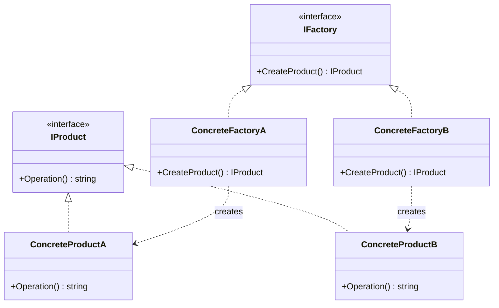
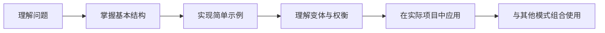

## 一、模式概述

:::abstract 工厂方法模式核心定义
工厂方法模式（Factory Method Pattern）是一种创建型设计模式，其核心思想是：**在父类（抽象创建者）中定义创建对象的接口，让子类（具体创建者）决定实例化哪个具体产品类**。

这种模式将对象的创建责任从客户端分离到工厂子类中，实现了创建与使用的解耦。
:::

**工厂方法模式**与[抽象工厂模式]()同属创建型模式，后者是前者在多维度产品创建场景下的扩展。

:::info 模式分类
工厂方法模式有时也称为**虚拟构造函数（Virtual Constructor）**，它是一种将对象创建延迟到子类实现的经典模式。
:::

---

## 二、为什么需要工厂方法模式

### 2.1 传统直接实例化的问题

在没有使用工厂方法模式时，客户端代码通常直接与具体产品类耦合：

```csharp
public class Player
{
    // 直接依赖具体产品类
    private Sword _weapon = new Sword();

    public void Attack()
    {
        _weapon.Use();
    }
}
```

这种方式存在以下问题：

| 问题类型 | 具体表现 |
|---------|---------|
| **紧耦合** | 客户端代码直接依赖具体产品类，替换实现需修改源码 |
| **违背开闭原则** | 新增产品类型必须修改已有代码 |
| **职责不清** | 客户端既需要关注业务逻辑，又要处理对象创建 |
| **测试困难** | 无法在单元测试中方便地替换为 Mock 对象 |
| **创建逻辑分散** | 对象创建代码可能散布在系统各处 |

### 2.2 工厂方法模式的优势

```csharp
// 引入工厂后，客户端只需关心如何使用产品
public class Player
{
    private readonly IWeapon _weapon;

    // 通过工厂创建，客户端不关心具体类型
    public Player(IWeaponFactory factory)
    {
        _weapon = factory.CreateWeapon();
    }

    public void Attack()
    {
        _weapon.Use();
    }
}
```

:::hint 核心转变
**从"谁来用谁创建"转变为"谁来用由别人决定"**，客户端只关心抽象接口，不关心具体实现。
:::

---

## 三、模式结构解析



### 3.1 四要素详解

| 要素 | 角色 | 说明 |
|------|------|------|
| **抽象产品（Product）** | 接口/基类 | 定义产品的通用接口，是所有具体产品的父类 |
| **具体产品（Concrete Product）** | 实现类 | 实现抽象产品接口的具体类，是最终被使用的对象 |
| **抽象工厂（Creator）** | 接口/抽象类 | 声明工厂方法，返回抽象产品类型 |
| **具体工厂（Concrete Creator）** | 实现类 | 重写工厂方法，返回具体产品实例 |

### 3.2 代码实现

#### 抽象产品层

```csharp
/// <summary>
/// 武器接口，定义所有武器的通用行为
/// </summary>
public interface IWeapon
{
    /// <summary>
    /// 使用武器的攻击方法
    /// </summary>
    void Use();

    /// <summary>
    /// 获取武器名称
    /// </summary>
    string Name { get; }
}
```

```csharp
/// <summary>
/// 具体产品：剑
/// </summary>
public class Sword : IWeapon
{
    public string Name => "长剑";

    public void Use()
    {
        Console.WriteLine($"{Name} 挥砍攻击！");
    }
}
```

```csharp
/// <summary>
/// 具体产品：弓
/// </summary>
public class Bow : IWeapon
{
    public string Name => "长弓";

    public void Use()
    {
        Console.WriteLine($"{Name} 远程射箭！");
    }
}
```

#### 抽象工厂层

```csharp
/// <summary>
/// 武器工厂接口，定义创建武器的工厂方法
/// </summary>
public interface IWeaponFactory
{
    /// <summary>
    /// 创建武器的工厂方法
    /// </summary>
    IWeapon CreateWeapon();
}
```

#### 具体工厂层

```csharp
/// <summary>
/// 剑工厂，负责创建剑
/// </summary>
public class SwordFactory : IWeaponFactory
{
    public IWeapon CreateWeapon()
    {
        // 可以在这里添加复杂的初始化逻辑
        return new Sword();
    }
}
```

```csharp
/// <summary>
/// 弓工厂，负责创建弓
/// </summary>
public class BowFactory : IWeaponFactory
{
    public IWeapon CreateWeapon()
    {
        return new Bow();
    }
}
```

#### 客户端使用

```csharp
public class Player
{
    private readonly IWeapon _weapon;

    // 依赖抽象工厂，而非具体工厂
    public Player(IWeaponFactory factory)
    {
        _weapon = factory.CreateWeapon();
    }

    public void Attack()
    {
        _weapon.Use();
    }
}

// 使用示例
IWeaponFactory factory = new SwordFactory();
Player warrior = new Player(factory);
warrior.Attack(); // 输出：长剑 挥砍攻击！
```

---

## 四、模式变体与实现细节

### 4.1 工厂方法的两种实现方式

#### 变体一：抽象工厂方法 + 具体工厂类

```csharp
public interface IWeaponFactory
{
    IWeapon CreateWeapon();
}

public class SwordFactory : IWeaponFactory
{
    public IWeapon CreateWeapon() => new Sword();
}
```

#### 变体二：参数化工厂方法

```csharp
public interface IWeaponFactory
{
    IWeapon CreateWeapon(string weaponType);
}

public class WeaponFactory : IWeaponFactory
{
    public IWeapon CreateWeapon(string weaponType)
    {
        return weaponType switch
        {
            "sword" => new Sword(),
            "bow" => new Bow(),
            "axe" => new Axe(),
            _ => throw new ArgumentException($"Unknown weapon type: {weaponType}")
        };
    }
}
```

:::warning 参数化工厂的权衡
参数化工厂可以减少工厂类数量，但违背了单一职责原则，且每次新增产品都需要修改工厂类。使用具体工厂类更符合开闭原则。
:::

### 4.2 使用泛型简化工厂

```csharp
/// <summary>
/// 泛型工厂接口，支持类型安全的工厂创建
/// </summary>
public interface IGenericFactory<TProduct>
    where TProduct : class, new()
{
    TProduct Create();
}

/// <summary>
/// 泛型工厂实现，自动创建产品实例
/// </summary>
public class GenericFactory<TProduct> : IGenericFactory<TProduct>
    where TProduct : class, new()
{
    public TProduct Create()
    {
        return new TProduct();
    }
}
```

---

## 五、实际应用场景

### 5.1 日志系统

```csharp
/// <summary>
/// 日志接口
/// </summary>
public interface ILogger
{
    void Log(string message);
    void Error(string message);
}

/// <summary>
/// 控制台日志
/// </summary>
public class ConsoleLogger : ILogger
{
    public void Log(string message) => Console.WriteLine($"[INFO] {message}");
    public void Error(string message) => Console.WriteLine($"[ERROR] {message}");
}

/// <summary>
/// 文件日志
/// </summary>
public class FileLogger : ILogger
{
    private readonly string _filePath;

    public FileLogger(string filePath) => _filePath = filePath;

    public void Log(string message) => File.AppendAllText(_filePath, $"[INFO] {message}\n");
    public void Error(string message) => File.AppendAllText(_filePath, $"[ERROR] {message}\n");
}

/// <summary>
/// 日志工厂
/// </summary>
public interface ILoggerFactory
{
    ILogger CreateLogger();
}

/// <summary>
/// 控制台日志工厂
/// </summary>
public class ConsoleLoggerFactory : ILoggerFactory
{
    public ILogger CreateLogger() => new ConsoleLogger();
}

/// <summary>
/// 文件日志工厂
/// </summary>
public class FileLoggerFactory : ILoggerFactory
{
    private readonly string _filePath;

    public FileLoggerFactory(string filePath) => _filePath = filePath;

    public ILogger CreateLogger() => new FileLogger(_filePath);
}

// 使用
ILoggerFactory factory = new ConsoleLoggerFactory();
ILogger logger = factory.CreateLogger();
logger.Log("Application started");
```

### 5.2 数据库连接驱动

```csharp
/// <summary>
/// 数据库连接接口
/// </summary>
public interface IDbConnection
{
    void Connect();
    void Execute(string sql);
}

/// <summary>
/// SQL Server 连接
/// </summary>
public class SqlServerConnection : IDbConnection
{
    public void Connect() => Console.WriteLine("连接 SQL Server...");
    public void Execute(string sql) => Console.WriteLine($"执行 SQL: {sql}");
}

/// <summary>
/// MySQL 连接
/// </summary>
public class MySqlConnection : IDbConnection
{
    public void Connect() => Console.WriteLine("连接 MySQL...");
    public void Execute(string sql) => Console.WriteLine($"执行 SQL: {sql}");
}

/// <summary>
/// 数据库连接工厂
/// </summary>
public interface IDbConnectionFactory
{
    IDbConnection CreateConnection();
}
```

### 5.3 Unity 中的应用

```csharp
/// <summary>
/// 敌人基类
/// </summary>
public abstract class Enemy
{
    public abstract void Attack();
    public abstract int Damage { get; }
}

/// <summary>
/// 近战敌人
/// </summary>
public class MeleeEnemy : Enemy
{
    public override int Damage => 20;

    public override void Attack()
    {
        Console.WriteLine("近战攻击！");
    }
}

/// <summary>
/// 远程敌人
/// </summary>
public class RangedEnemy : Enemy
{
    public override int Damage => 15;

    public override void Attack()
    {
        Console.WriteLine("远程攻击！");
    }
}

/// <summary>
/// 敌人工厂接口
/// </summary>
public interface IEnemyFactory
{
    Enemy CreateEnemy();
}

/// <summary>
/// 近战敌人工厂
/// </summary>
public class MeleeEnemyFactory : IEnemyFactory
{
    public Enemy CreateEnemy() => new MeleeEnemy();
}

/// <summary>
/// 远程敌人工厂
/// </summary>
public class RangedEnemyFactory : IEnemyFactory
{
    public Enemy CreateEnemy() => new RangedEnemy();
}
```

:::info Unity 应用场景
在 Unity 项目中，工厂方法模式常用于：
- **UI 面板管理**：不同类型面板的创建与缓存
- **敌人/道具生成**：游戏对象的动态创建
- **音效管理**：不同类型音效的加载与播放
- **资源配置**：Addressables / AssetBundle 的统一加载接口
:::

---

## 六、模式的优缺点分析

### 6.1 优势

| 优势 | 说明 |
|------|------|
| **单一职责原则** | 产品创建逻辑集中到工厂类，职责分明 |
| **开闭原则** | 新增产品无需修改已有代码，只需添加新工厂 |
| **解耦** | 客户端依赖抽象接口，不依赖具体实现 |
| **可测试性** | 便于使用 Mock 对象进行单元测试 |
| **集中管理** | 对象创建逻辑集中，便于维护和扩展 |

### 6.2 缺点

| 缺点 | 说明 |
|------|------|
| **类数量增加** | 每个具体产品都需要对应的具体工厂 |
| **复杂度提升** | 对于简单场景，可能过度设计 |
| **结构膨胀** | 产品层次和工厂层次成对增长 |

:::warning 适用性判断
工厂方法模式最适合以下场景：
1. 产品类层次较稳定
2. 需要频繁添加新的产品类型
3. 系统需要与其他产品解耦

如果产品类型很少且不会扩展，可以考虑直接实例化。
:::

---

## 七、模式对比

| 对比维度 | 直接实例化 | 工厂方法模式 |
|----------|-----------|-------------|
| **耦合度** | 高耦合 | 低耦合 |
| **扩展性** | 差 | 好 |
| **测试性** | 差 | 好 |
| **代码量** | 少 | 中等 |
| **适用场景** | 简单、稳定的对象创建 | 复杂、多变的对象创建 |

---

## 八、学习路线建议



**进阶路径：**
1. **入门**：理解四要素，完成基础实现
2. **进阶**：掌握工厂变体，理解适用场景
3. **精通**：与策略模式、装饰器模式等组合使用
4. **大师**：结合 DI 容器，实现自动注入的工厂

---

## 九、总结

:::abstract 核心要点
工厂方法模式通过**将对象创建延迟到子类**实现，将"如何创建"的职责从客户端分离出去。

**关键要点：**
- 抽象工厂定义创建接口，具体工厂负责实例化
- 客户端依赖抽象产品，不依赖具体产品
- 新增产品只需添加新工厂，符合开闭原则
- 需要在灵活性和代码复杂度之间权衡
:::

**下一步建议：**
- 学习[抽象工厂模式]()，了解多维度产品的创建
- 结合[依赖注入](/依赖注入)，实现更灵活的工厂管理
- 在实际项目中尝试应用，逐步积累经验

---

## 参考资料

| 资料 | 链接 |
| --- | --- |
| Design Patterns: Elements of Reusable Object-Oriented Software | [Gang of Four 经典著作] |
| Microsoft Learn - 设计模式 | [https://learn.microsoft.com/zh-cn/dotnet/architecture/microservices/microservice-ddd-cqrs-patterns/](/) |
| Refactoring Guru - Factory Method | [https://refactoring.guru/design-patterns/factory-method](https://refactoring.guru/design-patterns/factory-method) |
