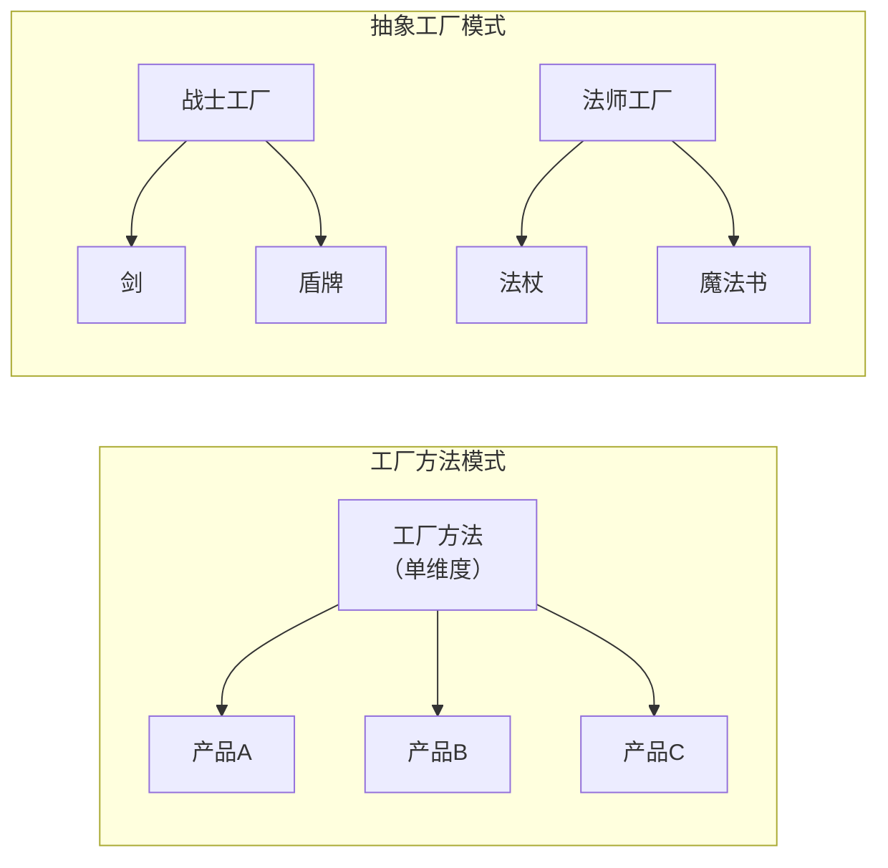
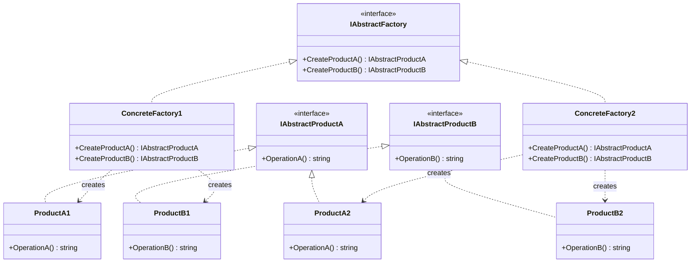
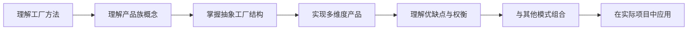

## 一、模式概述

:::abstract 抽象工厂模式核心定义
抽象工厂模式（Abstract Factory Pattern）是一种创建型设计模式，其核心思想是：**提供一个创建一系列相关或相互依赖对象的接口，而无需指定它们具体的类**。

与工厂方法模式专注于单一产品维度不同，抽象工厂模式专注于**产品族**的创建，确保同一个工厂创建的产品相互兼容。
:::

抽象工厂模式是[工厂方法模式](/1.工厂方法模式)在多维度产品创建场景下的扩展。当产品只在一个维度变化时，用工厂方法；当产品在多个维度变化时，就需要抽象工厂。

---

## 二、一维 vs 二维：理解两种模式的关系

:::info 维度类比
- **工厂方法模式** ≈ **一维数组**：单一分类维度，如只按角色类型（战士/法师）分类
- **抽象工厂模式** ≈ **二维数组**：多分类维度，如角色类型（战士/法师）× 装备类型（武器/防具）
:::

### 2.1 场景对比

| 维度 | 工厂方法模式 | 抽象工厂模式 |
|------|-------------|-------------|
| 产品分类 | 单一维度 | 多个维度 |
| 示例 | 只生产武器（剑、弓、法杖） | 生产武器+防具套装（战士套装、法师套装） |
| 产品关系 | 产品之间相互独立 | 产品之间存在关联（配套使用） |

### 2.2 可视化对比



---

## 三、模式结构解析

### 3.1 结构图



### 3.2 四要素详解

| 要素 | 说明 | 示例（RPG 游戏） |
|------|------|-----------------|
| **抽象产品 A** | 第一类产品的接口 | Weapon（武器） |
| **抽象产品 B** | 第二类产品的接口 | Armor（防具） |
| **抽象工厂** | 定义创建多个产品的方法 | IEquipmentFactory |
| **具体工厂** | 创建某一产品族的所有产品 | WarriorFactory、MageFactory |

### 3.3 核心原则

:::warning 配套一致性原则
抽象工厂模式确保**同一个工厂创建的所有产品属于同一个产品族**，相互兼容。例如战士工厂只创建战士配套的装备，不会混用法师的装备。
:::

---

## 四、RPG 游戏装备系统实现

### 4.1 需求分析

| 维度 | 维度一（职业） | 维度二（装备类型） |
|------|---------------|-------------------|
| 战士系列 | WarriorFactory | 武器（剑）+ 防具（盾牌） |
| 法师系列 | MageFactory | 武器（法杖）+ 防具（魔法书） |

### 4.2 抽象产品层

```csharp
/// <summary>
/// 武器接口，定义武器的通用行为
/// </summary>
public interface IWeapon
{
    /// <summary>
    /// 使用武器
    /// </summary>
    void Use();

    /// <summary>
    /// 获取武器名称
    /// </summary>
    string Name { get; }
}
```

```csharp
/// <summary>
/// 防具接口，定义防具的通用行为
/// </summary>
public interface IArmor
{
    /// <summary>
    /// 装备防具
    /// </summary>
    void Equip();

    /// <summary>
    /// 获取防御力
    /// </summary>
    int Defense { get; }

    /// <summary>
    /// 获取防具名称
    /// </summary>
    string Name { get; }
}
```

### 4.3 具体产品层

```csharp
/// <summary>
/// 具体产品：战士的剑
/// </summary>
public class Sword : IWeapon
{
    public string Name => "长剑";

    public void Use()
    {
        Console.WriteLine($"{Name} 发动近战斩击！");
    }
}
```

```csharp
/// <summary>
/// 具体产品：战士的盾牌
/// </summary>
public class Shield : IArmor
{
    public string Name => "铁盾牌";
    public int Defense => 25;

    public void Equip()
    {
        Console.WriteLine($"{Name} 已装备，防御力 +{Defense}");
    }
}
```

```csharp
/// <summary>
/// 具体产品：法师的法杖
/// </summary>
public class Staff : IWeapon
{
    public string Name => "魔法法杖";

    public void Use()
    {
        Console.WriteLine($"{Name} 施放魔法攻击！");
    }
}
```

```csharp
/// <summary>
/// 具体产品：法师的魔法书
/// </summary>
public class SpellBook : IArmor
{
    public string Name => "魔法手册";
    public int Defense => 10;

    public void Equip()
    {
        Console.WriteLine($"{Name} 已装备，防御力 +{Defense}，魔法值恢复速度提升");
    }
}
```

### 4.4 抽象工厂层

```csharp
/// <summary>
/// 装备工厂接口，定义创建整套装备的方法
/// </summary>
public interface IEquipmentFactory
{
    /// <summary>
    /// 创建武器
    /// </summary>
    IWeapon CreateWeapon();

    /// <summary>
    /// 创建防具
    /// </summary>
    IArmor CreateArmor();
}
```

### 4.5 具体工厂层

```csharp
/// <summary>
/// 战士装备工厂，创建战士系列的武器和防具
/// </summary>
public class WarriorEquipmentFactory : IEquipmentFactory
{
    public IWeapon CreateWeapon()
    {
        return new Sword();
    }

    public IArmor CreateArmor()
    {
        return new Shield();
    }
}
```

```csharp
/// <summary>
/// 法师装备工厂，创建法师系列的武器和防具
/// </summary>
public class MageEquipmentFactory : IEquipmentFactory
{
    public IWeapon CreateWeapon()
    {
        return new Staff();
    }

    public IArmor CreateArmor()
    {
        return new SpellBook();
    }
}
```

### 4.6 客户端使用

```csharp
/// <summary>
/// 游戏角色类，依赖抽象工厂和抽象产品
/// </summary>
public class GameCharacter
{
    private readonly IWeapon _weapon;
    private readonly IArmor _armor;

    public GameCharacter(IEquipmentFactory factory)
    {
        // 通过工厂一次性获取配套的装备
        _weapon = factory.CreateWeapon();
        _armor = factory.CreateArmor();
    }

    public void Attack()
    {
        _weapon.Use();
    }

    public void Defend()
    {
        _armor.Equip();
    }

    public void ShowEquipment()
    {
        Console.WriteLine($"装备：{_weapon.Name} + {_armor.Name}");
        Console.WriteLine($"总防御力：{_armor.Defense}");
    }
}

// 使用示例
IEquipmentFactory factory = new WarriorEquipmentFactory();
GameCharacter warrior = new GameCharacter(factory);
warrior.Attack();      // 输出：长剑 发动近战斩击！
warrior.Defend();      // 输出：铁盾牌 已装备，防御力 +25
warrior.ShowEquipment();
```

---

## 五、跨平台 UI 组件实例

### 5.1 需求分析

在跨平台应用开发中，需要为 Windows、macOS、Linux 等不同平台提供一致的 UI 组件：

| 平台 | 具体工厂 | 产品族 |
|------|---------|--------|
| Windows | WindowsFactory | WindowsButton + WindowsTextBox |
| macOS | MacOSFactory | MacOSButton + MacOSTextBox |
| Linux | LinuxFactory | LinuxButton + LinuxTextBox |

### 5.2 代码实现

```csharp
/// <summary>
/// 按钮接口
/// </summary>
public interface IButton
{
    void Render();
    void OnClick();
}

/// <summary>
/// 文本框接口
/// </summary>
public interface ITextBox
{
    void Render();
    void SetText(string text);
}

/// <summary>
/// 抽象 UI 工厂
/// </summary>
public interface IUIFactory
{
    IButton CreateButton();
    ITextBox CreateTextBox();
}

/// <summary>
/// Windows 风格按钮
/// </summary>
public class WindowsButton : IButton
{
    public void Render() => Console.WriteLine("渲染 Windows 风格按钮");
    public void OnClick() => Console.WriteLine("Windows 按钮点击");
}

/// <summary>
/// Windows 风格文本框
/// </summary>
public class WindowsTextBox : ITextBox
{
    public void Render() => Console.WriteLine("渲染 Windows 风格文本框");
    public void SetText(string text) => Console.WriteLine($"Windows 文本框: {text}");
}

/// <summary>
/// Windows UI 工厂
/// </summary>
public class WindowsUIFactory : IUIFactory
{
    public IButton CreateButton() => new WindowsButton();
    public ITextBox CreateTextBox() => new WindowsTextBox();
}

/// <summary>
/// macOS 风格按钮
/// </summary>
public class MacOSButton : IButton
{
    public void Render() => Console.WriteLine("渲染 macOS 风格按钮");
    public void OnClick() => Console.WriteLine("macOS 按钮点击");
}

/// <summary>
/// macOS 风格文本框
/// </summary>
public class MacOSTextBox : ITextBox
{
    public void Render() => Console.WriteLine("渲染 macOS 风格文本框");
    public void SetText(string text) => Console.WriteLine($"macOS 文本框: {text}");
}

/// <summary>
/// macOS UI 工厂
/// </summary>
public class MacOSUIFactory : IUIFactory
{
    public IButton CreateButton() => new MacOSButton();
    public ITextBox CreateTextBox() => new MacOSTextBox();
}

/// <summary>
/// 应用程序配置
/// </summary>
public class Application
{
    private readonly IButton _button;
    private readonly ITextBox _textBox;

    public Application(IUIFactory factory)
    {
        _button = factory.CreateButton();
        _textBox = factory.CreateTextBox();
    }

    public void Render()
    {
        _button.Render();
        _textBox.Render();
    }
}

// 使用：根据平台创建对应工厂
IUIFactory factory = new WindowsUIFactory(); // 或 MacOSUIFactory
Application app = new Application(factory);
app.Render();
```

:::hint 实践建议
在实际项目中，工厂的选择可以通过配置自动决定：
- 读取配置文件指定平台
- 检测操作系统类型
- 根据运行时环境变量选择
:::

---

## 六、图形渲染后端实例

### 6.1 需求分析

在游戏引擎或图形应用中，需要支持多种图形 API：

| 抽象产品 | DirectX 实现 | OpenGL 实现 | Vulkan 实现 |
|---------|-------------|------------|------------|
| IRenderTarget | D3D11RenderTarget | GLRenderTarget | VulkanRenderTarget |
| IShader | D3D11Shader | GLShader | VulkanShader |
| ITexture | D3D11Texture | GLTexture | VulkanTexture |

### 6.2 简化实现

```csharp
/// <summary>
/// 渲染目标接口
/// </summary>
public interface IRenderTarget
{
    void Clear();
    void Present();
}

/// <summary>
/// 着色器接口
/// </summary>
public interface IShader
{
    void Compile(string source);
    void Bind();
}

/// <summary>
/// 图形后端工厂
/// </summary>
public interface IRenderBackendFactory
{
    IRenderTarget CreateRenderTarget();
    IShader CreateShader();
}

/// <summary>
/// DirectX 11 渲染后端工厂
/// </summary>
public class D3D11BackendFactory : IRenderBackendFactory
{
    public IRenderTarget CreateRenderTarget() => new D3D11RenderTarget();
    public IShader CreateShader() => new D3D11Shader();
}

/// <summary>
/// OpenGL 渲染后端工厂
/// </summary>
public class GLBackendFactory : IRenderBackendFactory
{
    public IRenderTarget CreateRenderTarget() => new GLRenderTarget();
    public IShader CreateShader() => new GLShader();
}
```

---

## 七、模式的优缺点分析

### 7.1 优势

| 优势 | 说明 |
|------|------|
| **一致性保证** | 同一工厂创建的产品相互兼容，不会混用不配套的组件 |
| **解耦** | 客户端代码与具体产品类解耦，只依赖抽象接口 |
| **产品族替换** | 可以整个产品族一起替换，如主题切换、平台切换 |
| **符合开闭原则** | 新增产品族无需修改已有代码 |

### 7.2 缺点

| 缺点 | 说明 |
|------|------|
| **类数量爆炸** | 每个产品都需要对应抽象接口和实现类 |
| **扩展困难** | 新增产品类型需要修改所有工厂类 |
| **结构复杂** | 多层抽象导致代码结构复杂 |
| **违反开闭原则** | 增加新产品时必须修改抽象工厂接口 |

:::danger 扩展性陷阱
抽象工厂模式的最大问题是：**添加新产品（新的产品维度）需要修改所有已有工厂类**。如果产品维度经常变化，这个模式可能不太适合。
:::

---

## 八、工厂方法 vs 抽象工厂

| 对比维度 | 工厂方法模式 | 抽象工厂模式 |
|----------|-------------|-------------|
| **产品维度** | 单一维度 | 多个维度 |
| **产品关系** | 产品相互独立 | 产品属于同一产品族，相互关联 |
| **核心目标** | 定义创建单一产品的接口 | 定义创建一整套相关产品的接口 |
| **复杂度** | 较低 | 较高 |
| **扩展方式** | 添加新工厂即可 | 添加新产品可能需要修改所有工厂 |
| **适用场景** | 产品种类单一，如只生产武器 | 产品多维度关联，如武器+防具套装 |

:::info 选择建议
- **产品只在一个维度变化**：用工厂方法模式
- **产品需要多维度组合，且同一组合必须配套使用**：用抽象工厂模式
- **产品经常新增维度**：考虑其他模式（如Builder模式）或者不用设计模式
:::

---

## 九、模式对比总结

| 模式 | 一维/二维 | 配套保证 | 扩展新产品 | 扩展产品族 |
|------|----------|---------|-----------|-----------|
| 工厂方法 | 一维 | 无 | 容易 | 容易 |
| 抽象工厂 | 二维 | 有 | 困难 | 容易 |

---

## 十、与其他模式的组合

### 10.1 与单例模式组合

通常具体工厂使用单例模式，确保全局只有一个工厂实例：

```csharp
/// <summary>
/// Windows UI 工厂（单例实现）
/// </summary>
public sealed class WindowsUIFactory : IUIFactory
{
    private static WindowsUIFactory _instance = new WindowsUIFactory();

    public static WindowsUIFactory Instance => _instance;

    private WindowsUIFactory() { }

    public IButton CreateButton() => new WindowsButton();
    public ITextBox CreateTextBox() => new WindowsTextBox();
}
```

### 10.2 与依赖注入组合

```csharp
/// <summary>
/// 游戏角色（支持依赖注入）
/// </summary>
public class GameCharacter
{
    private readonly IWeapon _weapon;
    private readonly IArmor _armor;

    public GameCharacter(IWeapon weapon, IArmor armor)
    {
        _weapon = weapon;
        _armor = armor;
    }
}

/// <summary>
/// 使用 DI 容器自动注入
/// </summary>
public static class DICompositionRoot
{
    public static void RegisterServices()
    {
        // 根据配置或环境选择具体工厂
        var factoryType = Environment.GetEnvironmentVariable("RENDER_BACKEND");
        IEquipmentFactory factory = factoryType switch
        {
            "warrior" => new WarriorEquipmentFactory(),
            "mage" => new MageEquipmentFactory(),
            _ => new WarriorEquipmentFactory()
        };

        // 注册到 DI 容器（以 Microsoft.Extensions.DependencyInjection 为例）
        // services.AddSingleton<IEquipmentFactory>(factory);
        // services.AddTransient<GameCharacter>();
    }
}
```

---

## 十一、常见应用场景

| 场景 | 说明 | 示例 |
|------|------|------|
| **跨平台 UI 组件** | 不同平台有不同的控件实现 | Windows/macOS/Linux UI 组件 |
| **主题系统** | 支持多种皮肤/主题 | 暗色/亮色主题，深色/浅色模式 |
| **游戏引擎 RHI** | 多图形 API 抽象 | DirectX/OpenGL/Vulkan 渲染后端 |
| **数据库访问** | 不同数据库有不同的实现 | SQL Server/MySQL/Oracle 驱动 |
| **文档导出** | 不同格式的文档生成 | Word/Excel/PDF 导出器 |
| **网络协议** | 不同协议的实现 | HTTP/gRPC/WebSocket 客户端 |

---

## 十二、学习路线建议



**进阶路径：**
1. **入门**：理解产品族概念，对比工厂方法
2. **进阶**：完成 RPG 装备系统或 UI 组件示例
3. **精通**：理解模式的局限性，知道何时不用
4. **大师**：与单例、DI 容器、配置系统组合使用

---

## 十三、总结

:::abstract 核心要点
抽象工厂模式用于创建**多个维度相关的成套产品**，确保同一工厂创建的产品相互兼容。

**关键要点：**
- 抽象工厂定义创建**一整套**产品的方法
- 具体工厂负责创建**同一产品族**的所有产品
- 保证产品的配套一致性
- 优点是产品族替换方便，缺点是新增产品维度困难

**选择建议：**
- 单一维度产品 → 工厂方法模式
- 多维度产品族 → 抽象工厂模式
- 产品维度经常变化 → 考虑 Builder 模式或其他方案
:::

**相关阅读：**
- [工厂方法模式](/1.工厂方法模式) - 抽象工厂的基础
- [依赖注入](/依赖注入) - 工厂模式的最佳搭档
- [建造者模式](/3.建造者模式) - 复杂对象构造的另一种选择

---

## 参考资料

| 资料 | 链接 |
| --- | --- |
| Design Patterns: Elements of Reusable Object-Oriented Software | [Gang of Four 经典著作] |
| Refactoring Guru - Abstract Factory | [https://refactoring.guru/design-patterns/abstract-factory](https://refactoring.guru/design-patterns/abstract-factory) |
| Microsoft Learn - 设计模式 | [https://learn.microsoft.com/zh-cn/dotnet/architecture/microservices/microservice-ddd-cqrs-patterns/](https://learn.microsoft.com/zh-cn/dotnet/architecture/microservices/microservice-ddd-cqrs-patterns/) |
