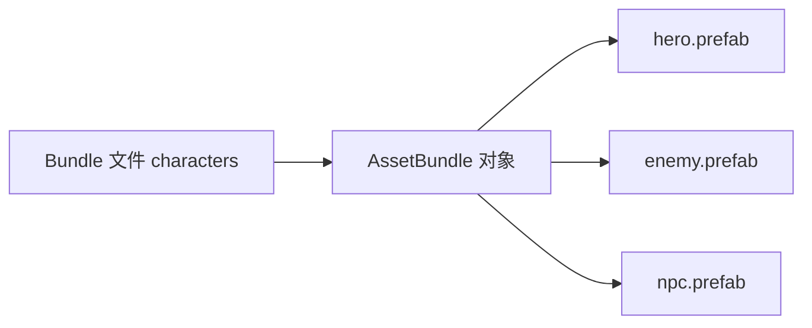
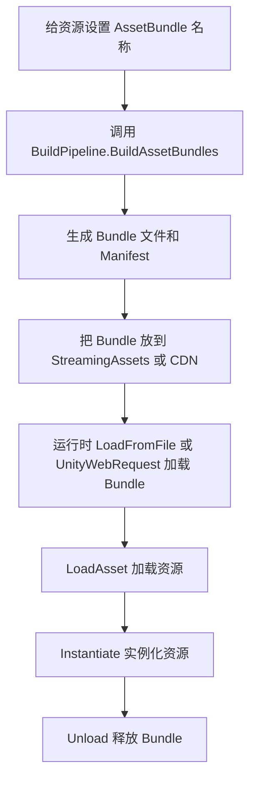
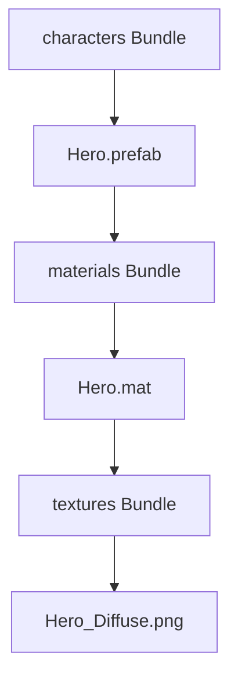
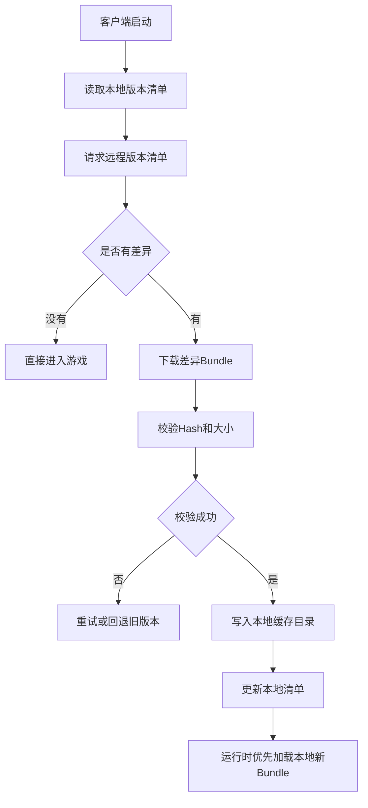

# AssetBundle 从入门到进阶详解

## 1. 这篇文章解决什么问题

很多 Unity 开发者第一次听到 `AssetBundle`，会把它简单理解成“一个资源压缩包”。  
这个理解不算错，但不够完整。

更准确地说：

**AssetBundle 是 Unity 提供的一套资源打包、分发、加载和卸载机制。它允许你把 Prefab、贴图、材质、音频、动画、场景等资源从主包中拆出来，在运行时按需加载。**

这篇文章面向从未接触过 AB 包概念的 Unity 开发者，目标是从零开始讲清楚：

1. AB 包到底是什么。
2. 为什么 Unity 项目需要 AB 包。
3. 怎么给资源设置 AB 包名。
4. 怎么构建 AB 包。
5. 怎么在运行时加载资源。
6. 依赖关系为什么重要。
7. Manifest 是什么。
8. AB 包如何做资源热更新。
9. 加载、卸载、内存和常见坑应该怎么处理。

:::abstract 一句话结论
AssetBundle 不是单纯的“压缩文件”，而是 Unity 资源工程化的底层能力。  
你可以用它实现按需加载、包体拆分、资源热更新和更精细的内存管理，但代价是你必须自己处理依赖、版本、下载、缓存和生命周期。
:::

## 2. 为什么需要 AssetBundle

### 2.1 传统资源放进主包的问题

如果所有资源都直接放进 Unity 工程并随 App 一起打包，会出现几个问题：

| 问题 | 说明 |
| --- | --- |
| 首包过大 | 所有角色、地图、音频、特效都进安装包，下载门槛高 |
| 启动资源不可分发 | 玩家即使只玩第一关，也可能被迫下载后续所有资源 |
| 资源无法热更新 | 改一张贴图、一个 Prefab，也可能需要重新发整包 |
| 内存控制粗糙 | 如果资源引用链混乱，容易常驻大量暂时不用的资源 |

### 2.2 AB 包解决的核心问题

AssetBundle 主要解决四类问题：

| 能力 | 说明 |
| --- | --- |
| 资源拆包 | 把资源从主包中拆成多个独立文件 |
| 按需加载 | 运行时需要哪个资源，就加载哪个 Bundle |
| 远程更新 | 新 Bundle 可以放在 CDN，客户端下载后替换本地旧资源 |
| 生命周期控制 | 可以主动加载、卸载 Bundle 和资源，降低内存峰值 |

### 2.3 AB 包和 Resources 的区别

Unity 里很多新人会先接触 `Resources.Load`，所以先做一个对比。

| 维度 | Resources | AssetBundle |
| --- | --- | --- |
| 资源位置 | 必须放在 `Resources` 目录下 | 可以按 AssetBundle 名称打包 |
| 打包方式 | 自动进入主包 | 手动构建 Bundle 文件 |
| 热更新 | 不适合资源热更新 | 天然适合远程资源更新 |
| 依赖管理 | Unity 内部处理 | 需要开发者理解并管理 |
| 适用场景 | 少量内置资源、配置兜底 | 中大型资源系统、分包、热更新 |

建议：

1. 小项目、少量固定资源可以用 `Resources`。
2. 中大型商业项目、热更新项目，应优先理解 AB 或 Addressables。
3. Addressables 底层也会使用 AssetBundle，所以理解 AB 对学习 Addressables 也很有帮助。

## 3. AB 包到底是什么

### 3.1 从文件角度看

构建完成后，AssetBundle 通常表现为一组文件：

```text
AssetBundles/
  Windows/
    characters
    characters.manifest
    ui
    ui.manifest
    Windows
    Windows.manifest
```

其中：

| 文件 | 说明 |
| --- | --- |
| `characters` | 真正的 Bundle 数据文件 |
| `characters.manifest` | 该 Bundle 的文本描述文件，主要给开发者查看 |
| `Windows` | 总 Manifest 对应的 Bundle 文件 |
| `Windows.manifest` | 总 Manifest 文本文件 |

注意：运行时依赖查询通常用的是构建生成的 `AssetBundleManifest` 对象，而不是你手动解析 `.manifest` 文本。

### 3.2 从资源角度看

一个 Bundle 可以包含：

1. Prefab
2. Texture
3. Material
4. AudioClip
5. AnimationClip
6. AnimatorController
7. Scene
8. ScriptableObject

但通常不建议把“完全无关”的资源随便塞进同一个 Bundle。  
Bundle 划分会直接影响加载粒度、内存占用、更新粒度和依赖复杂度。

### 3.3 从运行时角度看

运行时加载 AB 包通常分两步：

1. 先加载 Bundle 文件。
2. 再从 Bundle 中加载具体资源。

示意：



也就是说：

| 概念 | 说明 |
| --- | --- |
| Bundle | 资源容器 |
| Asset | 容器里的具体资源 |
| AssetBundle 对象 | 运行时加载后的 Bundle 句柄 |

## 4. 一个最小 AB 工作流

先看最小流程，再逐步展开。



这条链路里，每一步都很重要：

| 步骤 | 重点 |
| --- | --- |
| 设置包名 | 决定资源进入哪个 Bundle |
| 构建 | 生成对应平台可用的 Bundle |
| 分发 | 本地内置或远程下载 |
| 加载 | 同步、异步、本地、网络加载 |
| 卸载 | 避免内存泄漏和资源丢失 |

## 5. 给资源设置 AssetBundle 名称

### 5.1 Inspector 设置方式

选中资源后，在 Inspector 底部可以看到 `AssetBundle` 设置区域。  
你可以给资源设置一个名称，例如：

```text
characters/hero
ui/login
audio/bgm
```

Unity 会根据这个名称把资源打入对应 Bundle。

### 5.2 用代码批量设置

真实项目通常不会靠手动点 Inspector 管几百上千个资源，而会用编辑器脚本批量设置。

```csharp
using UnityEditor;
using UnityEngine;

namespace Blogger.Editor
{
    /// <summary>
    /// AssetBundle 名称设置示例。
    /// </summary>
    public static class AssetBundleNameSetter
    {
        #region 按目录设置Bundle名称

        /// <summary>
        /// 为指定资源设置 AssetBundle 名称。
        /// </summary>
        [MenuItem("Tools/AssetBundle/设置示例Bundle名称")]
        public static void SetSampleBundleName()
        {
            // 资源路径必须是 Unity 工程内的 Assets 相对路径。
            string assetPath = "Assets/GameAssets/Characters/Hero.prefab";

            // AssetImporter 表示 Unity 对某个资源的导入设置对象。
            AssetImporter importer = AssetImporter.GetAtPath(assetPath);

            // 设置资源所属的 AssetBundle 名称。
            importer.assetBundleName = "characters/hero";

            // 设置 Bundle 后缀名，生成文件时会体现为对应变体。
            importer.assetBundleVariant = "bundle";

            // 输出中文调试信息，方便确认设置完成。
            Debug.Log("已设置资源的 AssetBundle 名称: " + assetPath);
        }

        #endregion
    }
}
```

### 5.3 关键 API 解释

| API | 说明 |
| --- | --- |
| `AssetImporter.GetAtPath` | 获取某个资源的导入器，只能在编辑器脚本中使用 |
| `assetBundleName` | 设置资源进入哪个 Bundle |
| `assetBundleVariant` | 设置 Bundle 变体后缀，常用于多语言、多清晰度、多平台差异 |
| `[MenuItem]` | 在 Unity 菜单栏注册一个编辑器菜单 |

:::warning 注意
`AssetImporter`、`BuildPipeline`、`MenuItem` 都属于 `UnityEditor` 命名空间，只能在编辑器下使用。  
它们不能放进运行时脚本目录，也不能在手机真机运行时调用。
:::

## 6. 构建 AssetBundle

### 6.1 最小构建脚本

```csharp
using System.IO;
using UnityEditor;
using UnityEngine;

namespace Blogger.Editor
{
    /// <summary>
    /// AssetBundle 构建示例。
    /// </summary>
    public static class AssetBundleBuilder
    {
        #region 构建本平台Bundle

        /// <summary>
        /// 构建当前平台的 AssetBundle。
        /// </summary>
        [MenuItem("Tools/AssetBundle/构建当前平台Bundle")]
        public static void BuildCurrentPlatformBundles()
        {
            // 定义输出目录，建议不要直接输出到 Assets 根目录。
            string outputPath = "AssetBundles";

            // 如果输出目录不存在，则先创建目录。
            if (!Directory.Exists(outputPath))
            {
                Directory.CreateDirectory(outputPath);
            }

            // 构建当前激活平台对应的 AssetBundle。
            AssetBundleManifest manifest = BuildPipeline.BuildAssetBundles(
                outputPath,
                BuildAssetBundleOptions.ChunkBasedCompression,
                EditorUserBuildSettings.activeBuildTarget);

            // 判断 Manifest 是否为空，用于确认构建结果。
            if (manifest == null)
            {
                Debug.LogError("AssetBundle 构建失败，请检查资源包名和输出路径。");
                return;
            }

            // 输出中文调试信息，方便在 Console 中确认构建成功。
            Debug.Log("AssetBundle 构建完成，输出目录: " + outputPath);
        }

        #endregion
    }
}
```

### 6.2 `BuildPipeline.BuildAssetBundles` 详解

这个 API 是构建 AB 包的核心。

```csharp
BuildPipeline.BuildAssetBundles(outputPath, options, target);
```

| 参数 | 说明 |
| --- | --- |
| `outputPath` | Bundle 输出目录 |
| `options` | 构建选项，例如压缩方式、是否强制重建等 |
| `target` | 构建目标平台，例如 Android、iOS、Windows |

最容易忽略的是 `target`。  
AB 包是平台相关的，Android 构建出来的 Bundle 不应该拿去给 iOS 用。

### 6.3 常见构建选项

| 选项 | 说明 | 适用场景 |
| --- | --- | --- |
| `None` | 默认构建方式 | 简单测试 |
| `UncompressedAssetBundle` | 不压缩 | 加载最快，但文件大 |
| `ChunkBasedCompression` | LZ4 分块压缩 | 常用推荐，加载和体积比较均衡 |
| `ForceRebuildAssetBundle` | 强制重建 | 排查缓存或构建异常 |

一般项目常用：

```csharp
BuildAssetBundleOptions.ChunkBasedCompression
```

因为它比较适合运行时按需加载。

## 7. 加载 AssetBundle

### 7.1 从本地文件同步加载

这是最容易理解的加载方式。

```csharp
using System.IO;
using UnityEngine;

namespace Blogger.Runtime
{
    /// <summary>
    /// AssetBundle 本地加载示例。
    /// </summary>
    public sealed class LocalAssetBundleLoader : MonoBehaviour
    {
        #region 本地同步加载

        /// <summary>
        /// 从本地 Bundle 中加载并实例化预制体。
        /// </summary>
        public void LoadHeroFromLocalBundle()
        {
            // 拼接 Bundle 文件路径。
            string bundlePath = Path.Combine(Application.streamingAssetsPath, "characters/hero.bundle");

            // 从本地文件加载 AssetBundle。
            AssetBundle bundle = AssetBundle.LoadFromFile(bundlePath);

            // 如果 Bundle 加载失败，则输出错误并停止后续逻辑。
            if (bundle == null)
            {
                Debug.LogError("加载 AssetBundle 失败: " + bundlePath);
                return;
            }

            // 从 Bundle 中加载名为 Hero 的预制体。
            GameObject heroPrefab = bundle.LoadAsset<GameObject>("Hero");

            // 实例化加载出来的预制体。
            Instantiate(heroPrefab);

            // 卸载 Bundle 文件本身，但保留已经加载出来的资源对象。
            bundle.Unload(false);
        }

        #endregion
    }
}
```

### 7.2 `AssetBundle.LoadFromFile` 是什么

`LoadFromFile` 的作用是从本地磁盘读取 Bundle 文件，并创建一个运行时 `AssetBundle` 对象。

| 特点 | 说明 |
| --- | --- |
| 加载来源 | 本地文件 |
| 是否下载 | 不负责下载 |
| 线程表现 | 同步加载，资源大时可能卡主线程 |
| 适用场景 | 本地小资源、启动阶段预加载、测试 |

### 7.3 `LoadAsset<T>` 是什么

`LoadAsset<T>("Hero")` 的作用是：

**从已经加载好的 Bundle 容器里，按资源名取出具体资源。**

注意：

1. 它不是加载 Bundle 文件。
2. 它是在 Bundle 已经加载后，加载 Bundle 内部资源。
3. 类型 `T` 要和资源真实类型匹配，例如 `GameObject`、`Texture2D`、`AudioClip`。

## 8. 异步加载 AssetBundle 和资源

同步加载容易理解，但资源大时会卡顿。  
真实项目中更常用异步加载。

```csharp
using System.Collections;
using System.IO;
using UnityEngine;

namespace Blogger.Runtime
{
    /// <summary>
    /// AssetBundle 异步加载示例。
    /// </summary>
    public sealed class AsyncAssetBundleLoader : MonoBehaviour
    {
        #region 本地异步加载

        /// <summary>
        /// 异步加载 Bundle 并实例化资源。
        /// </summary>
        public IEnumerator LoadHeroAsync()
        {
            // 拼接本地 Bundle 路径。
            string bundlePath = Path.Combine(Application.streamingAssetsPath, "characters/hero.bundle");

            // 创建异步加载 Bundle 的请求对象。
            AssetBundleCreateRequest bundleRequest = AssetBundle.LoadFromFileAsync(bundlePath);

            // 等待 Bundle 异步加载完成。
            yield return bundleRequest;

            // 取得加载完成后的 AssetBundle 对象。
            AssetBundle bundle = bundleRequest.assetBundle;

            // 如果 Bundle 为空，说明加载失败。
            if (bundle == null)
            {
                Debug.LogError("异步加载 AssetBundle 失败: " + bundlePath);
                yield break;
            }

            // 创建异步加载资源的请求对象。
            AssetBundleRequest assetRequest = bundle.LoadAssetAsync<GameObject>("Hero");

            // 等待资源异步加载完成。
            yield return assetRequest;

            // 将加载结果转换为 GameObject 预制体。
            GameObject heroPrefab = assetRequest.asset as GameObject;

            // 实例化预制体。
            Instantiate(heroPrefab);

            // 卸载 Bundle 文件句柄，保留已实例化资源。
            bundle.Unload(false);
        }

        #endregion
    }
}
```

### 8.1 关键异步对象解释

| 类型 | 说明 |
| --- | --- |
| `AssetBundleCreateRequest` | 异步创建 AssetBundle 的请求 |
| `AssetBundleRequest` | 异步加载 Bundle 内部资源的请求 |
| `yield return request` | 等待 Unity 异步操作完成 |

:::info 为什么不用 C# async/await
Unity 原生 AB API 很多是基于 `AsyncOperation` 和协程模型。  
如果项目接入了 UniTask，也可以再封装成 `await` 风格，但零基础阶段先理解协程版最直观。
:::

## 9. 从网络下载 AssetBundle

AB 热更新通常需要从 CDN 下载资源。  
Unity 推荐使用 `UnityWebRequestAssetBundle`。

```csharp
using System.Collections;
using UnityEngine;
using UnityEngine.Networking;

namespace Blogger.Runtime
{
    /// <summary>
    /// AssetBundle 网络下载示例。
    /// </summary>
    public sealed class RemoteAssetBundleLoader : MonoBehaviour
    {
        #region 远程下载Bundle

        /// <summary>
        /// 从远程地址下载 Bundle 并加载资源。
        /// </summary>
        /// <param name="url">Bundle 下载地址。</param>
        public IEnumerator DownloadHeroBundle(string url)
        {
            // 创建专门用于下载 AssetBundle 的网络请求。
            UnityWebRequest request = UnityWebRequestAssetBundle.GetAssetBundle(url);

            // 发送网络请求并等待完成。
            yield return request.SendWebRequest();

            // 判断网络请求是否失败。
            if (request.result != UnityWebRequest.Result.Success)
            {
                Debug.LogError("下载 AssetBundle 失败: " + request.error);
                yield break;
            }

            // 从下载处理器中取得 AssetBundle 对象。
            AssetBundle bundle = DownloadHandlerAssetBundle.GetContent(request);

            // 从 Bundle 中加载资源。
            GameObject heroPrefab = bundle.LoadAsset<GameObject>("Hero");

            // 实例化资源。
            Instantiate(heroPrefab);

            // 卸载 Bundle 文件句柄。
            bundle.Unload(false);

            // 释放网络请求对象占用的资源。
            request.Dispose();
        }

        #endregion
    }
}
```

### 9.1 `UnityWebRequestAssetBundle.GetAssetBundle` 是什么

它不是普通文件下载，而是 Unity 为 AB 包准备的下载方式。

| API | 说明 |
| --- | --- |
| `UnityWebRequestAssetBundle.GetAssetBundle(url)` | 创建 AB 下载请求 |
| `DownloadHandlerAssetBundle.GetContent(request)` | 从下载结果中取出 `AssetBundle` |
| `request.result` | 判断请求是否成功 |

真实项目中通常还会加入：

1. 超时控制。
2. 重试机制。
3. 下载进度显示。
4. hash 校验。
5. 本地缓存。

## 10. AssetBundle 依赖关系

### 10.1 什么是依赖

假设有一个角色 Prefab：

```text
Hero.prefab
  使用 Hero.mat
    使用 Hero_Diffuse.png
  使用 Hero.controller
    使用 Idle.anim
```

如果 `Hero.prefab` 在 `characters` 包里，而材质和贴图在 `materials` 包里，那么加载角色时就必须先保证依赖包也加载了。



### 10.2 不加载依赖会怎样

常见表现：

| 表现 | 可能原因 |
| --- | --- |
| 材质变粉 | Shader 或材质依赖未加载 |
| 贴图丢失 | Texture 所在 Bundle 没加载 |
| 动画不播放 | AnimatorController 或 Clip 依赖缺失 |
| Prefab 部分引用为空 | 引用资源所在 Bundle 未加载 |

### 10.3 为什么依赖管理是 AB 最核心难点

因为 `LoadAsset` 只负责从当前 Bundle 里取资源，它不会自动帮你把所有依赖包都加载好。  
依赖包需要你根据 Manifest 自己加载。

## 11. AssetBundleManifest

### 11.1 Manifest 是什么

`AssetBundleManifest` 是 Unity 构建 AB 包时生成的依赖清单对象。

它主要能做两件事：

1. 查询某个 Bundle 依赖哪些其他 Bundle。
2. 获取某个 Bundle 的 Hash，用于版本比对和缓存校验。

### 11.2 加载 Manifest

构建后输出目录中会有一个和平台目录同名的 Bundle。  
例如输出目录是：

```text
AssetBundles/Windows
```

那么通常会有：

```text
AssetBundles/Windows/Windows
```

这个 `Windows` Bundle 里包含 `AssetBundleManifest`。

```csharp
using System.IO;
using UnityEngine;

namespace Blogger.Runtime
{
    /// <summary>
    /// AssetBundle Manifest 加载示例。
    /// </summary>
    public sealed class AssetBundleManifestLoader
    {
        #region 读取依赖清单

        /// <summary>
        /// 加载 AssetBundleManifest。
        /// </summary>
        /// <param name="bundleRoot">Bundle 根目录。</param>
        /// <param name="platformName">平台主 Bundle 名称。</param>
        /// <returns>构建生成的依赖清单对象。</returns>
        public AssetBundleManifest LoadManifest(string bundleRoot, string platformName)
        {
            // 拼接平台主 Bundle 路径。
            string manifestBundlePath = Path.Combine(bundleRoot, platformName);

            // 加载包含 Manifest 的主 Bundle。
            AssetBundle manifestBundle = AssetBundle.LoadFromFile(manifestBundlePath);

            // 如果主 Bundle 加载失败，则输出错误并返回空。
            if (manifestBundle == null)
            {
                Debug.LogError("加载 Manifest Bundle 失败: " + manifestBundlePath);
                return null;
            }

            // 从主 Bundle 中读取 AssetBundleManifest 对象。
            AssetBundleManifest manifest = manifestBundle.LoadAsset<AssetBundleManifest>("AssetBundleManifest");

            // 卸载主 Bundle 文件句柄，保留 Manifest 对象。
            manifestBundle.Unload(false);

            // 返回依赖清单。
            return manifest;
        }

        #endregion
    }
}
```

### 11.3 查询依赖

```csharp
string[] dependencies = manifest.GetAllDependencies("characters/hero.bundle");
```

| API | 说明 |
| --- | --- |
| `GetAllDependencies` | 查询某个 Bundle 的所有直接和间接依赖 |
| `GetDirectDependencies` | 只查询直接依赖 |
| `GetAssetBundleHash` | 获取 Bundle 构建 Hash |
| `GetAllAssetBundles` | 获取所有 Bundle 名称 |

## 12. 带依赖加载的最小管理器

下面示例不是完整商业框架，只演示最关键的加载顺序。

```csharp
using System.Collections.Generic;
using System.IO;
using UnityEngine;

namespace Blogger.Runtime
{
    /// <summary>
    /// AssetBundle 依赖加载示例管理器。
    /// </summary>
    public sealed class SimpleAssetBundleManager
    {
        private readonly Dictionary<string, AssetBundle> loadedBundles = new Dictionary<string, AssetBundle>();
        private readonly string bundleRoot;
        private readonly AssetBundleManifest manifest;

        /// <summary>
        /// 创建简单 AssetBundle 管理器。
        /// </summary>
        /// <param name="bundleRoot">Bundle 根目录。</param>
        /// <param name="manifest">依赖清单。</param>
        public SimpleAssetBundleManager(string bundleRoot, AssetBundleManifest manifest)
        {
            // 保存 Bundle 根目录。
            this.bundleRoot = bundleRoot;

            // 保存依赖清单。
            this.manifest = manifest;
        }

        #region 加载资源及依赖

        /// <summary>
        /// 加载指定 Bundle 中的资源。
        /// </summary>
        /// <typeparam name="TAsset">资源类型。</typeparam>
        /// <param name="bundleName">Bundle 名称。</param>
        /// <param name="assetName">资源名称。</param>
        /// <returns>加载出来的资源对象。</returns>
        public TAsset LoadAsset<TAsset>(string bundleName, string assetName) where TAsset : Object
        {
            // 先加载目标 Bundle 的所有依赖。
            LoadDependencies(bundleName);

            // 再加载目标 Bundle 本身。
            AssetBundle bundle = LoadBundle(bundleName);

            // 从目标 Bundle 中读取资源。
            TAsset asset = bundle.LoadAsset<TAsset>(assetName);

            // 返回资源对象。
            return asset;
        }

        /// <summary>
        /// 加载指定 Bundle 的所有依赖。
        /// </summary>
        /// <param name="bundleName">Bundle 名称。</param>
        private void LoadDependencies(string bundleName)
        {
            // 从 Manifest 查询目标 Bundle 的全部依赖。
            string[] dependencies = manifest.GetAllDependencies(bundleName);

            // 逐个加载依赖 Bundle。
            for (int index = 0; index < dependencies.Length; index++)
            {
                LoadBundle(dependencies[index]);
            }
        }

        /// <summary>
        /// 加载单个 Bundle。
        /// </summary>
        /// <param name="bundleName">Bundle 名称。</param>
        /// <returns>加载完成的 Bundle 对象。</returns>
        private AssetBundle LoadBundle(string bundleName)
        {
            // 如果已经加载过，则直接复用缓存对象。
            if (loadedBundles.TryGetValue(bundleName, out AssetBundle cachedBundle))
            {
                return cachedBundle;
            }

            // 拼接 Bundle 文件完整路径。
            string bundlePath = Path.Combine(bundleRoot, bundleName);

            // 从本地文件加载 Bundle。
            AssetBundle bundle = AssetBundle.LoadFromFile(bundlePath);

            // 如果加载失败，则输出错误信息。
            if (bundle == null)
            {
                Debug.LogError("加载 Bundle 失败: " + bundlePath);
                return null;
            }

            // 缓存已加载 Bundle，避免重复加载。
            loadedBundles.Add(bundleName, bundle);

            // 返回 Bundle 对象。
            return bundle;
        }

        #endregion
    }
}
```

### 12.1 这个示例还缺什么

这个管理器只是帮助你理解依赖加载，真实项目还需要：

1. 引用计数。
2. 异步加载队列。
3. 重复请求合并。
4. 下载与本地缓存。
5. 错误重试。
6. Bundle 卸载策略。

这里不要一上来过度工程。  
先把“依赖先加载，目标包后加载”这条主线吃透。

## 13. 卸载 AssetBundle

### 13.1 `Unload(false)` 和 `Unload(true)`

这是 AB 最容易踩坑的 API。

| API | 含义 |
| --- | --- |
| `bundle.Unload(false)` | 卸载 Bundle 文件句柄，但保留已经加载出来的资源 |
| `bundle.Unload(true)` | 卸载 Bundle 文件句柄，同时卸载从该 Bundle 加载出来的资源 |

### 13.2 什么时候用 `Unload(false)`

例如：

1. 从 Bundle 加载 Prefab。
2. 实例化 Prefab。
3. 不想让实例化出来的对象丢材质、丢贴图。

这时通常用：

```csharp
bundle.Unload(false);
```

### 13.3 什么时候用 `Unload(true)`

当你确认这个 Bundle 里的资源都不再使用时，才用：

```csharp
bundle.Unload(true);
```

如果对象还在场景中，你调用 `Unload(true)`，可能出现：

1. 贴图丢失。
2. 材质异常。
3. 引用资源变空。
4. 实例显示异常。

### 13.4 `Resources.UnloadUnusedAssets`

`Resources.UnloadUnusedAssets()` 会触发 Unity 卸载没有被引用的资源。  
它通常比较重，不建议每帧或高频调用。

常见调用时机：

1. 大场景切换后。
2. 战斗结束后。
3. 释放大量资源后。
4. 打开内存敏感页面前。

## 14. 压缩方式怎么选

AssetBundle 常见压缩方式有三类：

| 压缩方式 | 体积 | 加载速度 | 适用场景 |
| --- | --- | --- | --- |
| 不压缩 | 最大 | 最快 | 本地高速读取、开发调试 |
| LZMA | 最小 | 首次解压慢 | 下载体积敏感，不适合频繁随机加载 |
| LZ4 | 较小 | 较快 | 常用推荐，运行时加载更友好 |

### 14.1 为什么常推荐 LZ4

LZ4 是分块压缩，加载时不需要像 LZMA 那样整体解压。  
它在包体大小和运行时加载速度之间比较平衡。

对于大多数 Unity 项目，建议默认考虑：

```csharp
BuildAssetBundleOptions.ChunkBasedCompression
```

## 15. AssetBundle 热更新流程

AB 热更新的核心不是“能下载文件”，而是 **版本比对 + 差异下载 + 校验替换 + 加载新资源**。



### 15.1 清单文件通常包含什么

真实项目一般会生成自己的资源版本清单，例如：

| 字段 | 作用 |
| --- | --- |
| `bundleName` | Bundle 名称 |
| `hash` | 判断内容是否变化 |
| `size` | 下载进度和校验 |
| `crc` | 完整性校验 |
| `url` | 远程下载地址 |
| `version` | 资源版本 |

Unity 的 `AssetBundleManifest` 能提供依赖和 Hash，但商业项目通常还会生成一份更适合热更新系统使用的 JSON 清单。

### 15.2 本地目录优先级

运行时加载 Bundle 通常会有优先级：

1. `Application.persistentDataPath` 中的热更资源。
2. `Application.streamingAssetsPath` 中的首包资源。
3. 远程 CDN 下载。

原因：

| 路径 | 作用 |
| --- | --- |
| `persistentDataPath` | 保存客户端下载后的最新资源 |
| `streamingAssetsPath` | 保存随包发布的初始资源 |
| CDN | 保存线上可更新资源 |

## 16. AB 包划分策略

包怎么划分，会直接影响项目后期维护。

### 16.1 常见划分方式

| 划分方式 | 示例 | 优点 | 缺点 |
| --- | --- | --- | --- |
| 按功能模块 | `ui_login`、`battle_common` | 容易理解 | 公共依赖要处理好 |
| 按资源类型 | `textures`、`materials`、`audio` | 结构清晰 | 加载一个功能可能要多个包 |
| 按场景 | `scene_forest`、`scene_city` | 适合关卡制游戏 | 跨场景复用资源要拆公共包 |
| 按更新频率 | `stable_common`、`activity_202604` | 热更粒度好 | 前期规划要求高 |

### 16.2 一个实用建议

比较稳的做法是：

1. 高频共用资源单独做公共包。
2. 页面或玩法资源按模块打包。
3. 活动资源独立打包，方便上下线。
4. 不要把全项目贴图都塞进一个巨型包。
5. 不要把每个小资源都拆成一个包。

### 16.3 过大和过小都不好

| 问题 | 后果 |
| --- | --- |
| Bundle 太大 | 更新一个小资源也要下载大包，加载内存峰值高 |
| Bundle 太碎 | 请求数量多，依赖复杂，管理成本高 |

所以 AB 划分不是越细越好，而是要围绕：

1. 加载场景。
2. 更新频率。
3. 复用关系。
4. 内存峰值。

## 17. Shader 和材质问题

AB 项目里常见“粉色材质”问题，通常和 Shader 有关。

### 17.1 粉色材质常见原因

| 原因 | 说明 |
| --- | --- |
| Shader 没被打进包 | 运行时找不到 Shader |
| Shader 被裁剪 | 构建时 Unity 认为它没用，结果运行时缺失 |
| 依赖包没加载 | 材质在包里，但 Shader 或贴图依赖没加载 |
| 管线不匹配 | Built-in、URP、HDRP 资源混用 |

### 17.2 常见处理方式

1. 将常用 Shader 放入固定公共包。
2. 在 Graphics Settings 中配置 Always Included Shaders。
3. 确认材质、贴图和 Shader 所在依赖包加载顺序正确。
4. 不同渲染管线资源不要混打。

## 18. 场景 AssetBundle

AssetBundle 也可以打包场景。

运行时加载场景通常使用：

```csharp
using System.Collections;
using System.IO;
using UnityEngine;
using UnityEngine.SceneManagement;

namespace Blogger.Runtime
{
    /// <summary>
    /// AssetBundle 场景加载示例。
    /// </summary>
    public sealed class AssetBundleSceneLoader : MonoBehaviour
    {
        #region 加载Bundle场景

        /// <summary>
        /// 从 Bundle 中加载场景。
        /// </summary>
        /// <param name="sceneBundlePath">场景 Bundle 路径。</param>
        /// <param name="sceneName">场景名称。</param>
        public IEnumerator LoadSceneFromBundle(string sceneBundlePath, string sceneName)
        {
            // 加载场景所在的 AssetBundle。
            AssetBundle sceneBundle = AssetBundle.LoadFromFile(sceneBundlePath);

            // 如果场景 Bundle 加载失败，则停止流程。
            if (sceneBundle == null)
            {
                Debug.LogError("加载场景 Bundle 失败: " + sceneBundlePath);
                yield break;
            }

            // 异步加载 Bundle 中的场景。
            AsyncOperation operation = SceneManager.LoadSceneAsync(sceneName, LoadSceneMode.Single);

            // 等待场景加载完成。
            yield return operation;

            // 场景加载后保留 Bundle 还是卸载，要根据场景资源引用情况决定。
            sceneBundle.Unload(false);
        }

        #endregion
    }
}
```

注意：

1. 场景资源依赖同样要处理。
2. 场景名要和构建进 Bundle 的场景一致。
3. 场景切换后再释放资源，避免引用断裂。

## 19. AssetBundle 与 Addressables 的关系

你可以这样理解：

| 技术 | 定位 |
| --- | --- |
| AssetBundle | Unity 底层资源打包和加载能力 |
| Addressables | Unity 在 AB 基础上封装出的高级资源管理系统 |

Addressables 帮你处理了很多 AB 中要手写的内容：

1. 地址管理。
2. 依赖加载。
3. 引用计数。
4. 远程目录。
5. 下载依赖。
6. 资源释放。

但理解 AB 仍然重要，因为：

1. 老项目可能还在直接使用 AB。
2. 复杂问题最终可能要回到底层 Bundle 机制排查。
3. Addressables 的打包结果本质上仍和 Bundle 有关。

## 20. 常见坑总结

### 20.1 依赖包没加载

表现：

1. 材质粉色。
2. 贴图丢失。
3. 引用为空。

解决：

1. 使用 Manifest 查询依赖。
2. 先加载依赖，再加载目标包。
3. 统一由管理器处理，不要业务代码随手 `LoadFromFile`。

### 20.2 Bundle 重复加载

同一个 Bundle 重复 `LoadFromFile` 可能报错或造成管理混乱。  
建议用字典缓存已加载 Bundle。

### 20.3 过早 `Unload(true)`

表现：

1. 实例对象资源丢失。
2. UI 图片消失。
3. 材质异常。

建议：

1. 不确定时先用 `Unload(false)`。
2. 建立引用计数后再安全释放。

### 20.4 平台 Bundle 混用

Android Bundle 不要给 iOS 用。  
不同平台要分别构建、分别上传、分别校验。

### 20.5 包划分不合理

表现：

1. 更新一个按钮图标，要下载整个 UI 大包。
2. 进入一个页面，要加载几十个碎包。
3. 公共贴图被重复打进多个包。

解决：

1. 分析依赖。
2. 提取公共包。
3. 按更新频率和加载场景划分。

## 21. 从入门到进阶的学习路线

### 21.1 入门阶段

先掌握：

1. AB 是资源容器。
2. 如何设置 AssetBundle 名称。
3. 如何构建 Bundle。
4. 如何 `LoadFromFile`。
5. 如何 `LoadAsset`。
6. `Unload(false)` 和 `Unload(true)` 区别。

### 21.2 进阶阶段

继续掌握：

1. `AssetBundleManifest`。
2. 依赖包加载顺序。
3. 异步加载。
4. 网络下载。
5. LZ4 / LZMA / 不压缩区别。
6. Shader 和公共资源处理。

### 21.3 实战阶段

最后重点掌握：

1. 资源版本清单。
2. 差异下载。
3. CDN 分发。
4. 本地缓存。
5. 回滚策略。
6. 引用计数和统一资源管理器。
7. 包划分策略和依赖分析工具。

## 22. 推荐的一套最小工程结构

```text
Assets/
  GameAssets/
    Characters/
    UI/
    Audio/
    Scenes/
  Editor/
    AssetBundleBuilder.cs
  Scripts/
    AssetBundle/
      AssetBundleManager.cs
      AssetBundleDownloader.cs
      AssetBundleManifestService.cs
AssetBundles/
  Android/
  iOS/
  Windows/
```

职责建议：

| 模块 | 职责 |
| --- | --- |
| `AssetBundleBuilder` | 编辑器构建 Bundle |
| `AssetBundleManifestService` | 读取依赖清单 |
| `AssetBundleDownloader` | 下载和校验远程 Bundle |
| `AssetBundleManager` | 统一加载、缓存、卸载 Bundle |

不要一开始就写一个巨大的资源框架。  
先从“构建、加载、依赖、卸载”四件事跑通，再逐步补下载、缓存、引用计数。

## 23. 总结

AssetBundle 是 Unity 资源管理里非常重要的底层能力。  
它的核心价值是：

1. 把资源从主包中拆出来。
2. 运行时按需加载。
3. 支持远程资源热更新。
4. 允许更细粒度地控制内存和资源生命周期。

但它也要求你自己处理：

1. 依赖管理。
2. 包划分策略。
3. 版本清单。
4. 下载校验。
5. 本地缓存。
6. 卸载和内存释放。

如果你只记一句话，那就是：

**AssetBundle 的难点不在“加载一个包”，而在“长期稳定地管理一批包”。**

当你能理解依赖、Manifest、卸载、热更新和包划分后，再去学习 Addressables，会发现它其实是在帮你自动化处理很多 AB 项目里容易写错的工程细节。
