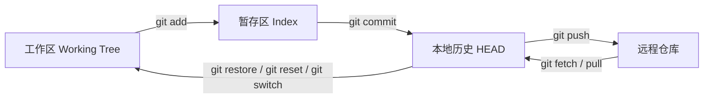
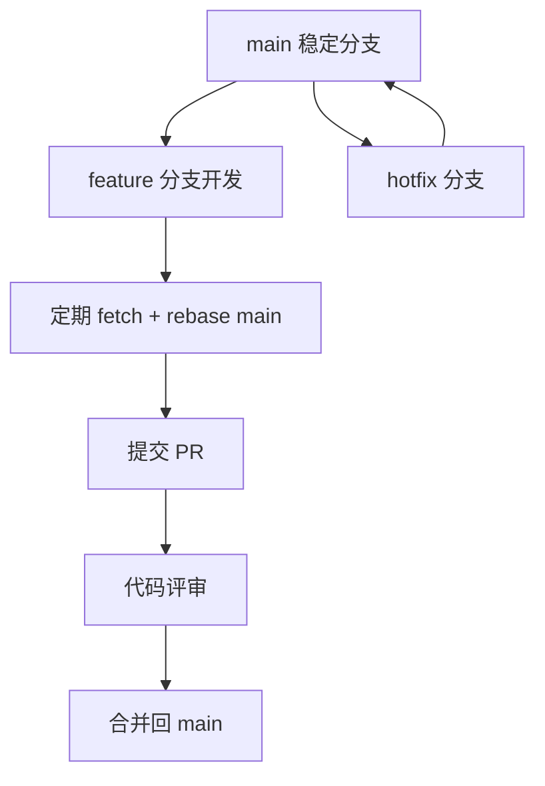

# Git 详解：从基础工作流到高阶实践

:::abstract 文章摘要
Git 不是“背命令工具”，而是一套围绕 **快照、引用、索引区、历史图** 设计出来的分布式版本控制系统。真正掌握 Git，关键不在于记住多少命令，而在于理解四件事：**Git 保存的是什么、分支本质是什么、工作区 / 暂存区 / 提交历史如何流转、历史修改为什么会有风险**。理解了这几个核心，再去学习 `merge`、`rebase`、`reflog`、`stash`、`bisect`、`worktree` 等命令，就会发现它们不是彼此孤立的功能，而是围绕同一个数据模型展开的不同操作入口。
:::

:::info 目标读者
本文适合以下读者阅读：

1. 已经会使用 `clone`、`pull`、`commit`、`push`，但对 Git 仍然“半懂不懂”的开发者。
2. 想把 Git 从“会用”提升到“理解原理并能解决复杂问题”的工程师。
3. 需要在团队中建立稳定 Git 工作流、代码评审流程和分支规范的技术负责人。
4. 想系统学习 `worktree`、`rebase`、`reflog`、`bisect`、`submodule` 等高阶功能的读者。
:::

## 1. Git 到底是什么

Git 是一个 **分布式版本控制系统**。它最重要的特征不是“能回滚代码”，而是：

- 每个开发者本地都拥有完整历史，而不仅仅是一个工作目录。
- 它擅长管理 **历史**，不仅能记录“当前代码是什么”，还能记录“它是如何演化来的”。
- 分支与切换在 Git 中非常轻量，鼓励频繁分支、独立开发、按需合并。
- Git 在内部更像是“存储项目历史的对象数据库”，而不是传统意义上的“文件差异列表”。

很多人一开始学 Git 时最困惑的地方，是把它当作“远程仓库工具”来理解。其实 Git 的核心首先是 **本地仓库**，远程协作只是建立在本地历史模型之上的能力。

### 1.1 Git 与 GitHub / GitLab 的关系

这是最常见的概念混淆之一。

| 概念 | 本质 | 作用 |
| --- | --- | --- |
| Git | 版本控制工具本身 | 管理代码历史、分支、合并、比较、恢复 |
| GitHub / GitLab / Gitea | 托管平台 | 承载远程仓库、Pull Request、Issue、CI、权限管理 |
| 本地仓库 | `.git` 目录及其对象数据库 | 真正保存你的提交历史、引用、配置 |
| 远程仓库 | 服务器上的 Git 仓库 | 用于共享、同步、代码评审和自动化 |

你可以完全不依赖 GitHub 而使用 Git；也可以把 GitHub 视为建立在 Git 之上的团队协作层。

## 2. 先建立最重要的 Git 心智模型

如果你只记命令，很快就会混乱。理解 Git，建议先把它拆成三层。

### 2.1 Git 的“三棵树”

在日常开发里，最重要的不是所有底层对象，而是这三层状态：

| 层 | 常见叫法 | 作用 |
| --- | --- | --- |
| Working Tree | 工作区 | 你当前磁盘上实际看到和编辑的文件 |
| Index | 暂存区 / 索引区 | 下一次提交时准备写入快照的内容 |
| Repository / HEAD | 本地仓库 / 当前提交 | 已提交的历史状态 |

可以把它理解为下面这个流转过程：



很多 Git 命令之所以难，是因为它们并不是只改一个地方，而是可能同时影响 **工作区、暂存区、当前引用**。

### 2.2 Git 存储的是“快照”，不是传统意义上的补丁链

Git 的重要设计思想之一，是它更倾向于把每次提交视作某一时刻项目状态的快照，而不是一串“从旧文件改到新文件的差异指令”。这也是 Git 分支极轻量、切换很快、合并能力强的重要原因。

这意味着你在脑中不要把提交理解成“修改记录”，而要更多理解成“某一版完整项目树的状态节点”。

### 2.3 commit、tree、blob、tag 分别是什么

理解底层对象，会让很多命令不再神秘。

| 对象 | 作用 | 可以粗略理解为 |
| --- | --- | --- |
| blob | 文件内容对象 | 某个文件的内容 |
| tree | 目录树对象 | 某个目录在某个时刻的结构 |
| commit | 提交对象 | 指向一次项目快照，并记录父提交、作者、说明 |
| tag | 标签对象 | 给某个提交起一个稳定名字，常用于版本发布 |

### 2.4 分支本质上只是一个可移动的引用

这是 Git 最应该理解透彻的一点。

分支并不是“复制出一整份代码”。在 Git 里，分支更像是一个指向某个提交的 **可移动指针**。提交产生后，分支指针向前移动到新的提交节点。因为它只是引用，所以 Git 的建分支和切换分支都非常轻量。

### 2.5 HEAD 是什么

`HEAD` 可以理解为“当前所在位置”。通常它会指向某个分支，分支再指向某个提交。  
当你进入 **detached HEAD** 状态时，表示 `HEAD` 直接指向一个提交，而不是分支名。这时你依然可以提交，但这些提交如果没有新分支引用它们，就更容易在后续操作里丢失可见入口。

:::warning 常见误区
很多人以为 “切换到某个 commit 看看” 是完全安全的。其实 detached HEAD 并不危险，但如果你在这种状态下继续提交，又没有及时创建分支保存，就很容易让后续历史难以追踪。
:::

## 3. Git 基础工作流：从创建仓库到提交代码

### 3.1 创建与获取仓库

常见起点有两种：

```bash
git init
git clone <repository-url>
```

- `git init`：在当前目录初始化一个新的 Git 仓库。
- `git clone`：复制远程仓库，包括对象数据、引用和默认远程配置。

### 3.2 查看状态

```bash
git status
git diff
git diff --staged
git log --oneline --graph --decorate --all
```

推荐把这几个命令当成日常最常用的“观察命令”：

| 命令 | 作用 |
| --- | --- |
| `git status` | 看工作区和暂存区是否干净 |
| `git diff` | 看工作区相对暂存区的改动 |
| `git diff --staged` | 看暂存区相对当前提交的改动 |
| `git log --oneline --graph --decorate --all` | 看历史图谱 |

### 3.3 提交的标准节奏

最常见的本地循环如下：

```bash
git status
git add <file>
git commit -m "feat: add player movement"
```

推荐形成下面这套习惯：

1. 先用 `git status` 明确当前状态。
2. 只把本次提交真正相关的内容加入暂存区。
3. 提交说明写清楚“为什么改”，而不是只写“update”。

### 3.4 为什么暂存区很重要

很多初学者会觉得暂存区多余，想直接“改完就 commit”。但暂存区恰恰是 Git 最强的设计之一，它让你能把一次工作区中的大量修改，重新整理成更合理的提交粒度。

典型场景：

- 一个文件里混入了两个功能改动。
- 你顺手修了一个无关 bug。
- 你想先提交能通过测试的一部分，再继续改剩下部分。

这时你可以配合交互式暂存：

```bash
git add -p
```

它会让你按 hunk 逐块决定哪些内容进入暂存区。

## 4. 撤销、恢复与“后悔药”：Git 最容易混乱的一组命令

Git 的“撤销”之所以难，是因为撤销目标不同：

- 你可能想撤销 **工作区修改**
- 你可能想撤销 **暂存区内容**
- 你可能想撤销 **某次提交**
- 你可能想撤销 **公开历史**
- 你可能想找回 **已经看起来消失的提交**

这些场景对应的命令完全不同。

### 4.1 `restore`、`reset`、`revert`、`reflog` 的定位

| 命令 | 主要用途 | 是否改历史 | 适合场景 |
| --- | --- | --- | --- |
| `git restore` | 恢复工作区或暂存区文件 | 否 | 丢弃未提交修改、从某提交还原文件 |
| `git reset` | 移动当前分支 / 调整暂存区 / 配合工作区重置 | 会 | 本地重写历史、拆提交、撤销未推送提交 |
| `git revert` | 生成一个“反向提交” | 否（不改既有历史） | 已公开历史的安全回退 |
| `git reflog` | 查找引用曾经指向过的位置 | 否 | 找回误删分支、误 reset、误 rebase 后的提交 |

### 4.2 `git restore`：恢复文件，比老式 `checkout -- <file>` 更清晰

```bash
git restore Player.cs
git restore --staged Player.cs
git restore --source=HEAD~1 -- Player.cs
```

理解方式：

- 不带 `--staged`：主要恢复工作区。
- 带 `--staged`：主要恢复暂存区。
- 带 `--source=<commit>`：从指定提交恢复内容。

### 4.3 `git reset`：威力很大，也最容易误用

常见三种模式：

```bash
git reset --soft HEAD~1
git reset --mixed HEAD~1
git reset --hard HEAD~1
```

| 模式 | 分支指针 | 暂存区 | 工作区 |
| --- | --- | --- | --- |
| `--soft` | 回退 | 保留 | 保留 |
| `--mixed` | 回退 | 重置 | 保留 |
| `--hard` | 回退 | 重置 | 重置 |

实战理解：

- `--soft`：提交撤回了，但改动仍在暂存区里，适合“重写 commit message”或“合并多个提交”。
- `--mixed`：最常见，相当于“撤回提交，但改动留在工作区重新整理”。
- `--hard`：危险，会直接覆盖工作区和暂存区。

:::danger 高风险操作
`git reset --hard` 会直接丢弃当前工作区和暂存区内容。只要这些内容没有被提交、stash 或复制出去，它们就可能真的找不回来。执行前至少先 `git status` 一次。
:::

### 4.4 `git revert`：面向公开历史的安全回滚

如果某个错误提交已经推送到远程，并且其他人可能已经基于它继续开发，那么通常优先使用：

```bash
git revert <commit>
```

它不是“删除那个提交”，而是额外创建一个新提交，内容上抵消掉旧提交的影响。  
因此它更适合共享分支，例如 `main`、`release`、`develop`。

### 4.5 `git reflog`：真正的“后悔药”

很多人误以为 `reset --hard`、误删分支、错误 rebase 就彻底完了。其实在很多情况下，Git 仍然通过 reflog 记录了引用移动历史。

```bash
git reflog
git reset --hard HEAD@{1}
git switch -c rescue-branch <commit-id>
```

`reflog` 的价值在于：

- 它记录的是 **本地引用的变动历史**
- 它不是远程共享历史的一部分
- 它在找回“曾经能访问到、后来访问不到”的提交时非常关键

典型场景：

1. 你做了 `git reset --hard`
2. 某个提交看起来“消失了”
3. 通过 `git reflog` 找到旧位置
4. 再 `git reset` 回去，或者新建恢复分支

## 5. 分支、合并与变基：Git 协作的主战场

### 5.1 为什么 Git 鼓励频繁分支

因为 Git 的分支极轻量，成本低，所以理想习惯是：

- 每个功能、修复、实验都独立分支
- 分支短命
- 合并前先整理历史
- 主分支保持稳定

### 5.2 创建与切换分支

```bash
git switch -c feature/login
git switch main
git branch
```

相比早期习惯的 `git checkout`，`git switch` 的语义更清晰：它就是“切换分支”。

### 5.3 merge 与 rebase 的核心区别

这是 Git 最经典的话题之一。

| 维度 | `merge` | `rebase` |
| --- | --- | --- |
| 本质 | 合并两个历史端点 | 把一串提交重新播放到新基底上 |
| 是否改写提交 ID | 否 | 是 |
| 历史形态 | 保留真实分叉与合并 | 更线性、整洁 |
| 适合场景 | 公共分支集成 | 本地整理提交、提交前同步 |
| 风险 | 历史稍复杂 | 改写历史后推送需谨慎 |

可以用一句话记忆：

- `merge` 更像“把两条线汇合起来”
- `rebase` 更像“把你的工作搬到另一条线的最新位置上重新演一遍”

### 5.4 什么时候用 merge，什么时候用 rebase

推荐实践：

| 场景 | 建议 |
| --- | --- |
| 个人功能分支还没推送或只有自己使用 | 可以放心 `rebase` |
| 准备提交 PR 前想整理历史 | 可以使用交互式 rebase |
| 团队共享分支 | 优先 `merge` 或经过约定后再 `rebase` |
| 已经公开给多人依赖的历史 | 不建议随意 `rebase` 改写 |

### 5.5 交互式 rebase：真正能提升提交质量的高级工具

```bash
git rebase -i HEAD~5
```

它常见用途有：

- 合并零碎提交
- 修改旧的 commit message
- 调整提交顺序
- 把一个提交拆成多个
- 删除不该进入历史的临时提交

常见指令：

| 指令 | 作用 |
| --- | --- |
| `pick` | 保留该提交 |
| `reword` | 保留提交内容，但改说明 |
| `edit` | 暂停到该提交，允许修改 |
| `squash` | 合并到前一个提交，并合并提交说明 |
| `fixup` | 合并到前一个提交，但丢弃当前提交说明 |
| `drop` | 丢弃该提交 |

:::warning 团队协作注意
交互式 rebase 改写的是提交对象本身，因此提交 ID 会变化。已经 push 到共享远程分支、且别人可能基于它继续工作的历史，不要轻易改写。
:::

### 5.6 Cherry-pick：只摘取某几个提交

```bash
git cherry-pick <commit-id>
```

适合场景：

- 把 hotfix 从 `release` 摘到 `main`
- 只想把某个独立修复同步到另一条线
- 不想整体合并一个分支，只想拿其中几个提交

它非常有用，但也不要滥用。过度 cherry-pick 会让历史图变得碎片化，长期维护成本上升。

### 5.7 Tag：发布版本时的稳定锚点

```bash
git tag v1.0.0
git tag -a v1.0.0 -m "release 1.0.0"
git push origin v1.0.0
git push origin --tags
```

标签常用于：

- 发布版本号
- 标记里程碑
- 记录某次可回溯构建点

通常推荐对正式版本使用 **annotated tag**，而不是只创建轻量标签。

## 6. 远程协作：fetch、pull、push 与分支同步

### 6.1 远程分支与本地分支不是一回事

很多初学者看到 `origin/main` 会以为它就是远程上的实时分支。其实本地看到的 `origin/main` 是一个 **远程跟踪引用**，它代表你上次与远程同步后所知道的远程状态。

### 6.2 `fetch` 与 `pull` 的区别

```bash
git fetch origin
git pull origin main
```

| 命令 | 做什么 |
| --- | --- |
| `fetch` | 只把远程最新历史拿到本地，不自动集成 |
| `pull` | 本质上通常等于 `fetch + merge`，也可配置成 `fetch + rebase` |

更稳妥的习惯是：

1. 先 `fetch`
2. 看看差异
3. 再决定 `merge` 还是 `rebase`

### 6.3 推荐的团队同步节奏

```bash
git fetch origin
git switch feature/login
git rebase origin/main
git push --force-with-lease
```

这套节奏适用于“个人功能分支 + PR”模式。  
其中 `--force-with-lease` 比裸 `--force` 更安全，它会检查远程分支是否已经被别人更新。

:::warning 不要默认依赖裸 `--force`
如果必须强推改写后的分支，优先使用 `git push --force-with-lease`，这样能减少误覆盖他人更新的风险。
:::

## 7. 日常高频但常被低估的高级能力

## 7.1 `stash`：临时收纳当前修改

`stash` 常被误解为“临时存个 patch”。实际上它会把你当前工作区和索引区状态保存成特殊提交，再把工作区还原到 `HEAD` 对应的干净状态。

常用命令：

```bash
git stash push -m "wip: login panel"
git stash list
git stash show -p stash@{0}
git stash apply stash@{0}
git stash pop
git stash drop stash@{0}
```

实战建议：

- 想切分提交、先测一部分代码时，`git stash --keep-index` 非常好用。
- 需要把未跟踪文件也一起保存时，用 `-u`。
- `pop` 失败并不等于 stash 消失；冲突时它可能仍然留在列表中。

### 7.2 `bisect`：二分法定位引入 bug 的提交

当你知道“某个历史版本是好的、当前版本是坏的”，却不知道 bug 是哪个提交引入的时，`git bisect` 是最省时间的工具之一。

```bash
git bisect start
git bisect bad
git bisect good <good-commit>
# 之后不断测试并标记 good / bad
git bisect reset
```

适合场景：

- 回归问题定位
- 性能退化定位
- 某测试在一段时间后突然失败

如果项目有自动化测试，`bisect` 的价值会更大，因为你可以把“判断好坏”的动作脚本化。

### 7.3 `submodule`：把另一个仓库作为子目录挂进来

适合以下场景：

- 你确实需要独立版本演进的外部仓库
- 你想明确锁定某个依赖仓库的具体提交
- 依赖仓库本身需要独立生命周期和权限边界

常见命令：

```bash
git submodule add <repo-url> extern/libA
git submodule update --init --recursive
git submodule status
```

但它也有明显成本：

- 新人容易忘记 `--recursive`
- 主仓库记录的是子模块提交指针，而不是其内容
- CI、部署、权限配置更复杂

所以能不用就别滥用；一旦用了，就要写清楚团队规范。

### 7.4 `hooks`：把规范自动化，而不是靠口头约束

Git hooks 是你放在 hooks 目录中的脚本，在 Git 某些关键时机触发执行，例如：

| Hook | 时机 | 常见用途 |
| --- | --- | --- |
| `pre-commit` | 提交前 | 代码格式化、lint、阻止大文件误提交 |
| `commit-msg` | 提交说明生成后 | 校验提交信息规范 |
| `pre-push` | 推送前 | 跑测试、阻止错误分支推送 |
| `post-merge` | 合并后 | 自动安装依赖、刷新生成文件 |

推荐做法是通过 `core.hooksPath` 把 hooks 统一到项目目录，例如：

```bash
git config core.hooksPath .githooks
```

这样 hooks 可以随项目规范一起版本化。

## 8. Worktree 深度讲解：Git 中最实用却常被忽视的高级功能

`git worktree` 是本文最重点的高阶内容之一。很多人知道分支，却不知道当你需要 **同时并行处理多个分支** 时，worktree 往往比反复 `switch` 更高效、更安全。

### 8.1 Worktree 是什么

Git 仓库可以挂接多个 working tree，也就是你可以在一个仓库对象数据库的基础上，同时拥有多个工作目录。  
这些工作目录共享同一个仓库历史和对象数据库，但各自拥有自己的工作区状态、索引和当前检出分支信息。

可以把它理解成：

- **同一个 Git 仓库**
- **多个不同的实体目录**
- 每个目录都像“独立 checkout 的一个副本”
- 但它们共享底层对象，不像重新 clone 那样重复存储一份历史

### 8.2 为什么需要 worktree

假设你正在做一个功能分支，改到一半，线上突然来了 hotfix。

传统做法通常有几种：

1. 当前修改先 commit 一个 WIP
2. 或者先 stash
3. 然后切回主分支处理热修
4. 修完再切回来恢复现场

这不是不能做，但会产生明显问题：

- 上下文频繁切换
- stash 多了容易混乱
- 热修与原本开发状态互相干扰
- 有些构建产物、IDE 状态、临时文件不想来回折腾

这时 worktree 的体验就非常好：

- 主目录继续保留当前 feature 开发状态
- 新开一个目录专门处理 hotfix
- 两边互不干扰
- 处理完直接删除临时 worktree 即可

### 8.3 Worktree 与重新 clone 的区别

| 方案 | 历史对象 | 磁盘占用 | 切换成本 | 适合场景 |
| --- | --- | --- | --- | --- |
| 重新 clone 一份仓库 | 完整复制 | 高 | 中 | 完全隔离、不同配置 |
| 新建分支再频繁 switch | 同一份 | 低 | 高 | 简单短任务 |
| `git worktree` | 共享对象数据库 | 低到中 | 很低 | 并行分支开发、热修、代码评审 |

### 8.4 Worktree 的常用命令

#### 8.4.1 查看当前所有 worktree

```bash
git worktree list
```

#### 8.4.2 新建一个 worktree 并创建分支

```bash
git worktree add ../repo-hotfix -b hotfix/login-crash
```

这条命令通常会：

1. 在 `../repo-hotfix` 创建一个新的工作目录
2. 新建分支 `hotfix/login-crash`
3. 在该目录中直接检出这个新分支

#### 8.4.3 基于已有分支创建 worktree

```bash
git worktree add ../repo-release release/1.2
```

#### 8.4.4 删除 worktree

```bash
git worktree remove ../repo-hotfix
```

如果该 worktree 不干净，默认不允许直接删除；必要时可以显式 `--force`，但务必先确认没有未保存修改。

#### 8.4.5 清理失效 worktree 元数据

```bash
git worktree prune
```

当某些目录被手动删除、移动，导致仓库里还残留 worktree 记录时，这个命令就有用。

#### 8.4.6 锁定与解锁 worktree

```bash
git worktree lock ../repo-hotfix --reason "on external disk"
git worktree unlock ../repo-hotfix
```

如果某个 worktree 放在可移动磁盘、网络共享目录等不总是在线的位置，锁定可以避免它的管理信息被自动修剪。

#### 8.4.7 修复 worktree 连接关系

```bash
git worktree repair
```

如果你手工移动了主工作树或某个 linked worktree，`repair` 可以帮助重建关联。

### 8.5 Worktree 的底层机制应该怎么理解

从工程角度，理解到下面这个层面就够了：

- 你的主仓库仍然有一个核心 `.git`
- linked worktree 并不是“完整复制一个 `.git`”
- 它们共享对象数据库与大部分仓库元数据
- 但每个 worktree 有自己独立的 HEAD、index、工作区状态，以及在主仓库中的关联管理信息

这也是它为什么比多次 clone 更省空间、比频繁切分支更适合并行上下文的原因。

### 8.6 Worktree 的典型应用场景

#### 8.6.1 同时维护 feature 与 hotfix

```bash
# 主目录继续开发 feature/a
# 新目录处理 hotfix
git worktree add ../project-hotfix -b hotfix/crash-fix
```

#### 8.6.2 同时打开 release 分支与 main 分支做对比验证

```bash
git worktree add ../project-release release/2.0
git worktree add ../project-main main
```

你可以同时启动两个 IDE、两套构建、两份运行环境。

#### 8.6.3 代码评审或问题复现

遇到 PR、历史 bug、线上 tag 时，不想污染当前开发目录，可以：

```bash
git worktree add ../review-pr origin/feature/payment
git worktree add ../debug-v1.8 v1.8.0
```

#### 8.6.4 大型项目中减少“切分支触发重建”的成本

有些项目切换分支后需要重新生成大量中间文件、重新索引 IDE、重新安装依赖、重新编译缓存。  
这时一个稳定的多 worktree 目录布局会明显提升效率。

### 8.7 Worktree 的限制与常见坑

| 问题 | 说明 |
| --- | --- |
| 同一分支默认不能同时被多个 worktree 检出 | Git 默认会阻止这种情况，避免同一分支在多个目录被同时推进导致混乱 |
| 手工删除目录后元数据可能残留 | 需要 `git worktree prune` |
| 含 submodule 的 worktree 移动更复杂 | 某些移动场景不建议手工折腾 |
| 不要把 worktree 当成完全独立仓库 | 它们共享底层仓库对象和很多配置 |
| IDE / 构建缓存路径要注意 | 某些工具会以绝对路径缓存，切换目录后要留意 |

:::hint 实践建议
如果你经常同时处理多个任务，建议固定一个结构，例如：

```bash
~/dev/project-main
~/dev/project-hotfix
~/dev/project-release
~/dev/project-review
```

这样 worktree 的价值会非常明显。对大型项目来说，它常常比频繁 stash / switch 更稳定。
:::

## 9. 团队里真正好用的 Git 工作流应该长什么样

Git 没有唯一正确工作流，但一个实用工作流通常满足三件事：

1. 主分支随时可发布
2. 功能分支彼此隔离
3. 历史既能审查，也能排障

### 9.1 常见推荐工作流



### 9.2 一个比较稳的团队规范

| 主题 | 建议 |
| --- | --- |
| 主分支 | 只接收经过评审、可发布的代码 |
| 功能开发 | 每个需求一个功能分支 |
| 提交粒度 | 一次提交表达一个清晰意图 |
| 提交说明 | 使用统一规范，例如 Conventional Commits |
| 同步方式 | 本地分支可 `rebase`，共享分支谨慎改写历史 |
| 回滚策略 | 公共历史用 `revert`，本地历史用 `reset/rebase` |
| 发布版本 | 使用 annotated tag |
| 紧急修复 | 单独 hotfix 分支，必要时用 worktree 并行处理 |

## 10. Git 进阶排障：遇到复杂问题时怎么想

### 10.1 为什么我明明改了文件，却不能切分支

因为 Git 判断切换分支会不会覆盖你当前工作区中的未提交改动。  
当目标分支上的文件状态与当前改动冲突时，它会拒绝切换，以免丢数据。

解决思路通常只有三类：

1. 提交
2. stash
3. 放弃改动

### 10.2 为什么 rebase 后提交全变了

因为 rebase 的本质是“在新基底上重放提交”，重放后形成的是 **新的提交对象**，因此 commit ID 会变化。  
这不是异常，而是 rebase 的正常表现。

### 10.3 为什么 merge 冲突与 rebase 冲突处理体验不一样

因为它们处理冲突的时机不同：

- `merge` 是在合并两个端点时处理
- `rebase` 是在“逐个重放提交”过程中处理

所以 rebase 在长提交链上可能让你经历多次冲突，但好处是提交历史更整洁。

### 10.4 为什么找不到“刚才那个提交”了

先不要慌，按这个顺序查：

```bash
git log --all --graph --decorate --oneline
git reflog
```

绝大多数“提交消失”的问题，本质上只是“没有引用再指向它了”，而不是对象已经立刻从磁盘消失。

## 11. 命令速查：从日常到高阶

### 11.1 日常最常用

```bash
git status
git add -p
git commit -m "feat: ..."
git switch -c feature/xxx
git fetch origin
git rebase origin/main
git push origin HEAD
```

### 11.2 历史整理与恢复

```bash
git rebase -i HEAD~5
git reset --soft HEAD~1
git reset --mixed HEAD~1
git revert <commit>
git reflog
```

### 11.3 高阶能力

```bash
git stash push -u -m "wip"
git bisect start
git worktree list
git worktree add ../repo-hotfix -b hotfix/xxx
git submodule update --init --recursive
git config core.hooksPath .githooks
```

## 12. 学习路线建议：如何真正学会 Git

### 12.1 第一阶段：先掌握最小闭环

先把下面这套命令用熟：

- `status`
- `add`
- `commit`
- `diff`
- `log`
- `switch`
- `branch`
- `fetch`
- `pull`
- `push`

目标不是记命令，而是形成“工作区 -> 暂存区 -> 提交 -> 远程”的流转感。

### 12.2 第二阶段：补齐历史修改能力

重点掌握：

- `restore`
- `reset`
- `revert`
- `reflog`
- `rebase -i`

这一步学会后，你对“改历史”和“找回历史”的恐惧会大幅下降。

### 12.3 第三阶段：进入工程级用法

重点掌握：

- `stash`
- `bisect`
- `worktree`
- `hooks`
- `submodule`
- `tag`
- `cherry-pick`

这一步决定你是否能在复杂项目、多人协作、版本发布、线上排障中真正把 Git 用顺手。

## 13. 常见误区总结

| 误区 | 正确认识 |
| --- | --- |
| Git 就是远程仓库工具 | Git 首先是本地版本控制系统 |
| 分支会复制整份代码 | 分支本质是指向提交的引用 |
| `rebase` 一定比 `merge` 高级 | 两者用途不同，没有绝对高低 |
| `reset` 和 `revert` 差不多 | 一个改引用，一个追加反向提交，适用场景不同 |
| `stash` 只是临时文本备份 | 它本质上也和提交对象结构有关 |
| `worktree` 没必要，用 clone 就行 | 对并行任务和大项目来说，worktree 往往更高效 |
| 提交丢了就没救了 | 先查 `reflog`，很多时候还能找回 |

## 14. 总结：把 Git 从“命令集”升级为“历史管理系统”

Git 真正难的地方，不是命令数量多，而是它背后有一套稳定的数据模型。  
一旦你理解了：

- Git 更偏向保存快照
- 分支只是引用
- `HEAD`、工作区、暂存区、本地历史各自扮演不同角色
- `merge`、`rebase`、`reset`、`revert` 只是对这套模型的不同操作

那么 Git 就不再是一堆零散命令，而是一套可以推理、可以排错、可以设计团队工作流的工程系统。

如果只给一个进阶建议，那就是：

:::hint 最值得投入学习的三个点
1. 学会用 `git log --graph` 和 `git reflog` 看历史，而不是盲操作。  
2. 学会用交互式 `rebase` 整理提交，而不是把混乱历史直接推上去。  
3. 学会用 `git worktree` 并行处理多个上下文，它会明显改变你对 Git 分支协作的使用方式。
:::

## 参考资料

| 资料 | 链接 |
| --- | --- |
| Git 官方文档总览 | [https://git-scm.com/docs](https://git-scm.com/docs) |
| Pro Git（官方在线书） | [https://git-scm.com/book/en/v2](https://git-scm.com/book/en/v2) |
| Git Tutorial | [https://git-scm.com/docs/gittutorial](https://git-scm.com/docs/gittutorial) |
| Git User Manual | [https://git-scm.com/docs/user-manual](https://git-scm.com/docs/user-manual) |
| git-switch | [https://git-scm.com/docs/git-switch](https://git-scm.com/docs/git-switch) |
| git-restore | [https://git-scm.com/docs/git-restore](https://git-scm.com/docs/git-restore) |
| git-rebase | [https://git-scm.com/docs/git-rebase](https://git-scm.com/docs/git-rebase) |
| git-reflog | [https://git-scm.com/docs/git-reflog](https://git-scm.com/docs/git-reflog) |
| git-stash | [https://git-scm.com/docs/git-stash](https://git-scm.com/docs/git-stash) |
| git-worktree | [https://git-scm.com/docs/git-worktree](https://git-scm.com/docs/git-worktree) |
| git-submodule | [https://git-scm.com/docs/git-submodule](https://git-scm.com/docs/git-submodule) |
| githooks | [https://git-scm.com/docs/githooks](https://git-scm.com/docs/githooks) |
| git-gc | [https://git-scm.com/docs/git-gc](https://git-scm.com/docs/git-gc) |
| git-maintenance | [https://git-scm.com/docs/git-maintenance](https://git-scm.com/docs/git-maintenance) |
