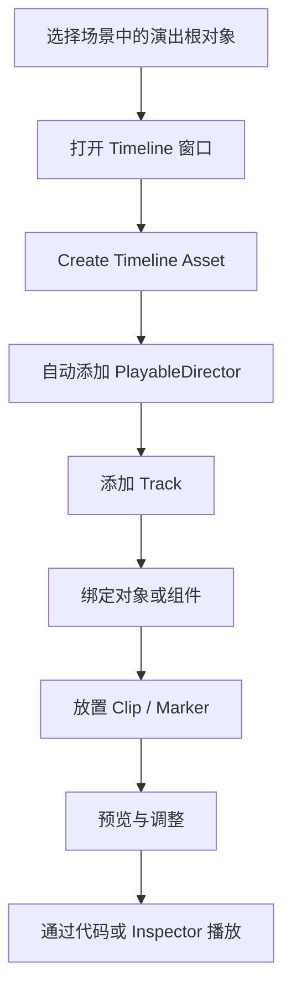

# Unity Timeline 详解：从入门到运行时控制与自定义扩展

:::abstract 文章摘要
Unity Timeline 适合解决“**一段有明确时间轴的内容编排**”问题：比如过场动画、剧情事件、摄像机切换、角色表演、音效时序、对象激活、特效控制，以及把多个系统按时间顺序组织成一个可预览、可编辑、可复用的序列。它不是 Animator Controller 的替代品，也不是简单的动画播放器，而是一个建立在 Playables 体系之上的**时间线编排工具**。

这篇文章会从概念入门一路讲到实战落地：包括 Timeline Asset 与 Timeline Instance 的关系、Playable Director 的职责、常见 Track 的用法、运行时控制 API、自定义 Track/Clip/Marker 的思路，以及项目里最常见的坑点与组织建议。
:::

:::info 版本说明
本文写作时参考的是 Unity 官方文档中 Unity 6.x 与 `com.unity.timeline` 1.8.12 的资料。不同 Unity 版本在界面细节、默认行为、某些 API 或样例位置上可能略有差异；如果你的项目仍在 2021 LTS、2022 LTS 或更老版本，具体行为请以当前项目版本和官方文档为准。
:::

## 1. Timeline 是什么，它解决什么问题

### 1.1 Timeline 的本质

Unity 官方对 Timeline 的描述非常直接：它用于创建 **cinematic content、game-play sequences、audio sequences、complex particle effects**。换句话说，Timeline 不是只给“剧情动画”准备的，它其实是 Unity 里一个通用的**时间序列编排系统**。

你可以把它理解成：

- **编辑器视角**：一个可视化时间线窗口，用轨道和片段来组织内容。
- **运行时视角**：一个由 `PlayableDirector` 驱动、基于 `PlayableGraph` 运行的图。
- **工程视角**：一个把动画、音频、对象激活、代码逻辑统一到“时间轴”上的工具。

### 1.2 Timeline 适合哪些场景

Timeline 最适合下面这类问题：

| 场景 | 为什么适合 Timeline |
| --- | --- |
| 过场动画 / 剧情演出 | 需要同时控制角色动画、相机、音频、特效、对象显隐 |
| 新手引导 | 某些提示、镜头、UI 动画、语音和逻辑需要严格对时 |
| Boss 登场 / 关卡演出 | 需要把多个系统按顺序编排，并允许策划或美术直接预览 |
| 复杂交互脚本 | 逻辑不是纯状态机，而是明显依赖时间先后关系 |
| 可复用演出模块 | 同一段演出逻辑需要换绑定对象重复使用 |

它不太适合的场景也要说清楚：

| 场景 | 更合适的方案 |
| --- | --- |
| 长期循环的角色状态控制 | `Animator Controller` 通常更合适 |
| 高频、完全代码驱动的实时行为 | 直接写代码或使用状态机更直接 |
| 纯 UI Tween 且不需要统一时序编排 | 专门的 Tween 方案可能更轻量 |
| 极其动态、运行中不断生成的大量短逻辑 | 纯代码调度可控性更高 |

### 1.3 Timeline 与 Animator、Animation、协程的关系

很多初学者最困惑的不是“怎么用 Timeline”，而是“它和其他系统到底怎么分工”。

| 工具 | 强项 | 弱项 | 常见用法 |
| --- | --- | --- | --- |
| Animator Controller | 角色长期状态管理、状态切换、参数驱动 | 不擅长做大段跨系统演出编排 | 角色移动、攻击、受击、待机 |
| Timeline | 多系统、可视化、按时间轴编排 | 不适合承担整个角色行为树 | 过场动画、剧情桥段、复杂时序 |
| Animation Window / Animation Clip | 单对象或少量对象的关键帧编辑 | 编排能力有限 | 录制基础动画、配合 Timeline 使用 |
| Coroutine / 纯代码 | 灵活、动态、程序员可控性强 | 可视化差，不利于策划和美术协作 | 逻辑调度、运行中动态行为 |

一个很实用的工程结论是：

:::hint 经验结论
把 Timeline 当成“**演出编排层**”，把 Animator 当成“**角色状态层**”，通常是更稳定的架构。前者负责一段序列什么时候发生、谁参与、先后顺序如何；后者负责角色自身持续的状态切换。
:::

## 2. Timeline 的核心模型

### 2.1 Timeline Asset 与 Timeline Instance

这是 Timeline 最重要、也是最容易被误解的一组概念。

- **Timeline Asset**：保存轨道、片段、标记以及录制出来的动画数据，本质上是项目里的资源。
- **Timeline Instance**：把 Timeline Asset 关联到场景中的某个 `GameObject`，并保存“这个 Track 绑定到哪个场景对象”的信息。

也就是说：

- 资源文件负责“**定义时间线长什么样**”
- 场景实例负责“**这条时间线实际控制谁**”

这意味着同一个 Timeline Asset 可以被多个 `PlayableDirector` 重复使用，但每个 Director 都会建立自己的图和绑定关系。

### 2.2 Playable Director 的职责

`PlayableDirector` 是 Timeline 运行时的核心组件。它至少承担四件事：

1. 关联 `Timeline Asset`
2. 管理绑定关系
3. 决定 Timeline 用什么时钟更新
4. 控制播放、暂停、停止、跳转与结束行为

如果你把 Timeline 比喻成一份“谱子”，那 `PlayableDirector` 就像“演奏者 + 指挥”。没有它，Timeline Asset 只是资源，不会自己在场景里运行。

### 2.3 Track、Clip、Marker、Binding

你在 Timeline 窗口里看到的结构，本质上就是这些概念：

| 概念 | 作用 |
| --- | --- |
| Track | 一条轨道，表示一种被编排的内容或目标 |
| Clip | 轨道上的时间片段，表示某段内容在某个时间区间内生效 |
| Marker | 时间点事件，不一定占时长 |
| Binding | 轨道与场景对象、组件之间的关联 |
| Group Track | 轨道分组，主要用于组织结构 |
| Sub-Timeline | 通过 Control Track 嵌套的子时间线 |

### 2.4 PlayableGraph 与 Timeline 的关系

虽然日常使用时你大多只操作 Timeline 窗口，但运行时真正执行的是 `PlayableGraph`。`PlayableDirector` 会根据 `PlayableAsset` 构建一张图，再由图去驱动动画、音频、通知以及各种可播放内容。

这也是为什么：

- Timeline 能统一调度多种系统
- 你可以在代码里手动 `Evaluate`
- 可以自定义 `PlayableAsset`、`PlayableBehaviour`、自定义 Track 和 Clip

如果你将来要做自定义 Timeline 功能，最终一定会碰到 `PlayableGraph`、`Playable`、`ScriptPlayable<T>`、`PlayableBehaviour` 这些概念。

## 3. 从零开始的 Timeline 编辑器工作流

### 3.1 创建 Timeline Asset 与 Timeline Instance

最常见的创建方式是：

1. 在场景中选中一个作为“演出根节点”的 `GameObject`
2. 打开 `Window > Sequencing > Timeline`
3. 点击 `Create`
4. 保存 `.playable` 资源
5. Unity 自动给该对象挂上 `PlayableDirector` 并建立关联

这套流程背后其实做了两件事：

- 在 Project 里创建 Timeline Asset
- 在 Scene 里创建 Timeline Instance

推荐你把 Timeline 的“根节点”单独做成空对象，例如：

- `Cutscene_Intro`
- `BossAppearTimeline`
- `TutorialStep01Timeline`

这样更利于组织场景层级和脚本控制。

### 3.2 一个完整的基础工作流图



### 3.3 Timeline 窗口中最重要的几个区域

| 区域 | 作用 |
| --- | --- |
| Track List | 显示轨道层级、绑定对象、分组 |
| Content View | 显示片段与标记的时间分布 |
| Playhead | 当前时间位置 |
| Inspector | 当前 Track / Clip / Marker 的详细属性 |
| Track Header | 重命名、绑定、Record、Curves、Mute、Lock 等操作 |

初学者很容易忽略一个事实：**同一个 Timeline Window，在选择不同对象时显示的内容可能不同**。如果你不想因为切换场景对象而丢失当前编辑上下文，可以使用 Timeline 窗口的锁定功能。

### 3.4 Add Track：常见轨道类型

Unity Timeline 常见轨道大致如下：

| Track 类型 | 用途 | 典型绑定 |
| --- | --- | --- |
| Activation Track | 控制对象激活与禁用 | `GameObject` |
| Animation Track | 播放动画、录制关键帧、混合动画 | `Animator` / 动画对象 |
| Audio Track | 播放音频片段 | `AudioSource` |
| Control Track | 控制粒子、Prefab、嵌套 Timeline、`ITimeControl` 脚本 | 不同对象 |
| Playable Track | 播放自定义 `PlayableAsset` | 自定义绑定 |
| Signal Track | 在时间点发出信号 | `SignalReceiver` 所在对象 |

:::warning 一个很常见的误区
很多人第一次接触 Timeline，会把它误认为“只能放动画 Clip”。实际上 Timeline 的真正价值不在“播放动画”，而在于它能把**动画、音频、激活状态、代码逻辑、子时间线**放到同一根时间轴上统一管理。
:::

## 4. Playable Director 详解

### 4.1 Playable 属性：资源与实例的桥梁

`PlayableDirector` 的 `Playable` 属性对应你绑定的 Timeline Asset。只要这一步完成，Scene 中的这个 Director 就变成该 Timeline 的一个实例。

这件事的实际含义是：

- Timeline Asset 可以复用
- 实例绑定是场景级的
- 同一个 Timeline Asset 可以控制不同对象组合

这也是 Timeline 适合做“可复用演出模板”的原因。

### 4.2 Update Method：时间从哪里来

`PlayableDirector` 的更新方式是很多项目出 bug 的根源。常见选项可以理解为：

| Update Method | 含义 | 适合场景 |
| --- | --- | --- |
| DSP | 使用音频系统时钟，适合需要精确音频调度的场景 | 音乐节奏、精准音频同步 |
| Game Time | 使用游戏时间，受 `Time.timeScale` 影响 | 大多数普通玩法 |
| Unscaled Game Time | 使用不受时间缩放影响的时间 | 暂停菜单中的演出、UI 时间轴 |
| Manual | 不自动更新，完全由代码推进 | 回放系统、编辑器工具、手动 Scrub |

这四种模式的差异必须理解清楚。最常见的错误有两个：

1. 游戏进入慢动作后，Timeline 跟着慢下来，结果并不是你想要的
2. 游戏暂停时 `timeScale = 0`，Timeline 也停了，但你本来想让某个 UI 或剧情继续推进

### 4.3 Wrap Mode：播完之后怎么办

常见结束行为有三种：

| Wrap Mode | 行为 |
| --- | --- |
| Hold | 播放完后停留在最后一帧 |
| Loop | 播完后循环 |
| None | 播完后不保持最后状态 |

选择哪一种取决于你的内容目的：

- 过场动画收尾定格，通常选 `Hold`
- 循环播放的环境演出，通常选 `Loop`
- 某些一次性触发后不想保留尾状态的内容，选 `None`

### 4.4 Initial Time 与 Play On Awake

- `Play On Awake`：场景开始时自动播放
- `Initial Time`：延迟若干秒再真正开始

这两个属性在做开场演出时很方便，但在正式项目中也容易带来“为什么一进场景就播了”的困惑。

:::hint 实践建议
除非是非常明确的开场演出，否则我更建议关闭 `Play On Awake`，统一由脚本在合适时机显式调用 `Play()`。这样项目里更容易控制，也更容易排查问题。
:::

## 5. 常见 Track 的深入讲解

### 5.1 Animation Track：Timeline 的核心轨道

Animation Track 不只是“播放动画片段”，它同时也是 Timeline 里最强大的编辑轨道之一。

#### 5.1.1 绑定对象与自动补组件

把对象拖进 Timeline 添加 Animation Track 时，如果对象没有 `Animator`，Timeline 会自动补一个 `Animator`。因此，Animation Track 通常绑定的是可动画化对象，尤其是带 Animator 的角色或场景物体。

#### 5.1.2 录制基础动画与 Infinite Clip

你可以直接在空的 Animation Track 上点 Record 录制关键帧。此时 Timeline 会创建 **Infinite Clip**。

Infinite Clip 的特点：

- 是直接在 Timeline 中录出来的基础关键帧动画
- 没有明确长度概念，覆盖整条轨道
- 可以在曲线视图中编辑关键帧
- 不能像普通 Clip 那样直接修剪、切分、拖拽

如果你想对它做标准的 Clip 操作，需要先把它转换成普通 Animation Clip。

#### 5.1.3 Clip 编辑：Trim、Blend、Ease、Curves

Animation Track 上最常见的编辑操作包括：

- **Trim**：裁掉头尾，只用源动画的一部分
- **Clip In**：从源动画的某个偏移时间开始播放
- **Blend**：让两个 Clip 发生重叠并平滑过渡
- **Ease In / Ease Out**：让单个 Clip 平滑进入或退出
- **Curves**：直接调整动画曲线、切线和插值

如果你做的是角色表演或镜头演出，这部分能力几乎每天都会用到。

#### 5.1.4 Match Offsets：解决动画跳变

角色从一个动画接到另一个动画时，最容易出现“位置对不上”“朝向跳变”“脚底打滑”。

Timeline 提供了 `Match Offsets to Previous Clip` 和 `Match Offsets to Next Clip` 这样的工作流，帮助你把前后 Clip 的位置与旋转对齐。这个功能对人物转身、接走路、接跑步时非常有用。

#### 5.1.5 Track Offsets 与 Clip Offsets

初学者最容易混淆“Track Offset”和“Clip Offset”。

| 偏移层级 | 作用 |
| --- | --- |
| Track Offset | 影响整条 Animation Track 上的起始空间关系 |
| Clip Offset | 只影响某个 Animation Clip |

在项目里，推荐你这样记：

- **想让整条轨道以场景当前状态为基准开始**，优先看 Track Offset
- **只想修某一个片段的接缝**，优先改 Clip Offset

#### 5.1.6 Avatar Mask 与 Override Track

如果你需要“下半身保持走路，上半身做别的动作”，可以使用 **Animation Override Track** 配合 **Avatar Mask**。

这套能力的本质是：

- 父 Animation Track 提供完整动画基底
- Override Track 覆盖其中一部分骨骼区域
- Avatar Mask 决定哪些身体部位被覆盖

这在角色边走边挥手、边移动边开枪、边跑边播放上半身演出时非常实用。

### 5.2 Activation Track：控制对象显隐和激活

Activation Track 用于控制 `GameObject` 的激活状态。它非常适合：

- 让某个物体在某一时刻出现
- 切换场景中的道具可见性
- 控制特效对象启停
- 配合演出控制临时对象生命周期

但是要特别注意一个官方文档也明确提醒的点：

:::danger 高风险误区
不要把**挂着 PlayableDirector 的主控制对象本身**再绑定到 Activation Track 去开关激活。因为这个对象本身就是 Timeline 实例与场景的桥梁，禁用它会直接影响 Timeline 自己的运行长度和生命周期。
:::

此外，Activation Track 还有一个常被忽略的属性：**播放结束后的状态**。有些项目里会出现“明明演出结束了，物体却没恢复原状态”的问题，很多时候就是这里没有设计清楚。

### 5.3 Audio Track：处理时序化音频

Audio Track 用于把音频片段放到时间轴上。它很适合：

- 旁白
- 环境音效
- 关键时间点的 SFX
- 演出中的音乐段落

如果你的内容需要非常精准地与音频系统对齐，可以考虑 Playable Director 的 `DSP` 更新时间模式。

### 5.4 Control Track：最容易被低估的高级轨道

Control Track 能控制的内容很多，包括：

- 子 Timeline
- 粒子系统
- Prefab 实例
- 实现了 `ITimeControl` 的脚本

它不是一个“只有高级用户才用得到”的轨道，恰恰相反，它往往是把 Timeline 从“会播动画”升级为“能编排系统”的关键。

#### 5.4.1 Sub-Timeline：把大演出拆成小演出

大型过场动画如果全部塞进一条时间线，后期几乎一定会越来越难维护。Control Track 提供了嵌套子 Timeline 的能力，也就是常说的 **Sub-Timeline**。

这种拆分方式非常适合：

- 按镜头段落拆分
- 按角色拆分
- 按特效段拆分
- 把通用演出模块复用到多个主时间线中

嵌套后你可以进入子 Timeline 的本地视图编辑，也可以回到主 Timeline 看全局时间。

#### 5.4.2 Control Track 与 ITimeControl

如果某个自定义脚本实现了 `ITimeControl`，那么它就能接入 Timeline 的时间推进流程。这种方式很适合做：

- 自定义特效控制
- 非动画系统的时间驱动对象
- 需要被 Timeline 精确推进的逻辑模块

如果你希望某个系统不是简单收到“开始/结束”信号，而是**每一帧都按 Timeline 时间驱动**，那么 `ITimeControl` 是重要入口。

### 5.5 Signal Track 与 Marker：时间点事件系统

Timeline 不只有有长度的 Clip，还有“时间点事件”这一类能力，这就是 Marker / Signal 体系的价值。

#### 5.5.1 Marker 是什么

Marker 是挂在时间线某个时刻的标记。它本身更像“时间点信息”，不强调持续时间。

Marker 可以用于：

- 注释
- 提示
- 触发事件
- 作为自定义扩展点

#### 5.5.2 Signal 的结构

Signal 体系通常由三部分构成：

| 部件 | 作用 |
| --- | --- |
| `SignalAsset` | 定义一个信号资源 |
| `SignalEmitter` | 在某个时间点发出信号 |
| `SignalReceiver` | 监听信号并执行对应反应 |

这非常适合做：

- 脚步声
- 某一帧打开特效
- 某一帧触发对白
- 某一帧切换 UI
- 通知脚本执行指定方法

它和直接在代码里写“到某个时间点就调用函数”的差别在于：**可视化、可预览、可被非程序同学调节**。

### 5.6 Playable Track：承接自定义逻辑的入口

如果内置 Track 不满足需求，Playable Track 是你接入自定义 `PlayableAsset` 的标准方式。

常见用途：

- 字幕系统
- 自定义相机效果
- 时间膨胀
- 特殊游戏机制片段
- 非标准动画控制器

你可以把 Playable Track 理解成“Timeline 的可插拔逻辑轨道接口”。

## 6. Timeline 的常见编辑技巧

### 6.1 录制而不是手填关键帧

对于镜头、小幅位移、门的开合、机关的移动等内容，不要一开始就手写代码，也不要立刻去 Animation Window 单独做资源。直接在 Timeline 上录制，往往是最快的原型方式。

适合录制的内容包括：

- 摄像机 Transform
- 门、平台、道具的 Transform
- 灯光或材质的简单可动画属性
- 一些临时演出的过渡动画

### 6.2 Curves View：别只停留在 Dope Sheet 视图

很多人用 Timeline 只会拖 Clip，但真正要把演出做顺，最后一定会进曲线视图调整：

- 插值
- 切线
- Ease 曲线
- 自定义过渡手感

尤其是摄像机、平台移动、门开关、角色靠近停顿等场景，曲线质量直接决定演出的“廉价感”还是“顺滑感”。

### 6.3 Lock 与 Mute 只是编辑器级辅助，不完全等于运行保护

`TrackAsset` 的锁定状态只影响 Timeline 编辑器中的操作，并不代表你在代码里就改不了它。这个细节非常容易被误会。

而 `Mute` 则更偏向运行层，它会把该 Track 排除出生成的 `PlayableGraph`。所以：

- **Lock**：更多是编辑保护
- **Mute**：更多是执行排除

项目排查问题时，这个区别很重要。

## 7. 在运行时控制 Timeline

Timeline 真正好用，不是因为它能在编辑器里预览，而是因为你可以在运行时把它接到游戏逻辑里。

### 7.1 最基本的控制 API

下面这几个 API 是最常用的：

- `Play()`
- `Pause()`
- `Resume()`
- `Stop()`

示例：

```csharp
using UnityEngine;
using UnityEngine.Playables;

public sealed class TimelinePlayer : MonoBehaviour
{
    [SerializeField] private PlayableDirector director;

    public void PlayTimeline()
    {
        if (director == null)
        {
            return;
        }

        director.Play();
    }

    public void PauseTimeline()
    {
        if (director == null)
        {
            return;
        }

        director.Pause();
    }

    public void ResumeTimeline()
    {
        if (director == null)
        {
            return;
        }

        director.Resume();
    }

    public void StopTimeline()
    {
        if (director == null)
        {
            return;
        }

        director.Stop();
    }
}
```

#### 7.1.1 什么时候用 Pause，什么时候用 Stop

| 操作 | 行为 |
| --- | --- |
| Pause | 暂停当前图，通常保留当前状态 |
| Stop | 停止并销毁当前图，通常要重新构建才能再播 |

所以：

- 临时中断、稍后继续，优先 `Pause`
- 彻底结束并重置生命周期，优先 `Stop`

### 7.2 手动跳时间：time + Evaluate

如果你要做：

- 时间轴拖拽预览
- 快进
- 回放
- 对话历史跳转
- 外部逻辑精确控制到某一秒

就会用到 `director.time` 和 `director.Evaluate()`。

```csharp
using UnityEngine;
using UnityEngine.Playables;

public sealed class TimelineScrubber : MonoBehaviour
{
    [SerializeField] private PlayableDirector director;

    public void JumpTo(double targetTime)
    {
        if (director == null)
        {
            return;
        }

        director.time = targetTime;
        director.Evaluate();
    }
}
```

:::warning 常见坑
只改 `director.time` 但不调用 `Evaluate()`，你看到的场景状态可能不会立刻刷新。很多“我明明把时间改过去了，为什么画面没变”的问题，本质上都是这个原因。
:::

### 7.3 手动更新：Manual 模式

如果 Director 的更新时间模式设为 `Manual`，你就可以自己控制 Timeline 何时推进。一个典型场景是“剧情回放系统”或“编辑器工具预览”。

```csharp
using UnityEngine;
using UnityEngine.Playables;

public sealed class ManualTimelineDriver : MonoBehaviour
{
    [SerializeField] private PlayableDirector director;
    [SerializeField] private float speed = 1.0f;

    private void Update()
    {
        if (director == null)
        {
            return;
        }

        if (director.timeUpdateMode != DirectorUpdateMode.Manual)
        {
            return;
        }

        double nextTime = director.time + Time.unscaledDeltaTime * speed;
        director.time = nextTime;
        director.Evaluate();
    }
}
```

### 7.4 运行时动态绑定：SetGenericBinding

复用 Timeline 模板时，最常见的需求就是运行时换绑定对象。例如：

- 同一段演出给不同 NPC 使用
- 同一条镜头流程绑定不同相机
- 同一条交互时间线绑定不同门、不同按钮、不同特效根节点

示例：

```csharp
using UnityEngine;
using UnityEngine.Playables;
using UnityEngine.Timeline;

public sealed class TimelineBindingExample : MonoBehaviour
{
    [SerializeField] private PlayableDirector director;
    [SerializeField] private TimelineAsset timelineAsset;
    [SerializeField] private Animator targetAnimator;

    public void SetupAndPlay()
    {
        if (director == null || timelineAsset == null || targetAnimator == null)
        {
            return;
        }

        director.playableAsset = timelineAsset;

        foreach (TrackAsset track in timelineAsset.GetOutputTracks())
        {
            if (track is AnimationTrack)
            {
                director.SetGenericBinding(track, targetAnimator);
            }
        }

        director.RebuildGraph();
        director.Play();
    }
}
```

上面这段代码的价值不在于“遍历所有 Track”，而在于建立正确理解：

- Timeline Asset 是资源模板
- `SetGenericBinding` 解决的是实例绑定
- 改了绑定以后，必要时要 `RebuildGraph()` 或重新播放，确保图与输出刷新

### 7.5 监听播放事件

很多业务逻辑都需要知道 Timeline 什么时候开始、暂停、结束。`PlayableDirector` 提供了几个很实用的事件：

- `played`
- `paused`
- `stopped`

```csharp
using UnityEngine;
using UnityEngine.Playables;

public sealed class TimelineEventsListener : MonoBehaviour
{
    [SerializeField] private PlayableDirector director;

    private void OnEnable()
    {
        if (director == null)
        {
            return;
        }

        director.played += OnDirectorPlayed;
        director.paused += OnDirectorPaused;
        director.stopped += OnDirectorStopped;
    }

    private void OnDisable()
    {
        if (director == null)
        {
            return;
        }

        director.played -= OnDirectorPlayed;
        director.paused -= OnDirectorPaused;
        director.stopped -= OnDirectorStopped;
    }

    private void OnDirectorPlayed(PlayableDirector playableDirector)
    {
        Debug.Log("Timeline 开始播放");
    }

    private void OnDirectorPaused(PlayableDirector playableDirector)
    {
        Debug.Log("Timeline 已暂停");
    }

    private void OnDirectorStopped(PlayableDirector playableDirector)
    {
        Debug.Log("Timeline 已停止");
    }
}
```

## 8. 自定义 Timeline：从会用到能扩展

如果你的项目已经开始依赖 Timeline，迟早会遇到一个问题：

> 内置 Track 不够用了，能不能做自己的 Track？

答案是可以，而且这是 Timeline 体系非常有价值的一部分。

### 8.1 自定义扩展的核心角色

#### 8.1.1 `PlayableAsset`

负责“这个片段的数据是什么、如何创建 Playable”。

你可以把它理解成：**Clip 资源定义层**。

#### 8.1.2 `PlayableBehaviour`

负责“在图运行时，这个片段每一帧怎么表现”。

你可以把它理解成：**Clip 运行逻辑层**。

#### 8.1.3 `TrackAsset`

负责“这条轨道接收什么类型的 Clip、绑定什么对象、如何混合多个片段”。

你可以把它理解成：**轨道规则层**。

#### 8.1.4 常见 Attribute

| Attribute | 作用 |
| --- | --- |
| `TrackClipTypeAttribute` | 指定这条轨道能放什么 Clip |
| `TrackBindingTypeAttribute` | 指定这条轨道绑定什么对象类型 |
| `TrackColorAttribute` | 指定轨道颜色 |
| `DisplayNameAttribute` | 设置更友好的显示名 |

### 8.2 一个最小可用的自定义 Clip 示例

下面用一个“打印日志的示例片段”说明自定义结构。这个例子本身很简单，但适合你理解自定义 Timeline 的分层。

```csharp
using System;
using UnityEngine;
using UnityEngine.Playables;

[Serializable]
public sealed class LogPlayableBehaviour : PlayableBehaviour
{
    public string message;
    public bool logged;

    public override void OnBehaviourPlay(Playable playable, FrameData info)
    {
        if (logged)
        {
            return;
        }

        Debug.Log(message);
        logged = true;
    }

    public override void OnBehaviourPause(Playable playable, FrameData info)
    {
        logged = false;
    }
}

[Serializable]
public sealed class LogPlayableAsset : PlayableAsset
{
    public string message = "Hello Timeline";

    public override Playable CreatePlayable(PlayableGraph graph, GameObject owner)
    {
        ScriptPlayable<LogPlayableBehaviour> playable = ScriptPlayable<LogPlayableBehaviour>.Create(graph);
        LogPlayableBehaviour behaviour = playable.GetBehaviour();
        behaviour.message = message;
        behaviour.logged = false;
        return playable;
    }
}
```

然后定义一条能放这个 Clip 的 Track：

```csharp
using System;
using UnityEngine;
using UnityEngine.Timeline;

[Serializable]
[TrackClipType(typeof(LogPlayableAsset))]
[TrackColor(0.2f, 0.6f, 0.9f)]
public sealed class LogTrack : TrackAsset
{
}
```

这样你就拥有了一条最简单的自定义 Track。虽然它只是输出日志，但它已经展示了 Timeline 扩展最关键的结构关系。

### 8.3 带绑定对象的自定义 Track

只会输出日志还不够，实际项目里你通常需要轨道绑定到某个场景对象，比如：

- 一个文本组件
- 一个特效控制器
- 一个摄像机控制脚本
- 一个自定义角色表现脚本

这时通常会使用 `TrackBindingTypeAttribute` 或 `ExposedReference<T>`。

下面给出一个最小示意：

```csharp
using System;
using UnityEngine;
using UnityEngine.Playables;

[Serializable]
public sealed class FollowTargetBehaviour : PlayableBehaviour
{
    public Transform controlledTransform;
    public Vector3 offset;

    public override void ProcessFrame(Playable playable, FrameData info, object playerData)
    {
        if (controlledTransform == null)
        {
            return;
        }

        controlledTransform.position = controlledTransform.position + offset * info.deltaTime;
    }
}

[Serializable]
public sealed class FollowTargetAsset : PlayableAsset
{
    public ExposedReference<Transform> target;
    public Vector3 offset = Vector3.forward;

    public override Playable CreatePlayable(PlayableGraph graph, GameObject owner)
    {
        ScriptPlayable<FollowTargetBehaviour> playable = ScriptPlayable<FollowTargetBehaviour>.Create(graph);
        FollowTargetBehaviour behaviour = playable.GetBehaviour();
        PlayableDirector director = owner.GetComponent<PlayableDirector>();

        if (director != null)
        {
            behaviour.controlledTransform = target.Resolve(director);
        }

        behaviour.offset = offset;
        return playable;
    }
}
```

再定义 Track：

```csharp
using System;
using UnityEngine;
using UnityEngine.Timeline;

[Serializable]
[TrackClipType(typeof(FollowTargetAsset))]
[TrackBindingType(typeof(Transform))]
[TrackColor(0.8f, 0.5f, 0.2f)]
public sealed class FollowTargetTrack : TrackAsset
{
}
```

这个示例的重点不是逻辑本身，而是帮助你理解三件事：

1. `ExposedReference<T>` 适合让 Clip 持有场景引用
2. `PlayableDirector` 负责解析这些引用
3. 自定义 Track 的本质是把 Clip 规则和绑定关系组织起来

### 8.4 需要混合时，重写 CreateTrackMixer

如果你的 Track 上会同时放多个 Clip，并且这些 Clip 的结果需要“混合”，那么就应该重写 `CreateTrackMixer`。

典型例子：

- 多个速度变化片段混合
- 多个颜色变化片段叠加
- 多个音量或权重片段插值
- 自定义位移、缩放、透明度等连续参数混合

这也是 Timeline 样例里很多高级自定义 Track 的核心。

### 8.5 自定义编辑器层扩展

除了运行时逻辑，Timeline 还允许你扩展编辑器体验，例如：

- `ClipEditor`
- `TrackEditor`
- `MarkerEditor`

这些 API 适合做：

- 自定义 Clip 外观
- 报错提示
- 轨道样式
- 自定义上下文操作

它们不是所有项目都需要，但当你做平台级工具、内容管线或大型团队协作时，会非常有价值。

## 9. 典型项目工作流

### 9.1 过场动画型工作流

最常见的 Timeline 落地方式是：

1. 建一个演出根对象
2. 创建 Timeline
3. 添加角色 Animation Track、Camera Track、Audio Track、Signal Track
4. 用 Control Track 串联特效或子 Timeline
5. 用脚本在玩法触发点调用 `Play()`
6. 在 `stopped` 事件中恢复玩家控制权

这个工作流的好处是清晰、易协作、可预览。

### 9.2 玩法驱动型工作流

不是所有 Timeline 都要做“电影式演出”。很多项目会这样用：

- 玩家触发机关
- 播放一条 3 秒 Timeline
- 前 0.3 秒激活门动画
- 1.2 秒发 Signal 播放音效
- 2.0 秒切 UI 提示
- 3.0 秒结束后真正开放交互

这种用法的关键在于：**Timeline 负责时序，代码负责状态切换与业务判断**。

### 9.3 模板化与复用

如果项目里存在很多结构类似的演出，可以把 Timeline 做成模板化资源，然后在运行时换绑定对象。比如：

- 任意 NPC 的入场演出
- 任意门的开启演出
- 任意宝箱的拾取演出
- 任意任务点的提示演出

这类设计可以显著提高内容复用率。

## 10. Timeline 常见坑与排查思路

### 10.1 把 Asset 和 Instance 混为一谈

这是第一大坑。

表现：

- “为什么我改了资源，场景绑定没跟着变？”
- “为什么同一个 Timeline 资源在不同地方效果不一样？”

根因：

- 资源定义和场景绑定不是同一个层级

解决方式：

- 始终区分“Timeline Asset 的结构”和“PlayableDirector 的绑定”

### 10.2 改了时间但画面没刷新

表现：

- 改了 `director.time`，场景没更新

根因：

- 没有 `Evaluate()`

解决方式：

- 手动跳时间后显式 `Evaluate()`

### 10.3 运行时改了绑定但没生效

表现：

- 调了 `SetGenericBinding`，但 Timeline 还是控制旧对象

根因可能有三类：

1. 图已经构建完成，需要重新绑定输出
2. 需要 `RebuildGraph()`
3. 调用时机不对，旧图还在运行

解决方式：

- 在合适时机改绑定
- 必要时 `RebuildGraph()`
- 改完后重新 `Play()` 或重新评估

### 10.4 Infinite Clip 不好编辑

表现：

- 录出来的内容不能 trim、split、drag

根因：

- 它是 Infinite Clip，不是普通 Animation Clip

解决方式：

- 转换成普通 Animation Clip 后再做片段编辑

### 10.5 主 Director 对象被 Activation Track 关掉

表现：

- Timeline 自己中途失效
- 长度异常
- 播放状态异常

根因：

- 用 Activation Track 控制了承载 `PlayableDirector` 的根对象

解决方式：

- 让 Director 根节点只作为控制中枢，不参与这类激活控制

### 10.6 以为 Lock 能防止一切改动

表现：

- 轨道锁了，代码里还是能改

根因：

- Lock 主要影响 Timeline Editor 里的编辑操作，不是运行时只读保护

解决方式：

- 把 Lock 理解成编辑器辅助，而不是安全机制

### 10.7 混用 Game Time 和 Unscaled Game Time

表现：

- 暂停时 Timeline 不动或不该动的时候却继续动
- 慢动作里演出速度异常

根因：

- 时间源选择不对

解决方式：

- 一开始就明确：这条 Timeline 是“受游戏时间影响”还是“独立于游戏时间”

## 11. 实践建议：如何在团队中用好 Timeline

### 11.1 把 Timeline 当作内容编排层，而不是万能逻辑层

Timeline 很强，但不要什么逻辑都塞进去。更稳妥的分层通常是：

- **Timeline**：时序编排、演出调度
- **业务脚本**：状态判断、权限控制、数据同步
- **Animator / 其他系统**：持续行为与专有能力

### 11.2 每条 Timeline 都要有清晰的“所有者”

建议为每条 Timeline 明确：

- 谁触发
- 谁停止
- 播放期间谁接管输入
- 播放结束后谁收尾

否则项目后期很容易出现 Timeline 播了，但输入没锁；或者 Timeline 播完了，状态没还原。

### 11.3 复杂演出优先拆成子 Timeline

当一条时间线开始出现下面这些信号时，就该拆分了：

- 轨道数很多
- 片段过密
- 多人同时修改
- 某些片段想复用
- 难以阅读和定位

这时优先考虑：

- Group Track 做结构整理
- Control Track 做 Sub-Timeline 拆分
- 模块化绑定设计

### 11.4 给策划、美术留出可调参数，而不是全写死

Timeline 最大的价值之一是让非程序同学也能参与演出制作。所以你在自定义 Clip 时，尽量把这些内容暴露出来：

- 时间点
- 权重
- 混合时长
- 目标对象
- 文本内容
- 音量、速度等参数

这样 Timeline 才能真正变成团队协作工具。

## 12. 学习路线建议

### 12.1 入门阶段

先熟悉这些内容：

1. 创建 Timeline Asset 与 Instance
2. 理解 Playable Director
3. 会用 Animation / Audio / Activation / Signal
4. 会做 Trim、Blend、Curves、Record
5. 会用脚本 `Play()`、`Pause()`、`Stop()`

### 12.2 进阶阶段

接着进入：

1. Track Offset 与 Clip Offset
2. Avatar Mask 与 Override Track
3. Control Track 与 Sub-Timeline
4. `SetGenericBinding`
5. `time + Evaluate`
6. 播放事件与运行时状态衔接

### 12.3 高阶阶段

最后再看：

1. `PlayableAsset`
2. `PlayableBehaviour`
3. `TrackAsset`
4. `CreateTrackMixer`
5. `ExposedReference<T>`
6. `ClipEditor` / `TrackEditor` / `MarkerEditor`

按照这个顺序学，通常最稳，不容易在一开始就被 Playables 体系的底层概念劝退。

## 13. 总结

Timeline 的价值从来不只是“做过场动画”。

它真正解决的是：**把多个系统统一放到一根时间轴上进行可视化编排**。你可以把动画、音频、对象激活、子时间线、信号、代码驱动行为都纳入一个统一模型，并且让它：

- 可预览
- 可编辑
- 可复用
- 可由代码控制
- 可由工具继续扩展

如果你只把 Timeline 当作“能拖几个动画 Clip 的窗口”，你只用了它一小部分能力。真正把它用起来之后，你会发现它是 Unity 工程里非常重要的一层：它连接了内容生产、程序控制、运行时图系统和团队协作。

:::hint 一句话结论
把 Timeline 学到“能扩展、能运行时复用、能和业务逻辑协作”的程度，它才会真正从一个编辑器功能，升级为你项目里的基础设施。
:::

## 参考资料

| 资料 | 链接 |
| --- | --- |
| Unity Manual - Timeline | [https://docs.unity3d.com/6000.4/Documentation/Manual/com.unity.timeline.html](https://docs.unity3d.com/6000.4/Documentation/Manual/com.unity.timeline.html) |
| Timeline Package Manual - About Timeline | [https://docs.unity3d.com/Packages/com.unity.timeline@1.8/manual/index.html](https://docs.unity3d.com/Packages/com.unity.timeline@1.8/manual/index.html) |
| Timeline Package Manual - Timeline assets and instances | [https://docs.unity3d.com/Packages/com.unity.timeline@1.8/manual/tl-overview.html](https://docs.unity3d.com/Packages/com.unity.timeline@1.8/manual/tl-overview.html) |
| Timeline Package Manual - Playable Director component | [https://docs.unity3d.com/Packages/com.unity.timeline@1.8/manual/playable-director.html](https://docs.unity3d.com/Packages/com.unity.timeline@1.8/manual/playable-director.html) |
| Timeline Package Manual - Add tracks | [https://docs.unity3d.com/Packages/com.unity.timeline@1.8/manual/trk-add.html](https://docs.unity3d.com/Packages/com.unity.timeline@1.8/manual/trk-add.html) |
| Timeline Package Manual - Track header | [https://docs.unity3d.com/Packages/com.unity.timeline@1.8/manual/trk-header.html](https://docs.unity3d.com/Packages/com.unity.timeline@1.8/manual/trk-header.html) |
| Timeline Package Manual - Record basic animation | [https://docs.unity3d.com/Packages/com.unity.timeline@1.8/manual/wf-record-anim.html](https://docs.unity3d.com/Packages/com.unity.timeline@1.8/manual/wf-record-anim.html) |
| Timeline Package Manual - Convert an Infinite clip | [https://docs.unity3d.com/Packages/com.unity.timeline@1.8/manual/wf-convert-infinite.html](https://docs.unity3d.com/Packages/com.unity.timeline@1.8/manual/wf-convert-infinite.html) |
| Timeline Package Manual - Animate a humanoid | [https://docs.unity3d.com/Packages/com.unity.timeline@1.8/manual/wf-anim-human.html](https://docs.unity3d.com/Packages/com.unity.timeline@1.8/manual/wf-anim-human.html) |
| Timeline Package Manual - Override upper-body animation | [https://docs.unity3d.com/Packages/com.unity.timeline@1.8/manual/wf-anim-override.html](https://docs.unity3d.com/Packages/com.unity.timeline@1.8/manual/wf-anim-override.html) |
| Timeline Package Manual - Create a Sub-Timeline instance | [https://docs.unity3d.com/Packages/com.unity.timeline@1.8/manual/wf-subtimeline.html](https://docs.unity3d.com/Packages/com.unity.timeline@1.8/manual/wf-subtimeline.html) |
| Timeline Package Manual - Use markers and signals | [https://docs.unity3d.com/Packages/com.unity.timeline@1.8/manual/wf-signals.html](https://docs.unity3d.com/Packages/com.unity.timeline@1.8/manual/wf-signals.html) |
| Unity Scripting API - PlayableDirector | [https://docs.unity3d.com/6000.4/Documentation/ScriptReference/Playables.PlayableDirector.html](https://docs.unity3d.com/6000.4/Documentation/ScriptReference/Playables.PlayableDirector.html) |
| Timeline Scripting API - TrackAsset | [https://docs.unity3d.com/Packages/com.unity.timeline@1.8/api/UnityEngine.Timeline.TrackAsset.html](https://docs.unity3d.com/Packages/com.unity.timeline@1.8/api/UnityEngine.Timeline.TrackAsset.html) |
| Timeline Scripting API - SignalReceiver / SignalEmitter | [https://docs.unity3d.com/Packages/com.unity.timeline@1.8/api/UnityEngine.Timeline.SignalReceiver.html](https://docs.unity3d.com/Packages/com.unity.timeline@1.8/api/UnityEngine.Timeline.SignalReceiver.html) |
