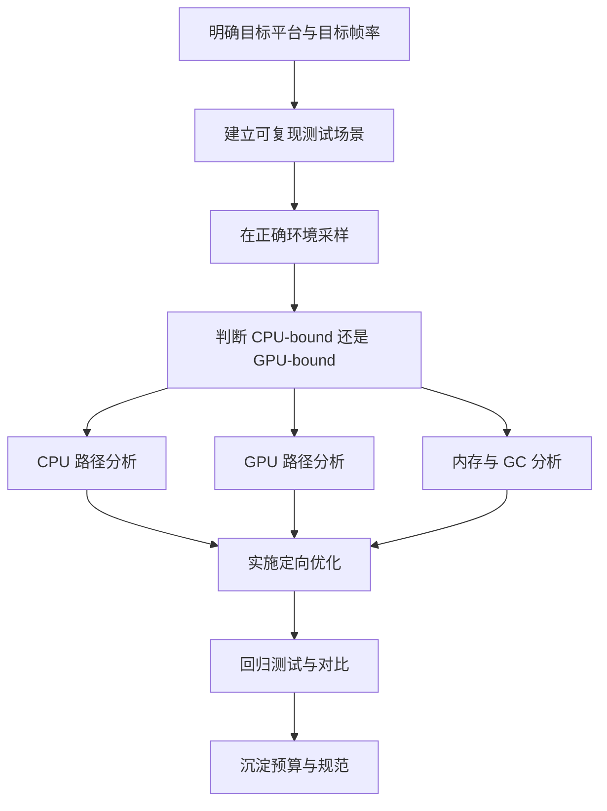

# Unity 性能分析与优化实战：Profiler、内存、渲染与工程工作流

:::abstract 文章摘要
Unity 性能优化最常见的失败原因，不是团队不会写优化代码，而是没有建立正确的“**先测量、再定位、最后验证**”工作流。真正高效的性能工作并不是看到卡顿就开始改代码，而是先明确目标帧率和资源预算，再用 Unity 官方工具链确认瓶颈是在 CPU、GPU、内存、GC、资源加载还是 UI，最后只对真正的热点做改动，并用同一套测试场景复测。

本文会把 Unity 的性能分析与优化拆成一整套可落地的方法：**目标设定 -> 采样环境 -> Profiler 定位 -> 分模块分析 -> 对症优化 -> 回归验证 -> 团队化沉淀**。如果你过去对优化的理解主要停留在“少写 Update”“少 Instantiate”“开批处理”，那么这篇文章会帮你把零散经验升级成完整工作流。
:::

:::info 版本说明
本文以 Unity 6 时代的官方工具链和文档为主线组织内容，但很多核心思路同样适用于 2021 LTS、2022 LTS、2023 系列。不同 Unity 版本、不同渲染管线（Built-in / URP / HDRP）以及不同平台（PC / Mobile / Console / Web）在细节上会有差异，实际项目请始终以当前项目版本和官方文档为准。
:::

## 1. 为什么性能优化不能靠感觉

### 1.1 “卡”不是一个单一问题

很多开发者说“项目很卡”，但这个描述对优化几乎没有帮助。因为“卡”的来源可能完全不同：

| 现象 | 可能原因 | 应优先看的工具 |
| --- | --- | --- |
| 帧率长期偏低 | CPU 或 GPU 长期超预算 | Profiler、Frame Debugger、Rendering Stats |
| 偶发卡顿 / 掉帧尖峰 | GC、资源加载、同步等待、脚本尖峰 | Profiler、Memory Profiler、Profile Analyzer |
| 首次进入场景很慢 | 资源加载、Shader 预热不足、初始化过重 | Profiler、Memory Profiler |
| 发热严重 / 电量消耗快 | 持续高 CPU/GPU 占用、目标帧率过高 | Profiler、FrameTimingManager、平台分析器 |
| UI 页面滑动掉帧 | Canvas 重建、布局重算、过度绘制 | Profiler、Frame Debugger |
| 设备上卡，编辑器里不卡 | 真机 GPU、热降频、资源规模、平台差异 | 真机 Profiler、平台 GPU/CPU 工具 |

如果不先界定问题，就会出现典型误区：

- 明明是 GPU 瓶颈，却一直在改 C# 逻辑。
- 明明是 GC 抖动，却去盲目做对象池。
- 明明是资源加载尖峰，却去微优化单行代码。
- 明明是编辑器开销，却把 Editor 下的结果当成最终性能结论。

### 1.2 优化的目标是“达标”，不是“无限快”

性能优化不是竞赛式地把所有数字都压到最低，而是让项目在目标设备上满足可接受的体验与预算。

常见帧预算可以先按下面理解：

| 目标帧率 | 单帧预算 |
| --- | --- |
| 30 FPS | 33.33 ms |
| 60 FPS | 16.67 ms |
| 90 FPS | 11.11 ms |
| 120 FPS | 8.33 ms |

如果你要做的是 60 FPS 的手游，那么整帧预算通常只有 **16.67ms**。这个预算还要由脚本、物理、动画、渲染、UI、资源系统等共同分摊。因此优化的本质是：

1. 明确业务目标。
2. 给各模块建立预算。
3. 用工具判断谁超预算。
4. 把时间花在最贵的地方。

## 2. Unity 性能工作的整体流程

### 2.1 一套建议长期坚持的工作流



这套流程看起来很普通，但真正决定优化效率的关键就在中间三步：

- **建立可复现测试场景**
- **在正确环境采样**
- **先判断瓶颈类型再动手**

### 2.2 性能分析的几个基本原则

:::hint 核心原则
1. 先在目标平台测，再在编辑器里辅助分析。  
2. 先看大头，再看细枝末节。  
3. 先抓稳定趋势，再分析极端尖峰。  
4. 每次优化都要复测，不要凭主观感觉判断是否有效。  
5. 避免“一把梭”式改动，否则很难知道到底哪项改动有效。
:::

## 3. Unity 官方性能工具链总览

Unity 官方已经提供了一条很完整的分析工具链，不同工具解决的是不同层级的问题。

| 工具 | 主要用途 | 适合回答的问题 |
| --- | --- | --- |
| Profiler | 总体性能采样入口 | 哪个模块最耗时？CPU 还是 GPU？有无 GC 抖动？ |
| CPU Usage 模块 | 分析主线程、渲染线程、Job、调用层级 | 是哪段脚本或引擎阶段耗时？ |
| Memory Profiler | 分析托管与原生内存、快照对比、引用链 | 内存为什么涨？哪些资源没释放？ |
| Frame Debugger | 分析单帧渲染事件与 Draw Call | 为什么 Draw Call 高？为什么没有批处理？ |
| Rendering Statistics | 观察 Batches、SetPass、Triangles 等实时统计 | 当前画面渲染压力大不大？ |
| Profile Analyzer | 多帧汇总、两组数据对比 | 优化前后是否真的更好了？ |
| ProfilerMarker / ProfilerCounter | 自定义打点 | 我自己的系统内部到底哪一步最贵？ |
| ProfilerRecorder | 在代码里读取性能指标 | 能否建立预算监控、HUD 或自动统计？ |
| FrameTimingManager | 在 Player 中获取 CPU/GPU 帧级时间 | 目标设备上 CPU/GPU 时间分别是多少？ |

## 4. 先搭好采样环境，再谈优化

### 4.1 编辑器数据只能做参考，不能替代真机结论

Unity 官方一直强调可以在编辑器里采样，但如果你想分析最终发布平台的性能，应该连接目标设备或构建后的 Player 来看真实数据。编辑器本身带有额外开销，资源加载路径、脚本编译、Inspector、Scene 视图、Gizmos、EditorLoop 等都可能污染结果。

因此建议分成两层：

- **日常开发阶段**：编辑器里快速初筛热点。
- **进入优化阶段**：必须切到目标平台 Build 或真机进行测量。

### 4.2 建议建立专门的性能测试场景

一个成熟项目不要只靠“随便跑一跑”来测性能。建议建立至少三类固定测试场景：

1. **峰值场景**：最容易掉帧的战斗、大地图、复杂 UI 页面。
2. **代表场景**：玩家最常驻的典型玩法场景。
3. **回归场景**：每次优化后都重复测试的基准场景。

测试场景最好固定以下条件：

- 固定分辨率
- 固定画质档位
- 固定角色数量 / 特效数量
- 固定摄像机路径
- 固定测试时长
- 固定录制方法

### 4.3 开发构建与自动连接 Profiler

在分析 Build 或真机时，通常会使用 Development Build，并在需要时开启 Autoconnect Profiler。这样运行后能自动连回编辑器中的 Profiler。

:::warning 采样注意
Development Build 本身会带来额外开销，因此它更适合“定位问题”而不是“测最终极限性能”。  
如果你要评估最终上线表现，还需要结合 Release Build 和平台原生分析器做交叉验证。
:::

### 4.4 Deep Profiling 要谨慎使用

Deep Profiling 会对几乎所有 C# 方法调用进行更细粒度采样，能够看到更深入的调用链，但代价是明显的性能开销和数据扰动。

更稳妥的策略通常是：

- 平时不要默认开 Deep Profiling。
- 先用普通 Profiler 找到疑似热点区域。
- 只在必要时短时间开启 Deep Profiling 或查看 Call Stacks。
- 采样结束后立刻关闭，避免拿高开销数据做最终结论。

## 5. 用 Profiler 建立“先定位后优化”的主线

### 5.1 Profiler 的核心价值

Unity Profiler 本质上是一个基于 instrumentation 的分析器。简单理解，就是 Unity 和你的代码里都放置了大量 marker，Profiler 通过这些标记采集时间与统计数据，然后在 CPU、内存、渲染等维度展示出来。

这意味着：

- 你看到的每一段耗时，往往都对应某个 marker。
- 你也可以给自己的系统补 marker，让它像引擎内部模块一样可观察。

### 5.2 先看趋势，不要一上来盯单帧

实际工作中建议先做这几步：

1. 录一段有代表性的持续数据，而不是只看某一帧。
2. 看整体帧时间曲线是否稳定。
3. 观察是长期偏高，还是偶发尖峰。
4. 再选取代表帧进入 CPU / Memory / Rendering 细看。

很多问题不是“平均耗时太高”，而是“偶发尖峰特别严重”。这两类问题的优化思路完全不同：

| 问题类型 | 现象 | 优先策略 |
| --- | --- | --- |
| 长期偏高 | 帧时间大多数时候都高 | 压缩常驻成本，做系统性优化 |
| 偶发尖峰 | 平均尚可，但偶尔顿一下 | 找 GC、加载、同步等待、资源首次初始化 |

### 5.3 判断是 CPU-bound 还是 GPU-bound

性能分析里最重要的一刀，就是先判断瓶颈落在哪一侧。

常见思路：

- **CPU Profiler 里主线程 / 渲染线程明显超预算**：更像 CPU-bound。
- **看到类似等待 GPU 呈现的迹象**：可能 GPU-bound。
- **Highlights / FrameTimingManager / GPU 时间更高**：优先查 GPU。
- **降低分辨率后帧率明显提升**：通常说明 GPU 压力较大。
- **减少实体数量 / 脚本逻辑后帧率提升明显**：通常更像 CPU 压力。

:::info 实战建议
不要把“CPU-bound”和“GPU-bound”理解成绝对二选一。很多项目是“常态下 CPU 紧，某些场景下 GPU 爆”。正确做法是针对**具体场景、具体设备、具体镜头**来判断主瓶颈。
:::

## 6. CPU 性能分析：先从主线程和渲染线程入手

### 6.1 CPU Usage 模块怎么看

CPU Usage 模块通常是 Unity 性能分析的第一站。它会显示：

- 各类时间分布图表
- Timeline 视图
- Hierarchy 视图
- 各种 marker 的占比与调用结构

你可以从两个视角看：

- **Timeline**：更适合看线程关系、等待、并行度、时序。
- **Hierarchy**：更适合看累计耗时、调用树、排序找热点。

### 6.2 Main Thread 不是唯一重点

Unity 项目里很多人只盯着 Main Thread，但实际上你至少要同时关注：

- Main Thread
- Render Thread
- Job Worker Threads
- GC 相关样本
- Physics / Animation / UI 等引擎子系统

如果主线程不高，但渲染线程长时间忙于准备命令，也依然可能是 CPU 侧的渲染提交压力。反过来，如果主线程并不忙，但经常等 GPU，也可能是 GPU-bound。

### 6.3 先找“最贵的大块”，再看细节

初看 CPU 数据时建议遵循 80/20 思路：

1. 先按 Self Time / Total Time 排序。
2. 找占据大头的系统。
3. 再深入到具体 marker 与调用点。
4. 最后才考虑小函数级别微优化。

常见 CPU 热点包括：

- 大量 MonoBehaviour.Update / LateUpdate / FixedUpdate
- UI 重建与布局
- Animator / Animation
- Physics.Simulate 相关
- 大量 Instantiate / Destroy
- 频繁查找组件、查找对象
- 路径寻路、AI 决策、排序、集合分配
- Scriptable Render Pipeline 的 CPU 提交成本
- 资源加载与反序列化

## 7. CPU 优化的常见路径

### 7.1 减少不必要的每帧执行

很多项目的 CPU 浪费不是来自单次超重计算，而是来自“**很多本来不该每帧做的事情被每帧做了**”。

典型问题：

- 空 Update 挂了几千个对象
- 每帧 GetComponent / Find / 字符串拼接
- 每帧重算不变的数据
- 每帧刷新 UI 文本，即使内容没有变化
- 每帧扫描全量对象列表

可以优先考虑：

- 事件驱动替代轮询
- 降低更新频率
- 分帧处理
- 缓存引用与结果
- 只在数据变化时刷新表现层

### 7.2 避免“低价值分配”和 GC 抖动

GC 是 Unity 项目里非常常见的尖峰来源。GC 本身不是错误，但频繁的小额分配叠加起来，最终会导致明显卡顿。

常见托管分配来源：

- 临时字符串拼接
- 装箱 / 拆箱
- Linq
- 闭包和匿名委托
- 频繁创建 List / Dictionary / 数组
- foreach 在某些场景下触发额外开销
- ToString、日志拼接、格式化输出
- Instantiate / Destroy 带来的托管与原生双重成本

:::warning 不要把“0 GC”当成宗教
有些业务场景中，适量分配是可以接受的。真正要避免的是**高频、无意义、可规避**的分配，以及这些分配造成的帧尖峰。
:::

### 7.3 对象池不是万能药，但非常常用

Unity 官方提供了 `UnityEngine.Pool.ObjectPool<T>`。对于频繁创建与销毁的对象，例如子弹、伤害飘字、特效实例、临时 UI 项，使用对象池通常能减少实例化 / 销毁成本，并降低 GC 压力。

```csharp
using UnityEngine;
using UnityEngine.Pool;

public sealed class Projectile : MonoBehaviour
{
    public void OnSpawned()
    {
        gameObject.SetActive(true);
    }

    public void OnDespawned()
    {
        gameObject.SetActive(false);
    }
}

public sealed class ProjectilePool : MonoBehaviour
{
    [SerializeField] private Projectile projectilePrefab;

    private ObjectPool<Projectile> pool;

    private void Awake()
    {
        pool = new ObjectPool<Projectile>(
            CreateProjectile,
            OnGetProjectile,
            OnReleaseProjectile,
            OnDestroyProjectile,
            true,
            32,
            256);
    }

    public Projectile Get()
    {
        return pool.Get();
    }

    public void Release(Projectile projectile)
    {
        pool.Release(projectile);
    }

    private Projectile CreateProjectile()
    {
        Projectile projectile = Instantiate(projectilePrefab);
        projectile.OnDespawned();
        return projectile;
    }

    private void OnGetProjectile(Projectile projectile)
    {
        projectile.OnSpawned();
    }

    private void OnReleaseProjectile(Projectile projectile)
    {
        projectile.OnDespawned();
    }

    private void OnDestroyProjectile(Projectile projectile)
    {
        Destroy(projectile.gameObject);
    }
}
```

:::hint 使用对象池时要注意
1. 对池内对象做完整的状态重置。  
2. 控制最大容量，避免池无限膨胀。  
3. 只有“高频创建销毁”的对象才值得池化。  
4. 池化会用空间换时间，不要无脑池化所有东西。
:::

### 7.4 Burst 与 C# Job System 适合 CPU 密集型任务

如果热点是纯 CPU 计算，而且具有批处理或数据并行特征，那么可以考虑将逻辑改造成 Job，并使用 Burst 编译。

适合的典型场景：

- 数值运算
- 大批量实体更新
- 路径采样
- 程序化生成
- 大规模数组处理
- 距离判断、聚类、批量筛选

一个极简示例：

```csharp
using Unity.Burst;
using Unity.Collections;
using Unity.Jobs;
using UnityEngine;

[BurstCompile]
public struct VelocityIntegrateJob : IJobParallelFor
{
    public NativeArray<Vector3> positions;
    [ReadOnly] public NativeArray<Vector3> velocities;
    public float deltaTime;

    public void Execute(int index)
    {
        positions[index] = positions[index] + velocities[index] * deltaTime;
    }
}

public sealed class JobExample : MonoBehaviour
{
    private NativeArray<Vector3> positions;
    private NativeArray<Vector3> velocities;

    private void Start()
    {
        positions = new NativeArray<Vector3>(10000, Allocator.Persistent);
        velocities = new NativeArray<Vector3>(10000, Allocator.Persistent);
    }

    private void Update()
    {
        VelocityIntegrateJob job = new VelocityIntegrateJob
        {
            positions = positions,
            velocities = velocities,
            deltaTime = Time.deltaTime
        };

        JobHandle handle = job.Schedule(positions.Length, 64);
        handle.Complete();
    }

    private void OnDestroy()
    {
        if (positions.IsCreated)
        {
            positions.Dispose();
        }

        if (velocities.IsCreated)
        {
            velocities.Dispose();
        }
    }
}
```

:::danger 何时不要急着上 Job / Burst
1. 热点不在纯计算，而在引擎对象访问。  
2. 数据量太小，调度成本可能吃掉收益。  
3. 代码还处在频繁变化阶段，复杂度先失控。  
4. 团队对 NativeContainer、依赖管理、生命周期管理还不熟。  
:::

### 7.5 自定义打点，比盲猜更可靠

当你自己的系统内部逻辑很复杂时，只看 Unity 内建 marker 往往不够。此时建议用 `ProfilerMarker` 给关键阶段手动打点。

```csharp
using Unity.Profiling;
using UnityEngine;

public sealed class EnemySystem : MonoBehaviour
{
    private static readonly ProfilerMarker UpdateEnemiesMarker =
        new ProfilerMarker("EnemySystem.UpdateEnemies");

    private static readonly ProfilerMarker BuildThreatMapMarker =
        new ProfilerMarker("EnemySystem.BuildThreatMap");

    private void Update()
    {
        using (UpdateEnemiesMarker.Auto())
        {
            BuildThreatMap();
            UpdateEnemies();
        }
    }

    private void BuildThreatMap()
    {
        using (BuildThreatMapMarker.Auto())
        {
            // 这里写威胁图构建逻辑
        }
    }

    private void UpdateEnemies()
    {
        // 这里写敌人更新逻辑
    }
}
```

这样做的价值非常大：

- 你可以准确知道“AI 系统内部到底哪一步最贵”。
- 优化前后可以直接比较自定义 marker 的耗时。
- 后期系统重构也更容易回归验证。

## 8. GPU 与渲染性能分析：别把所有渲染问题都叫 Draw Call 高

### 8.1 GPU 优化首先要确认“贵”在哪里

渲染问题经常被粗暴地归结为 Draw Call 多，但实际上 GPU 压力来源更复杂：

- 分辨率过高
- 过度绘制严重
- 透明物体过多
- 后处理太重
- 阴影质量过高
- Shader 太复杂
- 特效粒子过多
- 光照与反射成本高
- 顶点数、皮肤网格、骨骼计算过高
- CPU 提交 Draw Call 过多，属于渲染侧 CPU 压力

因此渲染优化通常需要同时看三个层面：

1. **Profiler**：看 CPU 的 Render Thread / Rendering 模块。
2. **Rendering Statistics**：看 Batches、SetPass、Triangles 等指标。
3. **Frame Debugger**：看单帧到底发生了哪些绘制事件。

### 8.2 Rendering Statistics 适合快速观察趋势

Game 视图右上角的 Stats 面板能快速给出一些实时渲染信息，比如：

- Batches
- SetPass Calls
- Triangles
- Vertices
- 阴影投射数量
- 可见 Skinned Mesh 数量
- 动画组件数量

这些指标不是完整真相，但非常适合做快速判断：

- **Batches 很高**：可能需要检查批处理、可见物数量、材质与状态切换。
- **SetPass 很高**：通常意味着 shader pass 切换与状态变更较多，CPU 开销可能明显。
- **Triangles 很高**：可能是模型复杂、LOD 失效、可见几何太多。
- **Visible Skinned Meshes 很高**：角色、骨骼与动画可能在吃预算。

### 8.3 Frame Debugger 是定位渲染细节问题的关键工具

Profiler 告诉你“渲染这帧很贵”，但它不一定直接告诉你“贵在哪个 draw event”。这时就要切到 Frame Debugger。

Frame Debugger 的典型用途：

- 检查一帧内所有渲染事件
- 逐步查看 Draw Call
- 确认对象为什么没进批
- 检查某个对象被渲染了几次
- 观察阴影、深度预通道、后处理等额外 pass
- 排查透明队列和 overdraw 问题
- 检查 SRP Batcher 是否生效

:::hint 一个很实用的使用习惯
看到“Batches 高”时，不要立刻下结论。先开 Frame Debugger，看看是不是：
1. 材质不同导致无法合批；  
2. Shader Variant 不同；  
3. 多 Pass Shader 导致一次物体被画多次；  
4. 阴影、深度、后处理等额外通道在放大成本；  
5. 某些对象明明看不见却仍在参与渲染。
:::

## 9. 渲染优化的常见路径

### 9.1 批处理不是越多越好，而是要看收益结构

Unity 支持多种降低 Draw Call CPU 开销的路径，例如：

- Static Batching
- Dynamic Batching
- SRP Batcher
- 手动合并网格
- GPU Instancing

但这些手段适用条件不同。

#### 静态批处理

适合不移动的物体。它会把静态物体组合到共享缓冲区中，以减少状态切换和提交成本。

适用场景：

- 固定建筑
- 静态场景装饰
- 不会移动的大量小物件

代价：

- 会增加内存占用
- 不适合频繁移动对象

#### 动态批处理

Unity 新版文档已经明确提醒：**对多数现代平台与图形 API，动态批处理并不总是推荐方案**。因为它会引入额外 CPU 处理，收益并不是无条件成立。

适合场景：

- 简单、低顶点、移动中的小对象
- 在特定老设备 / 老图形 API 上收益明确

不适合盲目默认开启的原因：

- CPU 侧变换与打包也要成本
- 在现代 API 与主机平台上可能收益有限甚至无益

#### SRP Batcher

如果项目使用 URP、HDRP 或自定义 SRP，那么 SRP Batcher 通常是非常重要的 CPU 渲染优化路径。它通过更稳定的材质数据提交流程减少渲染状态变更造成的 CPU 开销。

实际排查中，常见问题是：

- 以为项目开着 URP 就一定享受到了 SRP Batcher 收益
- 实际上某些 shader / 材质配置让它没生效
- 最后还是要用 Frame Debugger 验证

### 9.2 LOD、遮挡剔除与可见性控制

如果 GPU 或渲染 CPU 压力来自“画了太多东西”，那么最有效的办法往往不是优化 shader，而是**少画**。

常见手段：

- LODGroup
- Occlusion Culling
- 距离裁剪
- 分区加载
- 摄像机裁剪面优化
- 动态分辨率
- 减少阴影投射范围
- 降低后处理覆盖范围

:::info 关于 Occlusion Culling
遮挡剔除并不是“开了必赚”。Unity 官方文档也明确指出，它在运行时本身会有 CPU 计算与内存开销，因此更可能在**因 overdraw 而 GPU-bound 的静态复杂场景**里体现收益。  
如果项目本来就是 CPU 非常紧，遮挡剔除反而可能得不偿失。
:::

### 9.3 透明、粒子和后处理常常是 GPU 杀手

很多项目在中高端 PC 上也许不明显，但在移动平台上，这些内容极其容易成为瓶颈：

- 大面积透明叠加
- 屏幕空间特效
- 高质量 Bloom
- 景深、体积雾
- 软粒子
- 多层 UI 透明覆盖
- 全屏后处理链过长

这类问题的特点是：**降低分辨率后帧率改善明显**，或者在复杂镜头下掉帧特别严重。

优化思路通常包括：

- 减少透明层数
- 减少全屏特效数量
- 低端机关闭高成本后处理
- 缩小特效覆盖面积
- 控制粒子总数、生命周期与材质种类
- 用更简单的 shader 或更低精度

## 10. 内存分析：不要只盯 GC，还要盯资源生命周期

### 10.1 Memory Profiler 解决的不是“瞬时耗时”，而是“内存结构”

Profiler 的 Memory 模块适合做运行时观察，但如果你想知道：

- 哪些资源一直没释放
- 某个场景进出后为什么内存不降
- 某个贴图、网格、音频为什么异常大
- 托管对象为什么仍被引用
- 原生内存和托管内存分别由谁占用

这时应该使用 **Memory Profiler** 抓快照并做对比。

### 10.2 Memory Profiler 的典型用法

建议至少掌握两种分析方式：

1. **单快照分析**
   - 当前时刻谁最占内存
   - 哪类资源最重
   - 托管堆 / 原生对象分布如何

2. **双快照对比**
   - 进入场景前抓一次
   - 退出场景后抓一次
   - 对比哪些对象还活着
   - 判断是否存在资源未释放、引用链残留、缓存失控

### 10.3 常见内存问题类型

| 问题类型 | 现象 | 常见原因 |
| --- | --- | --- |
| 资源体积过大 | 启动或场景加载后内存直接爆高 | 贴图过大、未压缩、音频加载策略不当、Mesh 过重 |
| 生命周期异常 | 切场景后内存不降 | 单例持有引用、静态缓存、事件未解绑 |
| 托管堆膨胀 | GC 频繁且堆越来越大 | 临时对象多、对象池策略错误、长生命周期集合积累 |
| 原生内存增长 | Profiler 看不清托管问题，但总内存一直涨 | 资源未卸载、纹理 / 网格 / 渲染资源未释放 |
| Addressables / AssetBundle 使用不当 | 逻辑上“已经不用了”，内存却还在 | 句柄、依赖、引用关系没有完全释放 |

### 10.4 内存优化往往比 CPU 优化更依赖“生命周期设计”

内存问题最难的一点在于：它经常不是某一行代码慢，而是系统边界不清晰。例如：

- 哪些资源该常驻？
- 哪些资源应该按场景分批加载？
- 哪些资源应该对象池化？
- 哪些资源应该在战斗结束后立刻释放？
- 哪些缓存应该有上限？

很多项目性能差，并不是 CPU 不够，而是内存失控后导致：

- GC 更频繁
- 加载更慢
- 系统换页
- 热降频更严重
- 崩溃风险更高

## 11. GC 优化：从“少分配”走向“可控分配”

### 11.1 GC 优化的核心不是零分配，而是减少尖峰

Unity 官方关于 GC 的建议，本质是减少会频繁触发垃圾回收的工作流。一个很实用的工程目标是：

- **常驻逻辑尽量低分配**
- **高频路径尽量无临时垃圾**
- **可接受的分配集中到非关键帧或已知时机**

### 11.2 常见容易忽视的分配点

```csharp
using UnityEngine;

public sealed class GarbageExamples : MonoBehaviour
{
    private int score = 100;

    private void Update()
    {
        // 字符串拼接
        string text = "Score: " + score;

        // 隐式装箱
        object boxed = score;

        // 每帧 new List
        System.Collections.Generic.List<int> values =
            new System.Collections.Generic.List<int>();

        Debug.Log(text + boxed + values.Count);
    }
}
```

上面的例子每一条都不算“重”，但如果处在高频路径里，累计起来就会非常可观。

### 11.3 增量 GC 与禁用 GC 的取舍

Unity 提供了增量垃圾回收相关模式，也提供在短时间关键区间内禁用 GC 的思路。但这类手段属于**进阶调度策略**，不是第一层优化手段。

建议顺序始终是：

1. 先减少无意义分配。
2. 再评估 GC 模式的影响。
3. 最后才考虑在短时关键段中控制 GC 行为。

:::warning 重要提醒
禁用 GC 并不等于“问题解决”，只是把回收行为延后。如果期间继续大量分配，托管堆会持续膨胀，后续恢复 GC 时仍可能出现更大的停顿。
:::

## 12. UI 性能优化：很多项目都低估了 UI 的成本

### 12.1 UI 卡顿并不少见

无论是 UGUI 还是 UI Toolkit，UI 都可能成为性能热点。尤其是：

- 复杂商城页面
- 背包列表
- 排行榜与动态滚动列表
- 聊天界面
- 多层弹窗叠加
- 频繁更新数字与图标

常见成本来源：

- Canvas 重建
- Layout 重算
- 过多 Graphic 元素
- 文本频繁刷新
- Mask / RectMask / 特效
- 大量透明叠加造成 overdraw

### 12.2 UI 优化的通用思路

- 把频繁变化区域与静态区域拆分到不同 Canvas
- 避免全局 UI 因局部变化而整体重建
- 减少布局组件链条
- 列表使用虚拟化 / 循环复用
- 只在数据变化时刷新文本
- 控制 UI 层级与半透明覆盖

:::hint 很多 UI 优化其实不是“写得更快”
而是“少做无意义重建”和“减少覆盖区域”。  
尤其在移动平台，UI 带来的 overdraw 和 Canvas 重建常常被严重低估。
:::

## 13. 加载与初始化优化：首帧、切场景、首次触发都要管

### 13.1 很多卡顿并不发生在常驻帧，而是在“第一次”

典型场景：

- 首次进入战斗
- 首次打开某个页面
- 首次播放某种特效
- 首次切换 shader variant
- 首次加载大贴图 / 音频 / 动画资源

这类问题在 Profiler 中往往表现为尖峰，而不是长期均值问题。

### 13.2 处理思路

- 分阶段初始化，不要把所有系统堆在首帧
- 将非关键初始化延后到若干帧内
- 预热高频资源、特效、动画、shader
- 控制同步加载点
- 建立首次进入关键玩法的预加载方案

:::info 一个很常见的误区
“平均帧率 60 FPS”并不代表体验好。  
如果首进战斗时连续掉几帧，玩家主观感受往往比长期 55 FPS 还差。
:::

## 14. 用 Profile Analyzer 做多帧对比，而不是只比一帧

### 14.1 为什么优化前后对比很容易出错

很多人优化后只看某一帧，觉得“从 18ms 降到 15ms 了”，但这其实可能只是场景波动。更可靠的方法是：

- 录制一段稳定长度的数据
- 多取若干次
- 用同样路径和条件重复测试
- 对比多帧统计结果，而不是单帧偶然值

### 14.2 Profile Analyzer 适合做什么

Profile Analyzer 的核心价值是：

- 汇总一段 Profiler CPU 数据
- 分析多帧分布
- 比较两组数据集的差异
- 找出优化前后变化最大的 marker

这比肉眼对着两张 Profiler 截图看要可靠得多，特别适合：

- 回归验证
- 提交性能改动后的效果评估
- 对比两种实现方案
- 对比增量 GC 开关、对象池策略、算法替换等方案

## 15. 代码层面的性能可观测性建设

### 15.1 ProfilerMarker 负责打点，ProfilerCounter 负责指标

如果你的项目进入中后期，建议不仅要“看 Unity 提供的数据”，还要“让自己的业务系统产生可分析的数据”。

例如你可以为这些内容做自定义指标：

- 当前敌人数量
- 可见子弹数量
- 活跃特效数量
- UI 列表项数量
- AI 决策次数
- Pathfinding 每帧处理节点数
- 对象池占用数 / 空闲数

这样做的价值是：

- 更容易做预算管理
- 更容易理解“为什么今天这帧会变贵”
- 更容易做版本回归

### 15.2 用 ProfilerRecorder 读取指标

`ProfilerRecorder` 可以在代码里读取 Profiler 暴露的指标，适合做：

- 开发版性能 HUD
- 自动采样统计
- 简单预算报警
- 场景测试脚本

下面给出一个结构示例：

```csharp
using Unity.Profiling;
using UnityEngine;

public sealed class PerformanceHud : MonoBehaviour
{
    private ProfilerRecorder systemMemoryRecorder;
    private ProfilerRecorder gcReservedMemoryRecorder;

    private void OnEnable()
    {
        systemMemoryRecorder = ProfilerRecorder.StartNew(
            ProfilerCategory.Memory,
            "System Used Memory");

        gcReservedMemoryRecorder = ProfilerRecorder.StartNew(
            ProfilerCategory.Memory,
            "GC Reserved Memory");
    }

    private void OnDisable()
    {
        systemMemoryRecorder.Dispose();
        gcReservedMemoryRecorder.Dispose();
    }

    private void OnGUI()
    {
        long systemMemory = systemMemoryRecorder.Valid ? systemMemoryRecorder.LastValue : 0L;
        long gcReserved = gcReservedMemoryRecorder.Valid ? gcReservedMemoryRecorder.LastValue : 0L;

        GUILayout.Label("System Used Memory: " + (systemMemory / (1024.0f * 1024.0f)).ToString("F2") + " MB");
        GUILayout.Label("GC Reserved Memory: " + (gcReserved / (1024.0f * 1024.0f)).ToString("F2") + " MB");
    }
}
```

:::warning 关于指标名称
某些内建 counter 的名称和可用性可能会随 Unity 版本、模块、平台而变化。实际接入时，请以当前版本的 Scripting API、Profiler Counters 列表和项目运行结果为准。
:::

## 16. 一个建议直接落地到项目中的优化工作流

### 16.1 第一步：建立性能预算

建议至少建立下面这些预算：

| 维度 | 示例预算 |
| --- | --- |
| 总帧时间 | 16.67 ms @ 60 FPS |
| 主线程 | 8~10 ms |
| 渲染线程 | 3~5 ms |
| GPU | 10~12 ms |
| 常驻 GC 分配 | 尽量接近 0 或严格受控 |
| 场景峰值内存 | 按设备档位设上限 |
| UI 页面打开耗时 | 例如小于 200 ms |
| 战斗首进尖峰 | 例如不超过 2~3 帧明显跌落 |

### 16.2 第二步：建立固定测试 Case

例如：

- 战斗 100 敌人同屏 60 秒
- 城市场景固定路线跑动 90 秒
- 商城页连续切换标签 30 次
- 背包页滚动到底再滚回顶部
- 切场景 10 次观察内存是否回落

### 16.3 第三步：每次只改一类因素

例如本轮只做：

- 对象池改造
- UI Canvas 拆分
- Burst 化某个计算热点
- 材质合批整改
- 某类特效减负

不要一口气把十种优化全做了，否则复盘时很难知道到底哪一项真正有效。

### 16.4 第四步：用 Profile Analyzer 或同路径录制结果对比

建议记录：

- 优化前后的平均帧时间
- P95 / P99 尖峰
- 最大帧时间
- 关键 marker 的平均耗时
- 关键场景内存峰值
- 资源释放后内存是否回落

### 16.5 第五步：把经验沉淀成团队规范

例如形成如下规范：

- 高频系统必须有 ProfilerMarker
- 战斗中禁止临时字符串拼接
- UI 列表必须使用复用机制
- 子弹、命中特效必须池化
- 进入正式提测前必须跑性能回归场景
- 大型功能上线前必须更新预算表

## 17. 常见误区与反模式

### 17.1 “先上对象池，反正总没错”

不对。对象池解决的是**高频创建销毁**带来的成本，不会自动解决：

- 大量每帧逻辑
- 重型 shader
- UI overdraw
- 场景中可见对象过多
- 内存泄漏式生命周期问题

### 17.2 “Draw Call 越少越好”

不对。Draw Call 确实重要，但并不是唯一目标。你应该看的是：

- 当前项目到底 CPU-bound 还是 GPU-bound
- SetPass 与状态切换是否更关键
- 降低 Draw Call 是否引入额外内存与复杂度
- 是否因为批处理手段导致别的成本升高

### 17.3 “编辑器里不卡就说明项目没问题”

不对。真机或目标平台的 GPU、温控、驱动、内存带宽都可能完全不同。

### 17.4 “把 Deep Profiling 一开，看到最细就是真相”

不对。Deep Profiling 会显著增加开销，适合局部诊断，不适合作为常态采样方式。

### 17.5 “微优化一定有用”

不对。如果一段函数一帧只占 0.03ms，那它通常不是当前最值得投入时间的地方。优化的第一原则永远是：**优先处理最大热点**。

## 18. 推荐的学习路径

### 18.1 入门阶段

目标：

- 先会看 Profiler
- 会判断 CPU / GPU / 内存 / GC 是谁的问题
- 会用 Frame Debugger 与 Memory Profiler

建议优先掌握：

1. Profiler 基础操作
2. CPU Usage 模块
3. Rendering Stats 与 Frame Debugger
4. Memory Profiler 快照对比
5. 基本 GC 与对象池

### 18.2 进阶阶段

目标：

- 能自己定位复杂项目中的性能热点
- 能建立预算和测试场景
- 能做跨版本回归对比

建议重点提升：

1. 自定义 ProfilerMarker / ProfilerCounter
2. Profile Analyzer
3. 加载与初始化优化
4. UI 性能优化
5. Render Thread / GPU 成本分析

### 18.3 高级阶段

目标：

- 让性能管理变成工程体系，而不是救火
- 支撑多平台、多档位、多内容规模的长期演进

建议方向：

1. 预算制度化
2. 自动化回归
3. 低端机策略与动态降级
4. Jobs / Burst / 数据导向重构
5. 与平台原生分析器配合定位深层瓶颈

## 19. 总结

Unity 性能优化最重要的并不是某个技巧，而是**方法论**。

请记住下面这条主线：

1. **先明确目标和预算**。  
2. **建立可复现测试场景**。  
3. **在正确环境采样**。  
4. **先判断 CPU / GPU / 内存 / GC 的主瓶颈**。  
5. **只优化真正贵的热点**。  
6. **优化后必须回归对比**。  
7. **把经验沉淀成团队规范**。  

如果你把这套流程坚持下来，你会发现很多“性能玄学”都会变成可测量、可复现、可验证的问题。真正成熟的 Unity 性能工作，不是靠记住几十条散乱技巧，而是让你的项目从一开始就具备可观测性、预算意识和回归机制。

## 参考资料

| 资料 | 链接 |
| --- | --- |
| Unity Manual - Profiler | [https://docs.unity3d.com/6000.4/Documentation/Manual/Profiler.html](https://docs.unity3d.com/6000.4/Documentation/Manual/Profiler.html) |
| Unity Manual - Profiler introduction | [https://docs.unity3d.com/6000.3/Documentation/Manual/profiler-introduction.html](https://docs.unity3d.com/6000.3/Documentation/Manual/profiler-introduction.html) |
| Unity Manual - CPU Usage Profiler module reference | [https://docs.unity3d.com/6000.3/Documentation/Manual/ProfilerCPU.html](https://docs.unity3d.com/6000.3/Documentation/Manual/ProfilerCPU.html) |
| Unity Manual - Graphics performance and profiling | [https://docs.unity3d.com/6000.3/Documentation/Manual/graphics-performance-profiling.html](https://docs.unity3d.com/6000.3/Documentation/Manual/graphics-performance-profiling.html) |
| Unity Manual - Frame Debugger | [https://docs.unity3d.com/6000.4/Documentation/Manual/FrameDebugger.html](https://docs.unity3d.com/6000.4/Documentation/Manual/FrameDebugger.html) |
| Unity Manual - Rendering Statistics window | [https://docs.unity3d.com/6000.4/Documentation/Manual/RenderingStatistics.html](https://docs.unity3d.com/6000.4/Documentation/Manual/RenderingStatistics.html) |
| Unity Manual - Memory Profiler | [https://docs.unity3d.com/6000.3/Documentation/Manual/com.unity.memoryprofiler.html](https://docs.unity3d.com/6000.3/Documentation/Manual/com.unity.memoryprofiler.html) |
| Unity Package Docs - Memory Profiler latest | [https://docs.unity3d.com/Packages/com.unity.memoryprofiler@latest/](https://docs.unity3d.com/Packages/com.unity.memoryprofiler@latest/) |
| Unity Package Docs - Profile Analyzer latest | [https://docs.unity3d.com/Packages/com.unity.performance.profile-analyzer@latest/](https://docs.unity3d.com/Packages/com.unity.performance.profile-analyzer@latest/) |
| Unity Manual - Profiling tools reference | [https://docs.unity3d.com/6000.3/Documentation/Manual/performance-profiling-tools.html](https://docs.unity3d.com/6000.3/Documentation/Manual/performance-profiling-tools.html) |
| Unity Scripting API - ProfilerMarker | [https://docs.unity3d.com/6000.3/Documentation/ScriptReference/Unity.Profiling.ProfilerMarker.html](https://docs.unity3d.com/6000.3/Documentation/ScriptReference/Unity.Profiling.ProfilerMarker.html) |
| Unity Scripting API - ProfilerRecorder | [https://docs.unity3d.com/6000.3/Documentation/ScriptReference/Unity.Profiling.ProfilerRecorder.html](https://docs.unity3d.com/6000.3/Documentation/ScriptReference/Unity.Profiling.ProfilerRecorder.html) |
| Unity Manual - Adding profiling information to your code | [https://docs.unity3d.com/6000.3/Documentation/Manual/profiler-adding-information-code-intro.html](https://docs.unity3d.com/6000.3/Documentation/Manual/profiler-adding-information-code-intro.html) |
| Unity Manual - Profiler counters reference | [https://docs.unity3d.com/6000.3/Documentation/Manual/profiler-counters-reference.html](https://docs.unity3d.com/6000.3/Documentation/Manual/profiler-counters-reference.html) |
| Unity Manual - Frame Timing Manager | [https://docs.unity3d.com/6000.4/Documentation/Manual/frame-timing-manager.html](https://docs.unity3d.com/6000.4/Documentation/Manual/frame-timing-manager.html) |
| Unity Scripting API - FrameTimingManager | [https://docs.unity3d.com/6000.3/Documentation/ScriptReference/FrameTimingManager.html](https://docs.unity3d.com/6000.3/Documentation/ScriptReference/FrameTimingManager.html) |
| Unity Manual - Garbage collection best practices | [https://docs.unity3d.com/2022.2/Documentation/Manual/performance-garbage-collection-best-practices.html](https://docs.unity3d.com/2022.2/Documentation/Manual/performance-garbage-collection-best-practices.html) |
| Unity Manual - Garbage collection modes | [https://docs.unity3d.com/6000.3/Documentation/Manual/performance-incremental-garbage-collection.html](https://docs.unity3d.com/6000.3/Documentation/Manual/performance-incremental-garbage-collection.html) |
| Unity Manual - Configuring garbage collection | [https://docs.unity3d.com/6000.3/Documentation/Manual/performance-disabling-garbage-collection.html](https://docs.unity3d.com/6000.3/Documentation/Manual/performance-disabling-garbage-collection.html) |
| Unity Manual - Pooling and reusing objects | [https://docs.unity3d.com/6000.4/Documentation/Manual/performance-reusable-code.html](https://docs.unity3d.com/6000.4/Documentation/Manual/performance-reusable-code.html) |
| Unity Scripting API - ObjectPool<T> | [https://docs.unity3d.com/6000.5/Documentation/ScriptReference/Pool.ObjectPool_1.html](https://docs.unity3d.com/6000.5/Documentation/ScriptReference/Pool.ObjectPool_1.html) |
| Unity Manual - Burst compilation | [https://docs.unity3d.com/6000.3/Documentation/Manual/script-compilation-burst.html](https://docs.unity3d.com/6000.3/Documentation/Manual/script-compilation-burst.html) |
| Unity Burst Docs - Optimization Guidelines | [https://docs.unity3d.com/Packages/com.unity.burst@1.6/manual/docs/OptimizationGuidelines.html](https://docs.unity3d.com/Packages/com.unity.burst@1.6/manual/docs/OptimizationGuidelines.html) |
| Unity Manual - Reduce rendering work on the CPU or GPU | [https://docs.unity3d.com/6000.4/Documentation/Manual/OptimizingGraphicsPerformance.html](https://docs.unity3d.com/6000.4/Documentation/Manual/OptimizingGraphicsPerformance.html) |
| Unity Manual - SRP Batcher in URP | [https://docs.unity3d.com/6000.3/Documentation/Manual/SRPBatcher-landing.html](https://docs.unity3d.com/6000.3/Documentation/Manual/SRPBatcher-landing.html) |
| Unity Manual - Enable the SRP Batcher in URP | [https://docs.unity3d.com/6000.3/Documentation/Manual/SRPBatcher-Enable.html](https://docs.unity3d.com/6000.3/Documentation/Manual/SRPBatcher-Enable.html) |
| Unity Manual - Dynamic batching | [https://docs.unity3d.com/6000.1/Documentation/Manual/dynamic-batching-enable.html](https://docs.unity3d.com/6000.1/Documentation/Manual/dynamic-batching-enable.html) |
| Unity Manual - Static batching | [https://docs.unity3d.com/2021.3/Documentation/Manual/static-batching.html](https://docs.unity3d.com/2021.3/Documentation/Manual/static-batching.html) |
| Unity Manual - Introduction to batching meshes | [https://docs.unity3d.com/6000.6/Documentation/Manual/DrawCallBatching.html](https://docs.unity3d.com/6000.6/Documentation/Manual/DrawCallBatching.html) |
| Unity Manual - Occlusion Culling | [https://docs.unity3d.com/6000.4/Documentation/Manual/OcclusionCulling.html](https://docs.unity3d.com/6000.4/Documentation/Manual/OcclusionCulling.html) |
| Unity Manual - Profiling your application | [https://docs.unity3d.com/2022.2/Documentation/Manual/profiler-profiling-applications.html](https://docs.unity3d.com/2022.2/Documentation/Manual/profiler-profiling-applications.html) |
| Unity Manual - Deep Profiling | [https://docs.unity3d.com/6000.0/Documentation/Manual/profiler-deep-profiling.html](https://docs.unity3d.com/6000.0/Documentation/Manual/profiler-deep-profiling.html) |
| Unity Manual - Build Profiles Profiler settings | [https://docs.unity3d.com/6000.3/Documentation/Manual/profiler-build-settings-reference.html](https://docs.unity3d.com/6000.3/Documentation/Manual/profiler-build-settings-reference.html) |
