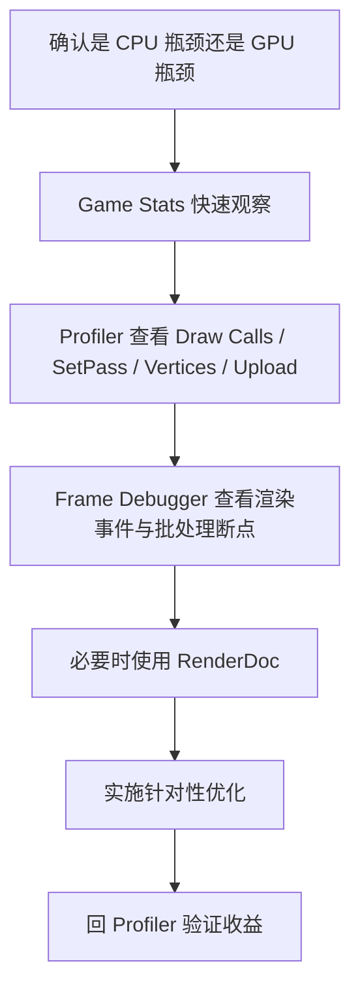

# Unity 渲染管线与 Draw Call 优化详解

:::abstract 文章摘要
很多团队一谈渲染优化就只盯着 Draw Call 数量，结果往往是“做了很多优化动作，但帧率没明显变化”。原因通常不是优化方向完全错误，而是没有把 **渲染管线、CPU 提交成本、GPU 着色成本、材质/Shader 变体切换、透明排序、阴影、后处理** 放到同一个分析框架里看。

这篇文章的目标不是只告诉你“如何减少 Draw Call”，而是从工程视角把 Unity 渲染优化真正串起来：**先理解渲染管线，再理解 Draw Call 与 Batch 的关系，接着用 Profiler 和 Frame Debugger 定位瓶颈，最后再选择 SRP Batcher、静态批处理、GPU Instancing、材质合批、纹理图集、LOD、遮挡剔除、灯光与阴影裁剪等具体手段。**

文章会覆盖 Built-in Render Pipeline、URP、HDRP 的核心差异，以及它们在 Draw Call 优化策略上的不同重点。
:::

## 1. 为什么“渲染管线”和“Draw Call 优化”必须一起讲

在 Unity 里，渲染性能问题通常并不是单一问题，而是几个层面叠加：

1. **CPU 提交成本**：CPU 要准备渲染数据、切换材质状态、组织命令并提交给图形 API。
2. **GPU 执行成本**：GPU 要做顶点处理、光照、阴影、透明混合、后处理等。
3. **资源带宽成本**：纹理采样、RenderTexture、G-Buffer、深度图、Shadow Map 都会消耗带宽。
4. **场景组织成本**：材质数量、Shader 关键字、透明物体、灯光数量、模型粒度、LOD、Occlusion Culling 都会影响最终的渲染负载。

所以实际工作中你会遇到两类常见误判：

| 误判 | 实际问题 |
| --- | --- |
| Draw Call 很多，所以一定是最大瓶颈 | 不一定。可能真正的问题是过度透明叠加、阴影、后处理、片元着色过重、贴图过大 |
| Draw Call 已经降下来了，为什么性能还是没起色 | 可能 CPU 不是瓶颈，或者 SetPass、Shader Variant、Overdraw、GPU 带宽、光照路径才是主因 |

:::info 一个更实用的判断方式
渲染优化要先回答两个问题：

1. 当前是 **CPU 受限** 还是 **GPU 受限**？
2. 如果是 CPU 受限，是不是 **渲染提交阶段** 在拖慢帧率？

只有回答完这两个问题，再谈 Draw Call 优化才有意义。
:::

## 2. Unity 的渲染管线是什么

### 2.1 渲染管线的本质

渲染管线可以理解为：**Unity 如何把场景中的可见对象、材质、光照、阴影和后处理，组织成最终屏幕图像的一整套流程**。

Unity 官方手册说明，Unity 提供三种预构建渲染管线，并且还支持自定义 SRP：

- **Built-in Render Pipeline**：通用型、历史最久、可定制性相对有限。
- **URP（Universal Render Pipeline）**：面向多平台、强调可扩展与可伸缩。
- **HDRP（High Definition Render Pipeline）**：面向高端平台和高保真画面。
- **Custom SRP**：如果团队有足够图形开发能力，可以基于 SRP API 自定义。  

从工程角度看，这三者最关键的差异不只是“画面风格”，而是 **渲染路径、状态组织方式、调试方式、兼容特性、优化抓手** 都不一样。

### 2.2 Built-in、URP、HDRP 的定位差异

| 管线 | 典型定位 | 优势 | 常见代价 | Draw Call 优化重点 |
| --- | --- | --- | --- | --- |
| Built-in | 旧项目、兼容性、传统工作流 | 历史包袱少、资料多、老项目迁移成本低 | 可定制性有限，现代 SRP 优化能力不完整 | 材质合并、静态批处理、GPU Instancing、渲染路径选择 |
| URP | 移动端、中轻量 PC/主机、多平台统一 | 可伸缩、跨平台表现稳定、SRP Batcher 友好 | 特性不如 HDRP 丰富，需要按项目裁剪 Renderer Features | **SRP Batcher、材质统一、灯光与阴影控制、Forward / Deferred / Forward+ 选型** |
| HDRP | 高端 PC/主机、高保真项目 | 光照和材质表达力强、调试能力强 | 默认成本高，配置复杂 | **减少高成本特性叠加、控制材质和光照复杂度、关注带宽与后处理，不只看 Draw Call** |

:::hint 经验建议
今天新项目如果没有强历史包袱，常见选择一般是：

- **移动端 / 多平台统一**：优先 URP
- **高品质主机 / PC 项目**：优先 HDRP
- **维护老项目**：继续 Built-in 通常更稳

但无论哪条管线，渲染优化都不能跳过分析阶段。
:::

## 3. 渲染路径与 Draw Call 的关系

“渲染管线”是总流程，而“渲染路径”是这条管线中更具体的光照与几何处理策略。

### 3.1 Built-in 中常见的渲染路径

Built-in Render Pipeline 里最常见的是：

- **Forward**
- **Deferred**
- **Legacy Vertex Lit**

一般工程里主要比较的是 **Forward 和 Deferred**。

| 路径 | 特点 | 适合场景 | 代价 |
| --- | --- | --- | --- |
| Forward | 默认、通用、单物体可能按受影响灯光多次处理 | 中小型项目、灯光数量有限的场景 | 多灯情况下可能产生额外 Pass，SetPass 和 Draw Call 容易上升 |
| Deferred | 对多灯更友好，光照集中处理 | 灯光较多的中大型 3D 场景 | 会引入 G-Buffer 成本，不适合所有平台；透明物体最终仍要走 Forward Pass |

### 3.2 URP 中常见的渲染路径

URP 里常见的是：

- **Forward**
- **Forward+**
- **Deferred / Deferred+**（具体能力依版本与配置而异）

一个非常关键的事实是：**渲染路径不同，灯光组织方式就不同，最终影响的并不只是画面，还会影响提交次数、Pass 数量和 GPU 负担。**

简化理解如下：

| 路径 | 核心特点 | 适合场景 |
| --- | --- | --- |
| Forward | 默认路径，简单直接 | 灯光数量不多，移动端常见 |
| Forward+ | 通过分块/分簇方式减少每个物体参与计算的灯光 | 中高复杂度场景，灯光较多但又不想走完整 Deferred 的项目 |
| Deferred | 对多灯更友好，光照统一处理 | 场景中实时灯光较多的项目 |

:::warning 一个非常重要的点
**Deferred 并不是“更高级所以永远更快”**。  
它往往更适合“很多灯”的场景，但会带来额外的 G-Buffer、带宽和平台适配成本。  
而且透明物体通常仍然要单独走 Forward 相关流程，因此透明材质很多的项目，Deferred 不一定更划算。
:::

## 4. Draw Call、Batch、SetPass 到底分别是什么

这三个词非常容易混淆，但如果搞不清，后面所有优化都会失焦。

### 4.1 Draw Call

**Draw Call** 是 CPU 向图形 API 提交的一次绘制命令。  
它的核心含义是：“请用某种状态、某些资源，把这一批几何画到屏幕上”。

### 4.2 Batch

**Batch** 是 Unity 在渲染组织层面处理后的批次概念。  
它和 Draw Call 相关，但不完全等价。一个 Batch 的形成方式，可能来自：

- 静态批处理
- 动态批处理
- GPU Instancing
- SRP Batcher 组织
- 其他渲染阶段的内部组织

### 4.3 SetPass

**SetPass Calls** 常常比 Draw Call 更能反映“状态切换成本”。  
可以把它理解为：**Shader Pass / 渲染状态切换次数**。

如果 Draw Call 很多，但大家都共享同一 Shader Variant、同一 Pass、同一材质状态，那么实际 CPU 提交代价不一定特别夸张。  
但如果 Draw Call 不算高，**SetPass 很高**，则通常意味着：

- 材质过多
- Shader 变体太散
- Pass 太多
- 渲染状态频繁切换

### 4.4 一个实战判断口诀

| 指标 | 更偏向说明什么 |
| --- | --- |
| Draw Calls | 提交次数整体规模 |
| Batches | Unity 组织后的批次情况 |
| SetPass Calls | 材质 / Shader Pass / 状态切换压力 |
| Triangles / Vertices | 几何复杂度 |
| Overdraw | 像素重复着色压力 |
| RenderTexture / Shadow / PostFX | 带宽和额外渲染链路压力 |

:::info 结论先说
**渲染优化不能只看 Draw Calls。**  
很多项目里，真正先要压的是 **SetPass、材质数量、Shader Variant、透明过绘、阴影和灯光数量**。
:::

## 5. Unity 官方工具链：应该怎么分析渲染问题

## 5.1 最基础：Game 视图 Statistics

Game 视图右上角的 **Stats** 虽然很基础，但非常适合第一轮扫描：

- Batches
- Saved by batching
- SetPass calls
- Triangles
- Vertices
- Screen / Texture Memory 等信息

它的优点是快，缺点是信息不够深。  
适合用来回答：“我刚改了材质、关了阴影、开了 Instancing，到底有没有变化？”

### 5.2 Rendering Profiler：看整体趋势

Unity 的 Rendering Profiler 模块会展示：

- Batches Count
- SetPass Calls Count
- Triangles Count
- Vertices Count
- Draw Calls Count
- Total Batches Count
- 动态批处理 / 静态批处理 / Instancing 的详细统计
- 纹理、RenderTexture、Buffer、Vertex Upload 等信息

如果你只是想建立正确分析思路，建议优先看这几项：

| 优先级 | 指标 | 用途 |
| --- | --- | --- |
| 高 | Draw Calls Count | 看整体提交规模 |
| 高 | SetPass Calls Count | 看状态切换压力 |
| 高 | Total Batches Count | 看批处理结果 |
| 高 | Vertices / Triangles | 看几何复杂度 |
| 中 | Vertex Buffer Upload In Frame Bytes | 判断是否有大量 CPU -> GPU 几何上传 |
| 中 | Shadow Casters Count | 判断阴影负担是否过高 |
| 中 | Static / Dynamic / Instanced Batches | 判断具体合批策略是否生效 |

### 5.3 Frame Debugger：看每一步到底发生了什么

**Frame Debugger** 是渲染优化里最重要的“解释器”。

它能让你暂停某一帧，查看这一帧由哪些渲染事件构成，并逐步检查：

- 这一帧到底画了哪些东西
- 哪些对象被拆成了多个事件
- 哪些对象没有合批
- 为什么发生了新的 Pass / 新的 Batch
- 某个 SRP Batch 为什么断开了

对于 SRP 项目，Frame Debugger 还可以直接显示：

- 某个 SRP Batch 包含多少 Draw Calls
- 使用了哪些 Shader Keywords
- 为什么没有继续和上一个 Batch 合并

这一步在实际项目里极其重要，因为它把“我感觉没有合批”变成了“我知道它具体为什么没合”。

### 5.4 RenderDoc：看更底层 GPU 细节

当 Unity 的 Frame Debugger 还不够时，可以进一步用 **RenderDoc** 这类第三方帧调试工具。  
它更适合处理：

- GPU 事件序列
- Render Target / G-Buffer 检查
- Pass 输入输出检查
- Shader 资源绑定
- 更底层的渲染诊断

:::hint 推荐的分析顺序
建议使用下面这套顺序，而不是一开始就上 RenderDoc：


:::

## 6. Draw Call 优化的底层逻辑

### 6.1 真正昂贵的往往不是“画”，而是“准备画”

很多人会把 Draw Call 想成“GPU 画一下而已”。  
但实际在现代引擎里，很多时候更贵的是 **CPU 为 Draw Call 做准备**：

- 切换材质
- 切换 Shader Pass
- 切换纹理和缓冲区
- 设置关键字
- 准备常量缓冲区
- 组织命令

所以 Unity 官方文档强调的并不是“盲目减少所有 Draw Call”，而是尽量减少 **渲染状态变化**。

### 6.2 为什么 SetPass 很重要

如果一个项目中：

- 材质球很多
- Shader Keyword 组合很多
- 使用了大量不同的 Pass
- 同类对象没有共享同一个 Shader Variant

那么即便 Draw Call 并没有爆炸，CPU 仍可能因为频繁状态切换而吃满。

因此很多时候更有效的优化方式不是“合 Mesh”，而是：

- 减材质数量
- 减 Shader 变体
- 统一 Shader
- 尽量复用贴图图集
- 让同类对象共享同一材质体系

## 7. Unity 官方推荐的 Draw Call 优化优先级

Unity 官方文档已经把 Draw Call 优化优先级写得比较明确：

1. **SRP Batcher 和静态批处理**
2. **GPU Instancing**
3. **Dynamic Batching**

这个优先级非常值得记住，因为它直接说明了一个重要现实：  
**现代 Unity 项目里，Dynamic Batching 通常不是主角。**

:::warning 一个常见误区
很多老教程会把 Dynamic Batching 当作“默认万能优化手段”。  
但在现代图形 API 和现代 Unity 项目里，它通常不是第一选择，甚至很多时候不如关闭之后更稳定。  
一定要以实际 Profile 结果为准。
:::

## 8. SRP Batcher：SRP 项目最该优先理解的优化手段

### 8.1 SRP Batcher 解决的是什么问题

在 URP、HDRP 或自定义 SRP 中，**SRP Batcher** 的目标是减少 CPU 为 Draw Call 做准备和派发所需的时间。  
它尤其适合：

- 大量对象
- 共享同一 Shader Variant
- 使用兼容 SRP Batcher 的 Shader / Material 组织方式

它优化的重点不是“强行把一堆网格合成一个网格”，而是 **减少 CPU 端的材质状态准备成本**。

### 8.2 它为什么通常比传统批处理更值得先考虑

因为 SRP Batcher 更符合现代项目的现实：

- 你未必能把场景对象都做成静态
- 你也未必总能让它们满足 GPU Instancing 条件
- 但你往往可以通过 **统一 Shader / 减少变体 / 规范材质体系** 获得收益

这就是为什么在 URP / HDRP 项目里，很多渲染优化第一步不是“疯狂合并 Mesh”，而是先做：

- 材质收敛
- Shader 收敛
- 关键字控制
- Renderer Feature 精简
- Pass 数量控制

### 8.3 SRP Batcher 的典型排查方法

在 Frame Debugger 中查看 `RenderLoopNewBatcher.Draw` 一类节点时，你可以看到：

- 一个 SRP Batch 含多少 Draw Calls
- 使用了哪些关键词
- 为什么从上一个 Batch 断开

如果你发现很多 SRP Batch 的 Draw Calls 很少，常见原因包括：

- Shader 不同
- Shader Variant 不同
- 关键字组合不同
- 材质组织过散
- 某些 Renderer 不兼容 SRP Batcher

### 8.4 MaterialPropertyBlock 在 SRP 里的坑

在 Built-in Render Pipeline 中，`MaterialPropertyBlock` 常常是一个很实用的工具：  
你可以不复制材质，就修改局部属性，通常比创建大量材质实例更高效。

但在 **Scriptable Render Pipeline（URP / HDRP）** 中，事情就变了。  
Unity 官方文档明确提醒：**`MaterialPropertyBlock` 会让材质失去 SRP Batcher 兼容性。**

这意味着：

- 在 Built-in 中，它常常是“避免材质实例泛滥”的好工具
- 在 URP / HDRP 中，它可能直接破坏你最重要的批处理优化路径

:::danger SRP 项目中的高频误区
很多团队把 Built-in 时代的经验直接搬到 URP / HDRP：

- 给每个 Renderer 写 `MaterialPropertyBlock`
- 每个角色改一点颜色
- 每个草实例改一点风参数
- 每个物件改一点 Emission

结果就是：**SRP Batcher 被悄悄打断，CPU 渲染提交成本明显上升。**

所以在 SRP 项目里，`MaterialPropertyBlock` 不是不能用，而是必须明确知道“我是在拿 SRP Batcher 兼容性换灵活性”。
:::

## 9. 静态批处理：适合真正不动的场景对象

### 9.1 静态批处理的原理

静态批处理会把 **不移动的 Mesh** 组合起来，以减少 Draw Call。  
Unity 会把组合后的网格变换到世界空间，构建共享的顶点和索引缓冲区。

它通常适合：

- 建筑
- 地形装饰
- 静态道具
- 室内固定家具
- 不会单独移动的场景块

### 9.2 为什么静态批处理通常比动态批处理更靠谱

因为静态批处理不会像动态批处理那样在 CPU 上为每帧做顶点变换。  
对于真正静态的对象，它通常是收益明显、行为稳定、容易验证的优化方式。

### 9.3 什么时候适合用

如果对象在构建前已经存在于场景里，通常更适合 **构建时静态批处理**。  
如果对象是运行时生成的静态物件，可以考虑 `StaticBatchingUtility.Combine`。

### 9.4 它的限制

静态批处理适合的是 **真正不需要单独移动** 的对象。  
运行时你可以移动整个静态批的根节点，但不能方便地独立操作其中每一个子网格而保持原批次结构不变。

### 9.5 运行时静态批处理示例

```csharp
using UnityEngine;

public sealed class RuntimeStaticBatchExample : MonoBehaviour
{
    [SerializeField] private GameObject[] rootObjects;

    private void Start()
    {
        if (rootObjects == null || rootObjects.Length == 0)
        {
            return;
        }

        StaticBatchingUtility.Combine(rootObjects, gameObject);
    }
}
```

:::warning 使用静态批处理时要注意
静态批处理不是“勾上就无脑赚”：

1. 它会改变网格组织方式。
2. 它可能增加内存占用。
3. 如果对象其实经常动，就不应该强行静态化。
4. 场景拆分、流式加载和 Addressables 使用方式也会影响静态批处理策略。
:::

## 10. GPU Instancing：大量相同 Mesh + 相同材质时非常有效

### 10.1 它适合什么场景

GPU Instancing 的核心场景是：

- **大量相同 Mesh**
- **共享同一材质**
- 只需要少量实例级差异

典型例子：

- 草
- 树
- 路灯
- 重复摆放的石头
- 相同敌人的壳体网格
- 大量重复建筑模块

### 10.2 它为什么有效

因为它允许 Unity 在 **同一个 Draw Call** 中绘制多个相同实例。  
这可以显著减少 CPU 提交压力。

### 10.3 它和 SRP Batcher 的关系

这是一个非常容易搞错的点：

- **GPU Instancing 不兼容 SRP Batcher**
- 如果对象兼容 SRP Batcher，Unity 会优先使用 **SRP Batcher**
- 如果你确实希望某一类对象走 Instancing，通常需要显式规划，而不是“勾上 Enable GPU Instancing 就完了”

这意味着在 URP / HDRP 里，你不能简单地认为：

> “我开启 Instancing 以后，就一定会走 Instancing。”

真实情况往往是：

- 兼容 SRP Batcher 的对象先走 SRP Batcher
- 某些特定大规模重复物体，才值得你刻意为 Instancing 调整 Shader / Renderer 策略

### 10.4 常见限制

GPU Instancing 并不是“所有 Renderer 都支持”。  
例如，Unity 官方文档明确指出，**`SkinnedMeshRenderer` 不支持常规 GPU Instancing**。  
这意味着：

- 人物骨骼动画角色通常不能直接靠普通 Instancing 优化
- 大量角色优化通常需要进一步结合 Animation Culling、LOD、GPU Skinning 路线或 DOTS/Entities Graphics 等方案

### 10.5 启用思路

最常见的入口是：

1. Shader 支持 Instancing
2. 材质启用 **Enable GPU Instancing**
3. 确保实例使用相同 Mesh 和相同材质
4. 在 Frame Debugger 中确认是否出现 `Draw Mesh (instanced)` 一类事件

:::hint 一个判断原则
如果你的场景里有 **上千个相同网格**，它们只是位置、缩放、颜色略有不同，那 GPU Instancing 往往值得认真评估。  
如果只是十几个、几十个对象，收益未必显著。
:::

## 11. Dynamic Batching：知道它是什么，但不要神化它

### 11.1 它的原理

Dynamic Batching 会在 CPU 上把小型动态网格变换到世界空间，然后尝试把它们组合提交。  
这意味着它减少了 Draw Call，但增加了 CPU 顶点处理工作。

### 11.2 为什么它在现代项目里经常不是最佳选项

因为现代图形 API（例如 Metal）和现代硬件上，单次 Draw Call 的提交成本没有过去那么夸张。  
在这种情况下，Dynamic Batching 带来的 CPU 顶点变换开销，未必比减少的提交成本更划算。

### 11.3 适用边界

Dynamic Batching 适合的通常是：

- **非常小的网格**
- **移动对象**
- **材质一致**
- **顶点属性较少**
- **场景规模不是极大**

而且 Unity 官方文档也给出了它的典型限制：

- 网格顶点属性总量过高时无法使用
- 不同材质无法一起批
- 多 Pass Shader 只能部分受益
- Lightmap 参数不同会影响合批
- 镜像缩放会影响合批

### 11.4 一个务实建议

如果你在做现代 Unity 项目，尤其是 URP / HDRP 项目：

- 先把注意力放在 **SRP Batcher、静态批处理、GPU Instancing**
- Dynamic Batching 放到后面验证
- 永远用 **有对照组的 Profile 数据** 决定是否启用

## 12. 材质、Shader 和纹理图集：很多项目真正的主战场

### 12.1 共享材质比“看起来一样”更重要

Unity 在做 Draw Call batching 时，核心前提之一是：**尽量共享同一材质**。  
两个材质即便看起来完全一样，只要它们是两个不同实例，也可能打断批处理。

这就是为什么实际项目里要非常注意：

- 不要无意义复制材质球
- 不要在运行时频繁 `renderer.material`
- 优先共享 `sharedMaterial`
- 做外观变化时先评估是否会破坏批处理路径

### 12.2 纹理图集的价值

如果两个材质唯一的差别只是贴图，那么非常值得考虑 **Texture Atlas**。  
把贴图放到同一图集中之后，你就更容易让对象共享同一材质，从而提升批处理成功率。

常见收益有两个：

1. 降低材质数量
2. 增加合批概率

### 12.3 Shader Variant 失控也是渲染提交杀手

很多项目的渲染问题不在模型，也不在灯光，而在 **Shader Variant 爆炸**：

- 大量 `multi_compile`
- 大量功能开关
- 大量关键字组合
- 同类对象跑在不同变体上

这会导致：

- SetPass 增多
- SRP Batch 很碎
- 编译和加载成本变高
- 内存和构建体积也受影响

:::info 一个常见现象
Frame Debugger 中如果你看到很多批次断在“不同 Shader”或“不同 Keywords”，这往往不是网格问题，而是 **材质与变体治理问题**。
:::

## 13. 什么最容易打断批处理

下面这张表建议你收藏，它覆盖了项目里最常见的批处理破坏源：

| 破坏源 | 影响 |
| --- | --- |
| 不同材质实例 | 最直接打断批处理 |
| 不同 Shader / Shader Variant | 提高 SetPass，打断 SRP Batch |
| `MaterialPropertyBlock`（SRP 中） | 破坏 SRP Batcher 兼容性 |
| 多 Pass Shader | 额外 Pass 增加提交与切换 |
| 透明物体 | 需要排序，常常降低合批效率 |
| 光照 / Lightmap 参数不一致 | 影响动态或静态批处理 |
| 镜像缩放 | Dynamic Batching 可能失效 |
| 顶点属性过多 | Dynamic Batching 限制明显 |
| 同 Mesh 但不同材质 | 很难做 Instancing |
| 运行时 `renderer.material` | 隐式复制材质，批处理很容易碎掉 |

## 14. 透明、阴影、后处理：这些问题常常比 Draw Call 更大

## 14.1 透明物体与 Overdraw

透明物体往往需要 **从后往前排序**。  
这件事会带来两个影响：

1. 更难合批
2. 更容易产生 **Overdraw**

如果你的场景里有：

- 大面积半透明 UI
- 粒子特效叠加
- 树叶、玻璃、雾、体积效果
- 多层透明材质

那么即便 Draw Call 并不夸张，GPU 也可能因为像素重复着色而掉帧。

### 14.2 阴影

实时阴影常常同时增加：

- 渲染 Pass
- Shadow Map 渲染负担
- 顶点和像素处理成本
- 带宽和纹理压力

优化阴影往往比单纯减少几个 Draw Call 更有收益，常见动作包括：

- 缩小阴影距离
- 降低阴影分辨率
- 减少投射阴影的对象
- 远景关闭阴影
- 合理使用烘焙和 Shadowmask

### 14.3 后处理

Bloom、SSAO、SSR、DoF、Motion Blur、TAA、Color Grading 等后处理都会消耗成本。  
HDRP 项目尤其要注意：**很多时候 HDRP 的瓶颈更多来自高成本特性叠加，而不是 Draw Call 本身。**

:::warning 一定要避免的思维
看到渲染掉帧，不要第一反应就是“再合点 Mesh”。  
先确认是不是：

- 透明过绘
- 阴影过多
- 后处理过重
- 屏幕分辨率过高
- 体积云 / 雾 / 反射 / SSR 太贵
:::

## 15. LOD、Occlusion Culling 与场景组织

### 15.1 LOD 不是“只降面数”

LOD 的真正价值不只是减少三角形，还包括：

- 降低阴影成本
- 降低像素着色成本
- 降低远处对象的贴图与材质复杂度
- 让远景用更简单的 Renderer / Material

### 15.2 Occlusion Culling 是减少“无效提交”

遮挡剔除的价值在于：  
**让看不见的东西不进入后续渲染链。**

这对大型室内场景、复杂建筑群、巷道和遮挡密集场景特别有效。  
它不能替代批处理，但能显著减少“根本不该提交的对象”。

### 15.3 网格粒度不要极端

项目里容易出现两个极端：

- 切得太碎：对象太多，提交压力大
- 合得太死：剔除不灵活，很多看不见的部分也被整体提交

正确做法通常是：

- 依据场景块划分
- 依据可见性区域划分
- 依据流式加载边界划分
- 保持可剔除性和可合批性之间的平衡

## 16. 按渲染管线分别给出优化建议

## 16.1 Built-in Render Pipeline 的重点

Built-in 项目常见重点：

1. 评估 **Forward 还是 Deferred**
2. 减少材质与 Shader Pass
3. 充分利用静态批处理
4. 合理使用 GPU Instancing
5. 使用 Texture Atlas
6. 谨慎利用 `MaterialPropertyBlock`
7. 控制实时灯光数量与阴影范围

Built-in 的一个特点是：  
很多老项目依赖旧 Shader、Surface Shader、多材质体系，实际瓶颈常常出在 **材质体系历史包袱**。

## 16.2 URP 项目的重点

URP 项目建议把优化优先级放在：

1. **优先确保 SRP Batcher 路线顺畅**
2. 控制 Renderer Feature 数量
3. 控制 Shader Keywords
4. 统一材质体系
5. 再评估 GPU Instancing 是否值得专项配置
6. 选择合适的 Rendering Path（Forward / Forward+ / Deferred）
7. 严控透明、阴影、屏幕后效

URP 的关键不是“功能尽量全开”，而是 **按平台做功能裁剪**。

## 16.3 HDRP 项目的重点

HDRP 项目的核心通常不是“怎么再少几十个 Draw Call”，而是：

1. 控制高成本材质和特效数量
2. 管理灯光、阴影、体积、反射、后处理
3. 关注带宽和分辨率
4. 确认哪些相机和渲染层真的需要高质量
5. 通过 Profiling 区分 CPU 提交瓶颈和 GPU 像素瓶颈

HDRP 项目里，Draw Call 优化仍然重要，但常常不是唯一焦点。

## 17. 一套真正可落地的渲染优化工作流

### 17.1 第一步：先判断 CPU 还是 GPU

做法建议：

- 降低分辨率，看帧率是否显著变化
- 暂时关闭后处理、阴影、透明特效，看 GPU 是否明显回升
- 查看 CPU Profiler 和 Rendering Profiler

如果分辨率降低后帧率提升明显，通常更偏 GPU 瓶颈。  
如果分辨率几乎不变但关闭部分对象后帧率大幅提升，可能更偏 CPU 提交或场景组织问题。

### 17.2 第二步：看 Draw Calls、SetPass、Batches、Triangles

先建立趋势认知，而不是盯着单帧数字。  
例如：

- 切换不同场景块前后
- 开关阴影前后
- 开关 Instancing 前后
- 开关某个 Renderer Feature 前后

### 17.3 第三步：用 Frame Debugger 找“为什么没合批”

这一步特别关键。  
不要只问“合没合”，要问：

- 为什么断了？
- 是材质不一样？
- 是 Shader Variant 不一样？
- 是透明排序导致？
- 是 MPB 破坏了 SRP Batcher？
- 是额外灯光引入额外 Pass？
- 是 ShadowCaster Pass 在单独提交？

### 17.4 第四步：先做收益最大的动作

大多数项目里，收益通常按下面顺序更容易出现：

1. 降低材质和 Shader Variant 数量
2. 确保 SRP Batcher 正常工作
3. 对静态场景做静态批处理
4. 对大量重复对象做 GPU Instancing
5. 控制阴影和透明
6. 做 LOD、Occlusion Culling、场景拆分
7. 最后再评估 Dynamic Batching

### 17.5 第五步：做 A/B 对照验证

任何优化动作都要有前后对比：

- 优化前数据
- 优化后数据
- 目标平台数据
- Editor 与 Player 分开看
- Development Build 与 Release Build 分开看

:::hint 实战原则
**不要只在 Editor 里判断渲染优化效果。**  
真正要看的，始终是目标平台、目标分辨率、目标画质设置下的 Player 数据。
:::

## 18. 一个用于运行时记录渲染指标的示例

如果你希望在真机或 Release Player 里观察关键渲染指标，可以使用 `ProfilerRecorder`。

```csharp
using System.Text;
using Unity.Profiling;
using UnityEngine;

public sealed class RuntimeRenderStatsPanel : MonoBehaviour
{
    private string statsText = string.Empty;

    private ProfilerRecorder setPassCallsRecorder;
    private ProfilerRecorder drawCallsRecorder;
    private ProfilerRecorder batchesRecorder;
    private ProfilerRecorder verticesRecorder;

    private void OnEnable()
    {
        setPassCallsRecorder = ProfilerRecorder.StartNew(ProfilerCategory.Render, "SetPass Calls Count");
        drawCallsRecorder = ProfilerRecorder.StartNew(ProfilerCategory.Render, "Draw Calls Count");
        batchesRecorder = ProfilerRecorder.StartNew(ProfilerCategory.Render, "Total Batches Count");
        verticesRecorder = ProfilerRecorder.StartNew(ProfilerCategory.Render, "Vertices Count");
    }

    private void OnDisable()
    {
        setPassCallsRecorder.Dispose();
        drawCallsRecorder.Dispose();
        batchesRecorder.Dispose();
        verticesRecorder.Dispose();
    }

    private void Update()
    {
        StringBuilder sb = new StringBuilder(256);

        if (setPassCallsRecorder.Valid)
        {
            sb.AppendLine("SetPass Calls: " + setPassCallsRecorder.LastValue);
        }

        if (drawCallsRecorder.Valid)
        {
            sb.AppendLine("Draw Calls: " + drawCallsRecorder.LastValue);
        }

        if (batchesRecorder.Valid)
        {
            sb.AppendLine("Batches: " + batchesRecorder.LastValue);
        }

        if (verticesRecorder.Valid)
        {
            sb.AppendLine("Vertices: " + verticesRecorder.LastValue);
        }

        statsText = sb.ToString();
    }

    private void OnGUI()
    {
        GUI.TextArea(new Rect(10, 10, 260, 90), statsText);
    }
}
```

:::info 这个脚本适合做什么
这个脚本不适合替代 Profiler。  
它更适合用于：

- 真机快速验证
- 对照开关某个渲染特性前后的变化
- 给关卡 / 美术 / TA 做现场调参观察
:::

## 19. 常见坑与纠错清单

### 19.1 “我把 `renderer.material` 用得到处都是”

这是非常经典的坑。  
`renderer.material` 会在运行时生成材质实例，容易让共享材质体系碎掉。  
结果往往是：

- 材质实例暴增
- 批处理失效
- SetPass 上升
- 内存也变差

### 19.2 “我开了 Enable GPU Instancing，但为什么没有 Instancing”

常见原因：

- 不是同一个 Mesh
- 不是同一个材质
- Shader 不支持
- 对象兼容 SRP Batcher，Unity 优先走了 SRP Batcher
- 不是适合 Instancing 的 Renderer 类型

### 19.3 “我用了 MaterialPropertyBlock，为什么 URP 反而更慢了”

因为它可能破坏 SRP Batcher。  
在 SRP 项目里这是非常常见的性能回退源。

### 19.4 “我已经做了静态批处理，为什么还是很多 Draw Calls”

可能的原因：

- 材质不一致
- 透明对象难以合批
- 阴影 Pass 单独提交
- 场景里还有大量动态对象
- SetPass 问题更严重
- 真正瓶颈根本不是提交，而是 GPU 像素着色或带宽

### 19.5 “我把很多对象合成一个大 Mesh，为什么没变快”

因为你可能损失了：

- 更细粒度剔除
- 遮挡剔除收益
- LOD 灵活性
- 流式加载粒度

渲染优化不等于“合得越大越好”，而是“**在可剔除性、可维护性、提交成本之间找到平衡**”。

## 20. 面向团队协作的实践建议

### 20.1 给技术美术和程序定统一规则

建议在项目早期就建立以下规范：

| 规则 | 目的 |
| --- | --- |
| 同类物件尽量共用材质模板 | 提高批处理与 SRP Batcher 命中率 |
| 控制 Shader 关键字数量 | 降低变体爆炸 |
| 优先使用图集和统一贴图布局 | 减少材质数量 |
| 透明材质要严格审批 | 控制 Overdraw |
| 阴影距离、阴影分辨率按平台分级 | 控制高成本特性 |
| 大量重复物件优先评估 Instancing | 降低 CPU 提交 |
| 固定场景对象尽量做静态批处理 | 稳定降低 Draw Call |

### 20.2 建立平台分层配置

不要用一套渲染设置打所有平台。  
至少应区分：

- 移动低端
- 移动中高端
- PC / 主机中档
- PC / 主机高档

控制项包括：

- Rendering Path
- 阴影距离
- 阴影分辨率
- 后处理开关
- Render Scale
- Anti-aliasing
- LOD Bias
- 透明特效密度

### 20.3 让性能分析成为日常流程，而不是上线前补救

最理想的做法不是“快发版了才救火”，而是：

- 每个里程碑都采样
- 每个典型场景都有基线
- 美术提交大资源时有检查项
- CI 或自动化工具保留性能快照
- 关键场景有版本间对比

## 21. 学习与排查路线图

### 21.1 入门阶段

先搞懂下面四件事：

1. Built-in / URP / HDRP 的定位
2. Draw Call / Batch / SetPass 区别
3. Stats / Profiler / Frame Debugger 怎么看
4. 静态批处理、GPU Instancing、SRP Batcher 分别解决什么问题

### 21.2 进阶阶段

继续深入：

1. Shader Variant 管理
2. 渲染路径选择
3. 阴影系统优化
4. 透明与 Overdraw 分析
5. LOD 与 Occlusion Culling
6. RenderDoc 与 GPU Capture

### 21.3 高阶阶段

针对大型项目继续扩展：

1. 自定义 Renderer Feature
2. 自定义 SRP 或深度管线裁剪
3. DOTS / Entities Graphics
4. GPU Driven Rendering
5. Streaming 与场景分块协同优化
6. 多平台渲染质量分层系统

## 22. 总结

Unity 的渲染优化，真正重要的不是“会不会背几个优化词”，而是建立完整思路：

1. **先判断瓶颈位置**
2. **再看 Draw Calls、SetPass、Batches、Vertices**
3. **再用 Frame Debugger 找原因**
4. **优先做收益最大的结构性优化**
5. **最后用数据验证，而不是靠感觉**

从当前 Unity 的官方路线和工程实践来看，比较稳妥的结论是：

- 在 **URP / HDRP** 项目里，优先保证 **SRP Batcher** 路线通畅
- 对真正静态的对象，优先考虑 **静态批处理**
- 对大量重复同 Mesh 同材质对象，认真评估 **GPU Instancing**
- **Dynamic Batching** 需要谨慎验证，不要神化
- Draw Call 只是渲染优化中的一部分，**透明、阴影、后处理、材质与 Shader 变体治理** 往往同样关键

:::ref 延伸思考
当你下一次看到 “Batches 过高” 时，不妨先别急着改资源。  
先问自己：

- 这是 CPU 提交瓶颈吗？
- SetPass 是否更严重？
- 这是材质和 Shader 变体的问题吗？
- 是透明、阴影、后处理在拖慢吗？
- 我的项目当前管线最应该优先利用的是 SRP Batcher、静态批处理，还是 GPU Instancing？

这五个问题，往往比“再少几个 Draw Call”更有价值。
:::

## 参考资料

| 资料 | 链接 |
| --- | --- |
| Unity Manual - Render pipelines overview | [https://docs.unity3d.com/6000.3/Documentation/Manual/render-pipelines-overview.html](https://docs.unity3d.com/6000.3/Documentation/Manual/render-pipelines-overview.html) |
| Unity Manual - Optimizing draw calls | [https://docs.unity3d.com/2022.3/Documentation/Manual/optimizing-draw-calls.html](https://docs.unity3d.com/2022.3/Documentation/Manual/optimizing-draw-calls.html) |
| Unity Manual - Scriptable Render Pipeline Batcher | [https://docs.unity3d.com/2022.3/Documentation/Manual/SRPBatcher.html](https://docs.unity3d.com/2022.3/Documentation/Manual/SRPBatcher.html) |
| Unity Manual - GPU instancing | [https://docs.unity3d.com/2020.3/Documentation/Manual/GPUInstancing.html](https://docs.unity3d.com/2020.3/Documentation/Manual/GPUInstancing.html) |
| Unity Manual - Static batching | [https://docs.unity3d.com/2023.1/Documentation/Manual/static-batching.html](https://docs.unity3d.com/2023.1/Documentation/Manual/static-batching.html) |
| Unity Manual - Dynamic batching | [https://docs.unity3d.com/2023.2/Documentation/Manual/dynamic-batching.html](https://docs.unity3d.com/2023.2/Documentation/Manual/dynamic-batching.html) |
| Unity Manual - Draw call batching | [https://docs.unity3d.com/2023.1/Documentation/Manual/DrawCallBatching.html](https://docs.unity3d.com/2023.1/Documentation/Manual/DrawCallBatching.html) |
| Unity Manual - Frame Debugger | [https://docs.unity3d.com/6000.4/Documentation/Manual/FrameDebugger.html](https://docs.unity3d.com/6000.4/Documentation/Manual/FrameDebugger.html) |
| Unity Manual - Rendering Profiler module | [https://docs.unity3d.com/ja/current/Manual/ProfilerRendering.html](https://docs.unity3d.com/ja/current/Manual/ProfilerRendering.html) |
| Unity Manual - ShaderLab Properties block reference | [https://docs.unity3d.com/Manual/SL-Properties.html](https://docs.unity3d.com/Manual/SL-Properties.html) |
| Unity Manual - Rendering paths in Unity | [https://docs.unity3d.com/6000.3/Documentation/Manual/rendering-paths-introduction.html](https://docs.unity3d.com/6000.3/Documentation/Manual/rendering-paths-introduction.html) |
| Unity Manual - Built-In Rendering Paths | [https://docs.unity3d.com/6000.4/Documentation/Manual/RenderingPaths.html](https://docs.unity3d.com/6000.4/Documentation/Manual/RenderingPaths.html) |
| Unity Manual - URP Rendering Paths | [https://docs.unity3d.com/6000.4/Documentation/Manual/urp/rendering-paths-comparison.html](https://docs.unity3d.com/6000.4/Documentation/Manual/urp/rendering-paths-comparison.html) |
