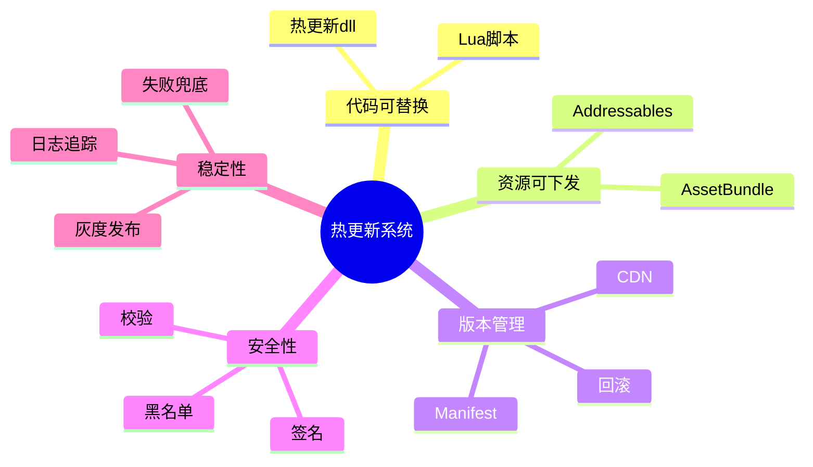
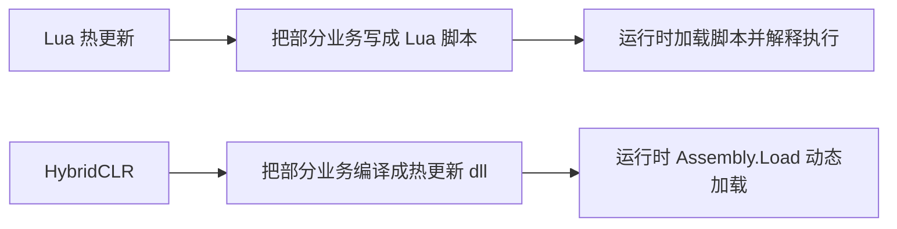
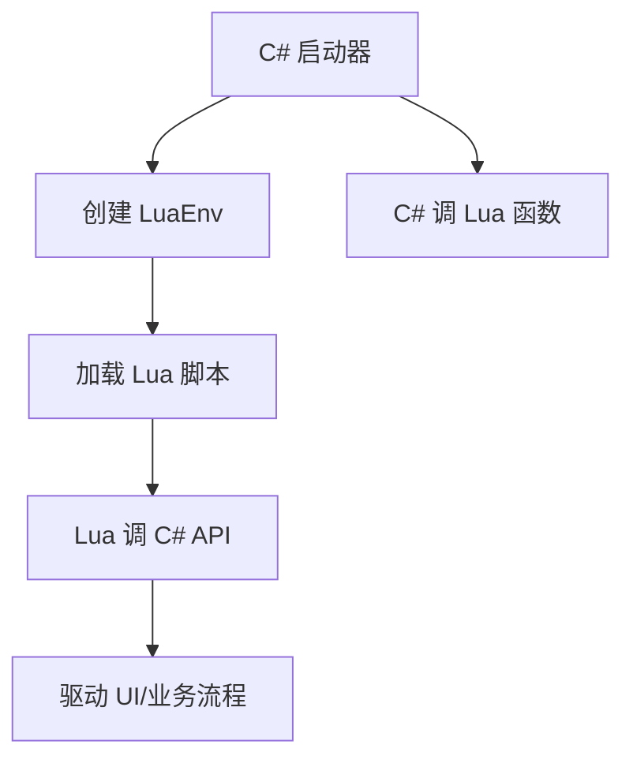
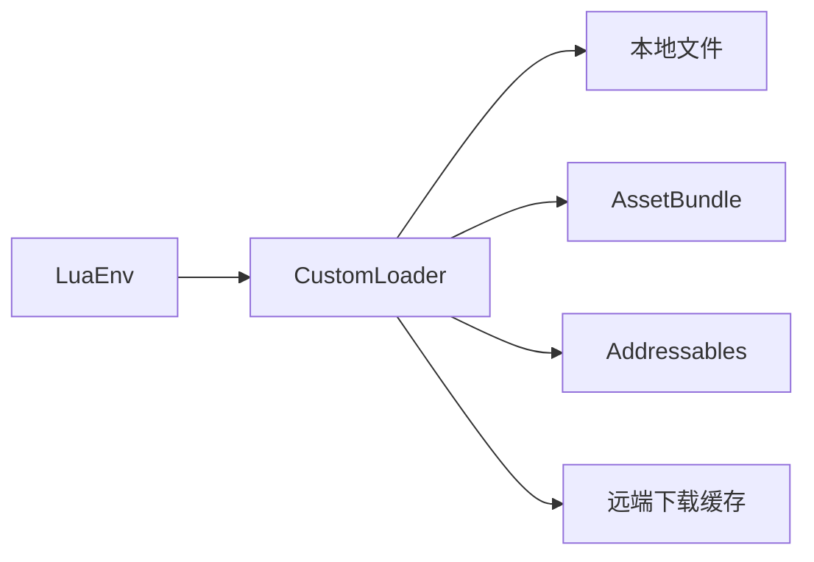
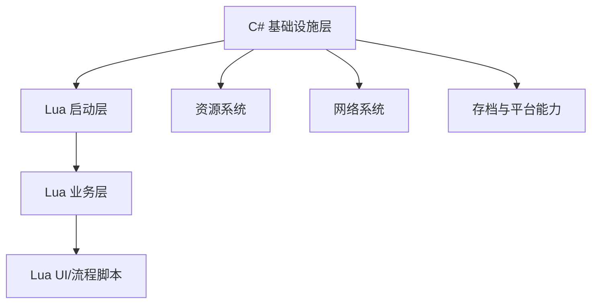
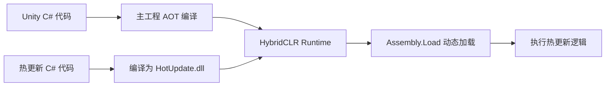
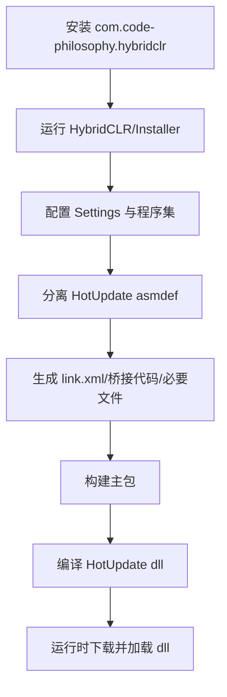
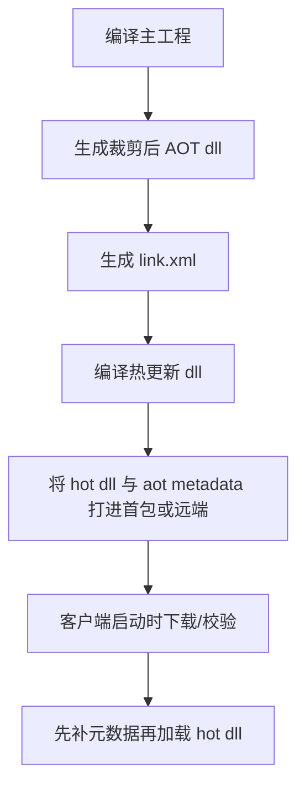
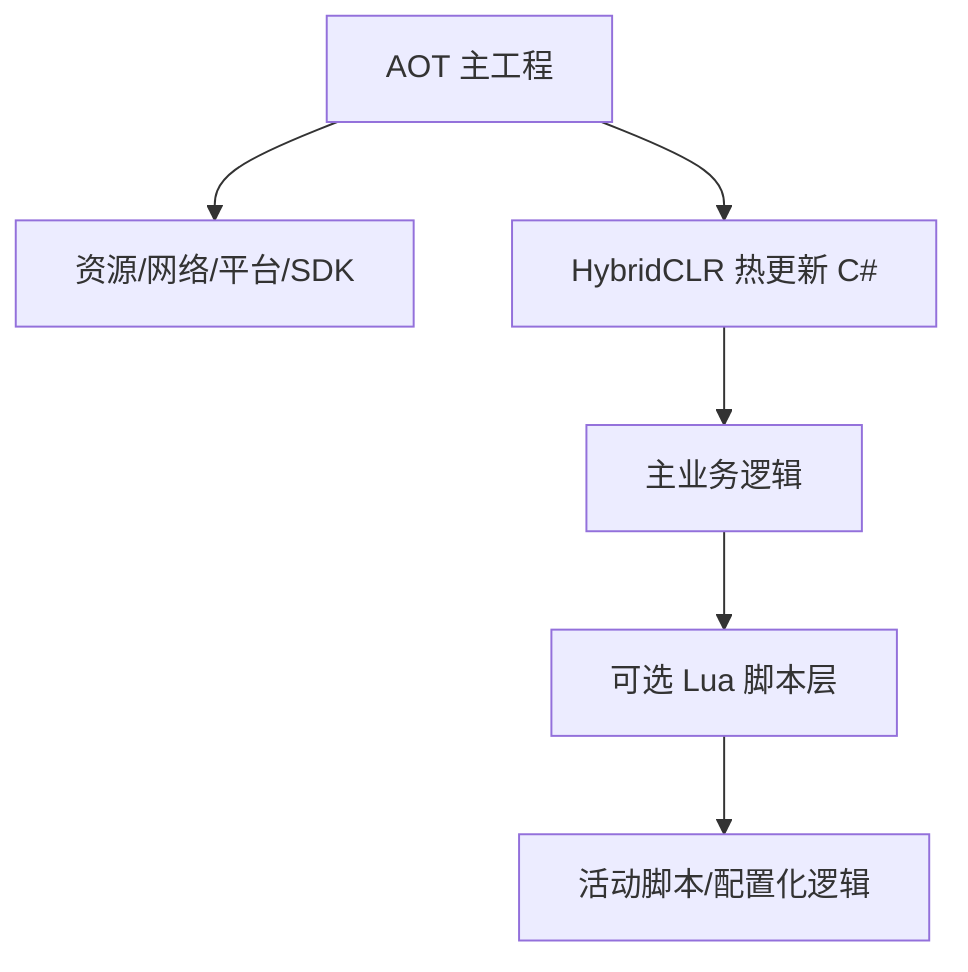
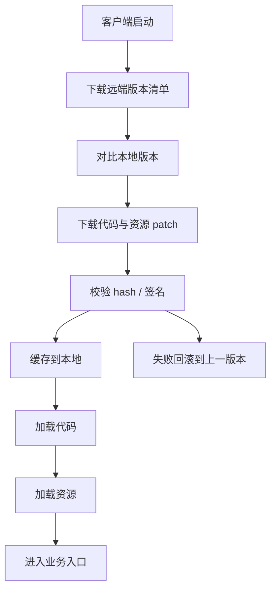

# Unity 中 Lua 与 HybridCLR 热更新的详细教学文档

## 1. 文档定位

这是一份面向 Unity 项目的热更新教学文档，目标是把两条主流路线讲清楚：

1. `Lua` 热更新。
2. `HybridCLR` 原生 C# 热更新。

为了保证内容可落地，本文中的 Lua 方案默认以 **xLua** 为例。原因很简单：

| 原因 | 说明 |
| --- | --- |
| 生态成熟 | Unity 项目里使用广泛，资料较多 |
| 官方资料清晰 | Tencent/xLua 官方仓库文档较完整 |
| 同时支持脚本开发与 Hotfix | 既能写 Lua 业务逻辑，也能做 C# 方法替换 |
| 可与 HybridCLR 共存 | 官方 HybridCLR 文档也专门提到与 `lua/js/python` 的协作场景 |

如果你只想先记一句话：

| 方案 | 最适合的场景 |
| --- | --- |
| Lua / xLua | 希望脚本化强、策划可参与、资源驱动强、热更颗粒度灵活 |
| HybridCLR | 希望继续写原生 C#、保留类型系统、尽量不改变 Unity 开发习惯 |

## 2. 热更新到底在解决什么问题

Unity 项目里说“热更新”，通常不只是“线上改 bug”，它本质上是在解决下面几类问题：

| 问题 | 传统发包方式的痛点 |
| --- | --- |
| 修复线上严重 bug | 等商店审核或整包更新太慢 |
| 快速迭代活动逻辑 | 改动频繁，不适合每次整包 |
| 多渠道版本维护 | 不同渠道包体更新成本高 |
| 降低平台限制影响 | iOS、主机、WebGL 等平台对 JIT 和动态代码限制严格 |

从工程角度看，热更新系统一般需要具备这些能力：



## 3. Lua 热更新与 HybridCLR 的核心区别

### 3.1 一张表先看懂

| 维度 | Lua / xLua | HybridCLR |
| --- | --- | --- |
| 核心语言 | Lua | C# |
| 开发习惯变化 | 较大，需要引入 Lua 运行时和桥接层 | 很小，基本继续按 C# 开发 |
| 运行原理 | Lua VM 执行脚本，或用 Lua 替换 C# 逻辑 | 修改 il2cpp runtime，使 AOT 平台支持动态加载程序集 |
| 热更载体 | `.lua` 文本 / 字节码 / AB 中脚本资源 | 热更新 `dll` + 补充元数据 |
| 类型系统 | 动态类型 | 静态类型 |
| 与 Unity 原工作流兼容度 | 中等，需要桥接层 | 高，官方强调几乎无缝 |
| 学习成本 | Lua 语言 + C#/Lua 互调 + 配置生成 | HybridCLR 安装、打包、AOT 元数据、程序集管理 |
| 典型团队 | 脚本化成熟团队、已有 Lua 经验团队 | 以 C# 为主的 Unity 团队 |

### 3.2 一句话理解两者



### 3.3 选型的关键不是“谁更强”，而是“团队更适合谁”

如果团队大多数程序员都只想继续写 C#，那强行上 Lua 通常会引入额外的架构复杂度。  
反过来，如果项目已经有成熟的 Lua 层、战斗或 UI 流程大量脚本化，那也没必要为了“原生”而全部推翻重来。

## 4. Lua 热更新的基本原理

以 xLua 为例，Unity 中 Lua 热更新通常有两种常见形态：

| 形态 | 说明 |
| --- | --- |
| Lua 业务脚本模式 | 主要业务逻辑直接写在 Lua 中，由 C# 作为宿主和桥接层 |
| Lua Hotfix 模式 | 原有 C# 代码不大改，通过 xLua 在运行时把某些 C# 方法替换成 Lua 实现 |

### 4.1 Lua 业务脚本模式

这种模式的核心思路是：



优点：

| 优点 | 说明 |
| --- | --- |
| 热更粒度细 | 下发脚本即可 |
| 灵活 | 业务逻辑调整快 |
| 策划配合友好 | 部分团队会让策划或工具链直接参与脚本层 |

代价：

| 代价 | 说明 |
| --- | --- |
| 双语言成本 | C# 与 Lua 同时维护 |
| 调试复杂度上升 | 堆栈和类型错误定位更费劲 |
| 架构要求更高 | 容易出现“桥接层到处都是”的问题 |

### 4.2 Lua Hotfix 模式

根据 xLua 官方 README，xLua 支持“运行时把 C# 实现替换成 Lua 实现”。  
这意味着对老项目来说，可以在不大规模重写逻辑的前提下，先把 Lua 当作“补丁层”。

优点：

| 优点 | 说明 |
| --- | --- |
| 侵入性小 | 老项目更容易接入 |
| 不改整体结构也能补问题 | 适合线上快速修复 |
| 补丁不生效时原逻辑不受影响 | 非补丁路径运行时开销通常较小 |

局限：

| 局限 | 说明 |
| --- | --- |
| 不适合长期承载全部业务 | 否则会变成“补丁叠补丁” |
| 某些复杂结构不适合无节制地 patch | 尤其是生命周期和多线程相关逻辑 |
| 团队容易误用 | 最后变成没人知道真实逻辑在哪一层 |

## 5. xLua 的核心能力

根据 xLua 官方 README，可以先记住下面几个要点：

| 能力 | 说明 |
| --- | --- |
| `LuaEnv` | 一个 `LuaEnv` 对应一个 Lua 虚拟机，官方建议全局唯一 |
| C# 调 Lua | 通过委托、接口映射、Global 取函数等方式 |
| Lua 调 C# | 通过 `CS.xxx` 访问 C# 类型和实例 |
| 代码生成与配置 | 通过标记和配置生成桥接代码 |
| Hotfix | 可运行时替换 C# 方法实现 |

## 6. xLua 安装与最小示例

### 6.1 安装方式

根据 xLua 官方 README，xLua 最直接的安装方式是：

1. 从官方 Releases 下载发行版，或直接下载源码。
2. 将包中的 `Assets` 内容拷贝到 Unity 项目对应的 `Assets` 目录。
3. 生产环境删除 Examples 示例。

### 6.2 最小示例

这是 xLua 官方 README 给出的入门思路，我这里改写成更适合项目教学的版本：

```csharp
using UnityEngine;
using XLua;

namespace HotUpdateDemo
{
    /// <summary>
    /// xLua 最小运行示例。
    /// </summary>
    public sealed class LuaBootstrap : MonoBehaviour
    {
        private LuaEnv _luaEnv;

        /// <summary>
        /// 启动时创建 Lua 虚拟机并执行脚本。
        /// </summary>
        private void Start()
        {
            // 创建 Lua 虚拟机。实际项目中通常建议做成全局唯一。
            _luaEnv = new LuaEnv();

            // 执行一段最简单的 Lua 代码，验证运行环境已可用。
            _luaEnv.DoString("CS.UnityEngine.Debug.Log('Hello xLua')");
        }

        /// <summary>
        /// 对象销毁时释放 Lua 虚拟机。
        /// </summary>
        private void OnDestroy()
        {
            // 释放 Lua 环境，避免泄漏。
            _luaEnv.Dispose();
            _luaEnv = null;
        }
    }
}
```

#### 6.2.1 代码讲解

这段代码虽然很短，但已经包含了 xLua 接入最核心的三步：

| 步骤 | 对应代码 | 作用 |
| --- | --- | --- |
| 创建运行环境 | `_luaEnv = new LuaEnv();` | 创建 Lua 虚拟机，后续所有脚本执行都依赖它 |
| 执行脚本 | `_luaEnv.DoString(...)` | 把 Lua 代码交给虚拟机执行 |
| 释放资源 | `_luaEnv.Dispose();` | 释放 Lua 虚拟机占用的资源，避免内存泄漏 |

按执行顺序来理解：

1. `Start()` 在 Unity 生命周期开始时被调用。
2. `new LuaEnv()` 创建 Lua 运行环境。
3. `DoString` 执行一段最简单的 Lua 代码。
4. 这段 Lua 代码内部通过 `CS.UnityEngine.Debug.Log` 反向调用 Unity 的 `Debug.Log`。
5. 当组件销毁时，`OnDestroy()` 负责调用 `Dispose()` 释放 LuaEnv。

几个关键点：

| 关键点 | 说明 |
| --- | --- |
| 为什么字段是 `private LuaEnv _luaEnv;` | 因为 LuaEnv 需要跨 `Start` 和 `OnDestroy` 生命周期使用 |
| 为什么不在 `Start` 里局部变量创建后就不管 | 因为 LuaEnv 不是一次性对象，而是整个 Lua 运行时上下文 |
| 为什么要 `Dispose()` | Lua 虚拟机内部会持有脚本状态、对象引用和桥接资源，不释放会造成资源泄漏 |
| 为什么示例里只写一行字符串脚本 | 这是教学最小闭环，方便先验证运行环境是否正确 |

如果把它放到真实项目里，通常会进一步演变成：

1. `LuaEnv` 改成全局单例或由 `LuaRuntime` 服务统一管理。
2. `DoString` 改成 `require 'Main'` 这种模块入口形式。
3. 初始化时注入自定义 Loader、版本系统、补丁系统。

## 7. xLua 中 C# 与 Lua 的双向调用

### 7.1 C# 调 Lua

推荐使用委托或接口方式，而不是到处写字符串拼接调用。

```csharp
using UnityEngine;
using XLua;

namespace HotUpdateDemo
{
    /// <summary>
    /// xLua 双向调用示例。
    /// </summary>
    public sealed class LuaCallSample : MonoBehaviour
    {
        [CSharpCallLua]
        private delegate int AddDelegate(int a, int b);

        private LuaEnv _luaEnv;
        private AddDelegate _addDelegate;

        /// <summary>
        /// 初始化 Lua 函数映射。
        /// </summary>
        private void Start()
        {
            // 创建 Lua 环境并注册一个 Lua 函数。
            _luaEnv = new LuaEnv();
            _luaEnv.DoString(@"
                mathEx = {}
                function mathEx.add(a, b)
                    return a + b
                end
            ");

            // 从 Lua 全局表中取出函数映射到 C# 委托。
            _addDelegate = _luaEnv.Global.GetInPath<AddDelegate>("mathEx.add");

            // 调用 Lua 函数。
            int result = _addDelegate.Invoke(3, 5);
            Debug.Log($""Lua 返回结果: {result}"");
        }

        /// <summary>
        /// 销毁时释放 Lua 资源。
        /// </summary>
        private void OnDestroy()
        {
            // 释放 LuaEnv。
            _luaEnv.Dispose();
            _luaEnv = null;
            _addDelegate = null;
        }
    }
}
```

#### 7.1.1 代码讲解

这段代码展示的是 **C# 调 Lua** 的标准思路：先在 Lua 中定义函数，再映射成 C# 委托进行调用。

可以按下面的顺序理解：

| 顺序 | 代码 | 含义 |
| --- | --- | --- |
| 1 | `[CSharpCallLua] private delegate int AddDelegate(int a, int b);` | 告诉 xLua：这个委托要和 Lua 函数做桥接 |
| 2 | `_luaEnv = new LuaEnv();` | 创建 Lua 虚拟机 |
| 3 | `_luaEnv.DoString(...)` | 在 Lua 虚拟机中创建 `mathEx.add` 函数 |
| 4 | `_luaEnv.Global.GetInPath<AddDelegate>(\"mathEx.add\")` | 把 Lua 函数映射成 C# 可直接调用的委托 |
| 5 | `_addDelegate.Invoke(3, 5)` | 从 C# 侧直接调用 Lua 函数 |

这里最值得讲清楚的是 `GetInPath<AddDelegate>("mathEx.add")`：

| 部分 | 作用 |
| --- | --- |
| `Global` | 表示 Lua 全局表 |
| `GetInPath` | 按路径向下查找字段 |
| `AddDelegate` | 告诉 xLua 要按什么签名把 Lua 函数包装成 C# 委托 |
| `mathEx.add` | 实际对应 Lua 里的函数路径 |

为什么要用委托，而不是每次都 `DoString("return mathEx.add(3, 5)")`？

| 方式 | 问题 |
| --- | --- |
| 每次拼字符串执行 Lua | 可维护性差、性能更差、也不利于排查错误 |
| 先映射成委托再调用 | 调用方式稳定、类型更明确、性能也更好 |

这段代码在真实项目中通常对应下面这种场景：

1. C# 是宿主。
2. Lua 写活动逻辑或 UI 流程。
3. C# 在某个时机调用 Lua 中的某个函数，比如 `Init`、`Open`、`OnButtonClick`。

销毁阶段的两行代码也很关键：

| 代码 | 原因 |
| --- | --- |
| `_luaEnv.Dispose();` | 释放 Lua 运行环境 |
| `_addDelegate = null;` | 断开当前 C# 侧的委托引用，避免误用旧函数句柄 |

### 7.2 Lua 调 C#

Lua 中最常见的写法如下：

```lua
CS.UnityEngine.Debug.Log("Lua 调用了 C# 的 Debug.Log")
```

也可以调用业务类：

```lua
local PlayerService = CS.HotUpdateDemo.PlayerService
local playerService = PlayerService()
playerService:Login("Hetu")
```

### 7.3 工程建议

| 建议 | 说明 |
| --- | --- |
| C# 暴露给 Lua 的 API 要收口 | 不要整个工程都直接暴露 |
| 为 Lua 提供 Facade / Service 层 | 避免 Lua 到处直接碰 Unity 细节 |
| 不要在 Lua 层频繁反射式取函数 | 启动时缓存好委托和接口映射 |

## 8. Lua 脚本加载方案

实际项目里，Lua 不会长期写死在 `DoString` 中。  
更常见的是通过 **自定义 Loader** 从本地、AB、Addressables、StreamingAssets 或 CDN 中读取脚本。

### 8.1 基本思路



### 8.2 自定义 Loader 示例

```csharp
using System.IO;
using UnityEngine;
using XLua;

namespace HotUpdateDemo
{
    /// <summary>
    /// 基于文件系统的 Lua 脚本加载器示例。
    /// </summary>
    public sealed class LuaLoaderSample : MonoBehaviour
    {
        private LuaEnv _luaEnv;

        /// <summary>
        /// 初始化 Lua 脚本加载器。
        /// </summary>
        private void Start()
        {
            // 创建 Lua 环境。
            _luaEnv = new LuaEnv();

            // 注册自定义加载器。
            _luaEnv.AddLoader(CustomLoader);

            // 加载 Lua 模块。
            _luaEnv.DoString("require 'Main'");
        }

        /// <summary>
        /// 自定义 Lua 模块读取函数。
        /// </summary>
        /// <param name="filePath">Lua require 传入的模块路径。</param>
        /// <returns>脚本字节数组。</returns>
        private byte[] CustomLoader(ref string filePath)
        {
            // 将 Lua 模块路径转换为项目中的相对路径。
            string fullPath = Path.Combine(Application.streamingAssetsPath, "Lua", filePath + ".lua.txt");

            // 输出调试信息，便于排查脚本加载路径问题。
            Debug.Log($"Lua 加载路径: {fullPath}");

            // 读取脚本内容并返回字节数组。
            return File.ReadAllBytes(fullPath);
        }

        /// <summary>
        /// 销毁时释放 Lua 环境。
        /// </summary>
        private void OnDestroy()
        {
            // 释放 Lua 虚拟机。
            _luaEnv.Dispose();
            _luaEnv = null;
        }
    }
}
```

#### 8.2.1 代码讲解

这段代码的重点不是“如何读文件”，而是 **如何把 Lua 模块名映射到你自己的资源系统**。

整个调用链是这样的：

1. `Start()` 中先创建 `LuaEnv`。
2. 调用 `_luaEnv.AddLoader(CustomLoader);` 注册自定义模块加载器。
3. 执行 `_luaEnv.DoString("require 'Main'");`。
4. 当 Lua 执行到 `require 'Main'` 时，xLua 会回调 `CustomLoader`。
5. `CustomLoader` 根据模块名拼出实际文件路径，然后返回脚本字节数组。

为什么 `CustomLoader` 的参数是 `ref string filePath`？

| 点 | 说明 |
| --- | --- |
| `filePath` 的初始值 | 来自 Lua 侧 `require` 传入的模块名 |
| `ref` 的意义 | 允许 Loader 在需要时改写模块路径 |
| 返回值 `byte[]` | xLua 最终要的是脚本内容本身 |

`Path.Combine(Application.streamingAssetsPath, "Lua", filePath + ".lua.txt")` 这一行非常关键，它做了三件事：

| 部分 | 作用 |
| --- | --- |
| `Application.streamingAssetsPath` | 取得首包内可访问资源目录 |
| `"Lua"` | 约定所有 Lua 脚本放在 `Lua` 子目录 |
| `filePath + ".lua.txt"` | 把模块名转成实际文件名，避免 Unity 误识别脚本资源 |

为什么很多项目把 Lua 文件后缀改成 `.lua.txt`？

| 原因 | 说明 |
| --- | --- |
| 避免 Unity 当成普通源码或特殊资源处理 | 更稳定 |
| 更方便打进 AB / Addressables | 资源工作流更统一 |
| 某些平台工具链兼容性更好 | 减少额外问题 |

这段代码在真实项目里一般会继续升级为：

1. 先查本地热更缓存目录。
2. 找不到再查 `StreamingAssets`。
3. 如果都没有，再由补丁系统决定是否下载。
4. 最后统一把字节返回给 xLua。

也就是说，`CustomLoader` 最好只负责“按名字取脚本内容”，不要在里面直接写复杂下载逻辑。

### 8.3 线上项目常见做法

| 资源位置 | 特点 |
| --- | --- |
| `StreamingAssets` | 开发方便，可作首包脚本入口 |
| `AssetBundle` | 易与现有资源热更体系整合 |
| `Addressables` | 更现代，但构建链更复杂 |
| 远端下载后本地缓存 | 最灵活，适合线上 patch |

### 8.4 推荐做法

建议不要让 `LuaEnv` 直接感知“下载逻辑”。  
更稳的结构通常是：

| 层 | 责任 |
| --- | --- |
| `VersionService` | 版本比对、清单下载 |
| `PatchService` | 脚本资源下载、校验、缓存 |
| `LuaScriptLoader` | 只负责按模块名取到最终字节 |
| `LuaBootstrap` | 创建 `LuaEnv`、启动脚本入口 |

## 9. xLua 的配置生成机制

xLua 实战里最容易卡人的部分，不是 Lua 语法，而是 **配置与生成代码**。

### 9.1 常见标记

| 标记 | 作用 |
| --- | --- |
| `[CSharpCallLua]` | 声明 C# 要调用的 Lua 委托 / 接口 |
| `[LuaCallCSharp]` | 声明 Lua 允许访问的 C# 类型 |
| `[Hotfix]` | 声明允许被热补丁替换的类型 |
| `[ReflectionUse]` | 某些反射保留场景下使用 |

### 9.2 一个简单配置示例

```csharp
using System;
using System.Collections.Generic;
using UnityEngine;
using XLua;

namespace HotUpdateDemo
{
    /// <summary>
    /// xLua 配置入口示例。
    /// </summary>
    public static class XLuaGenConfig
    {
        [LuaCallCSharp]
        public static List<Type> LuaCallCSharp = new List<Type>
        {
            typeof(Debug),
            typeof(GameObject),
            typeof(Transform)
        };

        [CSharpCallLua]
        public static List<Type> CSharpCallLua = new List<Type>
        {
            typeof(Action),
            typeof(Func<int, int, int>)
        };
    }
}
```

#### 9.2.1 代码讲解

这段代码本质上不是“业务代码”，而是 **xLua 的桥接配置清单**。

它的作用可以理解成两句话：

1. 哪些 C# 类型要暴露给 Lua。
2. 哪些 Lua 函数签名要映射成 C# 可调用的委托。

先看 `LuaCallCSharp`：

| 配置项 | 作用 |
| --- | --- |
| `typeof(Debug)` | 允许 Lua 调用 `Debug.Log` 等日志 API |
| `typeof(GameObject)` | 允许 Lua 操作 `GameObject` |
| `typeof(Transform)` | 允许 Lua 访问 Transform 层级能力 |

再看 `CSharpCallLua`：

| 配置项 | 作用 |
| --- | --- |
| `typeof(Action)` | 允许把 Lua 无参函数映射成 C# 委托 |
| `typeof(Func<int, int, int>)` | 允许把 `int,int -> int` 的 Lua 函数映射成 C# 委托 |

为什么这里写的是 `List<Type>`？

因为 xLua 需要一份“类型清单”来决定：

1. 哪些类型要生成桥接代码。
2. 哪些调用需要特殊适配。
3. 哪些类型在 IL2CPP / 裁剪场景下要重点保留。

工程上要特别注意：

| 风险 | 说明 |
| --- | --- |
| 暴露类型过多 | Lua 和 C# 边界会失控 |
| 暴露类型过少 | 运行时桥接失败 |
| 改了配置没重新生成 | 真机很容易出现与编辑器不一致的问题 |

所以更稳的做法通常是：

1. 只暴露稳定的 Facade / Service 层。
2. 避免把整个 Unity 基础设施无差别暴露给 Lua。
3. 每次增删桥接类型后，把生成流程纳入自动化构建。

### 9.3 配置的本质

你可以把它理解成：

1. 告诉 xLua 哪些类型要做桥接。
2. 让它生成必要的适配代码。
3. 减少运行时反射开销和某些平台兼容问题。

### 9.4 常见问题

| 问题 | 常见原因 |
| --- | --- |
| Lua 调不到 C# 类型 | `LuaCallCSharp` 没配置或裁剪了 |
| C# 映射 Lua 委托失败 | `CSharpCallLua` 没配置 |
| iOS/IL2CPP 下行为异常 | 生成代码没更新或裁剪处理不完整 |

## 10. xLua Hotfix 的基本用法

根据 xLua 官方 README，xLua 支持在运行时把某些 C# 方法替换成 Lua 逻辑。

### 10.1 原始 C# 类

```csharp
using UnityEngine;
using XLua;

namespace HotUpdateDemo
{
    /// <summary>
    /// 演示可被热补丁替换的类。
    /// </summary>
    [Hotfix]
    public class LoginPanel
    {
        /// <summary>
        /// 登录按钮点击逻辑。
        /// </summary>
        public virtual void OnClickLogin()
        {
            // 原始逻辑。
            Debug.Log("原始登录逻辑");
        }
    }
}
```

#### 10.1.1 代码讲解

这段代码展示的是 **xLua Hotfix 的被补丁目标**。

可以这样理解：

| 元素 | 作用 |
| --- | --- |
| `[Hotfix]` | 声明这个类允许被 xLua 做运行时方法替换 |
| `LoginPanel` | 被补丁的业务类 |
| `OnClickLogin()` | 需要被替换或修复的方法 |
| `virtual` | 这里不是必须条件，但在一些可扩展设计里更利于理解“可替换”语义 |

为什么示例里把补丁目标做得这么简单？

因为 Hotfix 的重点不在原类复杂，而在于你能否明确：

1. 哪个类允许被补丁。
2. 哪个方法是补丁入口。
3. 原始逻辑和补丁逻辑的责任边界是什么。

项目里更推荐把 Hotfix 用在：

| 适合场景 | 说明 |
| --- | --- |
| 修按钮点击流程错误 | 入口清晰 |
| 修线上判定 bug | 方法边界明确 |
| 修少量状态逻辑 | 风险可控 |

不推荐用在：

1. 大段生命周期链路整体替换。
2. 核心框架级逻辑无节制 patch。
3. 明明应该重构却长期靠补丁续命的模块。

### 10.2 Lua 补丁逻辑示意

```lua
xlua.hotfix(CS.HotUpdateDemo.LoginPanel, 'OnClickLogin', function(self)
    CS.UnityEngine.Debug.Log("Lua 热补丁后的登录逻辑")
end)
```

#### 10.2.1 代码讲解

这段 Lua 脚本表达的意思非常直接：

| 部分 | 作用 |
| --- | --- |
| `xlua.hotfix(...)` | 调用 xLua 的热补丁入口 |
| `CS.HotUpdateDemo.LoginPanel` | 指定要补丁的 C# 类型 |
| `'OnClickLogin'` | 指定要替换的方法名 |
| `function(self) ... end` | 提供新的 Lua 实现 |

执行后，原来的 `LoginPanel.OnClickLogin()` 在运行时就会被 Lua 实现接管。  
也就是说，后续点击登录按钮时，执行的将不再是原始 C# 逻辑，而是这个 Lua 函数体。

这里的 `self` 指向被补丁的 C# 实例。  
如果你需要访问实例字段或方法，一般就从 `self` 往下取。

真正上线时要注意两件事：

| 问题 | 原因 |
| --- | --- |
| 方法名写错 | 补丁直接不生效 |
| 类名或命名空间变更 | 线上旧脚本可能失效 |

因此 Hotfix 脚本一般都要配合版本校验、加载日志和回滚机制一起使用。

### 10.3 适合用 Hotfix 的场景

| 场景 | 是否适合 |
| --- | --- |
| 紧急修线上 bug | 很适合 |
| 临时替换一个错误方法 | 适合 |
| 把整个主业务流程都建立在 Hotfix 上 | 不适合 |

### 10.4 一个重要提醒

Lua Hotfix 很适合做“补丁层”，但不适合无限扩张成“主逻辑层”。  
否则项目会很快出现下面这些问题：

| 风险 | 说明 |
| --- | --- |
| 真实逻辑分散在 C# 与 Lua 两边 | 排查困难 |
| 新同事不知道该去哪改 | 维护成本高 |
| 热补丁叠加热补丁 | 回归验证困难 |

## 11. Lua 方案的推荐架构

### 11.1 推荐分层



### 11.2 建议职责

| 层 | 职责 |
| --- | --- |
| C# 基础设施层 | 资源、网络、平台 SDK、输入、数据存储 |
| C# 桥接层 | 对 Lua 暴露稳定 API |
| Lua 业务层 | 页面逻辑、流程编排、活动脚本、部分战斗脚本 |
| 补丁层 | 少量线上修复逻辑 |

### 11.3 不推荐的做法

| 不合理做法 | 原因 |
| --- | --- |
| Lua 直接访问大量 Unity 细节对象 | 耦合过深，替换和测试困难 |
| 每个脚本各自创建 `LuaEnv` | 官方已明确建议全局唯一 |
| C# 和 Lua 都能随便互相直调 | 最后会失去分层边界 |

## 12. HybridCLR 的基本原理

根据 HybridCLR 官方文档，HybridCLR 的核心原理是：

| 关键点 | 说明 |
| --- | --- |
| 修改 il2cpp runtime | 将纯 AOT runtime 扩展为 `AOT + Interpreter` 混合运行方式 |
| 支持动态加载程序集 | 可以用 `Assembly.Load(byte[])` 加载热更新 dll |
| 面向 IL2CPP 平台 | Android、iOS、WebGL、Consoles 等受限平台都能支持热更新 |
| 强调与 Unity 工作流兼容 | 仍然是 C# 开发体验 |

### 12.1 一张图理解 HybridCLR



### 12.2 它和 Lua 的本质区别

Lua 是“引入一门脚本语言来承载热更新逻辑”。  
HybridCLR 是“继续使用 C#，但让 IL2CPP 也支持动态程序集热更新”。

这也是为什么很多纯 C# 团队更偏爱 HybridCLR。

## 13. HybridCLR 支持范围与版本要点

我查了 HybridCLR 官方最新文档页，当前 `latest` 文档说明支持：

| 维度 | 说明 |
| --- | --- |
| Unity 版本 | `2019.4.x`、`2020.3.x`、`2021.3.x`、`2022.3.x`、`6000.x.y` 等 |
| 包名 | 当前使用 `com.code-philosophy.hybridclr` |
| 历史包名 | `v3.0.0` 之前叫 `com.focus-creative-games.hybridclr_unity` |

官方文档还特别提到：

1. 安装后需要运行 `HybridCLR/Installer`。
2. `Data~/hybridclr_version.json` 已配置对应的兼容版本分支。
3. 不建议自己随意拼装版本。

## 14. HybridCLR 的基础接入流程

你可以把它理解成下面这条主线：



### 14.1 安装步骤

根据官方文档，基础流程如下：

1. 将 `com.code-philosophy.hybridclr` 放入项目 `Packages` 目录。
2. 打开 Unity 菜单 `HybridCLR/Installer...`。
3. 按当前 Unity 版本和目标平台完成初始化安装。
4. 正确配置 `HybridCLRSettings`。

### 14.2 一个重要现实问题

HybridCLR 接入不是“导个包马上能跑”，它会影响构建链路。  
因此你在项目里最好从一开始就约束好：

| 项目 | 建议 |
| --- | --- |
| asmdef 划分 | 尽早分离主工程与热更新程序集 |
| 构建脚本 | 把编译 dll、拷贝、版本生成做成自动化 |
| 资源系统 | 明确热更新 dll 与资源清单如何一起发布 |

## 15. HybridCLR 的程序集划分

### 15.1 为什么一定要拆程序集

HybridCLR 官方文档明确建议将热更新代码独立为 assembly。  
这是因为：

| 原因 | 说明 |
| --- | --- |
| 便于单独编译 | 热更新 dll 可独立产出 |
| 便于按模块发布 | UI、玩法、活动逻辑可分模块维护 |
| 便于管理引用关系 | 避免主工程与热更代码纠缠不清 |

### 15.2 推荐划分

| 程序集 | 建议内容 |
| --- | --- |
| `Game.Runtime` | 主工程基础设施、平台、资源、网络、SDK |
| `Game.HotUpdate` | 热更新主业务逻辑 |
| `Game.HotUpdate.UI` | 热更新 UI / 流程 |
| `Game.HotUpdate.Battle` | 热更新战斗或玩法模块 |

### 15.3 一个常见架构问题

如果主工程和热更新程序集互相循环引用，后面一定会越来越难维护。  
更稳的方向是：

1. 主工程提供稳定基础设施接口。
2. 热更新程序集依赖这些接口。
3. 不要让主工程再反向依赖热更新实现细节。

## 16. HybridCLR 的最小运行示例

### 16.1 热更新程序集中的入口类

```csharp
using UnityEngine;

namespace HotUpdate
{
    /// <summary>
    /// 热更新入口示例。
    /// </summary>
    public static class Entry
    {
        /// <summary>
        /// 执行热更新逻辑。
        /// </summary>
        public static void Run()
        {
            // 输出日志，验证热更新程序集是否已经成功加载。
            Debug.Log("Hello, HybridCLR");
        }
    }
}
```

#### 16.1.1 代码讲解

这段代码位于 **热更新程序集内部**，它的职责非常纯粹，就是提供一个可被主工程反射调用的入口。

其中每个元素的作用如下：

| 元素 | 作用 |
| --- | --- |
| `namespace HotUpdate` | 约定热更新程序集中的命名空间 |
| `public static class Entry` | 提供一个无需实例化的固定入口类 |
| `public static void Run()` | 提供主工程可以稳定反射调用的方法名 |

为什么这里推荐用 `static` 入口？

| 原因 | 说明 |
| --- | --- |
| 最小依赖 | 不需要先构造对象 |
| 反射简单 | 只要找到类型和静态方法就能执行 |
| 适合作为启动入口 | 可在这里继续跳转到更复杂的初始化流程 |

在真实项目里，`Run()` 通常不会只打一行日志，而是会继续做这些事：

1. 初始化热更新层 IOC 或 ServiceLocator。
2. 注册 UI、系统、流程入口。
3. 打开主界面或进入主流程。

### 16.2 主工程加载热更新 dll

```csharp
using System;
using System.IO;
using System.Reflection;
using UnityEngine;

namespace HybridClrDemo
{
    /// <summary>
    /// 热更新程序集加载器示例。
    /// </summary>
    public sealed class HotUpdateLoader : MonoBehaviour
    {
        /// <summary>
        /// 启动时加载热更新程序集并执行入口。
        /// </summary>
        private void Start()
        {
            // 组合热更新 dll 的本地路径。
            string dllPath = Path.Combine(Application.streamingAssetsPath, "HotUpdate.dll.bytes");

            // 读取热更新 dll 字节流。
            byte[] dllBytes = File.ReadAllBytes(dllPath);

            // 动态加载程序集。
            Assembly assembly = Assembly.Load(dllBytes);

            // 查找热更新入口类型。
            Type entryType = assembly.GetType("HotUpdate.Entry");

            // 查找入口方法。
            MethodInfo runMethod = entryType.GetMethod("Run", BindingFlags.Public | BindingFlags.Static);

            // 调用热更新入口。
            runMethod.Invoke(null, null);
        }
    }
}
```

#### 16.2.1 代码讲解

这段代码就是 HybridCLR 路线里最核心的“主工程加载热更新程序集”示例。

整个流程是一个标准的四步链路：

| 步骤 | 对应代码 | 含义 |
| --- | --- | --- |
| 1 | `File.ReadAllBytes(dllPath)` | 从本地读取热更新 dll 字节流 |
| 2 | `Assembly.Load(dllBytes)` | 把 dll 动态加载到当前 AppDomain |
| 3 | `assembly.GetType(\"HotUpdate.Entry\")` | 找到热更新入口类型 |
| 4 | `runMethod.Invoke(null, null)` | 调用入口方法，正式进入热更新逻辑 |

逐行理解这几行关键代码：

| 代码 | 讲解 |
| --- | --- |
| `string dllPath = Path.Combine(...)` | 组合热更新程序集在客户端上的实际路径 |
| `byte[] dllBytes = File.ReadAllBytes(dllPath);` | 读取程序集二进制内容 |
| `Assembly assembly = Assembly.Load(dllBytes);` | 运行时加载程序集，这是热更新的核心动作 |
| `Type entryType = assembly.GetType(\"HotUpdate.Entry\");` | 通过字符串名称反射查找入口类型 |
| `MethodInfo runMethod = entryType.GetMethod(\"Run\", BindingFlags.Public | BindingFlags.Static);` | 获取公开静态方法 `Run` |
| `runMethod.Invoke(null, null);` | 调用静态方法，所以实例参数是 `null` |

为什么这里用反射，而不是直接引用 `HotUpdate.Entry`？

因为主工程在编译时并不应该直接静态依赖热更新程序集的类型。  
如果直接强依赖，热更新程序集就失去了“运行时独立替换”的意义。

这段示例故意保持得很轻，但项目里通常还要补上这些保护：

1. 文件存在性校验。
2. Hash 或签名校验。
3. `GetType` / `GetMethod` 的空值判断。
4. 调用异常捕获与日志上报。
5. 先补 AOT 元数据，再加载 hot dll。

这就是官方“动态加载 assembly”思路的最小版示例。

## 17. AOT 元数据补充是 HybridCLR 的关键知识点

这是 HybridCLR 新手最容易踩坑的地方之一。

### 17.1 为什么会有这个问题

因为 IL2CPP 是 AOT 编译。  
某些泛型、反射、接口调用、委托桥接等场景，如果 AOT 主工程没有足够元数据，热更新代码运行时就可能报错。

官方文档明确提供了补充元数据接口：

`HybridCLR.RuntimeApi.LoadMetadataForAOTAssembly(byte[] dllBytes, HomologousImageMode mode)`

### 17.2 补元数据的典型写法

```csharp
using System.IO;
using HybridCLR;
using UnityEngine;

namespace HybridClrDemo
{
    /// <summary>
    /// AOT 元数据补充示例。
    /// </summary>
    public static class AotMetadataLoader
    {
        /// <summary>
        /// 加载 AOT 元数据。
        /// </summary>
        public static void Load()
        {
            // 这里只演示一个 AOT 程序集，实际项目中通常会是一个列表。
            string metadataPath = Path.Combine(Application.streamingAssetsPath, "mscorlib.dll.bytes");

            // 读取 AOT 程序集裁剪后的元数据文件。
            byte[] dllBytes = File.ReadAllBytes(metadataPath);

            // 加载补充元数据，解决部分泛型和反射场景运行失败的问题。
            LoadImageErrorCode errorCode =
                RuntimeApi.LoadMetadataForAOTAssembly(dllBytes, HomologousImageMode.SuperSet);

            // 输出调试信息，便于定位补元数据失败问题。
            Debug.Log($"AOT 元数据加载结果: {errorCode}");
        }
    }
}
```

#### 17.2.1 代码讲解

这段代码的目标不是“加载热更新 dll”，而是 **在加载热更新逻辑之前，先把 AOT 运行时缺失的元数据补齐**。

可以把它理解为：

| 步骤 | 对应代码 | 作用 |
| --- | --- | --- |
| 1 | `File.ReadAllBytes(metadataPath)` | 读取 AOT 程序集对应的元数据镜像 |
| 2 | `RuntimeApi.LoadMetadataForAOTAssembly(...)` | 把元数据补充到运行时 |
| 3 | `Debug.Log(...)` | 输出结果，便于确认补元数据是否成功 |

最关键的一行是：

```csharp
RuntimeApi.LoadMetadataForAOTAssembly(dllBytes, HomologousImageMode.SuperSet);
```

它表示：

1. 把 `dllBytes` 这份 AOT 元数据送进 HybridCLR 运行时。
2. 使用 `SuperSet` 模式做同源镜像匹配。
3. 后续热更新代码在遇到某些泛型、反射、接口调用场景时，才不会因为元数据缺失而失败。

为什么这里读的是 `mscorlib.dll.bytes` 这种文件，而不是热更新 dll？

因为补元数据针对的是 **AOT 主工程运行时缺失的元数据**，不是热更新程序集本身。  
热更新程序集是后续 `Assembly.Load` 的对象，而这里是给底层运行时“补课”。

项目里通常会维护一个 AOT 元数据列表，而不是只补一个文件，例如：

1. `mscorlib`
2. `System`
3. `System.Core`
4. 其他项目实际依赖的 AOT 程序集

实际落地时，推荐把“补元数据结果”打印到启动日志里，因为这类问题一旦出现在真机，排查成本非常高。

### 17.3 `SuperSet` 为什么常见

官方文档说明：

| 模式 | 说明 |
| --- | --- |
| `Consistent` | 对 dll 一致性要求更严格 |
| `SuperSet` | 要求更宽松，更适合很多实际项目场景 |

因此项目里常见的默认推荐就是 `HomologousImageMode.SuperSet`。

### 17.4 常见报错信号

| 现象 | 常见原因 |
| --- | --- |
| `ExecutionEngineException` | AOT 泛型代码或元数据不足 |
| 某些反射调用只在包体里失败 | Editor 下是 Mono，真机是 IL2CPP |
| 泛型接口 / 委托在真机异常 | 没补齐 AOT 元数据或裁剪保护不足 |

## 18. HybridCLR 的打包工作流

### 18.1 一条完整工作流



### 18.2 常见产物

| 产物 | 用途 |
| --- | --- |
| 主包 AOT 代码 | 作为基础运行时 |
| HotUpdate.dll | 热更新业务程序集 |
| AOT 补元数据 dll.bytes | 补充 AOT 缺失元数据 |
| `link.xml` | 防止被 Unity 裁剪 |
| 版本清单 | 告诉客户端该下载什么 |

### 18.3 团队实践建议

| 建议 | 说明 |
| --- | --- |
| 把构建流程自动化 | 不要手工点菜单拼产物 |
| 产物命名带版本号与 hash | 便于回滚和 CDN 缓存 |
| 首包与远端热更统一走 manifest | 便于版本治理 |

## 19. 热更新 MonoBehaviour 与资源挂载

HybridCLR 官方文档明确提到，它支持热更新 `MonoBehaviour` 和 `ScriptableObject`，并强调“资源上挂载的热更新脚本可以正确实例化”。

这点非常重要，因为它是很多脚本方案做不到的。

### 19.1 这意味着什么

你可以把一部分逻辑类直接写在热更新程序集里，然后：

1. 在代码里 `AddComponent`。
2. 或者让资源 Prefab 直接挂这些热更新脚本。

### 19.2 示例

热更新程序集：

```csharp
using UnityEngine;

namespace HotUpdate
{
    /// <summary>
    /// 热更新 MonoBehaviour 示例。
    /// </summary>
    public sealed class HotUpdateBehaviour : MonoBehaviour
    {
        /// <summary>
        /// 启动时输出日志。
        /// </summary>
        private void Start()
        {
            // 输出热更新组件已成功运行的调试信息。
            Debug.Log("热更新 MonoBehaviour 已启动");
        }
    }
}
```

热更新程序集代码讲解：

| 元素 | 作用 |
| --- | --- |
| `HotUpdateBehaviour : MonoBehaviour` | 表示这是一个真正可以挂到场景对象上的 Unity 组件 |
| `private void Start()` | 组件实例化并启用后执行启动逻辑 |
| `Debug.Log(...)` | 用最直观的方式确认热更新脚本已经真实跑起来 |

这段代码重点不是业务复杂度，而是验证两件事：

1. 热更新程序集里的 `MonoBehaviour` 类型能否被正确识别。
2. 它在运行时被挂到对象后，Unity 生命周期能否正常触发。

主工程侧动态添加：

```csharp
using System;
using System.Reflection;
using UnityEngine;

namespace HybridClrDemo
{
    /// <summary>
    /// 动态添加热更新组件示例。
    /// </summary>
    public sealed class HotBehaviourInstaller : MonoBehaviour
    {
        /// <summary>
        /// 动态向对象挂载热更新脚本。
        /// </summary>
        /// <param name="assembly">热更新程序集。</param>
        public void Install(Assembly assembly)
        {
            // 从热更新程序集获取 MonoBehaviour 类型。
            Type behaviourType = assembly.GetType("HotUpdate.HotUpdateBehaviour");

            // 向当前对象挂载该热更新组件。
            gameObject.AddComponent(behaviourType);
        }
    }
}
```

主工程安装器代码讲解：

| 步骤 | 对应代码 | 说明 |
| --- | --- | --- |
| 1 | `assembly.GetType(\"HotUpdate.HotUpdateBehaviour\")` | 从热更新程序集里找到组件类型 |
| 2 | `gameObject.AddComponent(behaviourType)` | 把这个热更新组件挂到当前对象上 |

这里有一个很重要的前提：  
`behaviourType` 必须真的是继承自 `MonoBehaviour` 的类型，否则 `AddComponent` 会失败。

为什么这里不写 `gameObject.AddComponent<HotUpdateBehaviour>()`？

因为主工程编译时并不直接引用热更新程序集类型，只能通过反射拿到 `Type` 后动态挂载。

真实项目里这段逻辑一般还会补：

1. `behaviourType == null` 时的错误日志。
2. 热更新程序集版本校验。
3. 与 Prefab、Addressables、资源实例化流程的联动。

## 20. 裁剪、link.xml 与反射问题

HybridCLR 与 xLua 都会遇到 Unity IL2CPP 打包过程中的裁剪问题。  
只是 HybridCLR 在泛型、反射和程序集边界上更容易暴露出来。

### 20.1 link.xml 的作用

| 作用 | 说明 |
| --- | --- |
| 防止类型被裁剪 | 某些运行时反射需要的类必须保留 |
| 防止方法被裁剪 | 热更新或脚本桥接可能依赖这些方法 |
| 提高真机一致性 | 降低“Editor 正常，包体异常”的概率 |

### 20.2 一个简单示例

```xml
<linker>
  <assembly fullname="Assembly-CSharp">
    <type fullname="HotUpdateDemo.LoginPanel" preserve="all"/>
  </assembly>
</linker>
```

#### 20.2.1 代码讲解

这段 `link.xml` 的作用是告诉 Unity 的裁剪器：

1. `Assembly-CSharp` 这个程序集中的 `HotUpdateDemo.LoginPanel` 类型不要裁掉。
2. 并且 `preserve="all"` 表示该类型上的成员也尽量完整保留。

逐项理解：

| 节点 | 含义 |
| --- | --- |
| `<linker>` | 裁剪规则根节点 |
| `<assembly fullname="Assembly-CSharp">` | 指定程序集名称 |
| `<type fullname="HotUpdateDemo.LoginPanel" preserve="all"/>` | 指定完整类型名，并要求完整保留 |

为什么热更新项目更容易依赖 `link.xml`？

因为无论是 Lua/xLua 还是 HybridCLR，很多调用都是运行时发生的：

1. 反射找类型。
2. 脚本桥接找方法。
3. 热更新程序集按名字找入口。

这些调用路径在 Unity 构建阶段不一定能被静态分析到，所以如果没有保留策略，裁剪器就可能把你运行时才需要的代码删掉。

### 20.3 一个关键提醒

如果你的项目高度依赖反射、泛型、脚本桥接，但没有把裁剪链路管好，后期会出现大量“只在 IL2CPP 真机崩”的问题。  
这不是热更新框架本身的问题，而是 **构建链和保留策略没有工程化**。

## 21. HybridCLR 与 Lua 共存的典型方案

HybridCLR 官方文档专门提到 `HybridCLR + lua/js/python` 的场景，并说明对于脚本语言回调到 C# 的情况，需要处理 `MonoPInvokeCallback`。

### 21.1 一个现实结论

**Lua 和 HybridCLR 可以共存，但不建议让两套热更系统同时做“同一层主业务”。**

更稳的分工通常是：

| 层 | 推荐技术 |
| --- | --- |
| 核心业务模块 | HybridCLR |
| 活动脚本 / 配表驱动逻辑 / 简单流程层 | Lua |
| 基础设施 | 主工程 AOT C# |

### 21.2 推荐架构



### 21.3 为什么不建议“双主逻辑”

如果 HybridCLR 和 Lua 都承担主业务，会出现这些问题：

| 问题 | 后果 |
| --- | --- |
| 边界不清 | 新功能不知道该写 Lua 还是 C# |
| 调试链变长 | C# 堆栈、Lua 堆栈、资源版本都要查 |
| 回滚复杂 | 代码 patch 和脚本 patch 会互相影响 |
| 新人上手困难 | 学习成本翻倍 |

这其实是一个典型的架构不合理信号。  
热更新方案越多，不代表工程越先进；如果边界没设计好，复杂度只会指数上升。

## 22. MonoPInvokeCallback 与 Lua 回调

HybridCLR 官方文档在 `com.code-philosophy.hybridclr` 包介绍中明确说明：

1. 如果项目用了 xLua 等脚本语言。
2. 并且需要把 C# 函数注册给 Lua 侧回调。
3. 那么这些函数需要带 `[MonoPInvokeCallback]`。

这是因为需要为这些函数提前生成对应的 C++ wrapper。

### 22.1 示例

```csharp
using System;
using AOT;
using HybridCLR;

namespace HybridClrDemo
{
    /// <summary>
    /// Lua 回调桥接签名示例。
    /// </summary>
    [UnmanagedFunctionPointer(CallingConvention.Cdecl)]
    public delegate int LuaFunction(IntPtr luaState);

    /// <summary>
    /// MonoPInvokeCallback 预留示例。
    /// </summary>
    public static class LuaCallbackBridge
    {
        /// <summary>
        /// 预留同签名 wrapper 数量，避免后续热更新新增回调时 wrapper 不足。
        /// </summary>
        [ReversePInvokeWrapperGeneration(10)]
        [MonoPInvokeCallback(typeof(LuaFunction))]
        public static int OnLuaCallback(IntPtr luaState)
        {
            // 这里只是教学示例，实际项目里应转发到真正逻辑。
            return 0;
        }
    }
}
```

#### 22.1.1 代码讲解

这段代码主要解决的是 **脚本语言回调 C# 时，IL2CPP / HybridCLR 侧需要提前准备反向调用 wrapper** 的问题。

可以拆成三层理解：

| 层次 | 代码 | 作用 |
| --- | --- | --- |
| 回调签名定义 | `public delegate int LuaFunction(IntPtr luaState);` | 规定 Lua 回调函数的 C# 签名 |
| 回调函数声明 | `OnLuaCallback(IntPtr luaState)` | 真正要被原生侧回调的静态函数 |
| wrapper 生成提示 | `[MonoPInvokeCallback]` 与 `[ReversePInvokeWrapperGeneration(10)]` | 告诉打包流程提前生成足够的 wrapper |

几个关键点特别重要：

| 代码 | 说明 |
| --- | --- |
| `[UnmanagedFunctionPointer(CallingConvention.Cdecl)]` | 指定函数指针调用约定，保证与原生层一致 |
| `[MonoPInvokeCallback(typeof(LuaFunction))]` | 告诉 AOT/IL2CPP：这个静态方法将被原生侧反向调用 |
| `[ReversePInvokeWrapperGeneration(10)]` | 预留 10 个相同签名的 wrapper，避免后续热更新新增回调时数量不够 |

为什么 `OnLuaCallback` 必须是 `static`？

因为这类回调通常是以函数指针的形式暴露给原生层或脚本层，不依赖某个对象实例。  
实例方法无法稳定映射成这类原生回调入口。

为什么这里的参数是 `IntPtr luaState`？

因为很多 Lua 桥接底层本质上都会把当前 Lua VM 状态以指针方式传入，方便 C# 侧继续与 Lua runtime 交互。

如果项目未来会不断新增类似签名的 Lua 回调，而你没有提前做 wrapper 预留，真机上就很可能出现“编辑器正常、包体异常”的问题。

### 22.2 这段配置为什么重要

官方文档明确提醒：

| 问题 | 说明 |
| --- | --- |
| 每个 `[MonoPInvokeCallback]` 函数都需要唯一 wrapper | 这些 wrapper 需要打包前预生成 |
| 后续热更新新增同类函数 | 可能出现 wrapper 不足 |
| `ReversePInvokeWrapperGeneration` | 用于提前预留数量 |

这也是 `HybridCLR + xLua` 联合使用时最容易忽视的工程细节之一。

## 23. Lua 方案与 HybridCLR 的优缺点对比

### 23.1 技术对比

| 维度 | Lua / xLua | HybridCLR |
| --- | --- | --- |
| 开发语言 | Lua + C# | C# |
| 业务表达能力 | 灵活 | 强类型、可维护性更强 |
| 团队门槛 | 需要双语言能力 | C# 团队更容易落地 |
| 真机一致性 | 依赖桥接和脚本层规范 | 更接近原生 Unity 行为 |
| 性能上限 | 取决于脚本桥接与写法 | 通常更适合复杂主业务 |
| 线上修补速度 | 很快 | 也快，但依赖 dll 工作流 |

### 23.2 工程维度对比

| 维度 | Lua / xLua | HybridCLR |
| --- | --- | --- |
| 接入成本 | 中等 | 中高 |
| 长期维护成本 | 中高，双语言协作要求高 | 中，主要是构建链和版本治理 |
| 架构要求 | 很高 | 也高，但边界更自然 |
| 对团队规范依赖 | 极高 | 高 |

## 24. 什么时候选 Lua，什么时候选 HybridCLR

### 24.1 更适合 Lua / xLua 的情况

| 场景 | 原因 |
| --- | --- |
| 你们已经有成熟 Lua 体系 | 迁移成本最低 |
| 活动和流程脚本化很多 | Lua 更灵活 |
| 需要很细粒度地热更逻辑 | 脚本下发更轻 |

### 24.2 更适合 HybridCLR 的情况

| 场景 | 原因 |
| --- | --- |
| 团队主要是 Unity C# 程序 | 学习和维护成本更低 |
| 想保留类型系统与 IDE 体验 | C# 体验最完整 |
| 玩法和系统复杂 | 强类型与工程化优势更明显 |
| 想尽量减少“脚本层二次架构” | HybridCLR 更自然 |

### 24.3 一个实际建议

如果是 **新项目**，并且团队没有成熟 Lua 沉淀，通常优先考虑 **HybridCLR + 资源热更新** 会更稳。  
如果是 **老项目**，已经有庞大 Lua 业务层，那更现实的路线通常是：

1. 保留 Lua 现有主体。
2. 用 HybridCLR 逐步接管更适合强类型管理的复杂模块。
3. 明确边界，而不是让两者混在一起随意生长。

## 25. 一套推荐的线上热更新总流程

无论你最终用 Lua 还是 HybridCLR，线上都应该有完整的版本治理链。



### 25.1 必备工程能力

| 能力 | 为什么必须有 |
| --- | --- |
| Manifest | 知道要下载什么 |
| Hash 校验 | 避免坏包 |
| 回滚机制 | 防止线上 patch 故障直接炸服 |
| 日志埋点 | 知道失败发生在哪一步 |
| 灰度能力 | 降低全量事故风险 |

## 26. 常见踩坑清单

### 26.1 Lua / xLua 常见坑

| 问题 | 原因 |
| --- | --- |
| 到处创建 `LuaEnv` | 与官方建议相反，资源与性能都会出问题 |
| Lua 与 C# 双向互调失控 | 缺乏 API 边界 |
| 所有业务都做 Hotfix | 维护性迅速恶化 |
| 生成配置长期不更新 | 真机 / IL2CPP 问题会集中爆发 |

### 26.2 HybridCLR 常见坑

| 问题 | 原因 |
| --- | --- |
| 不拆程序集 | 后面编译和发布全乱 |
| 忽略 AOT 元数据 | 泛型 / 反射场景真机会炸 |
| 不处理裁剪 | Editor 能跑，包体挂掉 |
| 构建链全靠手工 | 产物容易错位 |

### 26.3 联合使用时的坑

| 问题 | 原因 |
| --- | --- |
| 没处理 `MonoPInvokeCallback` 预留 | Lua 回调到热更 C# 可能失败 |
| Lua 和 HybridCLR 都能改同一块业务 | 边界冲突 |
| 代码版本和资源版本不同步 | 线上最常见事故之一 |

## 27. 推荐落地方案

### 27.1 新项目推荐

| 模块 | 推荐方案 |
| --- | --- |
| 基础设施 | 主工程 AOT C# |
| 核心业务 | HybridCLR |
| 资源热更 | Addressables 或 AB |
| 活动脚本层 | 若团队确有脚本化诉求，再考虑接 Lua |

### 27.2 老项目推荐

| 模块 | 推荐方案 |
| --- | --- |
| 既有 Lua 大业务层 | 保留 |
| 新复杂系统 | 尝试用 HybridCLR 接入 |
| 基础设施与平台层 | 保持在主工程 |
| 回调桥接 | 按 HybridCLR 文档处理 `MonoPInvokeCallback` |

## 28. 总结

如果只记几句话，可以先记这几条：

1. Lua 热更新通常更灵活，但代价是双语言和桥接层复杂度。
2. HybridCLR 更接近“继续写 Unity C#”，但你必须把程序集、AOT 元数据、裁剪和构建链管好。
3. 两者可以共存，但不要让两套热更系统同时承担主业务，否则架构复杂度会非常高。
4. 真正的难点从来不只是“能不能热更”，而是 **版本治理、资源联动、回滚、安全和工程自动化**。

## 29. 参考资料

本文整理时参考了以下官方资料：

| 类型 | 链接 |
| --- | --- |
| xLua 官方仓库 | [https://github.com/Tencent/xLua](https://github.com/Tencent/xLua) |
| xLua Releases | [https://github.com/Tencent/xLua/releases](https://github.com/Tencent/xLua/releases) |
| HybridCLR 官方文档首页 | [https://hybridclr.doc.code-philosophy.com/docs/intro](https://hybridclr.doc.code-philosophy.com/docs/intro) |
| HybridCLR 安装文档 | [https://hybridclr.doc.code-philosophy.com/docs/basic/install](https://hybridclr.doc.code-philosophy.com/docs/basic/install) |
| HybridCLR 使用指南 | [https://hybridclr.doc.code-philosophy.com/docs/basic](https://hybridclr.doc.code-philosophy.com/docs/basic) |
| HybridCLR Package 手册 | [https://hybridclr.doc.code-philosophy.com/docs/basic/com.code-philosophy.hybridclr](https://hybridclr.doc.code-philosophy.com/docs/basic/com.code-philosophy.hybridclr) |
| HybridCLR 支持平台与版本 | [https://hybridclr.doc.code-philosophy.com/docs/basic/supportedplatformanduniyversion](https://hybridclr.doc.code-philosophy.com/docs/basic/supportedplatformanduniyversion) |
