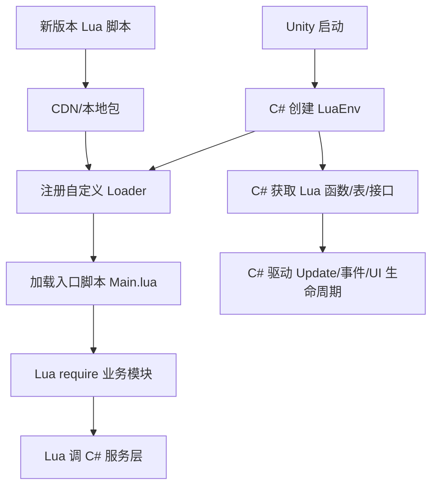
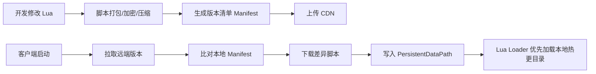

# Unity Lua 热更新从入门到进阶实战详解

## 1. 这篇文章解决什么问题

很多 Unity 开发者第一次接触 Lua 热更新时，最容易卡在两个地方：

| 卡点 | 典型表现 |
| --- | --- |
| 概念不连贯 | 知道 `LuaEnv`、`require`、`AddLoader` 这些名字，但不知道它们在整条链路里各自负责什么 |
| API 太陌生 | 能照着示例抄代码，但遇到 `CSharpCallLua`、`LuaTable`、`Hotfix`、`Tick`、`Dispose` 就不知道为什么要这样写 |

这篇文章的目标不是只给你几段可运行代码，而是尽量把 **Unity 中 Lua 热更新的完整工程链路** 讲清楚，让你从入门一直看到进阶阶段。

本文默认采用 **xLua** 作为讲解对象，原因很简单：

| 原因 | 说明 |
| --- | --- |
| 生态成熟 | Unity 项目里使用较多，资料和实践都相对丰富 |
| 上手路径清晰 | 最小示例、桥接、生成配置、Hotfix 都有明确用法 |
| 同时覆盖两类场景 | 既能做 Lua 业务脚本，也能做 C# 方法替换 |

:::info 阅读建议
如果你之前完全没接触过 Lua 热更新，建议按顺序阅读。  
如果你已经接过 xLua，只是对某些 API 模糊，可以重点看 `LuaEnv`、`互调桥接`、`脚本加载`、`Hotfix`、`GC 与性能` 这几章。
:::

## 2. Unity 里的“Lua 热更新”到底是什么

### 2.1 它不是“让 Unity 原生支持 Lua”

Unity 本身并没有内建 Lua 运行时。  
所谓 Lua 热更新，本质上是：

1. 你在客户端包里集成一个 Lua 虚拟机。
2. C# 负责创建这个虚拟机并把脚本喂给它。
3. Lua 脚本负责执行业务逻辑。
4. 当脚本发生变化时，你只替换 Lua 文件，不重新发整个客户端包。

也就是说，**Unity 仍然是宿主，Lua 只是运行在宿主内部的一层脚本系统**。

### 2.2 它解决的核心问题

| 问题 | Lua 热更新的价值 |
| --- | --- |
| 线上紧急修复 | 可以只下发脚本补丁，不必整个包重发 |
| 活动高频迭代 | 活动流程、UI 流程、任务逻辑更适合脚本化 |
| 减少平台发版压力 | 某些平台整包审核慢，脚本热更更灵活 |
| 提高业务层迭代速度 | 把变化频繁的逻辑和稳定底层解耦 |

### 2.3 它不是什么万能解法

Lua 热更新适合“变化频繁、规则驱动、流程驱动”的层，但不代表所有代码都该写成 Lua。

| 更适合 Lua 的部分 | 更适合保留在 C# 的部分 |
| --- | --- |
| 活动流程 | 引擎初始化 |
| UI 页面逻辑 | 资源系统 |
| 剧情、任务、配置驱动逻辑 | 网络底层 |
| 规则判断、技能脚本 | 性能敏感底层系统 |

如果一个新项目没有 Lua 沉淀，却打算把所有主逻辑都塞进 Lua，后期通常会遇到：

1. 双语言维护成本上升。
2. 业务边界越来越乱。
3. Unity API 被 Lua 侧到处直接调用。
4. 调试链变长，问题定位更慢。

这属于典型的“为了热更新而热更新”。  
从架构角度看，**Lua 层应该是业务层扩展，而不是把整个 Unity 工程再复制一套脚本版架构**。

## 3. Lua 热更新系统的整体结构

先建立全局视角，再看 API 会容易很多。



可以把它理解为四层：

| 层级 | 作用 |
| --- | --- |
| Unity 宿主层 | 游戏启动、场景、资源、网络、生命周期 |
| Lua 运行时层 | `LuaEnv`、脚本执行、模块缓存、GC |
| 桥接层 | C# 调 Lua、Lua 调 C#、委托映射、接口映射 |
| 业务脚本层 | 页面逻辑、活动逻辑、规则逻辑、状态机 |

## 4. xLua 中最核心的几个对象与 API

这一节很重要。很多人会背代码，但不知道这些 API 到底是什么。

### 4.1 `LuaEnv`

`LuaEnv` 是 xLua 最核心的对象。  
它可以理解为：

| 名称 | 真实含义 |
| --- | --- |
| `LuaEnv` | 一个 Lua 虚拟机运行环境 |
| 作用 | 保存全局变量、已加载模块、桥接状态、对象引用 |
| 生命周期 | 通常建议全局唯一，随整个游戏生命周期存在 |

最重要的结论：

1. **不要到处 `new LuaEnv()`。**
2. 大多数项目都应该只有一个主 `LuaEnv`。
3. 它不是“临时工具对象”，而是整个 Lua 世界的根。

为什么通常建议全局唯一？

| 原因 | 解释 |
| --- | --- |
| 模块缓存一致 | `require` 加载过的模块会缓存在虚拟机中 |
| 资源管理简单 | 少一个虚拟机就少一套全局状态和引用 |
| 减少性能损耗 | 多虚拟机意味着更多初始化和桥接开销 |

### 4.2 `DoString`

`DoString` 的作用是：**执行一段 Lua 代码字符串**。

```csharp
luaEnv.DoString("print('hello lua')");
```

它常见于两个阶段：

| 场景 | 用途 |
| --- | --- |
| 最小示例 | 验证 xLua 是否接入成功 |
| 启动入口 | 执行 `require 'Main'` 或注入少量启动逻辑 |

但要注意，`DoString` 不是长期主力加载方式。  
真实项目里，Lua 文件通常通过 `require` 和自定义 Loader 来组织，而不是把大量脚本直接拼成字符串执行。

### 4.3 `Global`

`luaEnv.Global` 表示 **Lua 全局表**。

可以把它理解成“Lua 世界里最外层的那张总表”。  
如果你在 Lua 中写：

```lua
gameVersion = "1.0.0"
```

那么在 C# 里就可以从 `Global` 读取：

```csharp
string version = luaEnv.Global.Get<string>("gameVersion");
```

这里的 `Get<T>` 表示“把 Lua 里的值按目标类型取出来”。

### 4.4 `LuaTable`

`LuaTable` 是 C# 对 Lua 表的一个包装对象。

Lua 里的 table 非常重要，它既能当：

1. 数组
2. 字典
3. 对象
4. 模块

例如下面这段 Lua：

```lua
player = {
    name = "Knight",
    hp = 100
}
```

在 C# 里可以这样接：

```csharp
LuaTable playerTable = luaEnv.Global.Get<LuaTable>("player");
string playerName = playerTable.Get<string>("name");
int playerHp = playerTable.Get<int>("hp");
```

`LuaTable` 的本质不是“C# 真字典”，而是 **对 Lua table 的引用句柄**。  
它背后仍然是 Lua 虚拟机里的数据。

### 4.5 `LuaFunction`

`LuaFunction` 是对 Lua 函数的包装。

例如：

```lua
function Add(a, b)
    return a + b
end
```

对应的 C# 可以直接取成 `LuaFunction`：

```csharp
LuaFunction addFunction = luaEnv.Global.Get<LuaFunction>("Add");
```

但是在实际项目里，更推荐直接映射成 **委托**，因为：

| 写法 | 优缺点 |
| --- | --- |
| `LuaFunction` | 灵活，但类型信息弱，调用不够自然 |
| C# 委托映射 | 类型更清晰，调用方式更接近普通 C# |

### 4.6 `AddLoader`

`AddLoader` 是很多新手第一次会觉得陌生的 API。

它的作用不是“下载脚本”，而是：

**告诉 xLua：当 Lua 执行 `require` 时，如果默认找不到模块，你应该如何把模块内容读出来。**

简单说，它是一个“脚本读取回调注册器”。

| API | 作用 |
| --- | --- |
| `luaEnv.AddLoader(loader)` | 注册一个自定义模块加载函数 |
| `loader(ref string filepath)` | 根据模块名返回脚本内容字节 |

你可以让它从以下任意地方读取：

1. `StreamingAssets`
2. `PersistentDataPath`
3. AssetBundle
4. Addressables
5. 内存缓存
6. CDN 下载后的本地缓存

所以 `AddLoader` 是 Lua 热更新接资源系统的关键入口。

### 4.7 `Tick`

`Tick` 是 xLua 里经常被忽略，但非常重要的一个 API。

它的作用可以粗略理解为：

**让 xLua 有机会执行延迟释放和内部 GC 相关处理。**

很多项目会定期调用：

```csharp
luaEnv.Tick();
```

为什么不能只靠 `Dispose()`？

| API | 作用时机 |
| --- | --- |
| `Tick()` | 运行过程中周期性处理内部对象回收 |
| `Dispose()` | 整个 LuaEnv 生命周期结束时彻底释放 |

如果你长时间运行 Lua，却从不 `Tick`，通常会让一些桥接对象释放不及时。

### 4.8 `Dispose`

`Dispose()` 表示 **销毁整个 LuaEnv**。

调用之后：

1. Lua 虚拟机生命周期结束。
2. 全局变量和模块状态都失效。
3. 已取出的 `LuaTable`、`LuaFunction` 等对象也不应继续使用。

因此它一般只适合：

1. 游戏退出。
2. 主运行时整体关闭。
3. 编辑器测试场景中主动清理。

不应该把它当成“清某个页面脚本”的常规手段。

## 5. 从零开始的最小可运行示例

### 5.1 C# 启动脚本

```csharp
using UnityEngine;
using XLua;

namespace Blogger.Demo
{
    /// <summary>
    /// Lua 最小启动示例。
    /// </summary>
    public sealed class LuaBootstrap : MonoBehaviour
    {
        private LuaEnv luaEnv;

        private void Start()
        {
            luaEnv = new LuaEnv();
            luaEnv.DoString("CS.UnityEngine.Debug.Log('Lua 环境启动成功')");
        }

        private void Update()
        {
            luaEnv.Tick();
        }

        private void OnDestroy()
        {
            luaEnv.Dispose();
            luaEnv = null;
        }
    }
}
```

### 5.2 逐行理解这段代码

| 代码 | 解释 |
| --- | --- |
| `new LuaEnv()` | 创建 Lua 虚拟机 |
| `DoString(...)` | 执行一段 Lua 代码 |
| `CS.UnityEngine.Debug.Log(...)` | 在 Lua 中反向调用 C# 的 `Debug.Log` |
| `Tick()` | 运行时周期性维护 Lua 内部回收 |
| `Dispose()` | 生命周期结束时释放整个 Lua 环境 |

### 5.3 为什么 Lua 里能直接写 `CS.UnityEngine.Debug.Log`

这是 xLua 提供的桥接能力。  
其中：

| 片段 | 含义 |
| --- | --- |
| `CS` | xLua 暴露给 Lua 的 C# 命名空间入口 |
| `UnityEngine` | C# 命名空间 |
| `Debug` | C# 类型 |
| `Log` | C# 的静态方法 |

也就是说，这不是 Lua 原生语法特性，而是 **xLua 为 Lua 注入的 C# 类型访问入口**。

## 6. Lua 模块化与 `require` 机制

### 6.1 `require` 到底做了什么

Lua 里的 `require("Main")` 不只是“读文件”，它实际包含两层语义：

1. 按模块名查找脚本内容。
2. 如果这个模块之前加载过，直接用缓存，不重复执行。

因此 `require` 的核心价值不只是导入，更是 **模块缓存与单次初始化**。

### 6.2 一个简单模块示例

```lua
local LoginController = {}

function LoginController.Open()
    CS.UnityEngine.Debug.Log("打开登录界面")
end

return LoginController
```

使用方式：

```lua
local loginController = require("LoginController")
loginController.Open()
```

这里 `return LoginController` 很关键。  
因为 `require` 的返回值，就是这个模块最终导出的对象。

### 6.3 `require` 为什么通常配合 `AddLoader`

因为 xLua 默认并不知道你的 Lua 文件放在哪。  
你注册 `AddLoader` 后，相当于告诉它：

1. 模块名如何映射成路径。
2. 从哪个位置读取脚本。
3. 返回给 Lua 虚拟机的字节内容是什么。

示例：

```csharp
using System.IO;
using System.Text;
using UnityEngine;
using XLua;

namespace Blogger.Demo
{
    public sealed class LuaLoaderSample : MonoBehaviour
    {
        private LuaEnv luaEnv;

        private void Start()
        {
            luaEnv = new LuaEnv();
            luaEnv.AddLoader(CustomLoader);
            luaEnv.DoString("require 'Main'");
        }

        private byte[] CustomLoader(ref string filePath)
        {
            string fullPath = Path.Combine(Application.streamingAssetsPath, "Lua", filePath + ".lua.txt");

            if (!File.Exists(fullPath))
            {
                Debug.LogError("Lua 模块不存在: " + fullPath);
                return null;
            }

            return Encoding.UTF8.GetBytes(File.ReadAllText(fullPath));
        }

        private void Update()
        {
            luaEnv.Tick();
        }

        private void OnDestroy()
        {
            luaEnv.Dispose();
            luaEnv = null;
        }
    }
}
```

### 6.4 `CustomLoader(ref string filePath)` 为什么这样设计

这个签名经常让新手困惑。

| 参数/返回值 | 含义 |
| --- | --- |
| `ref string filePath` | Lua 当前正在请求的模块名，允许你在回调里修正最终路径 |
| `byte[]` 返回值 | 该模块的脚本文本字节内容 |

你可以把 `filePath` 理解成：Lua 说“我要 `Main` 这个模块”，然后 xLua 问你“那你告诉我应该去哪里把它读出来”。

### 6.5 为什么很多项目把 Lua 文件写成 `.lua.txt`

不是 Lua 必须这样，而是工程习惯问题。

常见原因有三个：

| 原因 | 解释 |
| --- | --- |
| 避免编辑器导入规则冲突 | 某些资源流程里直接使用 `.lua` 不方便 |
| 统一当文本资源处理 | 更适合 AssetBundle 或资源打包链 |
| 规避平台特殊限制 | 某些平台对扩展名处理方式不同 |

所以 `.lua.txt` 不是 xLua 规定，而是项目资源组织的一种策略。

## 7. C# 调 Lua 的几种典型方式

### 7.1 方式一：直接取全局函数

Lua：

```lua
function Add(a, b)
    return a + b
end
```

C#：

```csharp
using UnityEngine;
using XLua;

namespace Blogger.Demo
{
    public sealed class LuaCallSample : MonoBehaviour
    {
        [CSharpCallLua]
        private delegate int AddDelegate(int a, int b);

        private LuaEnv luaEnv;
        private AddDelegate addDelegate;

        private void Start()
        {
            luaEnv = new LuaEnv();
            luaEnv.DoString(@"
                function Add(a, b)
                    return a + b
                end
            ");

            addDelegate = luaEnv.Global.Get<AddDelegate>("Add");
            int result = addDelegate.Invoke(3, 5);
            Debug.Log("Lua 返回结果: " + result);
        }
    }
}
```

### 7.2 `[CSharpCallLua]` 到底是什么

这是一个很典型的“非 Unity 原生 API”。

它不是 C# 官方特性，也不是 Unity 特性，而是 **xLua 用来做代码生成与桥接分析的标记**。

| 标记 | 作用 |
| --- | --- |
| `[CSharpCallLua]` | 告诉 xLua：这个委托或接口会用来接收 Lua 实现 |

为什么需要标记？

因为在 AOT、IL2CPP、桥接生成这类场景里，xLua 需要提前知道哪些类型要建立适配代码。  
否则它不知道应该为哪些委托或接口生成桥接支持。

### 7.3 方式二：获取模块返回表

Lua：

```lua
local UIPage = {}

function UIPage.Open(pageName)
    CS.UnityEngine.Debug.Log("打开页面: " .. pageName)
end

return UIPage
```

C#：

```csharp
LuaTable pageTable = luaEnv.Global.Get<LuaTable>("UIPage");
```

如果这个模块是通过 `local page = require("UIPage")` 存到某个全局变量里的，也可以从该全局变量取。

不过更常见的做法是：**在 C# 侧执行 `require` 并直接接收返回值**。

### 7.4 方式三：接口映射

Lua：

```lua
local updater = {}

function updater:Tick(deltaTime)
    CS.UnityEngine.Debug.Log("Lua Tick: " .. deltaTime)
end

return updater
```

C#：

```csharp
[CSharpCallLua]
public interface ILuaUpdater
{
    void Tick(float deltaTime);
}
```

这种方式适合“把 Lua 对象当成某种接口实现”来使用，优点是语义清晰，缺点是需要更明确地规划接口边界。

## 8. Lua 调 C# 的常见方式

### 8.1 直接访问静态类型

```lua
CS.UnityEngine.Debug.Log("Lua 调用了 C#")
```

这是最直观的方式，但如果项目里所有 Lua 都直接深入访问各种 Unity API，后面通常会变得难维护。

### 8.2 访问 C# 实例

你可以把一个 C# 对象塞到 Lua 全局表里：

```csharp
luaEnv.Global.Set("gameService", gameServiceInstance);
```

然后在 Lua 中直接用：

```lua
gameService:StartBattle()
```

这里冒号 `:` 是 Lua 的对象调用语法，会自动把前面的对象作为第一个参数传入。

### 8.3 `[LuaCallCSharp]` 是什么

这又是一个很容易遇到的陌生标记。

| 标记 | 作用 |
| --- | --- |
| `[LuaCallCSharp]` | 告诉 xLua：这些 C# 类型要暴露给 Lua 调用 |

虽然在编辑器里很多类型你不显式标也可能能跑，但在生成、裁剪、AOT 场景下，明确配置更稳。

### 8.4 为什么项目里通常不建议 Lua 直接到处碰 Unity API

因为这样会导致 Lua 层和 Unity 细节强耦合。

更推荐的做法是：

| 做法 | 价值 |
| --- | --- |
| 给 Lua 暴露 `UIService` | Lua 不需要知道具体页面 prefab 如何实例化 |
| 给 Lua 暴露 `AudioService` | Lua 不直接操作 `AudioSource` 细节 |
| 给 Lua 暴露 `TimerService` | Lua 不自己散落写各种 Unity 计时逻辑 |

也就是说，**Lua 最好面向“你定义的业务服务”编程，而不是面向一整套 Unity 原始 API 编程**。

## 9. 一套更接近实际项目的页面脚本写法

### 9.1 Lua 页面模块

```lua
local LoginPage = {}
LoginPage.__index = LoginPage

function LoginPage.New(view)
    local self = setmetatable({}, LoginPage)
    self.view = view
    return self
end

function LoginPage:OnOpen()
    CS.UnityEngine.Debug.Log("LoginPage 打开")
end

function LoginPage:OnClose()
    CS.UnityEngine.Debug.Log("LoginPage 关闭")
end

return LoginPage
```

### 9.2 C# 页面宿主

```csharp
using UnityEngine;
using XLua;

namespace Blogger.Demo
{
    [CSharpCallLua]
    public interface ILuaPage
    {
        void OnOpen();
        void OnClose();
    }

    public sealed class LuaPageHost : MonoBehaviour
    {
        private LuaEnv luaEnv;
        private ILuaPage luaPage;

        private void Start()
        {
            luaEnv = new LuaEnv();
            luaEnv.AddLoader(CustomLoader);
            luaEnv.DoString("LoginPageClass = require 'UI.LoginPage'");
            LuaTable global = luaEnv.Global;
            LuaTable pageClass = global.Get<LuaTable>("LoginPageClass");
            luaPage = pageClass.Cast<ILuaPage>();
            luaPage.OnOpen();
        }

        private byte[] CustomLoader(ref string filePath)
        {
            return null;
        }
    }
}
```

这段示例想表达的是：

1. C# 仍然掌握 Unity 生命周期。
2. Lua 负责页面业务逻辑。
3. C# 只通过一个接口跟 Lua 通信。

这种边界比“Lua 想干什么就直接进 Unity 里找对象”更稳。

:::warning 架构提醒
如果项目中 Lua 页面直接在脚本内部通过字符串全局查找场景对象、直接操作大量 Unity 组件、自己管理异步下载和资源释放，这通常说明边界已经失控。  
更合理的方式是让 Lua 只面向有限的服务接口和 View 引用工作。
:::

## 10. Lua Hotfix 模式到底是什么

除了“把业务写成 Lua”，xLua 还有一条常见路线：**运行时替换 C# 方法实现**。

### 10.1 它的本质

假设原本 C# 里有一个方法：

```csharp
public int CalcDamage(int attack)
{
    return attack * 2;
}
```

通过 xLua Hotfix，可以在运行时把它替换成 Lua 逻辑：

```lua
xlua.hotfix(CS.Game.BattleSystem, "CalcDamage", function(self, attack)
    return attack * 3
end)
```

这意味着：

1. 原始包里已经存在 `BattleSystem` 这个 C# 类。
2. xLua 在运行时把该方法改挂到 Lua 实现上。
3. 后续外部再调用 `CalcDamage` 时，实际执行的是 Lua 逻辑。

### 10.2 `[Hotfix]` 标记是什么

`[Hotfix]` 也是 xLua 的标记之一。

| 标记 | 作用 |
| --- | --- |
| `[Hotfix]` | 告诉 xLua：这个类允许被 Hotfix 替换方法 |

示例：

```csharp
using XLua;

[Hotfix]
public class BattleSystem
{
    public int CalcDamage(int attack)
    {
        return attack * 2;
    }
}
```

### 10.3 Hotfix 适合什么场景

| 场景 | 适合程度 |
| --- | --- |
| 老项目补线上 bug | 很适合 |
| 过渡期逐步引入 Lua | 很适合 |
| 全项目长期主要开发方式 | 通常不如直接做稳定的业务脚本层 |

原因很简单：Hotfix 更像“补丁机制”，而不是一套长期优雅的主业务架构。

### 10.4 Hotfix 的常见限制

Hotfix 很强，但不是想替什么都行。  
不同版本、不同平台、不同写法会有边界，真实项目中要重点验证：

1. 泛型方法。
2. 内联优化相关场景。
3. 构造函数与静态构造。
4. 特殊平台打包行为。
5. 裁剪与生成配置。

所以 Hotfix 更适合做“明确范围的可控补丁”，不建议把它当万能魔法。

## 11. 生成配置与桥接为什么重要

很多人第一次接 xLua，会觉得“为什么还要 Generate Code，明明我只是调用一个函数”。

这是因为 xLua 不是纯动态反射式方案，它为了性能和 AOT 兼容，很多场景会走 **生成适配代码**。

### 11.1 你经常会看到的几个标签

| 标签 | 典型对象 | 作用 |
| --- | --- | --- |
| `[CSharpCallLua]` | 委托、接口 | C# 从 Lua 侧接实现 |
| `[LuaCallCSharp]` | 类型列表 | Lua 侧要调用的 C# 类型 |
| `[Hotfix]` | 类 | 标记可被热更替换的方法 |
| `[BlackList]` | 成员或签名 | 排除某些不适合导出的 API |

### 11.2 它们为什么在 IL2CPP / AOT 下更重要

因为在 AOT 环境下，很多代码必须 **编译前就知道有哪些桥接关系**。  
如果没有显式告诉框架：

1. 该为哪些委托生成适配。
2. 哪些类型要保留。
3. 哪些函数允许桥接。

就可能出现：

| 编辑器表现 | 真机场景 |
| --- | --- |
| Editor 下正常 | IL2CPP 包里报错 |
| Mono 正常 | iOS 上桥接失败 |
| 少量测试能跑 | 大量业务接入后开始丢方法、丢签名 |

## 12. GC、内存与性能为什么是 Lua 项目的必修课

Lua 热更新项目比纯 C# 项目更需要关注“引用和分配”。

### 12.1 两套世界的 GC

你至少要有一个基本认识：

| 世界 | GC 来源 |
| --- | --- |
| C# 世界 | .NET/Mono/IL2CPP 管理对象 |
| Lua 世界 | Lua VM 自己管理对象 |

当对象在 C# 和 Lua 之间互相引用时，问题会变复杂。  
这也是为什么 `LuaTable`、`LuaFunction` 这类桥接对象不应随意长期持有。

### 12.2 `LuaTable.Dispose()` 为什么重要

如果你从 Lua 里取了一个 `LuaTable`：

```csharp
LuaTable table = luaEnv.Global.Get<LuaTable>("player");
```

那么在不用时通常应该显式释放：

```csharp
table.Dispose();
table = null;
```

为什么？

因为 `LuaTable` 不是普通托管对象，它背后还关联 Lua 虚拟机中的引用。  
显式释放能更快让桥接层解除这段关联。

### 12.3 高频互调为什么容易出性能问题

典型错误包括：

1. 每帧从 Lua 查一次函数。
2. 每帧从 C# 取一次 `LuaTable` 字段。
3. 每次点击都临时拼一段 `DoString`。
4. 把大量 Unity API 调用散落在 Lua 中高频执行。

更推荐的思路：

| 错误做法 | 更优做法 |
| --- | --- |
| 每次现取 `Global.Get` | 初始化时缓存委托/接口 |
| 每次 `DoString` 拼逻辑 | 模块化组织脚本，用 `require` |
| 每帧跨语言来回调很多次 | 适当批量化、收敛调用边界 |

### 12.4 `Tick` 该怎么调

通常会有三种常见做法：

| 做法 | 适用性 |
| --- | --- |
| 每帧 `Tick()` | 最简单直接 |
| 定时器间隔调用 | 中大型项目常见 |
| 场景切换或关键节点调用 | 单独这样做通常不够稳 |

如果项目 Lua 使用频繁，建议至少保证“稳定周期性调用”，而不是完全忘记它。

## 13. 调试与错误定位

Lua 热更新项目里，调试成本往往不是“Lua 难”，而是 **双语言堆栈和资源版本一起叠加**。

### 13.1 最常见的错误来源

| 类别 | 示例 |
| --- | --- |
| 模块路径错 | `require` 找不到文件 |
| 生成配置缺失 | 委托或接口桥接失败 |
| 生命周期错 | `LuaEnv` 被销毁后还继续调 |
| 资源版本错 | 客户端和脚本版本不匹配 |
| Unity 引用失效 | Lua 还持有已经销毁的对象 |

### 13.2 建议保留的日志维度

| 维度 | 示例 |
| --- | --- |
| 当前脚本版本 | `lua_version=2026.04.12.1` |
| 当前模块名 | `module=UI.LoginPage` |
| 当前入口流程 | `phase=page_open` |
| 当前资源包版本 | `bundle_manifest=10023` |

有了这些日志，线上查问题时才能分清是：

1. 脚本逻辑问题。
2. 资源版本问题。
3. C# 宿主问题。

## 14. Lua 脚本更新链路该怎么设计

Lua 热更新不是只把脚本放进客户端就结束了，真实项目还要有版本治理。



### 14.1 为什么 Loader 通常先读 `PersistentDataPath`

因为这里通常用于保存 **客户端下载后的最新脚本**。

而 `StreamingAssets` 更像首包自带内容。  
因此一个常见优先级是：

1. `PersistentDataPath` 热更目录
2. `StreamingAssets` 内置目录
3. 兜底错误处理

### 14.2 Manifest 是什么

Manifest 可以简单理解成“版本清单”。

它通常记录：

| 字段 | 作用 |
| --- | --- |
| 文件名 | 标识脚本文件 |
| hash / md5 | 判断文件是否变化 |
| 大小 | 下载校验 |
| 版本号 | 识别整体脚本版本 |

没有 Manifest，客户端就不知道该更新哪些脚本。

### 14.3 是否需要加密或编译成字节码

这取决于项目诉求。

| 方案 | 特点 |
| --- | --- |
| 纯文本 Lua | 最方便调试 |
| Lua 字节码 | 一定程度减少直接暴露源码 |
| 自定义加密包装 | 提高逆向门槛，但增加构建复杂度 |

这里要有一个现实认识：**加密更多是提高门槛，不是绝对防破解**。  
不要为了“看起来安全”把整个构建链做得特别复杂。

## 15. Lua 热更新与 AssetBundle / Addressables 的关系

很多新人会把“Lua 热更新”和“资源热更新”混在一起。

其实它们不是一回事：

| 类型 | 更新对象 |
| --- | --- |
| Lua 热更新 | 脚本逻辑 |
| 资源热更新 | 图片、Prefab、音频、配置、材质等资源 |

但两者通常会配合使用。

### 15.1 常见组合方式

| 组合方式 | 说明 |
| --- | --- |
| Lua 文件单独下载到本地 | 逻辑更新简单直接 |
| Lua 文件打进 AssetBundle | 脚本也走统一资源分发 |
| Addressables 管资源，Lua 走独立链路 | 最常见，也更清晰 |

如果团队已经有成熟资源更新链，Lua 通常不应重新造一套完全割裂的下载系统。  
最合理的是 **复用已有版本治理、下载、校验、回滚能力**。

## 16. 一套更推荐的工程边界

这里给一套比较实用、也比较稳的边界划分。

### 16.1 C# 负责什么

| 模块 | 职责 |
| --- | --- |
| `LuaRuntime` | 创建和持有唯一 `LuaEnv` |
| `LuaScriptLoader` | 根据模块名读取脚本字节 |
| `LuaBridgeConfig` | 收口生成配置和导出类型 |
| `LuaServiceFacade` | 向 Lua 暴露有限服务 |
| `LuaPageHost` / `LuaBehaviourHost` | 管理具体页面或逻辑节点生命周期 |

### 16.2 Lua 负责什么

| 模块 | 职责 |
| --- | --- |
| `Main.lua` | 总入口 |
| `Controller` | 流程控制 |
| `Page` | UI 业务逻辑 |
| `Config` | 配置驱动逻辑 |
| `Util` | 纯 Lua 工具函数 |

### 16.3 为什么这种拆法更稳

因为它避免了两种极端：

| 极端 | 问题 |
| --- | --- |
| 所有逻辑都堆进 Lua | Unity 细节和业务细节混在一起 |
| Lua 只是零散脚本片段 | 项目没有真正形成可维护脚本层 |

## 17. 从入门走到进阶，推荐按什么顺序掌握

### 17.1 入门阶段

先掌握这些就够：

1. `LuaEnv`
2. `DoString`
3. `require`
4. `AddLoader`
5. `Global.Get`
6. `CS.xxx` 调 C#

目标是能独立跑通：

1. C# 创建 Lua 环境。
2. Lua 脚本独立成文件。
3. 能从文件加载并执行入口。
4. 能做到最基础的双向调用。

### 17.2 进阶阶段

接着补这些：

1. 委托映射与接口映射
2. `CSharpCallLua` / `LuaCallCSharp`
3. `LuaTable` / `LuaFunction` 生命周期
4. `Tick` 与 `Dispose`
5. 模块缓存和脚本重载
6. 简单版本清单

目标是做出一个真正可维护的业务脚本层。

### 17.3 项目实战阶段

最后再处理这些工程化问题：

1. IL2CPP 与裁剪
2. 生成配置治理
3. 脚本加密与构建链
4. CDN 更新、回滚、灰度
5. Hotfix 作为补丁手段接入
6. 线上日志与问题追踪

## 18. 最常见的坑与建议

### 18.1 坑一：到处创建 `LuaEnv`

后果：

1. 模块缓存混乱。
2. 桥接对象管理麻烦。
3. 内存和性能问题更明显。

建议：绝大多数项目保持唯一主 `LuaEnv`。

### 18.2 坑二：Lua 直接深入操作大量 Unity 细节

后果：

1. Lua 代码难测。
2. Unity 改动会牵一大片脚本。
3. 页面逻辑和引擎逻辑耦死。

建议：给 Lua 暴露服务层，而不是暴露一整个杂乱的 Unity API 世界。

### 18.3 坑三：过度依赖 Hotfix

后果：

1. 代码可读性下降。
2. 实际执行入口不直观。
3. 平台兼容与生成配置更难维护。

建议：Hotfix 适合“补丁”，主业务长期还是应落到清晰的脚本层或稳定架构里。

### 18.4 坑四：脚本更新链和资源更新链各做一套

后果：

1. 版本号难统一。
2. 失败回滚难处理。
3. 线上排障维度翻倍。

建议：Lua 更新链尽量复用现有下载、校验、清单、回滚系统。

### 18.5 坑五：只会抄示例，不理解 API 角色

后果是你一遇到项目改造就不会落地。  
所以一定要记住本文里最核心的一组映射关系：

| 名词 | 你应该把它理解成什么 |
| --- | --- |
| `LuaEnv` | 整个 Lua 世界 |
| `DoString` | 执行一段脚本 |
| `require` | 加载并缓存模块 |
| `AddLoader` | 告诉 xLua 去哪里读模块 |
| `Global` | Lua 全局表入口 |
| `LuaTable` | Lua 表的 C# 包装引用 |
| `LuaFunction` | Lua 函数的 C# 包装引用 |
| `[CSharpCallLua]` | Lua 实现交给 C# 用的桥接标记 |
| `[LuaCallCSharp]` | C# 类型暴露给 Lua 的桥接标记 |
| `[Hotfix]` | 允许被运行时替换实现的类标记 |
| `Tick()` | 运行期回收维护 |
| `Dispose()` | 整个 LuaEnv 生命周期结束 |

## 19. 一套适合大多数 Unity 团队的建议

如果你们是第一次正式接 Lua 热更新，我更推荐这样的路线：

| 阶段 | 建议 |
| --- | --- |
| 第一步 | 先做稳定的 `LuaRuntime + Loader + Main.lua` 入口 |
| 第二步 | 先让少量活动或 UI 页面脚本化 |
| 第三步 | 建立服务层边界，不要让 Lua 直接到处碰 Unity |
| 第四步 | 建好脚本版本清单、下载、回滚机制 |
| 第五步 | 只把 Hotfix 当成补丁能力，不要一开始就全项目依赖它 |

这条路线的优点是：

1. 风险可控。
2. 团队学习曲线更平滑。
3. 出问题更容易定位。

## 20. 总结

Lua 热更新的核心，不是“会不会写几句 Lua”，而是你是否真的理解下面这条链：

1. Unity 是宿主。
2. `LuaEnv` 是 Lua 世界根节点。
3. `AddLoader` 决定脚本从哪里来。
4. `require` 决定模块如何组织和缓存。
5. 桥接层决定 C# 与 Lua 如何协作。
6. `Tick`、`Dispose`、`LuaTable` 生命周期决定运行期是否稳定。
7. Manifest、下载、回滚决定它能不能真正上线运营。

如果你只记一句话，那就是：

**Lua 热更新真正难的不是语言本身，而是工程边界、桥接治理和线上版本治理。**

## 21. 延伸阅读建议

| 主题 | 建议继续深入的方向 |
| --- | --- |
| xLua 接入 | 官方仓库、配置生成、平台差异 |
| 脚本架构 | 页面脚本化、控制器层、服务层设计 |
| 工程化 | 清单生成、差异下载、失败回滚 |
| 平台问题 | IL2CPP、裁剪、AOT 限制 |
| 方案选型 | Lua、HybridCLR、资源热更新的边界分工 |

如果你后续希望，我也可以继续补一篇更偏工程实现的配套文章，例如：

1. `xLua + AssetBundle` 的完整热更链路。
2. `xLua 页面框架` 的实战组织方式。
3. `Lua 热更新常见线上事故排查清单`。
