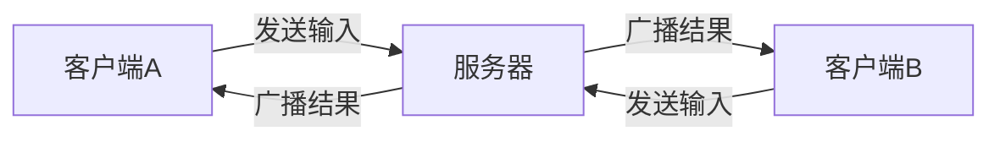
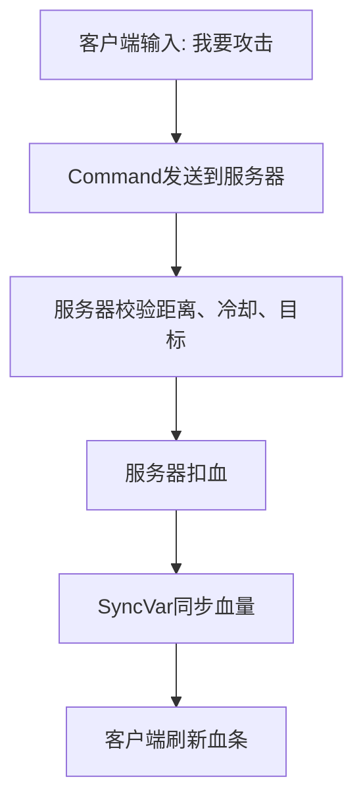
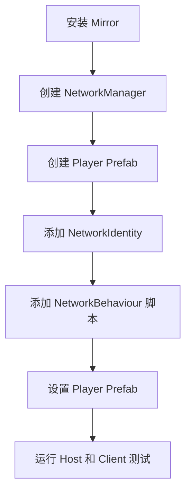
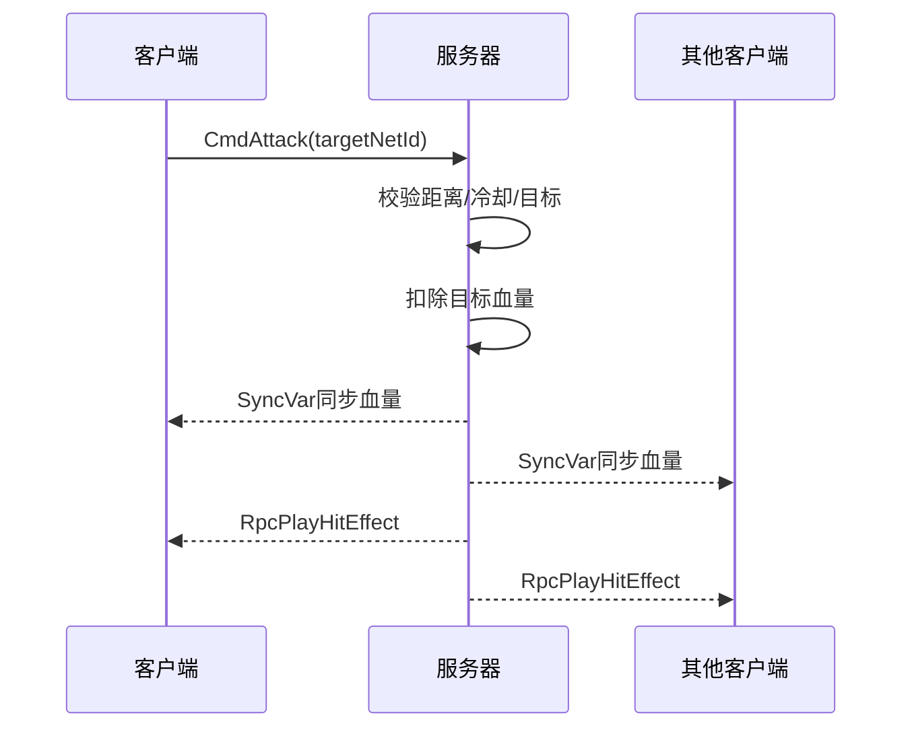

# Unity Mirror 多人游戏开发从入门到进阶详解

## 1. 这篇文章适合谁

这篇文章面向这样的 Unity 开发者：

| 读者状态 | 说明 |
| --- | --- |
| 会一点 C# Socket | 知道客户端、服务端、连接、发送消息、接收消息 |
| 没系统做过 Unity 多人游戏 | 不熟悉玩家对象、网络身份、状态同步、服务器权威 |
| 准备使用 Mirror | 想用成熟网络框架快速做联机功能 |

本文默认你已经理解最基础的 Socket 思维：

1. 服务端监听端口。
2. 客户端连接服务端。
3. 客户端发送字节消息。
4. 服务端接收消息并处理。
5. 服务端把结果广播给其他客户端。

Mirror 做的事情，本质上就是把这些底层网络细节封装成更适合 Unity 的组件、特性和生命周期。

:::abstract 一句话结论
Mirror 不是让你不用理解网络，而是把“收发字节、识别对象、广播状态、同步变量、远程调用”封装成 Unity 开发者更容易使用的高级 API。
:::

## 2. 从 Socket 思维过渡到 Mirror 思维

如果你写过简单 Socket，可能会这样理解多人游戏：



Mirror 仍然是这个逻辑，只是它帮你抽象了很多层。

| Socket 编程概念 | Mirror 中的大致对应 |
| --- | --- |
| Socket 连接 | Transport 连接 |
| 服务端启动监听 | `NetworkManager.StartServer()` / `StartHost()` |
| 客户端连接 | `NetworkManager.StartClient()` |
| 消息类型 | Command、ClientRpc、TargetRpc、NetworkMessage |
| 对象 ID | `NetworkIdentity.netId` |
| 服务端广播状态 | `SyncVar`、`SyncList`、`ClientRpc` |
| 生成网络对象 | `NetworkServer.Spawn()` |

你可以把 Mirror 理解成：

**一套运行在 Unity 对象体系上的高级网络同步框架。**

## 3. Mirror 的核心设计：服务器权威

### 3.1 什么是服务器权威

Mirror 默认推荐的是 **Server Authoritative**，也就是服务器权威模型。

它的意思是：

1. 客户端可以提交输入或请求。
2. 真正改变游戏状态的逻辑尽量由服务器执行。
3. 服务器把最终状态同步给客户端。

示意：



### 3.2 为什么不要让客户端直接决定结果

如果客户端直接告诉服务器：

```text
我打中了敌人，并且造成 999999 伤害
```

那外挂就很容易伪造消息。

更合理的方式是：

```text
客户端：我按下了攻击键
服务器：我来判断你能不能攻击、是否命中、造成多少伤害
```

对于多人游戏，尤其是 PvP、排行榜、经济系统，服务器权威非常重要。

## 4. Mirror 工程最小搭建流程

根据 Mirror 官方 Getting Started 文档，最小可运行流程通常包含：

1. 创建 `NetworkManager`。
2. 添加默认调试 UI `NetworkManagerHUD`。
3. 创建玩家 Prefab。
4. 给玩家 Prefab 添加 `NetworkIdentity`。
5. 把玩家 Prefab 填到 `NetworkManager` 的 Player Prefab。
6. 玩家脚本继承 `NetworkBehaviour`。
7. 只让本地玩家处理输入。



## 5. NetworkManager：联机入口

### 5.1 它负责什么

`NetworkManager` 是 Mirror 项目最常见的入口组件。

| 职责 | 说明 |
| --- | --- |
| 启动服务器 | 监听连接 |
| 启动客户端 | 连接远程服务器 |
| 启动 Host | 同一进程同时作为服务端和客户端 |
| 管理玩家生成 | 客户端连接后创建 Player 对象 |
| 注册可生成 Prefab | 让客户端知道哪些网络对象可以被生成 |

对 Socket 开发者来说，它相当于把“启动监听、接受连接、维护客户端列表”封装好了。

### 5.2 Host、Server、Client 区别

| 模式 | 说明 |
| --- | --- |
| Server | 只作为服务器，不显示本地玩家画面 |
| Client | 只作为客户端，连接某个服务器 |
| Host | 同时是服务器和客户端，常用于本机测试或房主模式 |

刚学习 Mirror 时，建议先用 Host + Client 测试：

1. 编辑器开 Host。
2. 打包一个客户端连接编辑器。
3. 或者用两个编辑器实例 / ParrelSync 测试。

## 6. Transport：底层传输层

Mirror 的高级 API 下面还有 Transport。  
Transport 才是真正负责底层收发数据的部分。

| 层级 | 说明 |
| --- | --- |
| Mirror 高级 API | `Command`、`Rpc`、`SyncVar`、`NetworkIdentity` |
| Transport | 真正发送字节数据的底层传输 |

常见 Transport 包括 Telepathy、KCP 等。  
如果你有 Socket 基础，可以把 Transport 理解为 Mirror 对 TCP、UDP 或 KCP 这类传输实现的封装。

通常入门阶段不需要自己写 Transport，先使用 Mirror 默认配置即可。

## 7. NetworkIdentity：网络对象的身份证

Mirror 官方文档强调，`NetworkIdentity` 是高级网络 API 的核心组件。  
一个 GameObject 想成为网络对象，通常必须有它。

### 7.1 它负责什么

| 能力 | 说明 |
| --- | --- |
| 唯一网络身份 | 服务端会给网络对象分配 `netId` |
| 让对象被网络系统识别 | Mirror 才知道这个对象要同步 |
| 支持对象生成和销毁同步 | 配合 `NetworkServer.Spawn()` 使用 |

### 7.2 重要限制

Mirror 官方文档提醒：不要在嵌套子物体上放多个 `NetworkIdentity`。  
通常一个网络对象根节点有一个 `NetworkIdentity` 即可。

错误结构：

```text
Player(NetworkIdentity)
  Weapon(NetworkIdentity)
```

更推荐：

```text
Player(NetworkIdentity)
  Weapon
```

如果武器本身需要独立网络生命周期，再把它做成独立网络对象，而不是嵌套在玩家 Prefab 里混用多个身份。

## 8. NetworkBehaviour：网络版 MonoBehaviour

### 8.1 为什么不能只继承 MonoBehaviour

Mirror 的网络能力依赖 `NetworkBehaviour`。

如果脚本只继承 `MonoBehaviour`，它就不能直接使用：

1. `isServer`
2. `isClient`
3. `isLocalPlayer`
4. `[Command]`
5. `[ClientRpc]`
6. `[SyncVar]`

### 8.2 常用属性

| 属性 | 含义 |
| --- | --- |
| `isServer` | 当前对象是否处于服务器上下文 |
| `isClient` | 当前对象是否处于客户端上下文 |
| `isLocalPlayer` | 当前对象是否是本客户端自己的玩家对象 |
| `isOwned` | 当前客户端是否拥有这个对象的权限 |
| `netId` | 服务器分配的网络对象 ID |

### 8.3 只让本地玩家处理输入

多人游戏里，每个客户端都会看到多个玩家对象。  
但每台机器只能控制自己的那个玩家。

```csharp
using Mirror;
using UnityEngine;

namespace Blogger.Runtime
{
    /// <summary>
    /// Mirror 玩家输入示例。
    /// </summary>
    public sealed class MirrorPlayerInput : NetworkBehaviour
    {
        [SerializeField]
        private float moveSpeed = 5f;

        #region 本地玩家输入

        /// <summary>
        /// 每帧处理本地玩家输入。
        /// </summary>
        private void Update()
        {
            // 不是本地玩家对象时，不处理键盘输入，避免一个客户端控制所有玩家。
            if (!isLocalPlayer)
            {
                return;
            }

            // 读取横向输入。
            float horizontal = Input.GetAxisRaw("Horizontal");

            // 读取纵向输入。
            float vertical = Input.GetAxisRaw("Vertical");

            // 计算移动方向。
            Vector3 direction = new Vector3(horizontal, 0f, vertical).normalized;

            // 根据方向和速度移动当前本地玩家。
            transform.position += direction * moveSpeed * Time.deltaTime;
        }

        #endregion
    }
}
```

### 8.4 这段代码解决什么问题

关键是这一句：

```csharp
if (!isLocalPlayer)
{
    return;
}
```

没有它的话，每个客户端都会对自己场景里的所有玩家对象执行输入逻辑，结果就是：

1. 你按键时所有玩家一起动。
2. 远程玩家也被本地输入影响。
3. 网络同步结果混乱。

## 9. Command：客户端请求服务器执行

### 9.1 Command 对应 Socket 里的什么

在 Socket 编程里，客户端会发送消息给服务器：

```text
Client -> Server: MoveInput(x, y)
```

在 Mirror 里，最常见的写法就是 `[Command]`。

官方文档中，Command 用于让客户端触发服务器上的代码执行。  
方法名推荐以 `Cmd` 开头，方便一眼看出这是“发到服务器”的调用。

### 9.2 示例：客户端请求服务器移动

```csharp
using Mirror;
using UnityEngine;

namespace Blogger.Runtime
{
    /// <summary>
    /// 服务器权威移动示例。
    /// </summary>
    public sealed class ServerAuthoritativeMovement : NetworkBehaviour
    {
        [SerializeField]
        private float moveSpeed = 5f;

        #region 客户端输入与服务器移动

        /// <summary>
        /// 本地玩家每帧提交输入。
        /// </summary>
        private void Update()
        {
            // 只有本地玩家才能读取本机输入。
            if (!isLocalPlayer)
            {
                return;
            }

            // 获取横向输入。
            float horizontal = Input.GetAxisRaw("Horizontal");

            // 获取纵向输入。
            float vertical = Input.GetAxisRaw("Vertical");

            // 创建输入方向。
            Vector2 input = new Vector2(horizontal, vertical);

            // 如果没有输入，则不发送命令，减少网络消息。
            if (input.sqrMagnitude <= 0.0001f)
            {
                return;
            }

            // 请求服务器执行移动。
            CmdMove(input);
        }

        /// <summary>
        /// 在服务器上执行移动。
        /// </summary>
        /// <param name="input">客户端提交的移动输入。</param>
        [Command]
        private void CmdMove(Vector2 input)
        {
            // 限制输入长度，避免客户端伪造超大输入。
            Vector2 clampedInput = Vector2.ClampMagnitude(input, 1f);

            // 转换为三维移动方向。
            Vector3 direction = new Vector3(clampedInput.x, 0f, clampedInput.y);

            // 服务器更新玩家位置。
            transform.position += direction * moveSpeed * Time.deltaTime;
        }

        #endregion
    }
}
```

### 9.3 为什么服务器还要校验输入

客户端提交的数据不能完全信任。

即使客户端 UI 上只允许输入 `-1` 到 `1`，外挂也可以直接发：

```text
input = (999, 999)
```

所以服务器里做了：

```csharp
Vector2 clampedInput = Vector2.ClampMagnitude(input, 1f);
```

这就是服务器权威的基本思想：  
**客户端可以请求，服务器必须校验。**

## 10. ClientRpc：服务器通知所有客户端

### 10.1 ClientRpc 对应 Socket 里的什么

在 Socket 编程里，服务器广播消息：

```text
Server -> All Clients: PlayerAttackEffect
```

Mirror 里常用 `[ClientRpc]`。

它的作用是：

**服务器调用一个方法，让所有观察该对象的客户端执行对应逻辑。**

### 10.2 示例：播放攻击特效

```csharp
using Mirror;
using UnityEngine;

namespace Blogger.Runtime
{
    /// <summary>
    /// Mirror 攻击表现同步示例。
    /// </summary>
    public sealed class MirrorAttackEffect : NetworkBehaviour
    {
        #region 攻击表现同步

        /// <summary>
        /// 客户端请求攻击。
        /// </summary>
        [Command]
        public void CmdAttack()
        {
            // 服务器执行攻击判定，此处省略距离、冷却、目标校验。
            Debug.Log("服务器收到攻击请求");

            // 服务器通知所有客户端播放攻击特效。
            RpcPlayAttackEffect();
        }

        /// <summary>
        /// 在所有客户端播放攻击特效。
        /// </summary>
        [ClientRpc]
        private void RpcPlayAttackEffect()
        {
            // 客户端播放表现层逻辑，例如动画、音效、粒子。
            Debug.Log("客户端播放攻击特效");
        }

        #endregion
    }
}
```

### 10.3 Command 和 ClientRpc 的方向

| 特性 | 调用方向 |
| --- | --- |
| `[Command]` | 客户端 -> 服务器 |
| `[ClientRpc]` | 服务器 -> 多个客户端 |
| `[TargetRpc]` | 服务器 -> 指定客户端 |

记住这张表，Mirror 的远程调用就清晰很多。

## 11. TargetRpc：服务器只通知某一个客户端

有些消息不应该广播给所有人，例如：

1. 登录失败原因。
2. 背包数据。
3. 私聊消息。
4. 个人任务进度。

这时可以使用 `[TargetRpc]`。

```csharp
using Mirror;
using UnityEngine;

namespace Blogger.Runtime
{
    /// <summary>
    /// TargetRpc 定向通知示例。
    /// </summary>
    public sealed class MirrorTargetMessage : NetworkBehaviour
    {
        #region 定向通知客户端

        /// <summary>
        /// 服务器向拥有该玩家对象的客户端发送提示。
        /// </summary>
        /// <param name="message">提示内容。</param>
        [TargetRpc]
        private void TargetShowMessage(string message)
        {
            // 只有目标客户端会执行这里的逻辑。
            Debug.Log("收到服务器定向提示: " + message);
        }

        /// <summary>
        /// 服务器侧触发定向提示。
        /// </summary>
        [Server]
        public void SendMessageToOwner()
        {
            // 向拥有这个玩家对象的客户端发送消息。
            TargetShowMessage("这是只发给你的消息");
        }

        #endregion
    }
}
```

## 12. SyncVar：服务器状态自动同步到客户端

### 12.1 SyncVar 对应 Socket 里的什么

如果用 Socket 手写血量同步，你可能会写：

```text
Server -> Clients: UpdateHealth(playerId, health)
```

Mirror 里可以把血量定义为 `[SyncVar]`。  
服务器修改它后，Mirror 会把变化同步给客户端。

官方属性文档也强调：`SyncVar` 用于从服务器自动同步变量到客户端，不应该从客户端直接赋值。

### 12.2 示例：同步血量

```csharp
using Mirror;
using UnityEngine;

namespace Blogger.Runtime
{
    /// <summary>
    /// Mirror 血量同步示例。
    /// </summary>
    public sealed class MirrorHealth : NetworkBehaviour
    {
        [SyncVar(hook = nameof(OnHealthChanged))]
        private int health = 100;

        #region 服务器血量逻辑

        /// <summary>
        /// 服务器扣血。
        /// </summary>
        /// <param name="damage">伤害值。</param>
        [Server]
        public void TakeDamage(int damage)
        {
            // 防止负数伤害导致加血。
            int safeDamage = Mathf.Max(0, damage);

            // 服务器修改 SyncVar，Mirror 会同步给客户端。
            health = Mathf.Max(0, health - safeDamage);
        }

        /// <summary>
        /// 血量变化回调。
        /// </summary>
        /// <param name="oldValue">旧血量。</param>
        /// <param name="newValue">新血量。</param>
        private void OnHealthChanged(int oldValue, int newValue)
        {
            // 客户端收到血量变化后刷新表现。
            Debug.Log("血量变化: " + oldValue + " -> " + newValue);
        }

        #endregion
    }
}
```

### 12.3 SyncVar 的关键规则

| 规则 | 说明 |
| --- | --- |
| 服务器修改 | 正常同步方向是服务器到客户端 |
| 客户端不要直接改 | 客户端改了也不是权威状态 |
| hook 用于刷新表现 | 比如血条、名字、颜色 |
| 不要同步太多高频数据 | 高频位置同步更适合 NetworkTransform 或自定义同步 |

## 13. NetworkTransform：位置同步

多人游戏最常见需求就是同步玩家位置。

Mirror 提供 `NetworkTransform` 来同步 Transform。  
入门阶段可以先用它快速跑通多人移动。

### 13.1 它适合什么

| 场景 | 是否适合 |
| --- | --- |
| 入门 Demo | 很适合 |
| 简单合作游戏 | 可以使用 |
| 强对抗 PvP | 需要更谨慎，通常要服务器权威和预测 |
| 高精度动作游戏 | 可能需要自定义同步、插值、预测、回滚 |

### 13.2 权威方向要看版本和组件配置

Mirror 不同版本的 `NetworkTransform` Inspector 可能有不同配置名。  
有的版本会看到 Client Authority，有的版本使用 Sync Direction 等配置。

你需要明确一个问题：

| 模式 | 含义 |
| --- | --- |
| 客户端权威移动 | 本地客户端移动自己，再把位置同步出去 |
| 服务器权威移动 | 客户端提交输入，服务器计算位置，再同步给客户端 |

学习阶段可以先用客户端权威跑通。  
正式项目尤其是对抗类游戏，更推荐服务器权威或混合预测方案。

## 14. 生成网络对象：NetworkServer.Spawn

### 14.1 为什么普通 Instantiate 不够

如果你只在服务器上：

```csharp
Instantiate(enemyPrefab);
```

客户端不会自动知道这个对象存在。

网络对象需要：

1. Prefab 上有 `NetworkIdentity`。
2. Prefab 注册到 NetworkManager 的 Spawnable Prefabs。
3. 服务器调用 `NetworkServer.Spawn()`。

Mirror 官方文档也说明，服务器需要用 `NetworkServer.Spawn()` 生成带 `NetworkIdentity` 的网络对象，这样连接的客户端才会创建对应对象并分配 `netId`。

### 14.2 示例：服务器生成子弹

```csharp
using Mirror;
using UnityEngine;

namespace Blogger.Runtime
{
    /// <summary>
    /// Mirror 网络子弹生成示例。
    /// </summary>
    public sealed class MirrorProjectileShooter : NetworkBehaviour
    {
        [SerializeField]
        private GameObject projectilePrefab;

        [SerializeField]
        private Transform firePoint;

        #region 子弹生成

        /// <summary>
        /// 本地玩家检测开火输入。
        /// </summary>
        private void Update()
        {
            // 只有本地玩家读取输入。
            if (!isLocalPlayer)
            {
                return;
            }

            // 按下鼠标左键时请求服务器开火。
            if (Input.GetMouseButtonDown(0))
            {
                CmdFire();
            }
        }

        /// <summary>
        /// 在服务器上生成子弹。
        /// </summary>
        [Command]
        private void CmdFire()
        {
            // 实例化子弹对象。
            GameObject projectileObject = Instantiate(projectilePrefab, firePoint.position, firePoint.rotation);

            // 通过 Mirror 生成网络对象，让所有客户端都能看到。
            NetworkServer.Spawn(projectileObject);
        }

        #endregion
    }
}
```

### 14.3 子弹 Prefab 必须满足什么

1. 有 `NetworkIdentity`。
2. 已注册到 `NetworkManager` 的 Spawnable Prefabs。
3. 如果要同步位置，需要 `NetworkTransform` 或自定义同步。
4. 销毁时应由服务器调用 `NetworkServer.Destroy()`。

## 15. 销毁网络对象

普通对象可以：

```csharp
Destroy(gameObject);
```

但网络对象应由服务器统一销毁：

```csharp
NetworkServer.Destroy(gameObject);
```

原因：

1. 服务器是权威。
2. 服务器销毁后，Mirror 会通知客户端销毁对应对象。
3. 客户端自己销毁网络对象容易造成状态不一致。

## 16. 自定义 NetworkManager

入门时可以直接用默认 `NetworkManager`，但实际项目通常会继承它。

### 16.1 常见重写点

| 方法 | 说明 |
| --- | --- |
| `OnStartServer` | 服务器启动时 |
| `OnStopServer` | 服务器停止时 |
| `OnClientConnect` | 客户端连接成功时 |
| `OnClientDisconnect` | 客户端断开时 |
| `OnServerAddPlayer` | 服务端为连接创建玩家时 |

### 16.2 示例：自定义玩家生成

```csharp
using Mirror;
using UnityEngine;

namespace Blogger.Runtime
{
    /// <summary>
    /// 自定义 NetworkManager 示例。
    /// </summary>
    public sealed class GameNetworkManager : NetworkManager
    {
        #region 玩家创建流程

        /// <summary>
        /// 服务端为新连接添加玩家对象。
        /// </summary>
        /// <param name="connection">客户端连接。</param>
        public override void OnServerAddPlayer(NetworkConnectionToClient connection)
        {
            // 获取出生点位置。
            Transform startPosition = GetStartPosition();

            // 根据出生点创建玩家对象。
            GameObject playerObject = Instantiate(playerPrefab, startPosition.position, startPosition.rotation);

            // 把玩家对象绑定到该客户端连接上。
            NetworkServer.AddPlayerForConnection(connection, playerObject);

            // 输出中文调试信息，方便确认玩家创建流程。
            Debug.Log("服务端已为客户端创建玩家对象");
        }

        #endregion
    }
}
```

### 16.3 `NetworkConnectionToClient` 是什么

它表示服务器眼中的一个客户端连接。  
你可以把它类比成 Socket 服务器里保存的某个客户端连接对象。

## 17. Mirror 生命周期回调

`NetworkBehaviour` 提供了很多网络生命周期回调。

| 回调 | 执行时机 |
| --- | --- |
| `OnStartServer` | 对象在服务器上启动 |
| `OnStopServer` | 对象在服务器上停止 |
| `OnStartClient` | 对象在客户端上生成 |
| `OnStopClient` | 对象在客户端上停止 |
| `OnStartLocalPlayer` | 本地玩家对象启动 |
| `OnStartAuthority` | 客户端获得对象权限 |

### 17.1 示例：区分服务端和客户端初始化

```csharp
using Mirror;
using UnityEngine;

namespace Blogger.Runtime
{
    /// <summary>
    /// Mirror 生命周期示例。
    /// </summary>
    public sealed class MirrorLifecycleSample : NetworkBehaviour
    {
        #region 网络生命周期

        /// <summary>
        /// 对象在服务器上启动时调用。
        /// </summary>
        public override void OnStartServer()
        {
            // 初始化服务器专用数据。
            Debug.Log("服务器初始化网络对象");
        }

        /// <summary>
        /// 对象在客户端上启动时调用。
        /// </summary>
        public override void OnStartClient()
        {
            // 初始化客户端表现。
            Debug.Log("客户端初始化网络对象表现");
        }

        /// <summary>
        /// 本地玩家对象启动时调用。
        /// </summary>
        public override void OnStartLocalPlayer()
        {
            // 本地玩家可以绑定摄像机、开启输入、显示本地 UI。
            Debug.Log("本地玩家初始化输入和摄像机");
        }

        #endregion
    }
}
```

### 17.2 Host 模式要特别注意

Host 同时是服务器和客户端。  
因此在 Host 上，同一个对象可能同时触发：

1. `OnStartServer`
2. `OnStartClient`
3. `OnStartLocalPlayer`

不要误以为某个回调只会在独立进程里发生。

## 18. NetworkMessage：更接近 Socket 的自定义消息

Mirror 不只有 `Command` 和 `Rpc`，也支持自定义网络消息。

当你想做登录、匹配、房间列表等“不一定绑定到某个网络对象”的消息时，`NetworkMessage` 会更接近传统 Socket 写法。

### 18.1 示例：登录消息结构

```csharp
using Mirror;

namespace Blogger.Runtime
{
    /// <summary>
    /// 登录请求消息。
    /// </summary>
    public struct LoginRequestMessage : NetworkMessage
    {
        /// <summary>
        /// 玩家名称。
        /// </summary>
        public string playerName;
    }
}
```

### 18.2 什么时候用 NetworkMessage

| 场景 | 推荐 |
| --- | --- |
| 玩家对象上的输入和行为 | Command |
| 服务器通知对象表现 | ClientRpc |
| 私人通知 | TargetRpc |
| 登录、匹配、房间、网关消息 | NetworkMessage |

入门阶段先掌握 `Command`、`ClientRpc`、`SyncVar`。  
等对象同步思路稳定后，再扩展 `NetworkMessage` 更合适。

## 19. 一个最小战斗同步流程

下面用一个简单攻击流程串起来：



核心原则：

1. 客户端只提交攻击请求。
2. 服务器判断是否有效。
3. 服务器修改血量。
4. SyncVar 同步状态。
5. ClientRpc 同步表现。

## 20. 常见坑

### 20.1 忘记添加 NetworkIdentity

表现：

1. Prefab 无法作为网络对象生成。
2. `NetworkServer.Spawn()` 报错。
3. 客户端看不到服务器生成对象。

解决：

1. 玩家 Prefab 添加 `NetworkIdentity`。
2. 子弹、怪物、道具等网络 Prefab 也添加 `NetworkIdentity`。

### 20.2 只 Instantiate，没有 NetworkServer.Spawn

服务器上 `Instantiate` 只会创建本地对象。  
要让客户端也生成，必须：

```csharp
NetworkServer.Spawn(networkObject);
```

### 20.3 客户端直接改 SyncVar

`SyncVar` 应由服务器修改。  
客户端直接改只是本地假象，不是权威状态。

### 20.4 忘记 isLocalPlayer 判断

表现：

1. 一个客户端控制所有玩家。
2. 摄像机绑定到错误玩家。
3. 输入逻辑混乱。

解决：本地输入入口先判断：

```csharp
if (!isLocalPlayer)
{
    return;
}
```

### 20.5 把表现和状态混在一起

推荐：

| 内容 | 放哪里 |
| --- | --- |
| 血量、分数、位置等权威状态 | 服务器和 SyncVar |
| 特效、音效、UI 提示 | ClientRpc 或本地表现 |

### 20.6 滥用 Command

不要每帧发送大量 Command。  
移动同步要考虑：

1. 发送频率。
2. 输入压缩。
3. NetworkTransform。
4. 预测和插值。

## 21. 从入门到进阶的学习路线

### 21.1 入门阶段

先掌握：

1. `NetworkManager`
2. `NetworkManagerHUD`
3. `NetworkIdentity`
4. `NetworkBehaviour`
5. `isLocalPlayer`
6. `StartHost` / `StartClient`

目标：跑通两个玩家加入同一场景。

### 21.2 基础同步阶段

继续掌握：

1. `[Command]`
2. `[ClientRpc]`
3. `[TargetRpc]`
4. `[SyncVar]`
5. `NetworkServer.Spawn`
6. `NetworkServer.Destroy`

目标：跑通移动、血量、攻击、生成子弹。

### 21.3 工程实践阶段

再学习：

1. 自定义 `NetworkManager`。
2. 自定义消息 `NetworkMessage`。
3. 房间和匹配流程。
4. 断线重连。
5. 延迟、插值、预测。
6. 权限和反作弊。
7. 服务器部署。

### 21.4 进阶同步阶段

最后再深入：

1. 自定义序列化。
2. Interest Management。
3. 网络可见性管理。
4. 快照插值。
5. 客户端预测。
6. Lag Compensation。

不要一开始就追求“完美同步架构”。  
先从 Host + Client 跑通基本对象同步，再逐步引入更复杂的网络技术。

## 22. 推荐工程边界

一个 Mirror 项目建议至少区分三类逻辑：

| 层级 | 职责 |
| --- | --- |
| 网络状态层 | SyncVar、服务器权威数据、对象生成销毁 |
| 输入请求层 | Command、客户端请求服务器 |
| 表现层 | 动画、特效、音效、UI |

不要让客户端表现层直接决定服务器状态。  
例如：

1. 客户端可以播放本地开火动画。
2. 但是否真的命中，应该由服务器判断。
3. 血量变化应该由服务器同步。

## 23. 和纯 Socket 开发相比，Mirror 改变了什么

| 纯 Socket | Mirror |
| --- | --- |
| 自己定义协议 | 用 Command、Rpc、Message 等高级封装 |
| 自己维护对象 ID | 使用 NetworkIdentity 和 netId |
| 自己广播状态 | 使用 SyncVar、SyncList、ClientRpc |
| 自己管理连接生命周期 | NetworkManager 封装常见流程 |
| 自己写序列化 | Mirror 自动处理常见类型序列化 |

但 Mirror 没有替你解决所有问题：

1. 服务器权威逻辑仍要你设计。
2. 输入校验仍要你写。
3. 延迟和丢包仍要你面对。
4. 同步频率和带宽仍要你优化。
5. 作弊风险仍要你防范。

## 24. 总结

Mirror 的学习重点不是背 API，而是理解它背后的多人游戏模型：

1. `NetworkManager` 管理连接和玩家生成。
2. `NetworkIdentity` 让 GameObject 拥有网络身份。
3. `NetworkBehaviour` 让脚本拥有网络能力。
4. `Command` 是客户端请求服务器。
5. `ClientRpc` 是服务器通知客户端。
6. `TargetRpc` 是服务器通知指定客户端。
7. `SyncVar` 是服务器状态同步到客户端。
8. `NetworkServer.Spawn` 是服务器生成网络对象。

如果你只记一句话，那就是：

**Mirror 把 Socket 里的“连接、消息、对象编号、广播、状态同步”封装成了 Unity 组件和特性，但多人游戏最核心的服务器权威、输入校验、状态同步边界仍然需要你自己设计。**

## 25. 参考资料

| 资料 | 链接 |
| --- | --- |
| Mirror Getting Started | [https://mirror-networking.gitbook.io/docs/manual/general/getting-started](https://mirror-networking.gitbook.io/docs/manual/general/getting-started) |
| Mirror Network Identity | [https://mirror-networking.gitbook.io/docs/manual/components/network-identity](https://mirror-networking.gitbook.io/docs/manual/components/network-identity) |
| Mirror Network Behaviour | [https://mirror-networking.gitbook.io/docs/manual/components/networkbehaviour](https://mirror-networking.gitbook.io/docs/manual/components/networkbehaviour) |
| Mirror Attributes | [https://mirror-networking.gitbook.io/docs/manual/guides/attributes](https://mirror-networking.gitbook.io/docs/manual/guides/attributes) |
| Mirror Synchronization | [https://mirror-networking.gitbook.io/docs/manual/guides/synchronization](https://mirror-networking.gitbook.io/docs/manual/guides/synchronization) |
