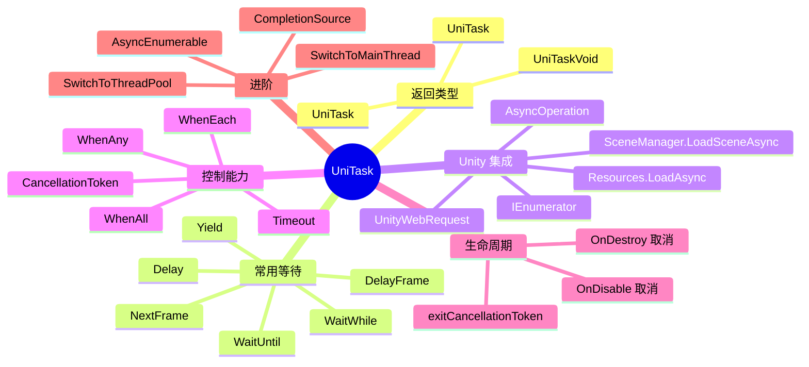
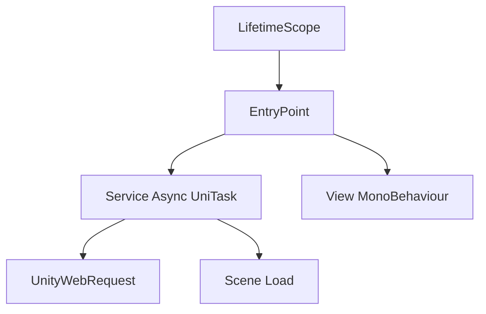

# Unity 中 UniTask 的详细用法

## 1. 文档定位

本文面向 Unity 开发者，目标是把 `Coroutine`、`AsyncOperation`、`UnityWebRequest`、资源加载、取消控制、超时、并发等待等常见异步场景，统一到 UniTask 的写法中。

这份文档会尽量回答三个问题：

1. UniTask 到底解决了什么问题。
2. 在 Unity 项目里应该怎么规范地使用它。
3. 哪些写法容易踩坑，尤其是取消、生命周期、重复 await、`UniTaskVoid` 等问题。

| 项目 | 说明 |
| --- | --- |
| 组件名称 | UniTask |
| 作者 / 组织 | Cysharp |
| 官方定位 | Unity 中高性能、低分配的 async/await 集成方案 |
| 适用范围 | Unity 异步流程、资源加载、网络请求、帧调度、事件等待 |
| 写文参考 | 官方 GitHub README、官方 API 文档、官方 Releases |

## 2. UniTask 是什么

简单说，UniTask 是为 Unity 场景量身定制的 `async/await` 方案。

官方 README 对它的核心描述可以概括为：

| 核心能力 | 说明 |
| --- | --- |
| `struct` 化任务类型 | 用 `UniTask` / `UniTask<T>` 替代较重的 `Task` |
| 支持 await Unity 对象 | `AsyncOperation`、`UnityWebRequestAsyncOperation`、`ResourceRequest` 等 |
| 集成 PlayerLoop | 可以替代大量协程写法 |
| 更贴近 Unity 生命周期 | 支持与 `MonoBehaviour` 的销毁令牌配合 |
| 强调低 GC 和执行效率 | 更适合 Unity 的主线程模型 |

## 3. 为什么不用原生 Task 或纯 Coroutine

### 3.1 三者的直观对比

| 方案 | 优点 | 不足 |
| --- | --- | --- |
| `Coroutine` | Unity 原生、上手简单 | 不返回结果、异常处理弱、组合能力一般 |
| `Task` | .NET 标准模型、生态成熟 | 对 Unity 主线程模型偏重，额外分配较多 |
| `UniTask` | 适配 Unity、支持 await Unity 异步对象、低分配 | 需要团队统一规范，且有自己的使用约束 |

### 3.2 UniTask 适合替代什么

| 原写法 | 推荐 UniTask 写法 |
| --- | --- |
| `yield return null` | `await UniTask.Yield()` 或 `await UniTask.NextFrame()` |
| `yield return new WaitForSeconds()` | `await UniTask.Delay()` |
| `yield return request.SendWebRequest()` | `await request.SendWebRequest()` |
| `yield return SceneManager.LoadSceneAsync()` | `await SceneManager.LoadSceneAsync()` |
| 回调地狱 | `async UniTask` 链式 await |

## 4. 核心概念总览



## 5. 安装方式

根据官方 README，UniTask 最低支持 Unity `2018.4.13f1`，Git URL 安装方式需要支持 git path 参数的 Unity 版本。

### 5.1 通过 Git URL 安装

在 `Packages/manifest.json` 中加入：

```json
{
  "dependencies": {
    "com.cysharp.unitask": "https://github.com/Cysharp/UniTask.git?path=src/UniTask/Assets/Plugins/UniTask"
  }
}
```

如果需要固定版本，可以加 tag：

```json
{
  "dependencies": {
    "com.cysharp.unitask": "https://github.com/Cysharp/UniTask.git?path=src/UniTask/Assets/Plugins/UniTask#2.5.10"
  }
}
```

### 5.2 版本说明

我核对官方 Releases 时，当前 GitHub 页面显示的最新发布版本是 `2.5.10`，发布时间为 `2024-10-03`。  
团队项目建议固定版本，不要直接追最新提交。

## 6. 第一个 UniTask 示例

### 6.1 最小写法

```csharp
using Cysharp.Threading.Tasks;
using UnityEngine;

namespace MyGame
{
    /// <summary>
    /// 演示 UniTask 基础等待的组件。
    /// </summary>
    public sealed class UniTaskHelloSample : MonoBehaviour
    {
        /// <summary>
        /// 组件启动时执行异步流程。
        /// </summary>
        private async UniTaskVoid Start()
        {
            // 等待一帧，模拟最简单的异步切换。
            await UniTask.NextFrame();

            // 输出日志，观察异步代码是否正常执行。
            Debug.Log("Hello UniTask");
        }
    }
}
```

#### 6.1.1 代码讲解

这段代码是 UniTask 最小闭环示例，核心目的是证明两件事：

1. Unity 消息函数里可以直接写 `async`。
2. 可以直接 `await UniTask.NextFrame()` 来替代常见的 `yield return null`。

执行过程如下：

| 步骤 | 对应代码 | 说明 |
| --- | --- | --- |
| 1 | `private async UniTaskVoid Start()` | Unity 调用启动函数，进入异步方法 |
| 2 | `await UniTask.NextFrame();` | 让逻辑挂起到下一帧继续 |
| 3 | `Debug.Log(\"Hello UniTask\")` | 下一帧恢复后输出日志 |

为什么这里返回 `UniTaskVoid` 而不是 `UniTask`？

因为 `Start()` 是 Unity 生命周期入口，不是由上层业务代码主动调用并等待的。  
这种“框架入口型异步函数”正是 `UniTaskVoid` 最常见的使用位置。

### 6.2 为什么能这样写

UniTask 为 Unity 提供了 task-like 返回类型，所以你可以直接写：

| 返回类型 | 适用场景 |
| --- | --- |
| `UniTask` | 无返回值异步流程 |
| `UniTask<T>` | 有返回值异步流程 |
| `UniTaskVoid` | 火并忘式入口，如 `Start`、按钮点击事件 |

## 7. 返回类型详解

### 7.1 UniTask

适用于“只关心完成，不关心返回结果”的异步方法。

```csharp
using Cysharp.Threading.Tasks;

public sealed class LoginService
{
    /// <summary>
    /// 执行登录流程。
    /// </summary>
    public async UniTask LoginAsync()
    {
        // 模拟网络耗时。
        await UniTask.Delay(1000);
    }
}
```

#### 7.1.1 代码讲解

这段 `LoginService` 展示的是最标准的 `UniTask` 业务方法写法。

可以这样理解：

| 代码 | 含义 |
| --- | --- |
| `public async UniTask LoginAsync()` | 定义一个无返回值的异步业务流程 |
| `await UniTask.Delay(1000);` | 异步等待 1 秒，不阻塞主线程 |

这里的关键不在“延迟 1 秒”，而在于返回类型选择：

1. 这个方法是业务流程的一部分。
2. 它可能被上层等待。
3. 它不是 Unity 消息函数，也不是单纯 fire-and-forget。

所以最合适的默认返回类型就是 `UniTask`。

### 7.2 UniTask<T>

适用于“异步完成后需要取结果”的场景。

```csharp
using Cysharp.Threading.Tasks;

public sealed class ConfigService
{
    /// <summary>
    /// 异步加载配置文本。
    /// </summary>
    /// <returns>配置内容。</returns>
    public async UniTask<string> LoadConfigAsync()
    {
        // 模拟异步加载后返回字符串结果。
        await UniTask.Delay(300);
        return "Config Loaded";
    }
}
```

#### 7.2.1 代码讲解

这段代码对应的是“异步完成后需要返回结果”的情况。

执行顺序很简单：

| 步骤 | 对应代码 |
| --- | --- |
| 1 | `await UniTask.Delay(300);` |
| 2 | `return \"Config Loaded\";` |

这里和 `UniTask` 的本质区别就在于：  
调用方不仅关心“它有没有做完”，还关心“做完后拿到什么结果”。

所以判断 `UniTask` 还是 `UniTask<T>`，最直接的方法就是问自己一句：

“这个异步流程完成后，上层要不要拿结果？”

### 7.3 UniTaskVoid

它是“火并忘”模型，不用于被上层等待结果。  
最常见于 Unity 消息函数或事件回调。

```csharp
using Cysharp.Threading.Tasks;
using UnityEngine;

public sealed class ButtonSample : MonoBehaviour
{
    /// <summary>
    /// 按钮点击时执行的异步逻辑。
    /// </summary>
    public async UniTaskVoid OnClickAsync()
    {
        // 异步执行点击逻辑。
        await UniTask.Delay(500);
        Debug.Log("按钮处理完成");
    }
}
```

#### 7.3.1 代码讲解

这段代码展示了 `UniTaskVoid` 的一个合理使用位置：按钮点击事件。

它的特点是：

| 特点 | 说明 |
| --- | --- |
| 由 UI 事件触发 | 不是上层业务链主动 await |
| 只关心执行 | 通常不需要把结果回传给调用者 |
| 更像“异步事件处理器” | 而不是可组合的业务方法 |

执行过程：

1. 按钮点击触发 `OnClickAsync()`。
2. 异步等待 500ms。
3. 等待结束后输出完成日志。

如果这段逻辑后续会被多个地方复用、需要统一错误处理、或者需要上层等待完成，那就不应该继续写成 `UniTaskVoid`，而应该拆成 `UniTask` 业务方法，再由事件入口去调用它。

重要提醒：

| 项目 | 说明 |
| --- | --- |
| `UniTaskVoid` 不适合业务链路核心方法 | 它不便于被上层统一等待和组合 |
| 更推荐的默认返回值 | 业务方法优先写成 `UniTask` / `UniTask<T>` |
| 火并忘调用 | 通常应显式 `.Forget()`，而不是悄悄丢掉 |

## 8. 常见等待操作

### 8.1 下一帧与让出当前帧

```csharp
await UniTask.Yield();
await UniTask.NextFrame();
```

区别可以先这样理解：

| API | 作用 |
| --- | --- |
| `UniTask.Yield()` | 尽快把控制权让回 PlayerLoop，再继续 |
| `UniTask.NextFrame()` | 明确等待到下一帧 |

### 8.2 等待固定更新与帧数

```csharp
await UniTask.WaitForFixedUpdate();
await UniTask.DelayFrame(10);
```

适合：

| 场景 | 写法 |
| --- | --- |
| 物理同步前后 | `WaitForFixedUpdate` |
| 若干帧后再执行 | `DelayFrame` |

### 8.3 等待时间

```csharp
await UniTask.Delay(1000);
await UniTask.Delay(System.TimeSpan.FromSeconds(1));
```

它通常对应协程里的：

```csharp
yield return new WaitForSeconds(1f);
```

### 8.4 条件等待

```csharp
await UniTask.WaitUntil(() => _isReady);
await UniTask.WaitWhile(() => _isLoading);
```

适合：

| 场景 | 说明 |
| --- | --- |
| 等待状态变为 true | `WaitUntil` |
| 等待状态结束 | `WaitWhile` |

### 8.5 值变化等待

```csharp
await UniTask.WaitUntilValueChanged(this, x => x.enabled);
```

这个 API 很适合观察目标对象上的某个值变化。

## 9. 直接 await Unity 异步对象

这是 UniTask 在 Unity 里最有价值的一块。

### 9.1 await AsyncOperation

```csharp
using Cysharp.Threading.Tasks;
using UnityEngine.SceneManagement;

public sealed class SceneLoadService
{
    /// <summary>
    /// 异步加载场景。
    /// </summary>
    /// <param name="sceneName">场景名。</param>
    public async UniTask LoadSceneAsync(string sceneName)
    {
        // 直接等待 Unity 场景加载操作完成。
        await SceneManager.LoadSceneAsync(sceneName);
    }
}
```

#### 9.1.1 代码讲解

这段代码最重要的意义是：**`SceneManager.LoadSceneAsync` 可以直接被 await**。

以前协程写法通常是：

```csharp
yield return SceneManager.LoadSceneAsync(sceneName);
```

现在你可以直接写：

```csharp
await SceneManager.LoadSceneAsync(sceneName);
```

这样带来的最大好处是，场景加载就变成了普通异步流程的一环，可以自然地继续向后写：

1. 加载场景前做准备。
2. await 场景加载。
3. 加载后继续初始化。

整个链路比协程更容易组合。

### 9.2 await Resources.LoadAsync

```csharp
using Cysharp.Threading.Tasks;
using UnityEngine;

public sealed class ResourceService
{
    /// <summary>
    /// 加载预制体资源。
    /// </summary>
    /// <param name="path">资源路径。</param>
    /// <returns>加载到的预制体。</returns>
    public async UniTask<GameObject> LoadPrefabAsync(string path)
    {
        // 直接等待 Resources 异步加载。
        ResourceRequest request = Resources.LoadAsync<GameObject>(path);
        Object loadedObject = await request;
        GameObject prefab = loadedObject as GameObject;
        return prefab;
    }
}
```

#### 9.2.1 代码讲解

这段代码展示的是如何直接 await `ResourceRequest`。

逐步理解：

| 代码 | 作用 |
| --- | --- |
| `ResourceRequest request = Resources.LoadAsync<GameObject>(path);` | 启动 Unity 异步资源加载 |
| `Object loadedObject = await request;` | 等待加载完成并取得结果 |
| `GameObject prefab = loadedObject as GameObject;` | 把 Unity 基类对象转回目标类型 |

为什么这里 `await request` 的结果是 `Object`，而不是直接 `GameObject`？

因为 `ResourceRequest` 底层返回的仍是 Unity 的基础资源对象类型。  
所以很多时候你还需要显式做一次类型转换。

### 9.3 await UnityWebRequest

```csharp
using Cysharp.Threading.Tasks;
using UnityEngine.Networking;

public sealed class HttpService
{
    /// <summary>
    /// 请求文本内容。
    /// </summary>
    /// <param name="url">请求地址。</param>
    /// <returns>返回的文本。</returns>
    public async UniTask<string> GetTextAsync(string url)
    {
        // 构造请求对象并等待发送完成。
        using UnityWebRequest request = UnityWebRequest.Get(url);
        UnityWebRequestAsyncOperation operation = await request.SendWebRequest();
        string text = operation.webRequest.downloadHandler.text;
        return text;
    }
}
```

#### 9.3.1 代码讲解

这段代码是 UniTask 在 Unity 网络层里最典型的应用方式之一。

执行顺序如下：

| 步骤 | 对应代码 | 含义 |
| --- | --- | --- |
| 1 | `using UnityWebRequest request = UnityWebRequest.Get(url);` | 构造请求对象 |
| 2 | `await request.SendWebRequest();` | 异步等待网络请求完成 |
| 3 | `operation.webRequest.downloadHandler.text` | 读取返回文本 |

为什么这里要写 `using`？

因为 `UnityWebRequest` 持有原生资源，使用结束后应及时释放。  
这在频繁请求的项目里尤其重要，否则很容易产生资源占用问题。

### 9.4 await IEnumerator

UniTask 也支持等待协程枚举器，这对老项目迁移很有用。

```csharp
using System.Collections;
using Cysharp.Threading.Tasks;

public sealed class CoroutineBridge
{
    /// <summary>
    /// 等待旧协程完成。
    /// </summary>
    public async UniTask WaitOldCoroutineAsync()
    {
        // 把旧协程逻辑桥接到新的异步流程中。
        await LegacyCoroutine();
    }

    private IEnumerator LegacyCoroutine()
    {
        yield return null;
    }
}
```

## 10. PlayerLoopTiming 详解

UniTask 的大量 API 是构建在自定义 PlayerLoop 上的。  
这意味着你不仅可以“等多久”，还可以“在哪个时机恢复执行”。

### 10.1 典型枚举

| Timing | 大致对应 |
| --- | --- |
| `Initialization` | 初始化阶段 |
| `EarlyUpdate` | 早期更新 |
| `FixedUpdate` | 物理帧 |
| `PreUpdate` | Update 前 |
| `Update` | 主更新 |
| `LateUpdate` | 晚更新 |
| `LastPostLateUpdate` | 一轮末尾 |

### 10.2 显式指定恢复时机

```csharp
using Cysharp.Threading.Tasks;

public sealed class TimingSample
{
    /// <summary>
    /// 在指定 PlayerLoop 时机继续执行。
    /// </summary>
    public async UniTask RunAsync()
    {
        // 指定在 PreLateUpdate 时机恢复。
        await UniTask.Yield(PlayerLoopTiming.PreLateUpdate);
    }
}
```

### 10.3 使用建议

| 场景 | 建议 |
| --- | --- |
| 普通帧切换 | 默认 `Yield()` / `NextFrame()` 即可 |
| 物理相关逻辑 | 优先 `WaitForFixedUpdate()` 或 `FixedUpdate` |
| UI 动画或布局刷新后 | 根据实际情况使用 `LateUpdate` 相关时机 |

## 11. 取消 CancellationToken

取消控制是 UniTask 项目里最重要的规范之一。

### 11.1 基础取消

```csharp
using System.Threading;
using Cysharp.Threading.Tasks;

public sealed class DownloadService
{
    /// <summary>
    /// 支持取消的下载流程。
    /// </summary>
    /// <param name="cancellationToken">取消令牌。</param>
    public async UniTask DownloadAsync(CancellationToken cancellationToken)
    {
        // 把取消令牌一直透传到最底层等待点。
        await UniTask.Delay(3000, cancellationToken: cancellationToken);
    }
}
```

### 11.2 最重要的团队规范

推荐统一遵循：

1. 异步方法最后一个参数写 `CancellationToken cancellationToken = default`。
2. 从入口一路往下透传，不要中途吞掉。
3. 生命周期对象优先使用销毁令牌，而不是手写布尔变量。

### 11.3 与 MonoBehaviour 生命周期绑定

官方 README 明确推荐将异步流程和对象生命周期绑定。  
常见写法如下：

```csharp
using System.Threading;
using Cysharp.Threading.Tasks;
using UnityEngine;

public sealed class AvatarLoader : MonoBehaviour
{
    /// <summary>
    /// 组件启动时加载头像。
    /// </summary>
    private async UniTaskVoid Start()
    {
        // 获取与当前对象销毁生命周期绑定的取消令牌。
        CancellationToken cancellationToken = this.GetCancellationTokenOnDestroy();
        await LoadAvatarAsync(cancellationToken);
    }

    /// <summary>
    /// 加载头像资源。
    /// </summary>
    /// <param name="cancellationToken">销毁取消令牌。</param>
    private async UniTask LoadAvatarAsync(CancellationToken cancellationToken)
    {
        // 对象被销毁时，此等待会被自动取消。
        await UniTask.Delay(2000, cancellationToken: cancellationToken);
    }
}
```

#### 11.3.1 代码讲解

这段代码展示的是 UniTask 项目里非常重要的规范：**把异步流程和对象生命周期绑定**。

关键链路如下：

| 步骤 | 对应代码 | 说明 |
| --- | --- | --- |
| 1 | `CancellationToken cancellationToken = this.GetCancellationTokenOnDestroy();` | 获取与当前对象销毁绑定的取消令牌 |
| 2 | `await LoadAvatarAsync(cancellationToken);` | 把取消令牌传给业务异步方法 |
| 3 | `await UniTask.Delay(..., cancellationToken: cancellationToken);` | 在实际等待点接入取消控制 |

这样写的意义是：

1. 如果对象被销毁，等待会自动取消。
2. 后续逻辑不会继续操作已经不存在的对象。
3. 能明显降低“页面关了但旧请求回来了”的问题。

补充说明：

| Unity 版本情况 | 说明 |
| --- | --- |
| Unity 2022.2 之后 | Unity 原生也提供 `destroyCancellationToken` |
| 更早版本 | 常用 `GetCancellationTokenOnDestroy()` |

### 11.4 OnDisable 取消

有些流程不需要等对象销毁，只要失活就应该停止。  
这时可以自己维护 `CancellationTokenSource`。

```csharp
using System.Threading;
using Cysharp.Threading.Tasks;
using UnityEngine;

public sealed class DisableCancelSample : MonoBehaviour
{
    private CancellationTokenSource _disableCancellationTokenSource;

    /// <summary>
    /// 激活时重新创建失活取消源。
    /// </summary>
    private void OnEnable()
    {
        // 进入激活状态时创建新的取消源。
        _disableCancellationTokenSource = new CancellationTokenSource();
    }

    /// <summary>
    /// 失活时取消当前流程。
    /// </summary>
    private void OnDisable()
    {
        // 对失活相关流程发出取消。
        _disableCancellationTokenSource.Cancel();
        _disableCancellationTokenSource.Dispose();
        _disableCancellationTokenSource = null;
    }

    /// <summary>
    /// 示例异步逻辑。
    /// </summary>
    public async UniTask PlayAsync()
    {
        // 如果组件失活，等待会被取消。
        await UniTask.Delay(5000, cancellationToken: _disableCancellationTokenSource.Token);
    }
}
```

## 12. 异常与取消异常处理

### 12.1 标准写法

```csharp
using System;
using System.Threading;
using Cysharp.Threading.Tasks;

public sealed class ExceptionSample
{
    /// <summary>
    /// 演示取消异常处理。
    /// </summary>
    public async UniTask RunAsync(CancellationToken cancellationToken)
    {
        try
        {
            // 等待一个可取消的异步过程。
            await UniTask.Delay(3000, cancellationToken: cancellationToken);
        }
        catch (OperationCanceledException)
        {
            // 取消通常属于预期行为，应单独处理。
        }
        catch (Exception exception)
        {
            // 非取消异常属于真正错误，应记录或继续抛出。
            UnityEngine.Debug.LogException(exception);
            throw;
        }
    }
}
```

#### 13.1.1 代码讲解

这段代码演示的是“超时也是一种取消”。

执行过程：

| 步骤 | 对应代码 |
| --- | --- |
| 1 | `new CancellationTokenSource()` |
| 2 | `CancelAfterSlim(TimeSpan.FromSeconds(5))` |
| 3 | `await UniTask.Delay(10000, cancellationToken: timeoutCancellationTokenSource.Token)` |
| 4 | 超时后抛出 `OperationCanceledException` |

为什么官方更推荐 `CancelAfterSlim`？

因为它是按 Unity / UniTask 的运行模型实现的超时机制，更适合当前环境。  
它的语义可以理解为：“如果 5 秒内还没完成，就主动取消这个异步流程”。

### 12.2 为什么取消要单独处理

| 原因 | 说明 |
| --- | --- |
| 取消通常不是错误 | 它往往是用户退出、对象销毁、超时导致 |
| 业务语义不同 | 取消通常不应计入真正异常统计 |
| 代码意图更清晰 | 能明确区分“失败”和“中止” |

### 12.3 SuppressCancellationThrow

官方 README 说明，抛 `OperationCanceledException` 会有一定开销。  
如果你对性能非常敏感，可以在“最源头”的等待处使用抑制抛错。

```csharp
using Cysharp.Threading.Tasks;
using System.Threading;

public sealed class CancelSuppressSample
{
    /// <summary>
    /// 演示取消不抛异常的写法。
    /// </summary>
    public async UniTask<bool> RunAsync(CancellationToken cancellationToken)
    {
        // 直接在源头等待点抑制取消异常。
        (bool isCanceled, AsyncUnit _) = await UniTask.Delay(60, cancellationToken: cancellationToken)
            .SuppressCancellationThrow();

        return isCanceled;
    }
}
```

#### 14.1.1 代码讲解

这段代码的重点是：**任务先启动，再一起等待，才能真正并发**。

这里要注意顺序：

| 写法 | 含义 |
| --- | --- |
| `UniTask<string> taskA = LoadAsync(\"A\");` | 先拿到任务句柄 |
| `UniTask<string> taskB = LoadAsync(\"B\");` | 再拿第二个任务句柄 |
| `UniTask<string> taskC = LoadAsync(\"C\");` | 再拿第三个任务句柄 |
| `await UniTask.WhenAll(taskA, taskB, taskC);` | 一次性等待全部完成 |

如果你写成：

1. `await LoadAsync("A")`
2. `await LoadAsync("B")`
3. `await LoadAsync("C")`

那它们就是串行，不是并发。

所以 `WhenAll` 的本质价值是：把多个独立异步流程收敛成一个统一等待点。

注意：

| 项目 | 说明 |
| --- | --- |
| 适用位置 | 最源头等待点 |
| 不建议滥用 | 会改变上层对异常的处理模型 |
| 更适合性能敏感路径 | 例如高频轮询、频繁取消逻辑 |

## 13. 超时处理

### 13.1 不要直接依赖标准 CancelAfter

官方 README 提醒，在 Unity 里不推荐直接依赖标准 `CancellationTokenSource.CancelAfter`，因为它依赖线程计时器。  
UniTask 推荐使用 `CancelAfterSlim`。

```csharp
using System;
using System.Threading;
using Cysharp.Threading.Tasks;

public sealed class TimeoutSample
{
    /// <summary>
    /// 演示超时取消。
    /// </summary>
    public async UniTask RunAsync()
    {
        // 创建一个专门用于超时的取消源。
        CancellationTokenSource timeoutCancellationTokenSource = new CancellationTokenSource();
        timeoutCancellationTokenSource.CancelAfterSlim(TimeSpan.FromSeconds(5));

        try
        {
            // 超过 5 秒未完成时会被取消。
            await UniTask.Delay(10000, cancellationToken: timeoutCancellationTokenSource.Token);
        }
        catch (OperationCanceledException)
        {
            // 这里可视为超时处理。
        }
        finally
        {
            timeoutCancellationTokenSource.Dispose();
        }
    }
}
```

### 13.2 联合多个取消来源

```csharp
using System;
using System.Threading;
using Cysharp.Threading.Tasks;

public sealed class LinkedCancelSample
{
    /// <summary>
    /// 组合用户取消和超时取消。
    /// </summary>
    public async UniTask RunAsync(CancellationToken userCancellationToken)
    {
        // 创建超时取消源。
        CancellationTokenSource timeoutCancellationTokenSource = new CancellationTokenSource();
        timeoutCancellationTokenSource.CancelAfterSlim(TimeSpan.FromSeconds(5));

        // 合并多个取消来源，任一触发都能终止流程。
        using CancellationTokenSource linkedCancellationTokenSource =
            CancellationTokenSource.CreateLinkedTokenSource(
                userCancellationToken,
                timeoutCancellationTokenSource.Token);

        await UniTask.Delay(10000, cancellationToken: linkedCancellationTokenSource.Token);
    }
}
```

## 14. 并发等待

### 14.1 UniTask.WhenAll

```csharp
using Cysharp.Threading.Tasks;

public sealed class ParallelLoadService
{
    /// <summary>
    /// 并行加载多个资源。
    /// </summary>
    public async UniTask RunAsync()
    {
        UniTask<string> taskA = LoadAsync("A");
        UniTask<string> taskB = LoadAsync("B");
        UniTask<string> taskC = LoadAsync("C");

        // 并行等待三个任务完成。
        (string a, string b, string c) = await UniTask.WhenAll(taskA, taskB, taskC);
    }

    private async UniTask<string> LoadAsync(string id)
    {
        // 模拟异步资源加载。
        await UniTask.Delay(300);
        return id;
    }
}
```

#### 17.1.1 代码讲解

这段代码展示的是线程切换的最小用法。

执行顺序：

| 步骤 | 对应代码 | 说明 |
| --- | --- | --- |
| 1 | `await UniTask.SwitchToThreadPool();` | 切到后台线程 |
| 2 | `int result = 1 + 2 + 3;` | 在后台线程做纯计算 |
| 3 | `await UniTask.SwitchToMainThread();` | 切回 Unity 主线程 |
| 4 | `return result;` | 把结果返回给上层 |

它的核心价值不是“线程很高级”，而是帮助你明确一条边界：

1. 纯数据计算可以放后台。
2. Unity API 操作要回主线程。

这条边界一旦被打破，最容易出现的就是真机随机异常和难复现 bug。

官方 README 中还提到，元组本身也可以直接 await：

```csharp
(string a, string b, string c) = await (taskA, taskB, taskC);
```

### 14.2 WhenAny 与 WhenEach

| API | 作用 |
| --- | --- |
| `UniTask.WhenAny` | 谁先完成就先返回 |
| `UniTask.WhenEach` | 逐个消费多个异步结果 |

如果你的需求是“全部完成后统一处理”，用 `WhenAll` 最直观。  
如果你的需求是“谁先回来先用谁”，再考虑 `WhenAny` 或 `WhenEach`。

## 15. 重复 await 的限制

这是 UniTask 新手非常容易踩的坑。

官方 README 明确指出，`UniTask` 不能像普通 `Task` 那样被随意多次 await。  
它和 `ValueTask` 类似，重复消费同一个实例会有未定义行为，甚至直接抛异常。

### 15.1 错误示例

```csharp
using Cysharp.Threading.Tasks;

public sealed class MultipleAwaitWrongSample
{
    /// <summary>
    /// 错误示例：同一个 UniTask 被重复等待。
    /// </summary>
    public async UniTask RunAsync()
    {
        // 创建一个任务实例。
        UniTask delayTask = UniTask.DelayFrame(10);

        // 第一次等待是合法的。
        await delayTask;

        // 第二次等待同一个实例属于错误用法。
        await delayTask;
    }
}
```

#### 18.1.1 代码讲解

这段代码解决的是“旧回调接口怎么桥接成 `await` 风格”。

你可以把 `UniTaskCompletionSource<int>` 理解成一个“手动完成的异步承诺对象”。

执行流程如下：

| 步骤 | 对应代码 |
| --- | --- |
| 1 | `new UniTaskCompletionSource<int>()` |
| 2 | 调用旧式回调接口 `SimulateCallback(...)` |
| 3 | 成功时 `TrySetResult(value)` |
| 4 | 失败时 `TrySetException(exception)` |
| 5 | 返回 `uniTaskCompletionSource.Task` 给外部 await |

这样一来，哪怕底层 SDK 还是古老的 success/error 回调模式，你的上层业务也可以统一写成：

```csharp
int result = await RequestAsync();
```

这对旧项目渐进式迁移非常有价值。

### 15.2 正确思路

| 需求 | 推荐做法 |
| --- | --- |
| 每次都重新执行 | 每次重新调用异步方法 |
| 需要缓存结果并多次取用 | 使用 `Preserve()` 或更高层缓存 |
| 多个调用方等待同一完成事件 | 使用 `UniTaskCompletionSource` |

## 16. Forget 与火并忘

### 16.1 正常写法

```csharp
using Cysharp.Threading.Tasks;

public sealed class FireAndForgetSample
{
    /// <summary>
    /// 启动一个不等待结果的异步流程。
    /// </summary>
    public void StartProcess()
    {
        // 显式声明这是火并忘调用，避免误以为遗漏 await。
        RunAsync().Forget();
    }

    private async UniTask RunAsync()
    {
        // 模拟后台流程。
        await UniTask.Delay(1000);
    }
}
```

### 16.2 使用建议

| 建议 | 说明 |
| --- | --- |
| 能 await 就 await | 业务主链路不要轻易 Forget |
| Forget 仅用于确实不关心返回值的流程 | 如动画触发、打点、局部预热 |
| 异常要可观察 | 火并忘流程不能变成“静默失败” |

## 17. 线程切换

UniTask 支持切到线程池，再切回主线程。

### 17.1 基础写法

```csharp
using Cysharp.Threading.Tasks;

public sealed class ThreadSwitchSample
{
    /// <summary>
    /// 在后台线程执行计算后切回主线程。
    /// </summary>
    public async UniTask<int> CalculateAsync()
    {
        // 切换到线程池做纯计算逻辑。
        await UniTask.SwitchToThreadPool();

        int result = 1 + 2 + 3;

        // 切回 Unity 主线程，便于安全访问 Unity API。
        await UniTask.SwitchToMainThread();

        return result;
    }
}
```

### 17.2 必须注意的规则

| 规则 | 说明 |
| --- | --- |
| 切到线程池后不要访问 Unity API | Unity 大多数 API 不是线程安全的 |
| 后台线程适合做纯计算或纯数据处理 | 解析、排序、文本处理、解压等 |
| 回到主线程后再碰场景对象 | 例如 `GameObject`、`Transform`、UI |

## 18. 回调转 UniTask

当项目里还存在旧 SDK 或旧接口时，常常需要把回调风格包成 UniTask。  
官方推荐使用 `UniTaskCompletionSource<T>`。

### 18.1 基本封装

```csharp
using Cysharp.Threading.Tasks;

public sealed class CallbackBridge
{
    /// <summary>
    /// 把回调风格接口封装为 UniTask。
    /// </summary>
    /// <returns>异步结果。</returns>
    public UniTask<int> RequestAsync()
    {
        // 创建轻量任务完成源。
        UniTaskCompletionSource<int> uniTaskCompletionSource = new UniTaskCompletionSource<int>();

        // 这里模拟旧式回调。
        SimulateCallback(
            onSuccess: value => uniTaskCompletionSource.TrySetResult(value),
            onError: exception => uniTaskCompletionSource.TrySetException(exception));

        return uniTaskCompletionSource.Task;
    }

    private void SimulateCallback(System.Action<int> onSuccess, System.Action<System.Exception> onError)
    {
        // 示例中直接返回成功结果。
        onSuccess.Invoke(100);
    }
}
```

## 19. Async Enumerable

UniTask 还提供了 `UniTaskAsyncEnumerable`，可以把“每帧一次”“定时器流”“值变化流”等看成异步流。

### 19.1 EveryUpdate 示例

```csharp
using System.Threading;
using Cysharp.Threading.Tasks;
using UnityEngine;

public sealed class EveryUpdateSample : MonoBehaviour
{
    /// <summary>
    /// 组件启动时开始每帧观察。
    /// </summary>
    private async UniTaskVoid Start()
    {
        // 绑定销毁取消，避免对象销毁后继续执行。
        CancellationToken cancellationToken = this.GetCancellationTokenOnDestroy();

        await UniTaskAsyncEnumerable.EveryUpdate()
            .ForEachAsync(_ =>
            {
                // 每帧输出当前帧号。
                Debug.Log(Time.frameCount);
            }, cancellationToken);
    }
}
```

#### 19.1.1 代码讲解

这段代码展示的是“把每帧更新看成一个异步流”。

核心流程：

| 步骤 | 对应代码 |
| --- | --- |
| 1 | `UniTaskAsyncEnumerable.EveryUpdate()` |
| 2 | `.ForEachAsync(...)` |
| 3 | `Debug.Log(Time.frameCount)` |

它和传统 `Update()` 最大的区别是：  
你现在可以把“每帧事件”纳入同一套异步组合模型中，而不是只能写在组件生命周期函数里。

这在做流式输入处理、节流、防抖、异步观察时会非常顺手。

### 19.2 适用场景

| 场景 | 是否适合 |
| --- | --- |
| 连续监听某个值变化 | 很适合 |
| 定时轮询 | 适合 |
| UI 输入流式处理 | 适合 |
| 简单的一次性等待 | 没必要，用普通 `await` 更清晰 |

## 20. 与协程的迁移对照

### 20.1 常见替换表

| Coroutine 写法 | UniTask 写法 |
| --- | --- |
| `yield return null;` | `await UniTask.Yield();` |
| `yield return new WaitForSeconds(1f);` | `await UniTask.Delay(TimeSpan.FromSeconds(1));` |
| `yield return request.SendWebRequest();` | `await request.SendWebRequest();` |
| `yield return SceneManager.LoadSceneAsync(name);` | `await SceneManager.LoadSceneAsync(name);` |
| `StartCoroutine(Foo());` | `FooAsync().Forget();` 或 `await FooAsync();` |

### 20.2 一个完整迁移示例

协程版本：

```csharp
private IEnumerator LoadRoutine()
{
    yield return new WaitForSeconds(1f);
    yield return SceneManager.LoadSceneAsync("Battle");
}
```

UniTask 版本：

```csharp
using System;
using Cysharp.Threading.Tasks;
using UnityEngine.SceneManagement;

public sealed class LoadFlow
{
    /// <summary>
    /// 加载战斗场景。
    /// </summary>
    public async UniTask LoadBattleAsync()
    {
        // 先等待一秒，再加载场景。
        await UniTask.Delay(TimeSpan.FromSeconds(1));
        await SceneManager.LoadSceneAsync("Battle");
    }
}
```

## 21. 与 VContainer 配合使用

如果项目同时使用 VContainer，推荐把 UniTask 流程写在普通 C# 类或 EntryPoint 中，而不是把所有异步逻辑都塞进 `MonoBehaviour`。

### 21.1 推荐结构



### 21.2 示例

```csharp
using System.Threading;
using Cysharp.Threading.Tasks;
using VContainer.Unity;

public sealed class BootstrapEntryPoint : IAsyncStartable
{
    private readonly LoginService _loginService;

    public BootstrapEntryPoint(LoginService loginService)
    {
        // 注入业务服务。
        _loginService = loginService;
    }

    /// <summary>
    /// 容器启动时执行异步初始化。
    /// </summary>
    /// <param name="cancellation">作用域取消令牌。</param>
    public async UniTask StartAsync(CancellationToken cancellation)
    {
        // 把作用域取消令牌直接透传给业务服务。
        await _loginService.LoginAsync(cancellation);
    }
}
```

#### 21.2.1 代码讲解

这段代码展示的是 UniTask 和 VContainer 最自然的组合方式：  
**容器负责入口，UniTask 负责异步链路。**

执行链如下：

| 步骤 | 对应代码 |
| --- | --- |
| 1 | `BootstrapEntryPoint` 通过构造函数拿到 `LoginService` |
| 2 | VContainer 在启动时调用 `StartAsync(CancellationToken cancellation)` |
| 3 | 入口把作用域取消令牌传给 `_loginService.LoginAsync(cancellation)` |

这里最重要的设计价值是：

1. 入口层负责流程编排。
2. 业务服务负责具体异步逻辑。
3. 生命周期取消从作用域一路透传到底层。

这样写出来的启动流程，通常会比“所有逻辑都写在 MonoBehaviour.Start 里”清晰很多。

### 21.3 推荐做法

| 建议 | 说明 |
| --- | --- |
| EntryPoint 负责启动流程 | 启动链路集中可控 |
| Service 承载异步业务逻辑 | 便于测试与复用 |
| View 只负责展示和事件转发 | 不要堆积复杂流程控制 |
| CancellationToken 从作用域往下透传 | 生命周期更清晰 |

## 22. 常见误区与踩坑

### 22.1 到处使用 UniTaskVoid

这是最典型的问题之一。  
如果团队把所有方法都写成 `UniTaskVoid`，后果通常是：

| 问题 | 说明 |
| --- | --- |
| 上层无法等待完成 | 流程组合困难 |
| 异常传播难统一 | 问题更隐蔽 |
| 代码越来越像“异步版事件回调” | 失去可维护性 |

### 22.2 不传 CancellationToken

如果异步方法不接收取消令牌，最容易出现：

| 问题 | 说明 |
| --- | --- |
| 场景退出后任务仍继续 | 容易空引用或越界访问 |
| UI 已关闭仍回调旧逻辑 | 出现状态污染 |
| 无法优雅中止网络与加载流程 | 资源浪费 |

### 22.3 在线程池访问 Unity API

这是很危险的误用。  
切到 `ThreadPool` 后，应该只做纯 C# 数据处理，不要直接动 `GameObject`、`Transform`、UI、资源对象。

### 22.4 忘记观察异常

火并忘流程、按钮事件、局部预加载，都很容易把异常藏起来。  
如果异常不可见，线上问题会非常难查。

### 22.5 把 UniTask 当成“所有地方都必须异步”

不是所有逻辑都值得异步化。  
如果某个函数只是普通字段赋值或同步计算，硬改成 `UniTask` 只会增加阅读成本。

## 23. 推荐实践清单

### 23.1 团队规范建议

| 规则 | 建议 |
| --- | --- |
| 返回类型默认 | 优先 `UniTask` / `UniTask<T>` |
| 取消参数位置 | 最后一个参数写 `CancellationToken cancellationToken = default` |
| 生命周期绑定 | `MonoBehaviour` 优先使用销毁令牌 |
| 并发 | 多任务并发优先 `WhenAll` |
| 火并忘 | 明确写 `.Forget()` |
| 线程切换 | 后台线程不访问 Unity API |

### 23.2 项目落地建议

| 模块 | 推荐模式 |
| --- | --- |
| 网络层 | `UnityWebRequest` + `await` + 超时 + 取消 |
| 资源层 | `Resources.LoadAsync` / Addressables 桥接到 UniTask |
| 启动流程 | `Bootstrap` + `WhenAll` + 可取消 |
| UI 流程 | 打开页面、等待按钮、关闭页面都走异步链 |
| 场景切换 | `LoadSceneAsync` + 生命周期取消 |

## 24. 一份简化版最佳实践模板

```csharp
using System;
using System.Threading;
using Cysharp.Threading.Tasks;
using UnityEngine;
using UnityEngine.Networking;

namespace MyGame
{
    /// <summary>
    /// 网络请求服务示例。
    /// </summary>
    public sealed class NetworkService
    {
        /// <summary>
        /// 获取文本内容，并支持超时与外部取消。
        /// </summary>
        /// <param name="url">请求地址。</param>
        /// <param name="cancellationToken">外部取消令牌。</param>
        /// <returns>响应文本。</returns>
        public async UniTask<string> GetTextAsync(string url, CancellationToken cancellationToken = default)
        {
            // 创建超时取消源。
            using CancellationTokenSource timeoutCancellationTokenSource = new CancellationTokenSource();
            timeoutCancellationTokenSource.CancelAfterSlim(TimeSpan.FromSeconds(5));

            // 合并超时和外部取消。
            using CancellationTokenSource linkedCancellationTokenSource =
                CancellationTokenSource.CreateLinkedTokenSource(
                    cancellationToken,
                    timeoutCancellationTokenSource.Token);

            try
            {
                // 创建并发送网络请求。
                using UnityWebRequest request = UnityWebRequest.Get(url);
                UnityWebRequestAsyncOperation operation =
                    await request.SendWebRequest().WithCancellation(linkedCancellationTokenSource.Token);

                // 返回请求文本结果。
                return operation.webRequest.downloadHandler.text;
            }
            catch (OperationCanceledException)
            {
                // 取消由外层决定如何处理，这里继续向上抛出。
                throw;
            }
            catch (Exception exception)
            {
                // 记录实际错误，便于排查问题。
                Debug.LogException(exception);
                throw;
            }
        }
    }
}
```

#### 24.1.1 代码讲解

这段代码是整篇文档里最贴近真实项目的一段“综合范式代码”。

它把几个关键能力串在了一起：

| 能力 | 对应代码 |
| --- | --- |
| 外部取消 | `CancellationToken cancellationToken = default` |
| 超时取消 | `timeoutCancellationTokenSource.CancelAfterSlim(...)` |
| 联合取消 | `CreateLinkedTokenSource(...)` |
| 请求等待 | `await request.SendWebRequest().WithCancellation(...)` |
| 异常分流 | `OperationCanceledException` 与普通 `Exception` 分开处理 |

可以把整个执行过程理解成：

1. 先创建超时令牌。
2. 再把“超时取消”和“外部取消”合并成一个总令牌。
3. 用这个总令牌去等待网络请求。
4. 请求成功就返回文本。
5. 取消就上抛取消异常。
6. 真正错误就记录日志再上抛。

这类代码很适合作为团队模板，因为它基本把 UniTask 项目里最重要的稳定性点都覆盖到了。

## 25. 总结

如果只记几个关键点，可以先记下面这些：

1. 默认业务异步方法优先用 `UniTask` / `UniTask<T>`，不要滥用 `UniTaskVoid`。
2. `CancellationToken` 要从入口一路透传到底层。
3. `MonoBehaviour` 的异步逻辑要绑定生命周期，优先使用销毁取消令牌。
4. 同一个 `UniTask` 不要重复 await。
5. 切到线程池后不要直接访问 Unity API。

UniTask 真正的价值，不只是“把协程换个写法”，而是把 Unity 中原本分散的异步行为统一成更可组合、更可测试、更易维护的流程模型。

## 26. 参考资料

以下资料用于本文整理与核对：

| 类型 | 链接 |
| --- | --- |
| 官方 GitHub 仓库 | [https://github.com/Cysharp/UniTask](https://github.com/Cysharp/UniTask) |
| 官方 API 文档首页 | [https://cysharp.github.io/UniTask/](https://cysharp.github.io/UniTask/) |
| GitHub Releases | [https://github.com/Cysharp/UniTask/releases](https://github.com/Cysharp/UniTask/releases) |
