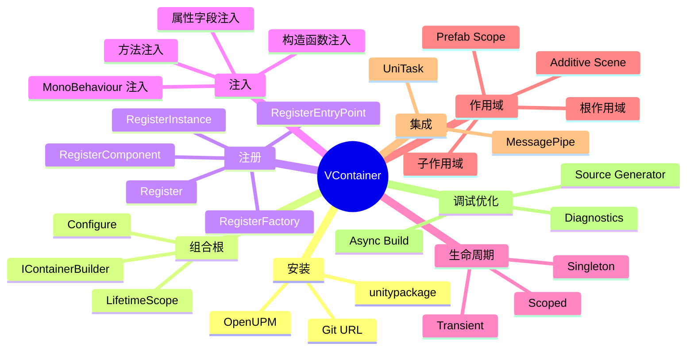
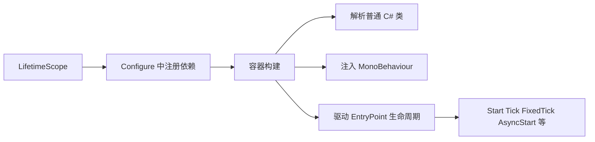
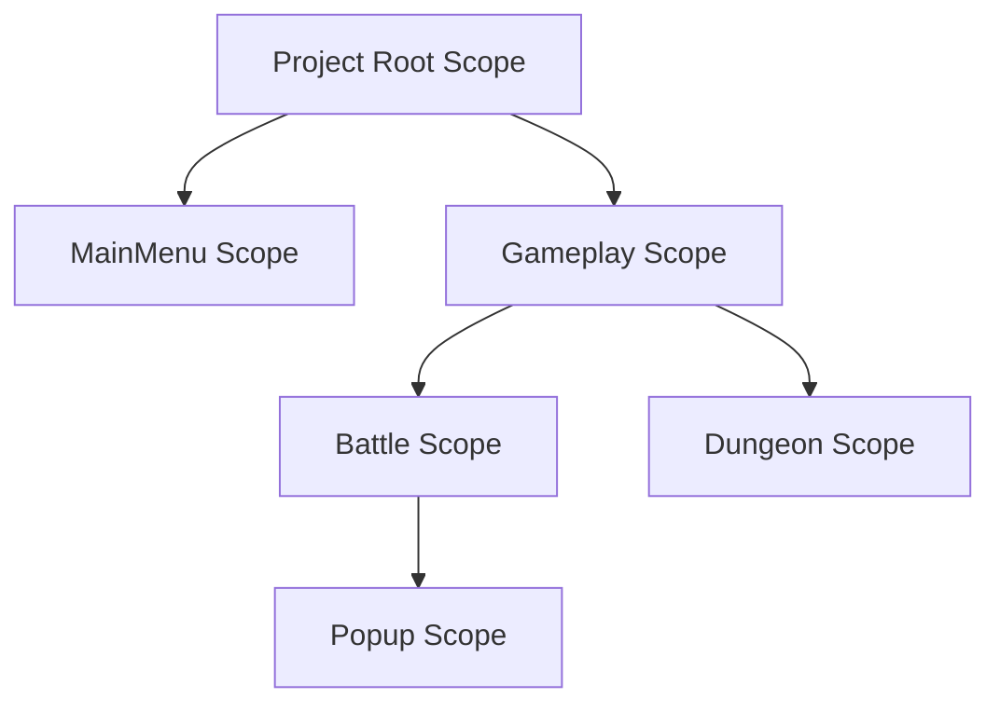
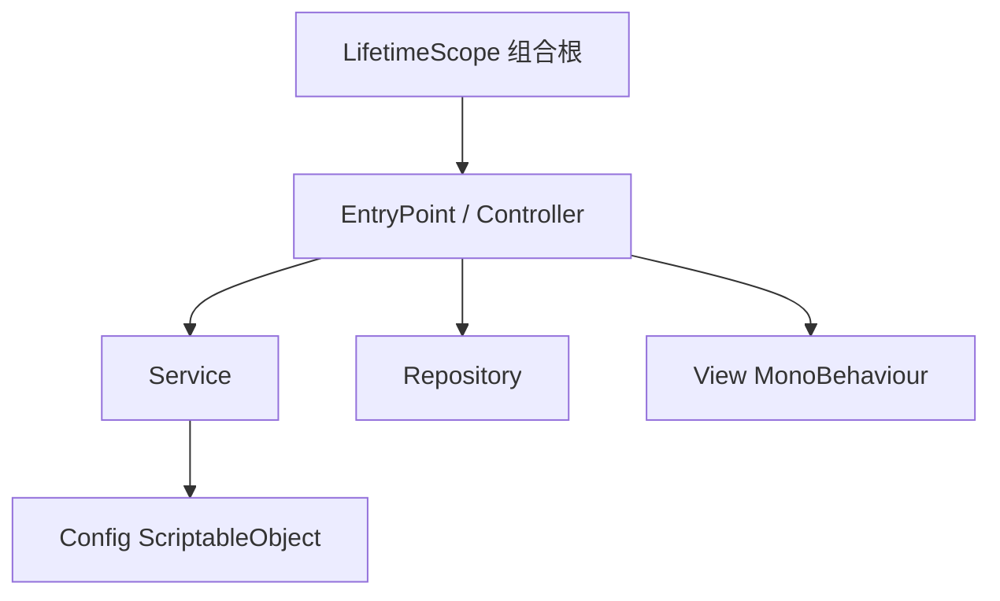

# Unity 中 VContainer 的详细用法

## 1. 文档定位

本文面向已经在使用 Unity，准备把项目从“脚本直接互相引用”升级到“依赖注入 + 组合根”方式的开发者。  
重点不是只讲 API，而是讲清楚 VContainer 在 Unity 项目中的推荐落地方式、常见误区，以及它和场景、Prefab、异步加载之间的关系。

| 项目 | 说明 |
| --- | --- |
| 组件名称 | VContainer |
| 类型 | Unity 依赖注入框架 |
| 官方定位 | 高性能、低 GC、强调简单透明的 DI 容器 |
| 适用场景 | 中大型 Unity 项目、需要解耦业务逻辑、便于测试与分层的项目 |
| 写文时参考 | 官方文档站点 + 官方 GitHub 仓库 / Releases |

## 2. VContainer 解决了什么问题

Unity 里最常见的耦合问题通常长这样：

1. `MonoBehaviour` 同时负责输入、流程控制、业务逻辑、数据读取、UI 更新。
2. 组件之间通过 `FindObjectOfType`、拖引用、单例静态类互相访问。
3. 场景一多以后，初始化顺序、对象生命周期、测试替换都会越来越难控。

VContainer 的核心价值是把这些职责拆开：

| 职责 | 推荐承载对象 |
| --- | --- |
| 组合与装配 | `LifetimeScope` |
| 业务服务 | 普通 C# 类 |
| 流程编排 | EntryPoint 普通 C# 类 |
| 表现层 | `MonoBehaviour` / UI 组件 |
| 配置数据 | `ScriptableObject` |

这样做的直接收益：

| 收益 | 说明 |
| --- | --- |
| 解耦 | 类只依赖接口或抽象，不依赖场景查找 |
| 可测试 | 普通 C# 类可单独构造和测试 |
| 生命周期清晰 | Singleton、Scoped、Transient 语义明确 |
| 适配 Unity | 支持 `MonoBehaviour` 注入、场景作用域、Prefab、异步加载 |
| 性能更稳 | 官方强调其 Resolve 性能和低 GC 表现 |

## 3. 核心概念总览



### 3.1 你可以先这样理解 VContainer



### 3.2 最重要的三个对象

| 对象 | 作用 | 你通常在哪里接触 |
| --- | --- | --- |
| `LifetimeScope` | 一个 Unity 场景/节点上的组合根 | 场景根对象、Prefab Scope |
| `IContainerBuilder` | 注册依赖的入口 | `Configure` 方法里 |
| `IObjectResolver` | 运行时解析和实例化对象 | Factory、回调、动态创建对象时 |

## 4. 安装方式

官方文档说明 VContainer 需要 Unity 2018.4 或更高版本；Source Generator 需要 Unity 2021.3 或更高版本。

### 4.1 OpenUPM 安装

```bash
openupm add jp.hadashikick.vcontainer
```

### 4.2 Git URL 安装

在 `Packages/manifest.json` 中加入：

```json
{
  "dependencies": {
    "jp.hadashikick.vcontainer": "https://github.com/hadashiA/VContainer.git?path=VContainer/Assets/VContainer#1.17.0"
  }
}
```

### 4.3 手动导入

也可以从官方 Releases 下载 `.unitypackage` 后导入。

### 4.4 版本建议

| 项目情况 | 建议 |
| --- | --- |
| 团队项目 | 优先固定版本，不要直接跟随最新提交 |
| 新项目 | 优先使用官方 Releases 当前稳定版本 |
| 老项目升级 | 先验证 `RegisterComponentInHierarchy`、EntryPoint、Source Generator 行为 |

## 5. 最小可运行示例

先看一套最小结构，后面所有细节都围绕它展开。

### 5.1 服务类

```csharp
namespace MyGame
{
    /// <summary>
    /// 打印问候语的服务。
    /// </summary>
    public sealed class HelloWorldService
    {
        /// <summary>
        /// 输出日志。
        /// </summary>
        public void Hello()
        {
            // 输出一条简单日志，便于验证依赖是否已成功装配。
            UnityEngine.Debug.Log("Hello VContainer");
        }
    }
}
```

#### 5.1.1 代码讲解

这段 `HelloWorldService` 是最典型的“纯业务类”示例。  
它没有继承 `MonoBehaviour`，也不依赖场景对象，这正是依赖注入最喜欢的对象形态。

可以这样理解：

| 元素 | 作用 |
| --- | --- |
| `public sealed class HelloWorldService` | 定义一个普通 C# 服务类 |
| `public void Hello()` | 暴露一个业务方法供外部调用 |
| `Debug.Log(...)` | 用最简单的方式验证依赖是否被成功创建和调用 |

这段代码的教学重点不在功能，而在于角色定位：

1. 它是“被注入”的对象。
2. 它不负责注册自己。
3. 它也不负责决定何时被调用。
4. 这些工作都交给组合根和入口类处理。

### 5.2 EntryPoint

```csharp
using VContainer.Unity;

namespace MyGame
{
    /// <summary>
    /// 作为业务入口的纯 C# 类。
    /// </summary>
    public sealed class GameEntryPoint : IStartable
    {
        private readonly HelloWorldService _helloWorldService;

        /// <summary>
        /// 构造函数注入服务依赖。
        /// </summary>
        /// <param name="helloWorldService">问候服务。</param>
        public GameEntryPoint(HelloWorldService helloWorldService)
        {
            // 缓存依赖，供启动阶段使用。
            _helloWorldService = helloWorldService;
        }

        /// <summary>
        /// 容器启动后执行一次。
        /// </summary>
        void IStartable.Start()
        {
            // 在启动节点调用服务逻辑。
            _helloWorldService.Hello();
        }
    }
}
```

#### 5.2.1 代码讲解

这段代码展示了 VContainer 里非常重要的一个概念：**用纯 C# 类承接 Unity 生命周期入口**。

执行顺序可以按下面理解：

| 顺序 | 对应代码 | 说明 |
| --- | --- | --- |
| 1 | `public GameEntryPoint(HelloWorldService helloWorldService)` | 构造函数声明依赖 |
| 2 | `_helloWorldService = helloWorldService;` | 容器在创建对象时自动把服务塞进来 |
| 3 | `void IStartable.Start()` | 容器构建完成后，自动调用启动入口 |
| 4 | `_helloWorldService.Hello();` | 真正执行业务逻辑 |

这里最值得记住的是：`GameEntryPoint` 自己没有去 `new HelloWorldService()`，也没有调用 `Resolve()`。  
它只负责声明“我需要什么”，至于“谁来给我”，由容器负责。

这就是依赖注入最核心的设计思想之一：

1. 类只声明依赖。
2. 类不关心依赖的创建细节。
3. 类不直接耦合对象构建过程。

### 5.3 组合根

```csharp
using VContainer;
using VContainer.Unity;

namespace MyGame
{
    /// <summary>
    /// 游戏主场景的组合根。
    /// </summary>
    public sealed class GameLifetimeScope : LifetimeScope
    {
        /// <summary>
        /// 注册当前场景所需依赖。
        /// </summary>
        /// <param name="builder">容器构建器。</param>
        protected override void Configure(IContainerBuilder builder)
        {
            #region 注册基础服务
            // 注册业务服务为单例，整个作用域共享同一个实例。
            builder.Register<HelloWorldService>(Lifetime.Singleton);
            #endregion

            #region 注册启动入口
            // 注册入口类，使其自动接入 Unity 的 PlayerLoop 生命周期。
            builder.RegisterEntryPoint<GameEntryPoint>();
            #endregion
        }
    }
}
```

#### 5.3.1 代码讲解

这段 `GameLifetimeScope` 是整个最小示例真正的“装配中心”。

它做了两件事：

| 代码 | 含义 |
| --- | --- |
| `builder.Register<HelloWorldService>(Lifetime.Singleton);` | 告诉容器如何创建并管理服务实例 |
| `builder.RegisterEntryPoint<GameEntryPoint>();` | 告诉容器启动后应该创建哪个入口对象 |

`Configure(IContainerBuilder builder)` 的角色可以理解为“容器初始化脚本”：

1. 所有依赖注册都集中在这里。
2. 运行时对象创建顺序由容器根据依赖关系自动推导。
3. 项目里哪个作用域需要哪些对象，也在这里集中体现。

为什么这里要把 `HelloWorldService` 注册成 `Singleton`？

因为在这个最小示例中，它只是一个简单服务，整个作用域里共用一份实例最容易理解。  
但在真实项目里，你应该根据业务语义选择 `Singleton`、`Scoped` 或 `Transient`，而不是看到服务就默认单例。

### 5.4 运行步骤

1. 在场景中创建一个空物体，例如 `GameLifetimeScope`。
2. 挂载上面的 `GameLifetimeScope` 组件。
3. 运行场景。
4. 容器构建后，`GameEntryPoint` 会被创建，`HelloWorldService` 会自动注入并执行。

## 6. 注入方式详解

VContainer 支持构造函数注入、方法注入、属性/字段注入。  
推荐优先级通常是：构造函数注入 > 方法注入 > 属性/字段注入。

### 6.1 构造函数注入

这是最推荐的方式，适合普通 C# 类。

```csharp
public interface IScoreService
{
    void AddScore(int value);
}

public sealed class BattlePresenter
{
    private readonly IScoreService _scoreService;
    private readonly BattleView _battleView;

    public BattlePresenter(IScoreService scoreService, BattleView battleView)
    {
        // 构造阶段明确声明所有必需依赖。
        _scoreService = scoreService;
        _battleView = battleView;
    }
}
```

#### 6.1.1 代码讲解

这段代码是构造函数注入最标准的样子。

`BattlePresenter` 的依赖关系一眼就能看出来：

| 字段 | 来自哪里 | 作用 |
| --- | --- | --- |
| `_scoreService` | `IScoreService` | 处理分数逻辑 |
| `_battleView` | `BattleView` | 与表现层交互 |

构造函数的意义不是“写一个赋值入口”这么简单，而是：

1. 把类的必需依赖完整暴露出来。
2. 强制调用者在创建对象时把依赖准备好。
3. 让这个类在测试环境里也容易手工构造。

如果某个类的构造函数参数越来越多，通常说明不是 VContainer 有问题，而是这个类的职责已经开始膨胀了。

特点：

| 优点 | 说明 |
| --- | --- |
| 依赖显式 | 构造函数一眼就能看出类需要什么 |
| 不易漏注入 | 没注册通常会在构建或校验阶段报错 |
| 便于测试 | 手动 new 时也很自然 |

注意点：

| 注意项 | 说明 |
| --- | --- |
| 可选依赖 | 官方文档说明构造函数不支持可选依赖 |
| 过多参数 | 往往说明这个类职责过重，需要拆分 |

### 6.2 方法注入

当类无法使用构造函数注入时，可以用 `[Inject]` 标记方法。  
最典型的场景就是 `MonoBehaviour`。

```csharp
using UnityEngine;
using VContainer;

public sealed class PlayerView : MonoBehaviour
{
    private PlayerConfig _playerConfig;

    [Inject]
    private void Construct(PlayerConfig playerConfig)
    {
        // 保存通过容器注入的配置对象。
        _playerConfig = playerConfig;
    }
}
```

#### 6.2.1 代码讲解

这段代码展示的是 `MonoBehaviour` 常用的接入方式：**方法注入**。

为什么 `PlayerView` 没有用构造函数注入？

因为 `MonoBehaviour` 不是你自己通过 `new` 创建的，而是 Unity 生命周期系统创建的。  
既然构造过程不在你手里，最自然的做法就是让容器在对象创建后，再通过 `[Inject]` 标记的方法把依赖塞进来。

这里的执行过程是：

1. Unity 创建 `PlayerView` 组件实例。
2. VContainer 识别到 `[Inject] private void Construct(...)`。
3. 容器解析 `PlayerConfig`。
4. 调用 `Construct`，把配置对象注入进来。

这也是为什么很多 Unity 项目里，`Construct` 会成为约定俗成的方法名，因为它很好地表达了“后置构造”的语义。

适用场景：

| 场景 | 是否推荐 |
| --- | --- |
| `MonoBehaviour` | 推荐 |
| 测试夹具 / 特殊框架对象 | 可用 |
| 普通业务类 | 不如构造函数注入清晰 |

### 6.3 属性 / 字段注入

也支持 `[Inject]` 标记属性或字段，但一般只建议在极少数特殊场景使用。

```csharp
using VContainer;

public sealed class WeaponHolder
{
    [Inject]
    public IWeapon PrimaryWeapon { get; set; }

    [Inject]
    private IAudioService _audioService;
}
```

不优先推荐的原因：

| 原因 | 说明 |
| --- | --- |
| 隐式依赖 | 看构造函数时不容易发现真正依赖 |
| 可维护性差 | 依赖增多后更难排查装配问题 |
| 测试不自然 | 手动构造对象后还要补设依赖 |

## 7. MonoBehaviour 的正确接入方式

这是 Unity 项目里最关键、也是最容易误用的一块。

### 7.1 先记住一个原则

`MonoBehaviour` 不是最适合承载业务逻辑的地方。  
更推荐的结构是：

| 层 | 建议 |
| --- | --- |
| View | `MonoBehaviour`，只负责引用和展示 |
| Presenter / Controller | 普通 C# 类，负责流程 |
| Service | 普通 C# 类，负责业务能力 |

### 7.2 方式一：通过 `[SerializeField]` 注册场景对象

```csharp
using UnityEngine;
using VContainer;
using VContainer.Unity;

public sealed class BattleLifetimeScope : LifetimeScope
{
    [SerializeField]
    private BattleView _battleView;

    protected override void Configure(IContainerBuilder builder)
    {
        // 把 Inspector 绑定的 View 注册进容器。
        builder.RegisterComponent(_battleView);
        builder.RegisterEntryPoint<BattlePresenter>();
    }
}
```

#### 7.2.1 代码讲解

这段代码体现的是“显式注册场景对象”的推荐方式。

可以按下面的链路理解：

| 步骤 | 对应代码 | 说明 |
| --- | --- | --- |
| 1 | `[SerializeField] private BattleView _battleView;` | 通过 Inspector 明确绑定场景里的 View |
| 2 | `builder.RegisterComponent(_battleView);` | 把这个现成的组件实例注册进容器 |
| 3 | `builder.RegisterEntryPoint<BattlePresenter>();` | 让入口类在启动时拿到这个 View |

这里最大的优势是“来源明确”。  
当你看 `BattleLifetimeScope` 时，能立刻知道 `BattleView` 是从 Inspector 拖进来的，而不是运行时在层级里临时查出来的。

这在大型项目里很重要，因为“依赖来源清晰”本身就是维护成本的分水岭。

适合：

| 场景 | 说明 |
| --- | --- |
| UI 面板 | Inspector 已有明确引用 |
| 场景中唯一对象 | 容易理解，最稳定 |
| 你想避免运行时查找 | 这是最推荐的场景对象接入方式 |

### 7.3 方式二：从场景层级中注册

```csharp
protected override void Configure(IContainerBuilder builder)
{
    // 从当前作用域相关层级中查找并注册组件。
    builder.RegisterComponentInHierarchy<BattleView>();
}
```

适合：

| 场景 | 说明 |
| --- | --- |
| 已有老场景改造 | 可以减少手动拖引用成本 |
| 原型阶段 | 快速接入方便 |

风险：

| 风险 | 说明 |
| --- | --- |
| 隐式查找 | 不如 Inspector 显式绑定清晰 |
| 维护成本 | 场景对象增多后不好追踪来源 |
| 版本差异 | 官方文档与近几个版本的发布说明里，这个 API 的生命周期/注入行为有过调整，升级时建议专项验证 |

### 7.4 方式三：运行时动态实例化时注入

官方推荐在运行时创建需要注入的对象时，优先使用 `IObjectResolver.Instantiate`，而不是直接 `UnityEngine.Object.Instantiate`。

```csharp
using UnityEngine;
using VContainer;

public sealed class EnemyFactory
{
    private readonly IObjectResolver _objectResolver;
    private readonly EnemyView _enemyPrefab;

    public EnemyFactory(IObjectResolver objectResolver, EnemyView enemyPrefab)
    {
        // 保存容器解析器和 Prefab。
        _objectResolver = objectResolver;
        _enemyPrefab = enemyPrefab;
    }

    public EnemyView Create(Transform parent)
    {
        // 通过容器实例化，确保新对象上的 [Inject] 逻辑被执行。
        EnemyView enemyView = _objectResolver.Instantiate(_enemyPrefab, parent);
        return enemyView;
    }
}
```

#### 7.4.1 代码讲解

这段 `EnemyFactory` 展示了运行时动态创建对象时，为什么要优先使用 `IObjectResolver.Instantiate(...)`。

关键链路如下：

| 步骤 | 对应代码 | 说明 |
| --- | --- | --- |
| 1 | 构造函数接收 `IObjectResolver` | 保存容器解析能力 |
| 2 | 构造函数接收 `_enemyPrefab` | 保存要实例化的预制体 |
| 3 | `_objectResolver.Instantiate(_enemyPrefab, parent)` | 让容器参与对象创建和注入 |

如果你这里直接写成 `Object.Instantiate(_enemyPrefab, parent)`，Prefab 确实也能创建出来，但新对象上的 `[Inject]` 逻辑未必会按你预期执行。  
而 `IObjectResolver.Instantiate` 的价值就在于：**不只是创建对象，还把依赖注入链一并接上了**。

## 8. 注册方式详解

### 8.1 注册普通类型

```csharp
builder.Register<BattleService>(Lifetime.Scoped);
builder.Register<IScoreService, ScoreService>(Lifetime.Singleton);
builder.Register<AudioService>(Lifetime.Singleton).As<IAudioService>();
builder.Register<SaveService>(Lifetime.Singleton).AsImplementedInterfaces();
```

常见写法：

| 写法 | 说明 |
| --- | --- |
| `Register<T>(Lifetime.X)` | 注册具体类型 |
| `Register<TInterface, TImpl>()` | 以接口形式暴露 |
| `.As<>()` | 显式声明多个暴露类型 |
| `.AsImplementedInterfaces()` | 自动把实现的接口都暴露出去 |

### 8.2 注册实例

```csharp
builder.RegisterInstance(gameSettings);
```

适合：

| 场景 | 说明 |
| --- | --- |
| 已存在对象 | 配置对象、外部创建对象 |
| ScriptableObject 数据 | 很常见 |
| 第三方对象桥接 | 例如 SDK 初始化结果 |

### 8.3 使用委托注册

当对象创建逻辑比较特殊时，可以用委托注册。

```csharp
builder.Register<IReplayService>(resolver =>
{
    ReplayRepository replayRepository = resolver.Resolve<ReplayRepository>();
    ReplayService replayService = new ReplayService(replayRepository);
    return replayService;
}, Lifetime.Scoped);
```

#### 8.3.1 代码讲解

这段代码展示的是“委托注册”的典型写法。

可以把它理解成：不是让容器自动 `new ReplayService(...)`，而是你明确告诉容器“这个对象应该怎么创建”。

逐步理解：

| 代码 | 作用 |
| --- | --- |
| `builder.Register<IReplayService>(resolver =>` | 注册一个接口，并自定义其创建逻辑 |
| `resolver.Resolve<ReplayRepository>()` | 在创建过程中，从容器里再取一个已有依赖 |
| `new ReplayService(replayRepository)` | 按你指定的方式构造实现类 |
| `Lifetime.Scoped` | 声明这个结果实例按作用域管理 |

这种写法特别适合“构造过程不是简单 new 一下”的场景，但也要注意边界：  
它仍然是在“注册依赖”，不是在写一个通用工厂。

适合理解为：

| 用法 | 含义 |
| --- | --- |
| `Register<T>(resolver => ..., Lifetime.X)` | 把“如何创建对象”交给你自己 |
| `resolver.Resolve<T>()` | 在创建过程中从容器取已有依赖 |

注意：

委托注册是在作用域构建或首次解析时用于创建对象，不等于“随时创建新对象的工厂”。  
如果你需要带运行时参数、反复创建，请优先使用 Factory。

### 8.4 注册 Factory

```csharp
builder.RegisterFactory<int, Bullet>(damage => new Bullet(damage));
```

或者依赖容器里的对象：

```csharp
builder.RegisterFactory<int, Bullet>(resolver =>
{
    WeaponConfig weaponConfig = resolver.Resolve<WeaponConfig>();
    return damage => new Bullet(damage, weaponConfig);
}, Lifetime.Scoped);
```

使用方式：

```csharp
public sealed class Gun
{
    private readonly System.Func<int, Bullet> _bulletFactory;

    public Gun(System.Func<int, Bullet> bulletFactory)
    {
        // 保存工厂，在开火时传入运行时参数。
        _bulletFactory = bulletFactory;
    }

    public Bullet Fire(int damage)
    {
        // 运行时按需创建子对象。
        Bullet bullet = _bulletFactory.Invoke(damage);
        return bullet;
    }
}
```

#### 8.4.1 代码讲解

这里实际上展示了两层意思：

1. 如何向容器注册一个“带运行时参数的创建函数”。
2. 如何在业务类里把它当成普通工厂使用。

先看注册部分：

| 写法 | 作用 |
| --- | --- |
| `RegisterFactory<int, Bullet>(damage => new Bullet(damage))` | 注册一个 `int -> Bullet` 的工厂 |
| `resolver => { ... return damage => ...; }` | 工厂本身也可以依赖容器中的其他对象 |

再看 `Gun`：

| 代码 | 含义 |
| --- | --- |
| `private readonly System.Func<int, Bullet> _bulletFactory;` | 把容器提供的工厂保存下来 |
| `_bulletFactory.Invoke(damage)` | 在真正开火时才传入运行时参数创建子对象 |

这和委托注册最大的区别在于：

| 方式 | 更适合什么 |
| --- | --- |
| 委托注册 | 创建“容器中的某个依赖实例” |
| Factory | 反复创建“带运行时参数的对象” |

重要提醒：

| 项目 | 说明 |
| --- | --- |
| Factory 返回对象的生命周期 | 不会被 VContainer 自动托管 |
| 返回 `IDisposable` 对象 | 需要你自己负责释放 |
| 复杂工厂 | 更建议写成专门的工厂类 |

### 8.5 注册 MonoBehaviour

常见方式有：

| API | 作用 | 常见用途 |
| --- | --- | --- |
| `RegisterComponent(instance)` | 注册已有组件实例 | 场景 UI / 绑定对象 |
| `RegisterComponentInHierarchy<T>()` | 从层级中查找并注册 | 老项目改造 |
| `RegisterComponentInNewPrefab(prefab, lifetime)` | 解析时从 Prefab 创建 | UI / Entity |
| `RegisterComponentOnNewGameObject<T>(...)` | 解析时新建 GameObject | 程序性对象 |

### 8.6 注册 ScriptableObject

```csharp
using UnityEngine;
using VContainer;
using VContainer.Unity;

[CreateAssetMenu(fileName = "GameSettings", menuName = "Game/Settings")]
public sealed class GameSettings : ScriptableObject
{
    public CameraSettings CameraSettings;
    public BattleSettings BattleSettings;
}

public sealed class GameLifetimeScope : LifetimeScope
{
    [SerializeField]
    private GameSettings _gameSettings;

    protected override void Configure(IContainerBuilder builder)
    {
        // 把 ScriptableObject 中的配置对象拆分注册到容器。
        builder.RegisterInstance(_gameSettings.CameraSettings);
        builder.RegisterInstance(_gameSettings.BattleSettings);
    }
}
```

非常适合做：

| 用途 | 说明 |
| --- | --- |
| 游戏参数配置 | 数值、相机、角色参数 |
| 关卡数据入口 | 统一配置资产 |
| 模块化配置 | 每个系统一个设置对象 |

### 8.7 集合注入

同一接口注册多个实现后，可以直接注入集合。

```csharp
builder.Register<ICommand, MoveCommand>(Lifetime.Scoped);
builder.Register<ICommand, AttackCommand>(Lifetime.Scoped);
```

```csharp
using System.Collections.Generic;

public sealed class CommandExecutor
{
    private readonly IReadOnlyList<ICommand> _commands;

    public CommandExecutor(IReadOnlyList<ICommand> commands)
    {
        // 一次性拿到当前作用域内的所有命令实现。
        _commands = commands;
    }
}
```

### 8.8 Keyed 注册

当同一个接口有多个实现时，可以用 Key 做区分。

```csharp
public enum WeaponType
{
    Primary,
    Secondary
}

builder.Register<IWeapon, Sword>(Lifetime.Singleton).Keyed(WeaponType.Primary);
builder.Register<IWeapon, Bow>(Lifetime.Singleton).Keyed(WeaponType.Secondary);
```

注入方式：

```csharp
public sealed class WeaponSystem
{
    private readonly IWeapon _primaryWeapon;
    private readonly IWeapon _secondaryWeapon;

    public WeaponSystem(
        [VContainer.Key(WeaponType.Primary)] IWeapon primaryWeapon,
        [VContainer.Key(WeaponType.Secondary)] IWeapon secondaryWeapon)
    {
        // 按 Key 区分两个同类型依赖。
        _primaryWeapon = primaryWeapon;
        _secondaryWeapon = secondaryWeapon;
    }
}
```

#### 8.8.1 代码讲解

这段代码解决的是“同一个接口有多个实现时，怎么精确区分”的问题。

注册阶段：

| 代码 | 作用 |
| --- | --- |
| `.Keyed(WeaponType.Primary)` | 给 `Sword` 打上主武器标记 |
| `.Keyed(WeaponType.Secondary)` | 给 `Bow` 打上副武器标记 |

注入阶段：

| 代码 | 作用 |
| --- | --- |
| `[VContainer.Key(WeaponType.Primary)]` | 明确要求注入主武器实现 |
| `[VContainer.Key(WeaponType.Secondary)]` | 明确要求注入副武器实现 |

如果没有 Key，容器只看到“两个 `IWeapon`”，但不知道你到底想拿哪一个。  
Keyed 注册就是用来解决这种“同接口多实现”的装配歧义。

但它最适合的是“策略区分”，而不是“值注入”。  
如果你开始用 Key 去注入很多散碎配置值，通常说明模型设计已经偏了。

官方也特别提醒，不建议把 Key 滥用成“细粒度值注入工具”。  
如果只是想区分不同策略，更推荐“工厂 / Provider / 配置对象”。

### 8.9 构建与释放回调

```csharp
builder.RegisterBuildCallback(resolver =>
{
    BootstrapLogger bootstrapLogger = resolver.Resolve<BootstrapLogger>();
    bootstrapLogger.LogReady();
});

builder.RegisterDisposeCallback(_ =>
{
    UnityEngine.Debug.Log("容器已释放");
});
```

适合：

| 场景 | 说明 |
| --- | --- |
| 启动阶段补充初始化 | 例如日志、预热 |
| 释放阶段清理资源 | 例如统计、收尾逻辑 |

## 9. 生命周期 Lifetime 详解

这是 VContainer 最关键的知识点之一。

| Lifetime | 含义 | 常见用途 |
| --- | --- | --- |
| `Singleton` | 所有相关容器共享同一实例 | 全局服务、配置、总线 |
| `Scoped` | 每个 `LifetimeScope` 一份实例 | 场景级服务、关卡上下文 |
| `Transient` | 每次解析都新建 | 轻量临时对象 |

### 9.1 Singleton

```csharp
builder.Register<SaveService>(Lifetime.Singleton);
```

适合：

| 场景 | 说明 |
| --- | --- |
| 存档系统 | 通常整个游戏共享 |
| 音频总控 | 全局唯一 |
| 平台服务桥接 | 登录、支付、统计 |

### 9.2 Scoped

```csharp
builder.Register<BattleSession>(Lifetime.Scoped);
```

适合：

| 场景 | 说明 |
| --- | --- |
| 当前战斗上下文 | 切场景后销毁 |
| 关卡状态 | 每个关卡一份 |
| UI 页面局部依赖 | 页面关闭后释放 |

### 9.3 Transient

```csharp
builder.Register<DamageCalculator>(Lifetime.Transient);
```

适合：

| 场景 | 说明 |
| --- | --- |
| 无状态对象 | 每次用新对象都没问题 |
| 纯算法辅助对象 | 轻量级、短生命周期 |

### 9.4 父子作用域关系

官方文档给出的规则可以总结为：

| 规则 | 说明 |
| --- | --- |
| 子作用域找不到依赖时 | 会向父作用域继续查找 |
| `Singleton` | 基本会复用同一实例；若父子都注册同类型，则优先最近作用域 |
| `Scoped` | 每个 `LifetimeScope` 各自持有 |
| 容器释放时 | 会释放其管理对象，并对已注册的 `IDisposable` 调用 `Dispose()` |

## 10. LifetimeScope 与场景组织

### 10.1 推荐的作用域分层



### 10.2 Project Root

官方支持项目根作用域，用来承载真正的全局服务。  
比较适合以下对象：

| 类型 | 举例 |
| --- | --- |
| 跨场景服务 | 存档、音频、设置、账号 |
| 总线类服务 | 事件总线、消息分发 |
| SDK 桥接 | 平台接口、联网桥接 |

不要把所有东西都塞到 Project Root。  
如果战斗相关服务也放到根作用域，最后会出现“全局单例越来越多”的架构退化。

### 10.3 场景级子作用域

每个主场景通常都有自己的 `LifetimeScope`，把该场景特有的服务注册为 `Scoped`。

### 10.4 Additive Scene 作为子作用域

VContainer 支持在加载 Additive Scene 前，先把父作用域压栈：

```csharp
using Cysharp.Threading.Tasks;
using UnityEngine.SceneManagement;
using VContainer.Unity;

public sealed class SceneLoader
{
    private readonly LifetimeScope _parentScope;

    public SceneLoader(LifetimeScope parentScope)
    {
        // 注入当前所属作用域，供后续场景挂接使用。
        _parentScope = parentScope;
    }

    public async UniTask LoadAsync()
    {
        // 在这个 using 块内创建的 LifetimeScope 会自动挂到父作用域下。
        using (LifetimeScope.EnqueueParent(_parentScope))
        {
            await SceneManager.LoadSceneAsync("BattleScene", LoadSceneMode.Additive);
        }
    }
}
```

#### 10.4.1 代码讲解

这段代码的核心目标是：**在 Additive Scene 加载时，把新场景产生的 `LifetimeScope` 挂到当前父作用域下**。

最关键的是这个 `using`：

| 代码 | 含义 |
| --- | --- |
| `using (LifetimeScope.EnqueueParent(_parentScope))` | 临时把 `_parentScope` 压入“待挂接父作用域上下文” |
| `await SceneManager.LoadSceneAsync(...)` | 在这个上下文中加载新场景 |

这样做的结果是：  
新场景里的 `LifetimeScope` 在构建时，会自动认出自己的父作用域是谁。

如果你不用这套机制，Additive Scene 虽然也能加载出来，但它的依赖树就可能和当前流程断开，导致：

1. 拿不到父作用域服务。
2. 生命周期不统一。
3. 场景退出时清理关系混乱。

### 10.5 运行时创建子作用域

```csharp
LifetimeScope childScope = currentScope.CreateChild();
LifetimeScope prefabScope = currentScope.CreateChildFromPrefab(scopePrefab);
```

还可以在创建时追加注册：

```csharp
LifetimeScope popupScope = currentScope.CreateChild(builder =>
{
    PopupContext popupContext = new PopupContext();
    builder.RegisterInstance(popupContext);
});
```

这类模式特别适合：

| 场景 | 说明 |
| --- | --- |
| 弹窗 | 一个弹窗一套局部依赖 |
| 副本实例 | 每个实例一套上下文 |
| 临时流程 | 教程、事件关卡、战斗房间 |

## 11. EntryPoint 详解

VContainer 的一个很强的点，是允许纯 C# 类直接接入 Unity 生命周期。

### 11.1 基本用法

```csharp
builder.RegisterEntryPoint<GameFlowController>();
```

```csharp
using VContainer.Unity;

public sealed class GameFlowController : IStartable, ITickable
{
    public void Start()
    {
        // 启动时执行一次。
    }

    public void Tick()
    {
        // 每帧执行。
    }
}
```

#### 11.1.1 代码讲解

这里其实包含两部分内容：

1. `builder.RegisterEntryPoint<GameFlowController>();`
2. `GameFlowController : IStartable, ITickable`

这两部分组合在一起，就形成了“让普通 C# 类参与 Unity 生命周期”的能力。

执行过程如下：

| 阶段 | 对应行为 |
| --- | --- |
| 容器构建 | 创建 `GameFlowController` |
| 启动阶段 | 自动调用 `Start()` |
| 每帧更新 | 自动调用 `Tick()` |

也就是说，`GameFlowController` 虽然不是 `MonoBehaviour`，但在表现效果上，它已经像一个“纯 C# 版 Update 脚本”了。

这也是 VContainer 很适合做流程层、控制层的原因：  
你能保留 Unity 的时序感知能力，同时又避免把业务逻辑强行塞进组件脚本。

### 11.2 常用接口与时机

| 接口 | 触发时机 |
| --- | --- |
| `IInitializable.Initialize()` | 容器构建后立即执行 |
| `IPostInitializable.PostInitialize()` | 晚于 `IInitializable` |
| `IStartable.Start()` | 接近 `MonoBehaviour.Start()` |
| `IAsyncStartable.StartAsync()` | 接近 `MonoBehaviour.Start()` 的异步入口 |
| `IPostStartable.PostStart()` | 晚于 `MonoBehaviour.Start()` |
| `IFixedTickable.FixedTick()` | 接近 `MonoBehaviour.FixedUpdate()` |
| `IPostFixedTickable.PostFixedTick()` | 晚于 `FixedUpdate()` |
| `ITickable.Tick()` | 接近 `Update()` |
| `IPostTickable.PostTick()` | 晚于 `Update()` |
| `ILateTickable.LateTick()` | 接近 `LateUpdate()` |
| `IPostLateTickable.PostLateTick()` | 晚于 `LateUpdate()` |

### 11.3 为什么推荐用 EntryPoint

| 优点 | 说明 |
| --- | --- |
| 业务逻辑脱离 `MonoBehaviour` | 更利于测试和重构 |
| 初始化顺序更清晰 | 所有入口都集中在组合根注册 |
| 结构更干净 | View 只负责显示与转发事件 |

### 11.4 多个入口分组注册

```csharp
builder.UseEntryPoints(Lifetime.Singleton, entryPoints =>
{
    entryPoints.Add<GameFlowController>();
    entryPoints.Add<AudioEntryPoint>();
    entryPoints.Add<AnalyticsEntryPoint>();
});
```

这在大型项目中可读性更好。

## 12. UniTask 集成

如果项目安装了 `com.cysharp.unitask`，VContainer 会启用对应集成能力。

### 12.1 IAsyncStartable

```csharp
using System.Threading;
using Cysharp.Threading.Tasks;
using VContainer.Unity;

public sealed class LoginEntryPoint : IAsyncStartable
{
    public async UniTask StartAsync(CancellationToken cancellation)
    {
        // 执行异步初始化，例如拉配置、热更检查等。
        await UniTask.Delay(500, cancellationToken: cancellation);
    }
}
```

```csharp
builder.RegisterEntryPoint<LoginEntryPoint>();
```

#### 12.1.1 代码讲解

这段代码展示了 VContainer 和 UniTask 结合时最常见的入口形态：`IAsyncStartable`。

这里有两个关键点：

| 代码 | 作用 |
| --- | --- |
| `public async UniTask StartAsync(CancellationToken cancellation)` | 定义一个支持取消的异步启动入口 |
| `builder.RegisterEntryPoint<LoginEntryPoint>();` | 告诉容器在启动时自动创建并执行它 |

为什么这里的参数是 `CancellationToken cancellation`？

因为这个入口是绑定在作用域生命周期上的。  
当所属 `LifetimeScope` 被销毁时，这个取消令牌就会被触发，异步初始化流程也就能及时停止。

这对于热更检查、拉配置、登录预处理这类启动链路尤其重要，否则场景切走后旧流程还在跑，后面就很容易出状态污染。

### 12.2 时序理解

需要特别注意：

| 项目 | 说明 |
| --- | --- |
| `StartAsync` 调度 | 会在主线程调度执行 |
| 后续生命周期 | 不会等待所有 `StartAsync` 完成再进入未来帧 |
| 取消令牌 | 当所属 `LifetimeScope` 被销毁时，`CancellationToken` 会取消 |

### 12.3 切换 PlayerLoopTiming

```csharp
await Cysharp.Threading.Tasks.UniTask.Yield(Cysharp.Threading.Tasks.PlayerLoopTiming.FixedUpdate);
```

如果你需要在不同的 PlayerLoop 阶段继续异步逻辑，可以在方法内部手动切换。

### 12.4 异步加载与作用域结合

```csharp
using Cysharp.Threading.Tasks;
using UnityEngine.SceneManagement;
using VContainer.Unity;

public sealed class AsyncSceneBootstrap
{
    private readonly LifetimeScope _parentScope;

    public AsyncSceneBootstrap(LifetimeScope parentScope)
    {
        _parentScope = parentScope;
    }

    public async UniTask LoadBattleSceneAsync(BattleAsset battleAsset)
    {
        // 把父子作用域关系和附加注册一起放进场景加载流程。
        using (LifetimeScope.EnqueueParent(_parentScope))
        using (LifetimeScope.Enqueue(builder => builder.RegisterInstance(battleAsset)))
        {
            await SceneManager.LoadSceneAsync("BattleScene", LoadSceneMode.Additive);
        }
    }
}
```

## 13. 调试与诊断

官方提供了 Diagnostics Window，用于查看注册关系、依赖链和实例内容。

### 13.1 开启方式

1. 在 Unity 中创建 `VContainerSettings`。
2. 勾选 `Enable Diagnostics`。
3. 从 `Window -> VContainer Diagnostics` 打开窗口。

### 13.2 能看到什么

| 面板 | 内容 |
| --- | --- |
| 中间面板 | 依赖关系图和注册节点 |
| 下方面板 | 注册来源代码位置 |
| 右侧面板 | 当前实例内容 |

### 13.3 注意事项

官方明确提醒：开启 Diagnostics 会显著影响性能并增加 GC。  
因此建议：

| 环境 | 建议 |
| --- | --- |
| 开发期 | 需要排查依赖时打开 |
| 日常运行 | 关闭 |
| 发布版本 | 不要开启 |

## 14. 性能优化

### 14.1 Source Generator

官方说明默认情况下 VContainer 会使用反射进行元编程；在 Unity 2021.3+ 中，可以使用 Roslyn Source Generator 来降低运行时反射成本。

适合：

| 场景 | 说明 |
| --- | --- |
| 中大型项目 | 启动或解析链较长时更有价值 |
| IL2CPP 项目 | 通常更值得启用 |
| 高频构建场景 | 例如模块化加载多、作用域创建频繁 |

需要注意：

| 项目 | 说明 |
| --- | --- |
| Unity 版本 | 需要 Unity 2021.3 或更高 |
| 升级到 1.16.0+ | 官方对 Source Generator 目标类型策略做过调整 |

### 14.2 Async Container Build

如果容器构建前处理较重，官方提供了异步构建思路：

1. 将 `LifetimeScope.autoRun` 设为 `false`。
2. 场景加载后手动调用 `Build()`。
3. 把可放到后台的构建工作放进异步流程。

示意代码：

```csharp
using Cysharp.Threading.Tasks;
using VContainer.Unity;

public sealed class ScopeBuilder
{
    public async UniTask BuildAsync(MyLifetimeScope lifetimeScope)
    {
        // 在异步流程中手动触发 Build，减少主线程阻塞时间。
        await UniTask.Run(() => lifetimeScope.Build());
    }
}
```

#### 14.2.1 代码讲解

这段代码想表达的是一个性能优化思路：把容器 `Build()` 的触发过程放到异步流程中管理。

关键点如下：

| 代码 | 含义 |
| --- | --- |
| `public async UniTask BuildAsync(...)` | 用异步方法包一层构建流程 |
| `await UniTask.Run(() => lifetimeScope.Build())` | 把构建调用放进后台任务调度中 |

但要特别注意，这段代码不是说“任何容器构建都可以无脑扔后台线程”。  
真正能不能异步化，取决于构建过程中有没有碰 Unity 主线程对象。

如果构建链里包含：

1. 场景层级查找。
2. `RegisterComponentInHierarchy`。
3. Unity 对象访问。

那就不能简单放到后台线程里，否则会引入线程安全问题。

但要特别注意官方文档里的限制：

| 限制 | 说明 |
| --- | --- |
| Unity 相关 API | 不能在后台线程安全使用 |
| `RegisterComponentInHierarchy` | 官方明确说明它不适合后台线程 |
| 解决方式 | 把场景对象查找提前到主线程，例如 `Awake` 阶段完成 |

## 15. 推荐架构落地方式

下面这套分层在 Unity + VContainer 项目里通常比较稳：



### 15.1 推荐职责划分

| 层 | 责任 | 不应该做什么 |
| --- | --- | --- |
| `LifetimeScope` | 注册依赖、组织模块 | 承载业务流程 |
| EntryPoint / Controller | 启动流程、订阅事件、协调整体行为 | 直接保存大量 Unity 引用 |
| Service | 业务规则、状态处理、领域逻辑 | 依赖具体场景对象 |
| View | 展示、按钮事件转发、动画触发 | 写复杂业务判断 |
| Config | 纯数据 | 处理运行时状态 |

### 15.2 典型目录建议

| 目录 | 内容 |
| --- | --- |
| `Scopes/` | 所有 `LifetimeScope` |
| `EntryPoints/` | 所有 `IStartable` / `ITickable` 等 |
| `Services/` | 业务服务 |
| `Views/` | `MonoBehaviour` 视图 |
| `Configs/` | `ScriptableObject` 配置 |
| `Factories/` | 动态创建逻辑 |

## 16. 常见误区与踩坑建议

### 16.1 把 VContainer 当成“高级版单例管理器”

错误方式：

1. 所有服务都注册成 `Singleton`。
2. 所有类都能随意 `Resolve`。
3. 没有清晰的场景 / 模块边界。

后果是：

| 问题 | 说明 |
| --- | --- |
| 依赖越来越隐式 | 最后还是回到“全局到处拿” |
| 生命周期混乱 | 战斗对象退出场景后仍残留 |
| 测试变差 | 逻辑还是无法局部替换 |

### 16.2 在业务类里滥用 Service Locator

虽然 `IObjectResolver` 很强，但不建议在普通业务类里到处保存它，然后手动 `Resolve` 一切。  
更推荐：

1. 构造函数直接声明依赖。
2. 只有 Factory、动态创建、回调等少数场景再使用 `IObjectResolver`。

### 16.3 MonoBehaviour 承担太多职责

如果一个 `MonoBehaviour` 同时出现下面几类代码，通常就该拆了：

| 信号 | 说明 |
| --- | --- |
| 处理按钮点击 | UI 层职责 |
| 写大量业务判断 | 应搬到 Presenter / Service |
| 直接访问多个系统单例 | 依赖设计已经失控 |
| 持有太多序列化字段 | 往往是巨型组件开始形成 |

### 16.4 过度使用 Keyed 注册

Key 很适合区分多个同接口实现，但不适合替代正常建模。  
如果你开始用 Key 注入各种字符串、整型、小配置值，通常说明：

1. 抽象层次不对。
2. 应该改成配置对象。
3. 或者应该改成工厂 / Provider。

### 16.5 RegisterComponentInHierarchy 使用过多

这个 API 很方便，但项目越大越应该谨慎：

| 风险 | 更稳妥替代方案 |
| --- | --- |
| 来源不直观 | 优先用 `[SerializeField]` + `RegisterComponent` |
| 场景结构变更影响装配 | 把关键引用收敛在 Scope Inspector |
| 升级版本易踩行为差异 | 对关键场景写验证用例 |

## 17. 一套推荐实践清单

### 17.1 新项目建议

| 建议 | 说明 |
| --- | --- |
| 先建立 Project Root Scope | 放跨场景全局服务 |
| 每个主场景一个 Scope | 放场景局部依赖 |
| View 和业务分离 | `MonoBehaviour` 不写核心逻辑 |
| 优先构造函数注入 | 让依赖关系保持显式 |
| 动态创建走 Factory | 不要散落 `Instantiate` |
| 配置走 ScriptableObject | 不要把配置写死在代码里 |

### 17.2 老项目改造建议

| 阶段 | 做法 |
| --- | --- |
| 第一步 | 先引入一个 `LifetimeScope`，只注册少量关键服务 |
| 第二步 | 把最大最难测的业务逻辑移出 `MonoBehaviour` |
| 第三步 | 把场景级上下文改成 `Scoped` |
| 第四步 | 把动态对象创建统一收口到工厂 |
| 第五步 | 最后再做 Source Generator 和构建优化 |

## 18. 何时不适合上 VContainer

| 场景 | 建议 |
| --- | --- |
| 很小的原型项目 | 可能直接用简单脚本更快 |
| 团队对 DI 完全陌生 | 先统一分层规范再上框架 |
| 项目本身没有架构约束 | 先解决职责划分，再谈容器 |

也就是说，VContainer 不是替你设计架构，它只是把“好架构”更容易落地。  
如果职责本身混乱，换成任何 DI 框架都不会自动变好。

## 19. 总结

如果只记三句话，可以记住这三条：

1. `LifetimeScope` 是组合根，不是业务层。
2. 普通业务逻辑优先放在纯 C# 类里，通过构造函数注入依赖。
3. `MonoBehaviour` 更适合作为 View，动态对象优先通过 Factory 和 `IObjectResolver.Instantiate` 创建。

当你按这个思路组织项目后，VContainer 的价值会非常明显：

| 之前 | 之后 |
| --- | --- |
| 组件互相拉引用 | 依赖通过组合根统一装配 |
| 初始化顺序混乱 | 生命周期可控 |
| 场景切换难清理 | 作用域退出自动释放 |
| 业务逻辑难测 | 普通类可独立测试 |

## 20. 参考资料

以下资料用于本文整理与核对：

| 类型 | 链接 |
| --- | --- |
| 官方文档首页 | [https://vcontainer.hadashikick.jp/](https://vcontainer.hadashikick.jp/) |
| 安装 | [https://vcontainer.hadashikick.jp/getting-started/installation](https://vcontainer.hadashikick.jp/getting-started/installation) |
| Hello World | [https://vcontainer.hadashikick.jp/getting-started/hello-world](https://vcontainer.hadashikick.jp/getting-started/hello-world) |
| 构造函数注入 | [https://vcontainer.hadashikick.jp/resolving/constructor-injection](https://vcontainer.hadashikick.jp/resolving/constructor-injection) |
| 方法注入 | [https://vcontainer.hadashikick.jp/resolving/method-injection](https://vcontainer.hadashikick.jp/resolving/method-injection) |
| 属性/字段注入 | [https://vcontainer.hadashikick.jp/resolving/property-field-injection](https://vcontainer.hadashikick.jp/resolving/property-field-injection) |
| MonoBehaviour 注入 | [https://vcontainer.hadashikick.jp/resolving/gameobject-injection](https://vcontainer.hadashikick.jp/resolving/gameobject-injection) |
| 注册普通类型 | [https://vcontainer.hadashikick.jp/registering/register-type](https://vcontainer.hadashikick.jp/registering/register-type) |
| MonoBehaviour 注册 | [https://vcontainer.hadashikick.jp/registering/register-monobehaviour](https://vcontainer.hadashikick.jp/registering/register-monobehaviour) |
| ScriptableObject 注册 | [https://vcontainer.hadashikick.jp/registering/register-scriptable-object](https://vcontainer.hadashikick.jp/registering/register-scriptable-object) |
| Factory | [https://vcontainer.hadashikick.jp/registering/register-factory](https://vcontainer.hadashikick.jp/registering/register-factory) |
| Keyed 注册 | [https://vcontainer.hadashikick.jp/registering/register-with-keys](https://vcontainer.hadashikick.jp/registering/register-with-keys) |
| EntryPoint | [https://vcontainer.hadashikick.jp/integrations/entrypoint](https://vcontainer.hadashikick.jp/integrations/entrypoint) |
| UniTask 集成 | [https://vcontainer.hadashikick.jp/integrations/unitask](https://vcontainer.hadashikick.jp/integrations/unitask) |
| 生命周期 | [https://vcontainer.hadashikick.jp/scoping/lifetime-overview](https://vcontainer.hadashikick.jp/scoping/lifetime-overview) |
| 子作用域与场景 | [https://vcontainer.hadashikick.jp/scoping/generate-child-via-scene](https://vcontainer.hadashikick.jp/scoping/generate-child-via-scene) |
| Diagnostics | [https://vcontainer.hadashikick.jp/diagnostics/diagnostics-window](https://vcontainer.hadashikick.jp/diagnostics/diagnostics-window) |
| Source Generator | [https://vcontainer.hadashikick.jp/optimization/source-generator](https://vcontainer.hadashikick.jp/optimization/source-generator) |
| Async Container Build | [https://vcontainer.hadashikick.jp/optimization/async-container-build](https://vcontainer.hadashikick.jp/optimization/async-container-build) |
| 官方 GitHub 仓库 | [https://github.com/hadashiA/VContainer](https://github.com/hadashiA/VContainer) |
| 官方 Releases | [https://github.com/hadashiA/VContainer/releases](https://github.com/hadashiA/VContainer/releases) |
