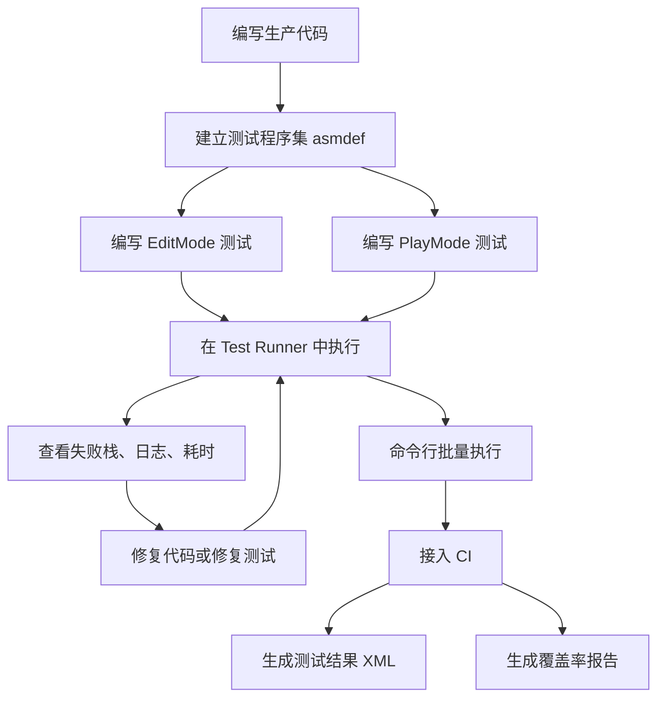

# Unity Test Runner 详解：从入门到落地的 Unity 测试工作流

:::abstract 文章摘要
很多 Unity 项目并不是“不适合做测试”，而是没有建立正确的测试分层与执行工作流。Unity 官方提供的测试体系本质上由 **Unity Test Framework（UTF）**、编辑器内置的 **Test Runner** 窗口以及 **NUnit** 基础能力共同组成。它既能做纯 C# 逻辑测试，也能做依赖帧推进、场景对象、日志、Domain Reload、平台 Player 的自动化验证。

这篇文章会从概念、安装、测试程序集、EditMode / PlayMode、代码示例、Test Runner UI、命令行、CI、覆盖率、包测试、进阶 API、常见坑与团队实践建议几个层面，把 Unity 中的测试工作流完整讲清楚。
:::

## 1. 什么是 Unity Test Runner

### 1.1 Test Runner 与 Unity Test Framework 的关系

很多人把 Test Runner 理解为“Unity 里的一个测试窗口”，这个理解不算错，但不完整。

更准确地说：

| 组件 | 作用 | 你在项目中会怎么接触到 |
| --- | --- | --- |
| Unity Test Framework | Unity 的测试框架，负责测试发现、执行、扩展 Unity/NUnit 能力 | 写测试代码、用特性、命令行、API |
| Test Runner | 编辑器里的测试执行界面 | 在窗口里点击 Run All、查看结果 |
| NUnit | 底层断言与测试声明能力 | `[Test]`、`Assert.AreEqual`、`[SetUp]` 等 |

可以把它理解成这样：

- **NUnit** 提供通用测试语言。
- **Unity Test Framework** 在 NUnit 之上增加 Unity 场景、帧推进、PlayMode、平台 Player、日志、构建前后钩子等能力。
- **Test Runner** 是 Unity 编辑器给这套能力提供的图形界面入口。

:::info 命名说明
在较新的 Unity 文档中，官方更强调 **Unity Test Framework** 这个名称；而在很多旧资料、教程和项目讨论里，仍然习惯说 **Test Runner**。实际工程里，这两个词经常一起出现：前者更偏“框架”，后者更偏“执行入口”。
:::

### 1.2 它解决了什么问题

没有自动化测试时，Unity 项目常见问题包括：

- 改一个工具脚本，Inspector 行为悄悄变了。
- 重构一段战斗逻辑，数值结算错了，但直到 QA 回归才发现。
- 加了一段异步加载逻辑，在某一帧时序下偶发 NullReference。
- 升级 Unity 版本后，某些 Editor 扩展或包兼容性出问题。
- 团队成员提交代码后，主分支开始间歇性红。

而测试体系能帮助你：

- 在提交代码后尽早发现回归问题。
- 把“靠手点”变成“可重复执行”的验证。
- 为重构提供安全网。
- 把核心逻辑从 MonoBehaviour 中抽离出来，形成可测试架构。
- 在 CI 中自动拦截坏提交。

## 2. Unity 测试体系的整体工作流

### 2.1 一张图看清测试工作流



### 2.2 团队中的推荐节奏

一套比较实用的 Unity 测试工作流通常是：

1. **先给核心纯逻辑写 EditMode 测试**。  
   例如状态机、数值公式、背包系统、配置解析、寻路规则、技能结算等。

2. **给依赖生命周期或帧推进的系统写 PlayMode 测试**。  
   例如对象生成、动画状态切换、异步加载完成时机、输入驱动流程、场景切换行为。

3. **本地开发时使用 Test Runner 快速回归**。  
   改一块逻辑，先只跑相关测试；提交前跑对应程序集或相关分类。

4. **在 CI 中跑稳定测试集**。  
   至少保证主干分支具备“每次提交自动验证”的能力。

5. **配合 Code Coverage 观察覆盖率**。  
   覆盖率不是目标本身，但它能暴露“哪些核心路径你根本没测到”。

:::hint 实战建议
Unity 项目最容易成功的做法不是“一上来就给所有东西写测试”，而是先从 **纯逻辑层** 和 **高风险模块** 开始建立测试。先让团队看到收益，再逐步扩大范围。
:::

## 3. EditMode 与 PlayMode：怎么选

### 3.1 EditMode 测试是什么

EditMode 测试也常被叫作 Editor 测试。它运行在 Unity Editor 内，适合验证：

- 纯 C# 业务逻辑
- Editor 扩展
- 资源导入、配置校验、菜单工具
- 不依赖游戏运行时循环的功能
- 绝大多数可被“架构解耦”出来的系统逻辑

EditMode 测试的特点：

- 运行快
- 调试方便
- 成本低
- 最适合作为日常回归的主力

### 3.2 PlayMode 测试是什么

PlayMode 测试在游戏运行上下文中执行，可以在 Editor 里的 PlayMode 执行，也可以在目标 Player 上执行。适合验证：

- `MonoBehaviour` 生命周期
- 帧推进与时间相关逻辑
- Coroutine 行为
- 场景对象交互
- 动画、输入、物理、异步流程
- 需要真正运行时环境的系统

PlayMode 测试通常比 EditMode 更慢，也更容易受到时序和环境影响，因此应该更谨慎地选择测试对象。

### 3.3 选择标准

| 场景 | 更适合的模式 | 原因 |
| --- | --- | --- |
| 数值公式、状态机、配置解析 | EditMode | 不依赖帧与场景，执行快 |
| 自定义 Inspector、菜单、导入器 | EditMode | 本质是 Editor 逻辑 |
| `MonoBehaviour` Update / Start / Awake 行为 | PlayMode | 依赖运行时生命周期 |
| Coroutine 多帧推进 | PlayMode | 需要帧推进 |
| 场景对象激活、销毁、切换 | PlayMode | 依赖运行时对象与场景 |
| 包开发中的纯 API 校验 | EditMode 为主 | 跨项目复用，易稳定执行 |

:::warning 常见误区
很多团队把所有测试都堆到 PlayMode 里，结果就是运行慢、易波动、CI 不稳定。**能用 EditMode 测的，就不要放进 PlayMode。**
:::

## 4. 如何在 Unity 中启用测试能力

### 4.1 打开 Test Runner 窗口

在 Unity 编辑器中，一般通过以下入口打开测试窗口：

- `Window > Test Runner`
- 某些版本或布局中也可能出现在测试相关菜单分组下

如果项目已经包含测试程序集，打开后通常会看到：

- **EditMode**
- **PlayMode**
- 某些版本中还会有 Player 相关执行入口

### 4.2 Unity 版本与包的关系

不同 Unity 版本中，测试框架的呈现方式略有差异：

- 在较新的 Unity 6 文档中，Unity Test Framework 已经整合到更核心的文档体系里。
- 在较早版本中，它更像是通过 Package Manager 管理的包。
- 不同版本的包号、文档位置、某些命令行参数和扩展能力，可能存在小差异。

:::info 版本建议
写文章、看教程、查 API 时，一定要确认资料对应的是你当前项目的 Unity 版本。**同样的“Test Runner 教程”，在 2020 LTS、2022 LTS、Unity 6 上看到的界面和包文档入口可能并不完全一样。**
:::

### 4.3 创建测试程序集

Unity 中测试最好放在独立程序集里，而不是随手把测试脚本混在普通业务目录中。

常见做法是创建两个测试程序集：

- 一个用于 **EditMode**
- 一个用于 **PlayMode**

推荐目录结构：

```text
Assets/
  Scripts/
    Runtime/
    Editor/
  Tests/
    EditMode/
      Game.EditModeTests.asmdef
      DamageCalculatorTests.cs
      InventoryServiceTests.cs
    PlayMode/
      Game.PlayModeTests.asmdef
      EnemySpawnTests.cs
      SceneFlowTests.cs
```

### 4.4 asmdef 为什么重要

`asmdef` 的作用不仅是“让代码分程序集”，更重要的是：

- 明确测试程序集依赖哪些生产程序集
- 区分 Editor 测试和 Runtime 测试
- 控制编译边界
- 提升编译速度
- 让 CI 和本地执行更清晰

一个典型的 **EditMode** 测试程序集示例：

```json
{
  "name": "Game.EditModeTests",
  "references": [
    "Game.Runtime",
    "Game.Editor"
  ],
  "optionalUnityReferences": [
    "TestAssemblies"
  ],
  "includePlatforms": [
    "Editor"
  ],
  "excludePlatforms": []
}
```

一个典型的 **PlayMode** 测试程序集示例：

```json
{
  "name": "Game.PlayModeTests",
  "references": [
    "Game.Runtime"
  ],
  "optionalUnityReferences": [
    "TestAssemblies"
  ],
  "includePlatforms": [],
  "excludePlatforms": []
}
```

其中最值得注意的是：

- `references`：决定测试代码能访问哪些业务程序集。
- `includePlatforms`：EditMode 测试通常只包含 `Editor`。
- `optionalUnityReferences: ["TestAssemblies"]`：让程序集获得测试相关引用能力。

:::warning 结构问题
如果你的业务代码还全部堆在 `Assembly-CSharp` 里，没有 asmdef，也不是不能测，但很容易让依赖变乱、编译边界不清晰、后期维护成本上升。中大型项目建议尽早做程序集拆分。
:::

## 5. 写第一个 EditMode 测试

### 5.1 先测试纯逻辑类

最理想的测试对象不是 `MonoBehaviour`，而是 **不依赖场景和生命周期的纯 C# 类**。例如：

```csharp
namespace Game.Runtime.Combat
{
    public sealed class DamageCalculator
    {
        public int CalculateFinalDamage(int attack, int defense)
        {
            int reducedDamage = attack - defense;
            if (reducedDamage < 1)
            {
                return 1;
            }

            return reducedDamage;
        }
    }
}
```

对应的 EditMode 测试：

```csharp
using Game.Runtime.Combat;
using NUnit.Framework;

namespace Game.Tests.EditMode
{
    public sealed class DamageCalculatorTests
    {
        [Test]
        public void CalculateFinalDamage_WhenAttackHigherThanDefense_ReturnsDifference()
        {
            DamageCalculator calculator = new DamageCalculator();

            int result = calculator.CalculateFinalDamage(20, 5);

            Assert.AreEqual(15, result);
        }

        [Test]
        public void CalculateFinalDamage_WhenDefenseTooHigh_ReturnsAtLeastOne()
        {
            DamageCalculator calculator = new DamageCalculator();

            int result = calculator.CalculateFinalDamage(3, 100);

            Assert.AreEqual(1, result);
        }

        [TestCase(10, 3, 7)]
        [TestCase(9, 9, 1)]
        [TestCase(100, 60, 40)]
        public void CalculateFinalDamage_WithMultipleInputs_ReturnsExpectedValue(int attack, int defense, int expected)
        {
            DamageCalculator calculator = new DamageCalculator();

            int result = calculator.CalculateFinalDamage(attack, defense);

            Assert.AreEqual(expected, result);
        }
    }
}
```

### 5.2 这类测试为什么价值很高

它有几个优点：

- 不依赖场景
- 不依赖 GameObject
- 不依赖帧推进
- 执行快
- 出错后定位简单
- 重构时最能提供安全感

如果你的核心业务逻辑大量写在 `MonoBehaviour` 里，建议逐步把可抽离的部分挪到纯类中，再给这些纯类写测试。

## 6. 写第一个 PlayMode 测试

### 6.1 `[UnityTest]` 是什么

PlayMode 测试最重要的特性之一是 `[UnityTest]`。它和普通 `[Test]` 不同，通常返回 `IEnumerator`，允许你：

- `yield return null` 跳过一帧
- 等待若干帧后继续断言
- 配合对象生命周期验证运行时行为

例如下面这个测试验证一个组件在下一帧完成初始化：

```csharp
using System.Collections;
using NUnit.Framework;
using UnityEngine;
using UnityEngine.TestTools;

namespace Game.Tests.PlayMode
{
    public sealed class HealthComponentTests
    {
        [UnityTest]
        public IEnumerator InitializeOnNextFrame_SetsCurrentHealthToMax()
        {
            GameObject gameObject = new GameObject("HealthOwner");
            HealthComponent component = gameObject.AddComponent<HealthComponent>();
            component.MaxHealth = 100;

            yield return null;

            Assert.AreEqual(100, component.CurrentHealth);

            Object.Destroy(gameObject);
        }
    }

    public sealed class HealthComponent : MonoBehaviour
    {
        public int MaxHealth = 100;
        public int CurrentHealth;

        private void Start()
        {
            CurrentHealth = MaxHealth;
        }
    }
}
```

### 6.2 什么时候必须用 PlayMode

下面这些情况通常更适合 PlayMode：

- 逻辑强依赖 `Awake` / `Start` / `Update`
- 需要 Coroutine 多帧验证
- 依赖 `Time`
- 依赖对象激活、销毁、层级关系
- 依赖场景加载
- 依赖输入、动画、物理或真实运行时对象

### 6.3 PlayMode 测试的设计原则

PlayMode 不应该成为“大杂烩集成测试垃圾场”。推荐原则：

- 一个测试只验证一个明确行为
- 场景依赖越少越好
- 不要把大场景直接当夹具
- 尽量动态创建最小测试对象
- 控制等待帧数，避免无意义 `yield return null` 链式堆积
- 用工厂或测试夹具构造对象，减少重复代码

## 7. 常用测试特性与断言能力

### 7.1 NUnit 基础特性

最常用的 NUnit 特性包括：

| 特性 | 用途 |
| --- | --- |
| `[Test]` | 普通测试方法 |
| `[TestCase]` | 参数化测试 |
| `[SetUp]` | 每个测试前执行 |
| `[TearDown]` | 每个测试后执行 |
| `[OneTimeSetUp]` | 测试类开始前执行一次 |
| `[OneTimeTearDown]` | 测试类结束后执行一次 |
| `[Category]` | 给测试打分类标签 |

示例：

```csharp
using NUnit.Framework;

namespace Game.Tests.EditMode
{
    [Category("Combat")]
    public sealed class BuffServiceTests
    {
        private BuffService _service;

        [SetUp]
        public void SetUp()
        {
            _service = new BuffService();
        }

        [TearDown]
        public void TearDown()
        {
            _service = null;
        }

        [Test]
        public void AddBuff_IncreasesCount()
        {
            _service.AddBuff("PowerUp");

            Assert.AreEqual(1, _service.Count);
        }
    }

    public sealed class BuffService
    {
        public int Count { get; private set; }

        public void AddBuff(string buffId)
        {
            Count += 1;
        }
    }
}
```

### 7.2 Unity 扩展特性

Unity Test Framework 在 NUnit 之上增加了一些很重要的能力：

| 特性 | 用途 |
| --- | --- |
| `[UnityTest]` | 支持多帧推进与 yield |
| `[UnitySetUp]` | 支持可 yield 的测试前置逻辑 |
| `[UnityTearDown]` | 支持可 yield 的清理逻辑 |
| `[PrebuildSetup]` | 在构建 Player 测试前做准备 |
| `[PostBuildCleanup]` | Player 测试构建后的清理 |
| `[UnityPlatform]` | 限定平台执行 |

一个简单的 `[UnitySetUp]` 示例：

```csharp
using System.Collections;
using NUnit.Framework;
using UnityEngine;
using UnityEngine.TestTools;

namespace Game.Tests.PlayMode
{
    public sealed class ProjectileTests
    {
        private GameObject _root;

        [UnitySetUp]
        public IEnumerator UnitySetUp()
        {
            _root = new GameObject("Root");
            yield return null;
        }

        [UnityTearDown]
        public IEnumerator UnityTearDown()
        {
            Object.Destroy(_root);
            yield return null;
        }

        [UnityTest]
        public IEnumerator RootObject_IsCreatedSuccessfully()
        {
            Assert.IsNotNull(_root);
            yield return null;
        }
    }
}
```

### 7.3 断言写法建议

除了最基础的 `Assert.AreEqual`，更推荐适度使用语义化断言，让测试更可读：

```csharp
Assert.That(currentHealth, Is.EqualTo(100));
Assert.That(playerName, Does.Contain("Hero"));
Assert.That(damageList.Count, Is.GreaterThan(0));
```

好的测试名字和好的断言一样重要。测试名应该直接说明：

- 前置条件
- 触发动作
- 预期结果

例如：

- `AddItem_WhenBagHasSpace_IncreasesCount`
- `LoadScene_WhenAddressInvalid_ThrowsException`
- `Start_WhenConfigMissing_LogsError`

## 8. Test Runner 窗口怎么用

### 8.1 基本操作

在 Test Runner 窗口中，通常可以完成这些操作：

- 查看 EditMode / PlayMode 测试树
- 运行全部测试
- 只运行某个测试类
- 只运行某个测试方法
- 查看失败断言、异常栈和日志
- 重新运行失败项
- 创建测试脚本或测试程序集

### 8.2 常见使用方式

比较常见的本地工作流是：

1. 改一段功能代码。
2. 在 Test Runner 中只跑相关测试类。
3. 修复失败项。
4. 提交前跑一遍相关分类或相关程序集。
5. 合并前由 CI 跑更完整的回归集。

### 8.3 如何看失败结果

看到红色失败项时，不要只盯着最后一行报错。要重点看：

- 失败的是 **断言失败** 还是 **异常**
- 失败发生在 **SetUp**、测试本体还是 **TearDown**
- 是否伴随控制台 Error / Exception
- 是否是因为对象销毁、场景未加载、时序未到位
- 是否是测试自身有环境耦合

:::danger 一个非常容易忽视的点
Unity 测试对日志是“有感知”的。运行测试过程中如果出现未预期的 `Error` 或 `Exception`，测试可能会直接失败。不是只有 `Assert.Fail` 才算失败。
:::

## 9. 日志测试：LogAssert 非常实用

如果你预期某段代码会打印错误日志，那么不能只是“让它报错然后看看控制台”，而应该显式声明“这条日志是预期行为”。

示例：

```csharp
using NUnit.Framework;
using UnityEngine;
using UnityEngine.TestTools;

namespace Game.Tests.EditMode
{
    public sealed class ConfigLoaderTests
    {
        [Test]
        public void Load_WhenFileMissing_LogsError()
        {
            LogAssert.Expect(LogType.Error, "Config file not found.");

            ConfigLoader loader = new ConfigLoader();
            loader.Load("MissingConfig");
        }
    }

    public sealed class ConfigLoader
    {
        public void Load(string configName)
        {
            Debug.LogError("Config file not found.");
        }
    }
}
```

这类测试很适合验证：

- 配置缺失保护
- 非法输入提示
- 编辑器工具错误信息
- 业务系统的容错路径

:::hint 经验建议
对于日志型行为，**不是“看到了日志就行”**，而是要把它写成可执行断言。这样日志才真正成为测试资产，而不是靠人工观察。
:::

## 10. MonoBehaviour、场景与帧驱动测试

### 10.1 测 `MonoBehaviour` 的推荐方式

不要一上来就把整张场景拖进测试。更推荐的方式是：

- 在测试里动态创建 `GameObject`
- 只挂需要的组件
- 手动喂依赖
- 跑最小生命周期
- 做最小断言
- 测完销毁对象

例如：

```csharp
using System.Collections;
using NUnit.Framework;
using UnityEngine;
using UnityEngine.TestTools;

namespace Game.Tests.PlayMode
{
    public sealed class EnemySpawnerTests
    {
        [UnityTest]
        public IEnumerator Spawn_CreatesEnemyObject()
        {
            GameObject gameObject = new GameObject("Spawner");
            EnemySpawner spawner = gameObject.AddComponent<EnemySpawner>();

            spawner.Spawn();

            yield return null;

            Assert.IsNotNull(GameObject.Find("Enemy(Clone)"));

            Object.Destroy(gameObject);
        }
    }

    public sealed class EnemySpawner : MonoBehaviour
    {
        public void Spawn()
        {
            GameObject enemyPrefab = new GameObject("Enemy");
            Object.Instantiate(enemyPrefab);
            Object.Destroy(enemyPrefab);
        }
    }
}
```

### 10.2 何时使用场景

只有在以下情况才建议加载专用测试场景：

- 需要多个系统协作
- 需要灯光、相机、导航、UI、动画等完整环境
- 需要验证场景初始化流程
- 需要更接近真实关卡状态

即便如此，也建议：

- 为测试建立独立场景
- 场景尽量轻量
- 不要复用正式大场景做回归测试
- 保证测试可重复执行，不依赖上次运行残留状态

### 10.3 关于时间和等待

PlayMode 测试常见反模式是：

```csharp
yield return null;
yield return null;
yield return null;
yield return null;
yield return null;
```

这类测试很脆弱。更好的做法是：

- 尽量等待明确条件
- 降低对固定帧数的依赖
- 用更清晰的状态断言代替盲等

## 11. 从 UI 执行，到命令行执行

### 11.1 为什么一定要学命令行

只会在编辑器里手点 `Run All`，测试体系就很难真正落地到团队流程。命令行执行至少有三个价值：

- 能接 CI
- 能做批量自动回归
- 能固定执行参数，减少人为差异

### 11.2 一个基础命令

下面是一个典型的 Windows 命令示例：

```bash
Unity.exe -runTests -batchmode -projectPath PATH_TO_YOUR_PROJECT -testResults C:\temp\results.xml -testPlatform EditMode
```

macOS 下通常也是同样思路，只是 Unity 可执行文件路径不同：

```bash
/Applications/Unity/Hub/Editor/6000.3.0f1/Unity.app/Contents/MacOS/Unity \
-runTests \
-batchmode \
-projectPath /Path/To/YourProject \
-testResults /tmp/results.xml \
-testPlatform EditMode
```

### 11.3 最常用的命令行参数

| 参数 | 作用 |
| --- | --- |
| `-runTests` | 启动测试执行 |
| `-batchmode` | 无界面批处理执行，适合自动化 |
| `-projectPath` | 指定项目路径 |
| `-testResults` | 输出 NUnit XML 结果文件 |
| `-testPlatform` | 指定 `EditMode`、`PlayMode` 或目标 BuildTarget |
| `-assemblyNames` | 只跑指定测试程序集 |
| `-testCategory` | 只跑指定分类 |
| `-testFilter` | 只跑某个测试名或匹配规则 |
| `-repeat` | 重复运行若干次，适合排查不稳定测试 |
| `-retry` | 失败后重试若干次 |
| `-runSynchronously` | 同步执行 EditMode 测试，过滤掉需要多帧的测试 |

### 11.4 如何筛选测试

例如你只想跑某个程序集：

```bash
Unity.exe -runTests -batchmode -projectPath D:\Project -testPlatform EditMode -assemblyNames "Game.EditModeTests" -testResults D:\Temp\editmode.xml
```

只想跑某个分类：

```bash
Unity.exe -runTests -batchmode -projectPath D:\Project -testPlatform EditMode -testCategory "Combat" -testResults D:\Temp\combat.xml
```

只想跑某个测试：

```bash
Unity.exe -runTests -batchmode -projectPath D:\Project -testPlatform EditMode -testFilter "Game.Tests.EditMode.DamageCalculatorTests.CalculateFinalDamage_WhenAttackHigherThanDefense_ReturnsDifference" -testResults D:\Temp\single.xml
```

:::warning 关于 `-quit`
Unity 官方文档提到，测试运行期间并不支持常规的 `-quit` 行为。实际自动化环境里应以测试命令和返回日志为准，不要想当然把普通构建脚本参数完全照搬到测试脚本里。
:::

## 12. CI 中如何落地 Unity 测试

### 12.1 最小可用 CI 思路

一个最小可用的团队方案通常包括：

1. 拉取仓库
2. 准备 Unity Editor 与许可
3. 执行 EditMode 测试
4. 导出 XML 结果
5. 可选执行 PlayMode 测试
6. 收集失败日志
7. 可选导出覆盖率报告

### 12.2 推荐的分层执行策略

| 测试层 | 触发时机 | 建议 |
| --- | --- | --- |
| 核心 EditMode | 每次提交 / 每次 PR | 必跑 |
| PlayMode 稳定集 | 每次 PR 或每日构建 | 视项目规模决定 |
| 长耗时集成测试 | 夜间构建 | 不建议阻塞所有提交 |
| 平台 Player 测试 | 里程碑、发布前、关键分支 | 成本较高，分阶段执行 |

### 12.3 为什么不要一股脑全跑

Unity 项目如果把所有 PlayMode、场景测试、平台测试都挂到每次提交上，CI 很容易变慢到不可用。更现实的做法是：

- 主干强制跑 EditMode 核心集
- 给高价值 PlayMode 测试建立稳定子集
- 平台相关测试放到更高层级的流水线
- 用分类和程序集拆分测试责任

:::hint 团队实践建议
CI 的目标不是“把所有测试塞进去”，而是 **在速度、稳定性、覆盖率之间找到能长期执行的平衡点**。跑不起来的 CI，比没有 CI 更伤团队信心。
:::

## 13. 测试覆盖率：Code Coverage 怎么看

### 13.1 覆盖率是什么

覆盖率用于回答一个问题：

> 测试执行时，到底覆盖到了哪些代码行、哪些程序集？

在 Unity 中，官方提供了 Code Coverage 包来导出覆盖率数据和 HTML 报告。

### 13.2 基本使用流程

通常的流程是：

1. 打开 Code Coverage 窗口
2. 选择需要统计的程序集
3. 执行 EditMode 或 PlayMode 测试
4. 生成覆盖率 HTML 报告
5. 查看哪些代码未被覆盖

### 13.3 覆盖率能帮助你什么

覆盖率最有价值的地方不是“追求 100%”，而是帮助你发现：

- 核心逻辑根本没被跑到
- 异常分支、错误分支缺失测试
- 重构后新增代码没跟上测试
- 团队把大量精力花在低价值路径上

### 13.4 不要误解覆盖率

:::danger 覆盖率不是质量分
高覆盖率不等于高质量测试。你可以写出一堆只跑表面路径、却没有业务价值的测试，让覆盖率很好看；也可以在覆盖率不高的情况下，对最关键风险点做出非常高质量的防护。**覆盖率应该用来发现盲区，而不是作为唯一 KPI。**
:::

## 14. 包测试与 `testables`

### 14.1 开发 UPM 包时怎么测

如果你在开发 Unity Package，而不是普通项目脚本，那么测试组织方式会更标准：

```text
Packages/com.company.my-package/
  Runtime/
  Editor/
  Tests/
    Runtime/
    Editor/
```

Unity 官方也建议为包建立 `Tests/Editor` 与 `Tests/Runtime`，并为它们配置对应的 `.asmdef`。

### 14.2 什么是 `testables`

当包位于项目 `Packages` 目录之外，或者你需要显式启用某些包测试时，可以在项目的 `Packages/manifest.json` 中加入 `testables`。

示例：

```json
{
  "dependencies": {
    "com.company.my-package": "1.0.0",
    "com.company.other-package": "2.0.0"
  },
  "testables": [
    "com.company.my-package",
    "com.company.other-package"
  ]
}
```

它的作用是告诉 Unity：

- 这些包中的测试程序集需要被纳入测试发现与执行流程。

### 14.3 什么时候你会遇到它

常见场景：

- 你在做共享基础库
- 你在维护多个项目共用包
- 你要在宿主项目里跑某个包的测试
- 某些依赖包本身带了测试扩展能力

:::info 一个工程化认知
如果你的项目规模逐渐变大，很多“项目脚本”最终都会往“可复用包”方向演化。此时 **包级测试** 会比单项目脚本测试更重要，因为它能保证复用资产在多个项目里都保持稳定。
:::

## 15. 从代码里运行测试：TestRunnerApi

### 15.1 什么时候需要 TestRunnerApi

大多数日常测试都直接通过 Test Runner 窗口或命令行跑就够了。但在一些进阶场景中，你可能希望：

- 自定义测试入口
- 在工具菜单中触发某类测试
- 自定义结果回调
- 构建自己的测试面板
- 与项目内部工具链打通

这时就会用到 **TestRunnerApi**。

### 15.2 一个基础示例

```csharp
using UnityEditor;
using UnityEditor.TestTools.TestRunner.Api;

namespace Game.Editor
{
    public static class RunCombatTestsMenu
    {
        [MenuItem("Tools/Tests/Run Combat EditMode Tests")]
        public static void RunCombatTests()
        {
            TestRunnerApi api = ScriptableObject.CreateInstance<TestRunnerApi>();

            Filter filter = new Filter
            {
                testMode = TestMode.EditMode,
                categoryNames = new string[] { "Combat" }
            };

            ExecutionSettings executionSettings = new ExecutionSettings(filter);

            api.Execute(executionSettings);
        }
    }
}
```

### 15.3 它适合什么团队

TestRunnerApi 更适合：

- 工具链较完善的中大型团队
- 需要把测试能力嵌入内部平台的团队
- 有专门 Editor 工具开发经验的团队

对于小团队或个人开发者来说，先把 Test Runner 和命令行工作流打通，通常更重要。

## 16. 更进阶的测试能力

### 16.1 `UnitySetUp` / `UnityTearDown`

当你的前置和清理步骤也需要跨帧执行时，普通 NUnit 的 `[SetUp]` / `[TearDown]` 就不够了，这时可以使用 Unity 提供的可 `yield` 版本。

适用场景：

- 等待资源初始化
- 等待对象创建完成
- 清理需要跨一帧生效的对象状态

### 16.2 `PrebuildSetup` / `PostBuildCleanup`

这类特性用于 **Player 测试构建前后** 的准备与清理。

适合：

- 构建前生成临时配置
- 写入测试资源
- 构建后清理临时文件
- 调整特定平台测试所需环境

### 16.3 `UnityPlatform`

当某些测试只在特定平台有意义时，可以限制平台范围，避免在无关环境里执行。

### 16.4 `MonoBehaviourTest`

当你需要以更“测试框架友好”的方式驱动某个 `MonoBehaviour` 完成生命周期时，可以使用 `MonoBehaviourTest` 相关能力。它适合更结构化地等待一个 `MonoBehaviour` 进入“测试完成”状态，而不是手写大量帧等待逻辑。

### 16.5 图形测试与性能测试

Unity 生态中还有一些与测试相关的扩展方向：

- **Graphics Test Framework**：适合图形输出对比、渲染回归验证
- **Performance Testing Extension**：适合性能采样、基准比较

它们不一定是每个项目都要上，但在图形密集项目、技术验证项目或平台优化阶段会很有价值。

## 17. 一套推荐的测试分层方案

### 17.1 业务分层建议

一个更易测试的 Unity 项目，通常可以分成下面几层：

| 层级 | 内容 | 推荐测试方式 |
| --- | --- | --- |
| 纯领域逻辑层 | 数值、规则、状态机、配置解析 | EditMode |
| 应用服务层 | 背包服务、任务服务、存档服务 | EditMode 为主 |
| Unity 适配层 | MonoBehaviour、View、桥接脚本 | PlayMode / 少量 EditMode |
| 集成场景层 | 场景流程、UI 交互、对象组合 | PlayMode |
| 平台验证层 | Player 构建、设备行为 | Player 测试 |

### 17.2 测试数量应该怎么分布

理想情况下：

- **大多数测试应当是 EditMode**
- **少量关键路径使用 PlayMode**
- **更少量关键发布路径使用 Player 测试**

这和很多通用软件项目里的“测试金字塔”思想是相通的。

### 17.3 一个现实落地模板

对大多数中小型 Unity 项目，我更推荐下面这个起步策略：

- 每个核心系统至少有一个 EditMode 测试文件
- 每个高风险运行时模块至少有一个 PlayMode 回归测试
- 每次提交必须过 EditMode 核心集
- 每个迭代至少补一批历史缺口测试
- 每个线上 bug 修复后，尽量补一条能复现它的测试

:::hint 最实用的一条规则
**每修一个曾经漏到 QA 或线上环境的 bug，就补一条测试防止它再次出现。** 这是团队最容易持续坚持、也最能积累价值的做法。
:::

## 18. Unity 测试中的常见坑

### 18.1 把测试写成“手工步骤脚本”

有些所谓测试，本质上只是：

- 打开场景
- 点按钮
- 看控制台
- 看角色有没有动
- 看 UI 有没有弹出来

这不是自动化测试，而只是把手工验证写成了备注。真正的自动化测试必须：

- 能自动执行
- 有明确断言
- 结果可重复
- 不依赖人工目测

### 18.2 测试过度依赖场景

一旦测试和正式场景深度耦合，就容易出现：

- 场景一改，测试全挂
- 测试初始化慢
- 场景脏数据影响结果
- 调试成本暴涨

解决思路：

- 优先动态创建最小对象集
- 场景只用于真正必要的集成验证
- 为测试建立专用轻量场景

### 18.3 在 PlayMode 测试里乱等帧

症状：

- `yield return null` 一串接一串
- 某台机器过，另一台机器不过
- CI 和本地结果不一致

解决思路：

- 改为等待明确状态
- 控制时间依赖
- 尽量减少隐式时序耦合

### 18.4 把所有逻辑塞进 MonoBehaviour

这是 Unity 项目最经典、也最影响测试落地的问题之一。后果是：

- 很多逻辑只能用 PlayMode 测
- 测试慢
- 依赖多
- 构造复杂
- 调试困难

最重要的改进方向是：

- 把业务规则抽到纯 C# 类
- 让 MonoBehaviour 负责桥接而不是承载全部逻辑

### 18.5 忽略测试清理

测试创建的对象、临时文件、静态状态、单例残留，如果不清理，很容易导致：

- 下一个测试结果异常
- 顺序相关失败
- 本地能过，CI 不过

建议每次写测试都反问一句：

> 这个测试执行完后，是否完整恢复了环境？

### 18.6 把不稳定测试默默注释掉

真正危险的不是测试失败，而是团队对失败测试失去信任。最糟糕的路径通常是：

- 某条测试偶发失败
- 大家觉得烦
- 直接忽略、注释、移除
- 之后真正回归问题再也挡不住

更正确的做法是：

- 给不稳定测试打标记并隔离
- 找出根因
- 通过 `-repeat` 或 `-retry` 辅助排查
- 修掉环境问题或时序问题
- 重新纳入稳定集

## 19. 一条从零开始的学习路线

### 19.1 入门阶段

先掌握下面这些能力：

- 会创建测试程序集
- 会写 `[Test]`
- 会写 `[TestCase]`
- 会使用 `Assert`
- 会在 Test Runner 中执行 EditMode 测试

### 19.2 进阶阶段

继续掌握：

- `[UnityTest]`
- PlayMode 测试
- `LogAssert`
- `[SetUp]` / `[TearDown]`
- 分类与按程序集执行
- 命令行执行与 XML 结果输出

### 19.3 工程化阶段

最后进入真正落地层面：

- CI 自动化
- Code Coverage
- 包测试与 `testables`
- TestRunnerApi
- 图形测试、性能测试
- 测试金字塔与团队治理

## 20. 结语：真正有价值的 Unity 测试，不是“测了多少”，而是“挡住了多少风险”

Unity Test Runner 很容易被误解成“就是个点按钮跑测试的窗口”。但如果你从工程角度看，它实际上是 Unity 自动化验证体系的入口。真正有价值的不是窗口本身，而是背后的完整工作流：

- 把核心逻辑从 `MonoBehaviour` 中解耦
- 用 EditMode 承担大部分回归责任
- 用 PlayMode 覆盖运行时关键路径
- 用命令行与 CI 建立自动执行链路
- 用覆盖率发现盲区
- 用测试资产为重构与版本升级保驾护航

如果你现在的 Unity 项目还没有系统化测试，我建议不要想着“一次补完所有”。最有效的起点通常只有三步：

1. 拆出一个可测试的核心逻辑类。
2. 给它写一组 EditMode 测试。
3. 把它接入提交前或 CI 的自动执行。

只要这一步走通，后面的工程化建设就会自然展开。

## 参考资料

| 资料 | 链接 |
| --- | --- |
| Unity Manual - Automated testing | [https://docs.unity3d.com/6000.0/Documentation/Manual/testing-editortestsrunner.html](https://docs.unity3d.com/6000.0/Documentation/Manual/testing-editortestsrunner.html) |
| Unity Manual - Edit mode and Play mode tests | [https://docs.unity3d.com/6000.3/Documentation/Manual/test-framework/edit-mode-vs-play-mode-tests.html](https://docs.unity3d.com/6000.3/Documentation/Manual/test-framework/edit-mode-vs-play-mode-tests.html) |
| Unity Manual - Running tests | [https://docs.unity3d.com/6000.3/Documentation/Manual/test-framework/running-tests.html](https://docs.unity3d.com/6000.3/Documentation/Manual/test-framework/running-tests.html) |
| Unity Manual - Run tests from the command line | [https://docs.unity3d.com/6000.3/Documentation/Manual/test-framework/run-tests-from-command-line.html](https://docs.unity3d.com/6000.3/Documentation/Manual/test-framework/run-tests-from-command-line.html) |
| Unity Manual - Command-line reference | [https://docs.unity3d.com/6000.3/Documentation/Manual/test-framework/reference-command-line.html](https://docs.unity3d.com/6000.3/Documentation/Manual/test-framework/reference-command-line.html) |
| Unity Test Framework overview | [https://docs.unity3d.com/Packages/com.unity.test-framework@2.0/manual/index.html](https://docs.unity3d.com/Packages/com.unity.test-framework@2.0/manual/index.html) |
| TestRunnerApi | [https://docs.unity3d.com/Packages/com.unity.test-framework@1.1/manual/reference-test-runner-api.html](https://docs.unity3d.com/Packages/com.unity.test-framework@1.1/manual/reference-test-runner-api.html) |
| Add tests to your package | [https://docs.unity3d.com/6000.4/Documentation/Manual/cus-tests.html](https://docs.unity3d.com/6000.4/Documentation/Manual/cus-tests.html) |
| Project manifest file | [https://docs.unity3d.com/6000.4/Documentation/Manual/upm-manifestPrj.html](https://docs.unity3d.com/6000.4/Documentation/Manual/upm-manifestPrj.html) |
| Code Coverage package | [https://docs.unity3d.com/2023.2/Documentation/Manual/com.unity.testtools.codecoverage.html](https://docs.unity3d.com/2023.2/Documentation/Manual/com.unity.testtools.codecoverage.html) |
| Using Code Coverage with Test Runner | [https://docs.unity3d.com/Packages/com.unity.testtools.codecoverage@1.3/manual/CoverageTestRunner.html](https://docs.unity3d.com/Packages/com.unity.testtools.codecoverage@1.3/manual/CoverageTestRunner.html) |
| Graphics Test Framework | [https://docs.unity3d.com/Packages/com.unity.testframework.graphics@7.10/manual/index.html](https://docs.unity3d.com/Packages/com.unity.testframework.graphics@7.10/manual/index.html) |
