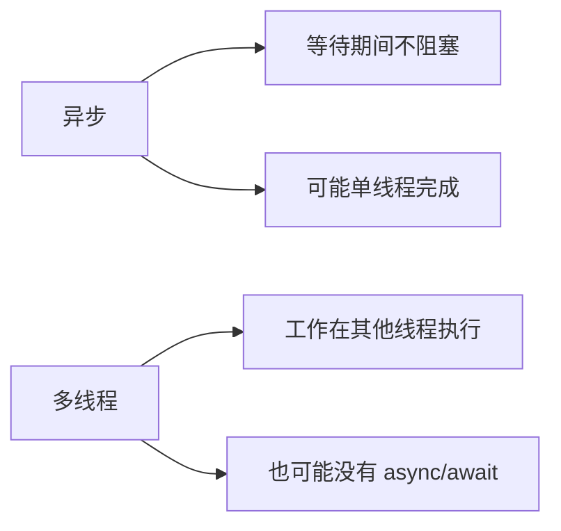

# Unity 协程开发者的 C# 异步编程与 UniTask 详解

## 1. 这篇文章适合谁

这篇文章面向这样的 Unity 开发者：

| 读者状态 | 说明 |
| --- | --- |
| 只熟悉协程 | 会写 `IEnumerator`、`StartCoroutine`、`yield return` |
| 对 C# 异步了解不深 | 可能见过 `async`、`await`、`Task`，但不知道它们真实解决什么问题 |
| 准备使用 UniTask | 想把 Unity 的异步加载、网络请求、UI 流程写得更清晰 |

本文会从协程出发，逐步讲到：

1. C# 异步编程到底是什么。
2. `async` / `await` / `Task` 分别负责什么。
3. 异步和多线程有什么区别。
4. 为什么 Unity 中原生 `Task` 不总是最好选择。
5. UniTask 为什么适合 Unity。
6. 怎么把协程思维迁移到 UniTask。
7. 取消、异常、超时、并发等待等进阶问题怎么处理。

:::abstract 一句话结论
协程解决的是“按帧拆分流程”，C# async/await 解决的是“用同步写法表达异步等待”，UniTask 则是把 async/await 适配到 Unity PlayerLoop、生命周期和低 GC 场景中的实用方案。
:::

## 2. 先从协程说起

### 2.1 协程解决了什么问题

你可能写过这样的代码：

```csharp
using System.Collections;
using UnityEngine;

namespace Blogger.Runtime
{
    /// <summary>
    /// 协程加载流程示例。
    /// </summary>
    public sealed class CoroutineFlowSample : MonoBehaviour
    {
        #region 协程流程控制

        /// <summary>
        /// 启动协程流程。
        /// </summary>
        private void Start()
        {
            // 启动协程，让流程可以分帧执行。
            StartCoroutine(LoadFlow());
        }

        /// <summary>
        /// 模拟一个分步骤加载流程。
        /// </summary>
        /// <returns>协程迭代器。</returns>
        private IEnumerator LoadFlow()
        {
            // 输出中文调试信息，表示开始加载。
            Debug.Log("开始加载");

            // 等待 1 秒，不阻塞整个 Unity 主循环。
            yield return new WaitForSeconds(1f);

            // 输出中文调试信息，表示加载结束。
            Debug.Log("加载结束");
        }

        #endregion
    }
}
```

协程的核心价值是：

| 能力 | 说明 |
| --- | --- |
| 分帧执行 | 一个方法可以暂停，后续帧继续 |
| 等待 Unity 对象 | 可以 `yield return AsyncOperation` |
| 写法直观 | 比手写状态机简单 |

### 2.2 协程不是线程

这是非常重要的基础认知。

协程通常仍然运行在 Unity 主线程中。  
它不会自动把耗时计算丢到后台线程。

```csharp
private IEnumerator HeavyCoroutine()
{
    // 这段重计算仍然会卡住 Unity 主线程。
    for (int index = 0; index < 100000000; index++)
    {
        // 模拟耗时计算。
    }

    yield return null;
}
```

也就是说：

| 误区 | 正确认知 |
| --- | --- |
| 协程等于多线程 | 协程不是线程 |
| `yield return` 就一定不卡 | 如果 yield 前执行了重计算，仍然会卡 |
| 协程适合 CPU 密集计算 | 协程更适合分帧流程和 Unity 异步对象等待 |

## 3. C# 异步编程到底是什么

### 3.1 异步的核心不是“开线程”

异步编程的核心是：

**当某个操作需要等待时，不阻塞当前执行环境，让后续逻辑在结果完成后继续。**

比如网络请求：

1. 发起请求。
2. 等服务器返回。
3. 返回后继续处理结果。

在等待服务器期间，没有必要卡住主线程。

### 3.2 异步和多线程的区别

| 概念 | 关注点 | Unity 中的例子 |
| --- | --- | --- |
| 异步 | 不阻塞等待结果 | 等待网络请求、等待资源加载 |
| 多线程 | 把工作放到其他线程执行 | 后台解析大量数据、压缩文件 |

它们可以组合，但不是同一个东西。



## 4. `async`、`await`、`Task` 分别是什么

### 4.1 `Task` 是什么

可以先把 `Task` 理解成：

**一个代表“未来会完成的异步操作”的对象。**

| 类型 | 说明 |
| --- | --- |
| `Task` | 表示没有返回值的异步任务 |
| `Task<T>` | 表示有返回值的异步任务 |

示例：

```csharp
using System.Threading.Tasks;
using UnityEngine;

namespace Blogger.Runtime
{
    /// <summary>
    /// Task 基础示例。
    /// </summary>
    public sealed class TaskBasicSample : MonoBehaviour
    {
        #region Task基础用法

        /// <summary>
        /// Unity 启动入口。
        /// </summary>
        private async void Start()
        {
            // 等待异步方法完成并取得返回值。
            string text = await GetTextAsync();

            // 输出异步结果。
            Debug.Log("异步返回结果: " + text);
        }

        /// <summary>
        /// 模拟异步获取文本。
        /// </summary>
        /// <returns>异步文本结果。</returns>
        private async Task<string> GetTextAsync()
        {
            // 异步等待 1 秒，不阻塞当前线程。
            await Task.Delay(1000);

            // 返回异步结果。
            return "加载完成";
        }

        #endregion
    }
}
```

### 4.2 `async` 是什么

`async` 用来告诉编译器：

**这个方法内部可能会使用 `await`，请把它编译成可以暂停和恢复的状态机。**

注意：

1. `async` 本身不代表开线程。
2. `async` 本身不代表异步已经开始。
3. 它主要是配合 `await` 使用。

### 4.3 `await` 是什么

`await` 表示：

**等待一个可等待对象完成，完成后继续执行后面的代码。**

它和协程里的 `yield return` 有相似感，但能力更强。

| 协程 | async/await |
| --- | --- |
| `yield return request` | `await request` |
| 不容易直接返回值 | 可以自然返回 `Task<T>` |
| 异常容易分散 | 可以用 `try-catch` 捕获 |
| 组合能力一般 | 可以 `WhenAll`、`WhenAny`、取消、超时 |

## 5. async/await 和协程的核心区别

### 5.1 返回值不同

协程返回 `IEnumerator`，它本身不适合表达业务结果。

```csharp
private IEnumerator LoadConfig()
{
    yield return new WaitForSeconds(1f);
}
```

异步方法可以直接返回结果：

```csharp
private async Task<string> LoadConfigAsync()
{
    await Task.Delay(1000);
    return "配置内容";
}
```

### 5.2 异常处理不同

协程中异常处理比较弱，尤其跨多层协程时不够自然。  
`async/await` 可以直接用 `try-catch`：

```csharp
private async Task LoadAsync()
{
    try
    {
        // 等待异步任务。
        await Task.Delay(1000);
    }
    catch (System.Exception exception)
    {
        // 输出中文错误信息。
        Debug.LogError("异步流程发生异常: " + exception.Message);
    }
}
```

### 5.3 组合能力不同

协程要等待多个流程都完成，通常要手动写状态。  
Task 可以直接：

```csharp
Task firstTask = LoadConfigAsync();
Task secondTask = LoadUserDataAsync();
await Task.WhenAll(firstTask, secondTask);
```

这就是异步编程在复杂流程里比协程更舒服的地方。

## 6. Unity 中原生 Task 的问题

原生 `Task` 是 C# 标准异步体系的一部分，但 Unity 项目中直接大量使用 `Task` 会遇到一些问题。

| 问题 | 说明 |
| --- | --- |
| 不天然贴合 PlayerLoop | Unity 很多等待是按帧、按生命周期来的 |
| GC 分配相对高 | 高频异步场景中可能产生更多分配 |
| Unity API 主线程限制 | 后台线程不能随便调用 UnityEngine 对象 |
| 生命周期取消麻烦 | GameObject 销毁时异步任务不一定自动停 |

这就是 UniTask 出现的主要原因。

## 7. UniTask 是什么

UniTask 是 Cysharp 提供的 Unity 异步库。  
你可以先这样理解：

**UniTask 是专门为 Unity 优化过的 async/await 方案。**

它解决的重点包括：

| 能力 | 说明 |
| --- | --- |
| 低 GC | `UniTask` 是结构体，比 `Task` 更适合高频 Unity 场景 |
| 适配 PlayerLoop | 支持等待下一帧、FixedUpdate、EndOfFrame 等 Unity 时机 |
| 支持 Unity 异步对象 | 可以 await `AsyncOperation`、`UnityWebRequest` 等 |
| 生命周期取消 | 能配合 `CancellationToken` 绑定对象销毁 |

### 7.1 Task 和 UniTask 对比

| 维度 | Task | UniTask |
| --- | --- | --- |
| 所属体系 | .NET 标准库 | Unity 第三方库 |
| 返回类型 | `Task` / `Task<T>` | `UniTask` / `UniTask<T>` |
| GC | 相对更高 | 更低 |
| Unity PlayerLoop | 不专门适配 | 专门适配 |
| 适用场景 | .NET 通用异步 | Unity 游戏逻辑异步 |

## 8. 从协程迁移到 UniTask

### 8.1 等一帧

协程：

```csharp
yield return null;
```

UniTask：

```csharp
await UniTask.Yield();
```

### 8.2 等待秒数

协程：

```csharp
yield return new WaitForSeconds(1f);
```

UniTask：

```csharp
await UniTask.Delay(System.TimeSpan.FromSeconds(1));
```

### 8.3 等待 Unity 异步加载

协程：

```csharp
yield return SceneManager.LoadSceneAsync("Battle");
```

UniTask：

```csharp
await SceneManager.LoadSceneAsync("Battle");
```

### 8.4 一个完整 UniTask 示例

```csharp
using System;
using Cysharp.Threading.Tasks;
using UnityEngine;
using UnityEngine.SceneManagement;

namespace Blogger.Runtime
{
    /// <summary>
    /// UniTask 场景加载示例。
    /// </summary>
    public sealed class UniTaskSceneSample : MonoBehaviour
    {
        #region UniTask加载场景

        /// <summary>
        /// 启动异步流程。
        /// </summary>
        private void Start()
        {
            // 不等待返回值时，使用 Forget 明确表达火并忘调用。
            LoadBattleSceneAsync().Forget();
        }

        /// <summary>
        /// 异步加载战斗场景。
        /// </summary>
        /// <returns>UniTask 异步任务。</returns>
        private async UniTask LoadBattleSceneAsync()
        {
            // 输出中文调试信息，表示流程开始。
            Debug.Log("准备进入战斗场景");

            // 等待 1 秒，用于模拟过场动画或加载提示。
            await UniTask.Delay(TimeSpan.FromSeconds(1));

            // 异步加载战斗场景。
            await SceneManager.LoadSceneAsync("Battle");

            // 输出中文调试信息，表示流程完成。
            Debug.Log("战斗场景加载完成");
        }

        #endregion
    }
}
```

## 9. `UniTaskVoid`、`Forget` 和 `async void`

### 9.1 为什么少用 `async void`

`async void` 最大的问题是：

1. 调用方无法等待它完成。
2. 调用方无法拿到异常。
3. 组合能力很差。

在 Unity 里，生命周期函数如 `Start()` 不能返回 `UniTask`，所以常见做法是：

```csharp
private void Start()
{
    InitializeAsync().Forget();
}
```

### 9.2 `Forget` 是什么

`Forget()` 的含义是：

**我知道这个异步任务没有被 await，我是有意让它自己运行。**

这比直接丢掉返回值更清晰。

### 9.3 `UniTaskVoid` 什么时候用

`UniTaskVoid` 更像异步事件入口，不适合普通业务方法到处使用。

| 返回类型 | 推荐用途 |
| --- | --- |
| `UniTask` | 普通无返回值异步业务 |
| `UniTask<T>` | 有返回值异步业务 |
| `UniTaskVoid` | 事件入口、生命周期入口、确实不需要等待的异步流程 |

建议：

1. 业务方法优先 `UniTask` / `UniTask<T>`。
2. 不要把所有异步方法都写成 `UniTaskVoid`。
3. 能 await 的主流程尽量 await。

## 10. 取消：Unity 异步必须掌握的安全机制

### 10.1 为什么需要取消

假设你打开一个 UI 页面时发起网络请求。  
结果请求还没回来，页面已经关闭了。

如果异步任务继续执行，可能出现：

1. 访问已销毁的 UI 对象。
2. 设置不存在的图片或文本。
3. 页面关闭后又弹出结果。
4. 产生隐藏异常。

所以 Unity 异步流程必须重视取消。

### 10.2 CancellationToken 是什么

`CancellationToken` 可以理解成：

**一个传递给异步任务的取消信号。**

外部触发取消后，异步任务内部可以及时停止。

### 10.3 UniTask 中绑定 MonoBehaviour 生命周期

```csharp
using System.Threading;
using Cysharp.Threading.Tasks;
using UnityEngine;

namespace Blogger.Runtime
{
    /// <summary>
    /// UniTask 生命周期取消示例。
    /// </summary>
    public sealed class UniTaskCancelSample : MonoBehaviour
    {
        #region 生命周期取消

        /// <summary>
        /// 启动异步加载。
        /// </summary>
        private void Start()
        {
            // 获取对象销毁时会触发的取消令牌。
            CancellationToken cancellationToken = this.GetCancellationTokenOnDestroy();

            // 启动异步流程，并把生命周期取消令牌传入。
            LoadAsync(cancellationToken).Forget();
        }

        /// <summary>
        /// 模拟可取消的异步加载流程。
        /// </summary>
        /// <param name="cancellationToken">取消令牌。</param>
        /// <returns>UniTask 异步任务。</returns>
        private async UniTask LoadAsync(CancellationToken cancellationToken)
        {
            // 等待 3 秒，如果对象销毁则提前取消。
            await UniTask.Delay(3000, cancellationToken: cancellationToken);

            // 如果对象还存在，则继续执行后续逻辑。
            Debug.Log("加载完成，可以安全刷新 UI");
        }

        #endregion
    }
}
```

### 10.4 取消异常怎么处理

当任务被取消时，通常会抛出 `OperationCanceledException`。  
这不一定是错误，而是“流程被正常取消”。

```csharp
try
{
    await LoadAsync(cancellationToken);
}
catch (System.OperationCanceledException)
{
    Debug.Log("异步流程已取消");
}
```

## 11. 超时：网络请求和资源下载常用

### 11.1 为什么需要超时

没有超时的异步任务可能一直挂着。  
比如：

1. 网络断开。
2. CDN 无响应。
3. 服务端异常。
4. 第三方 SDK 回调丢失。

### 11.2 UniTask 超时示例

```csharp
using System;
using System.Threading;
using Cysharp.Threading.Tasks;
using UnityEngine;
using UnityEngine.Networking;

namespace Blogger.Runtime
{
    /// <summary>
    /// UniTask 网络请求超时示例。
    /// </summary>
    public sealed class UniTaskTimeoutSample
    {
        #region 网络请求超时

        /// <summary>
        /// 获取远程文本。
        /// </summary>
        /// <param name="url">请求地址。</param>
        /// <param name="cancellationToken">外部取消令牌。</param>
        /// <returns>远程文本内容。</returns>
        public async UniTask<string> GetTextAsync(string url, CancellationToken cancellationToken)
        {
            // 创建超时取消源。
            CancellationTokenSource timeoutSource = new CancellationTokenSource(TimeSpan.FromSeconds(10));

            // 将外部取消和超时取消合并成一个令牌。
            CancellationTokenSource linkedSource = CancellationTokenSource.CreateLinkedTokenSource(
                cancellationToken,
                timeoutSource.Token);

            try
            {
                // 创建 UnityWebRequest 请求对象。
                UnityWebRequest request = UnityWebRequest.Get(url);

                // 发送请求并支持取消。
                await request.SendWebRequest().WithCancellation(linkedSource.Token);

                // 判断请求是否失败。
                if (request.result != UnityWebRequest.Result.Success)
                {
                    Debug.LogError("网络请求失败: " + request.error);
                    return string.Empty;
                }

                // 返回下载文本。
                return request.downloadHandler.text;
            }
            finally
            {
                // 释放合并取消源。
                linkedSource.Dispose();

                // 释放超时取消源。
                timeoutSource.Dispose();
            }
        }

        #endregion
    }
}
```

## 12. 并发等待：让多个异步任务一起跑

### 12.1 错误写法：一个个等

```csharp
await LoadConfigAsync();
await LoadUserDataAsync();
await LoadIconAsync();
```

如果三个任务彼此没有依赖，这样会变成串行等待。

### 12.2 正确写法：一起启动，一起等待

```csharp
UniTask configTask = LoadConfigAsync();
UniTask userDataTask = LoadUserDataAsync();
UniTask iconTask = LoadIconAsync();

await UniTask.WhenAll(configTask, userDataTask, iconTask);
```

这表示：

1. 三个任务先同时开始。
2. 等它们都完成后再继续。

### 12.3 有返回值的并发等待

```csharp
UniTask<string> configTask = LoadConfigTextAsync();
UniTask<int> levelTask = LoadPlayerLevelAsync();

(string configText, int playerLevel) = await UniTask.WhenAll(configTask, levelTask);
```

这比协程手写多个完成标记要清晰很多。

## 13. Task.Run、UniTask.Run 和线程切换

### 13.1 什么任务适合放后台线程

适合：

1. JSON 大文件解析。
2. 纯 C# 计算。
3. 压缩和解压。
4. 不访问 UnityEngine 对象的数据处理。

不适合：

1. 创建 GameObject。
2. 操作 Transform。
3. 读取或修改 Unity 组件。
4. 调用大多数 Unity API。

### 13.2 UniTask 切换线程示例

```csharp
using Cysharp.Threading.Tasks;
using UnityEngine;

namespace Blogger.Runtime
{
    /// <summary>
    /// UniTask 线程切换示例。
    /// </summary>
    public sealed class UniTaskThreadSwitchSample
    {
        #region 线程切换

        /// <summary>
        /// 在后台线程计算，再回到主线程使用结果。
        /// </summary>
        /// <returns>异步任务。</returns>
        public async UniTask CalculateThenApplyAsync()
        {
            // 切换到线程池，适合执行纯 C# 耗时计算。
            await UniTask.SwitchToThreadPool();

            // 执行后台计算。
            int result = CalculateHeavyData();

            // 切回 Unity 主线程，才能安全访问 Unity API。
            await UniTask.SwitchToMainThread();

            // 在主线程输出结果。
            Debug.Log("计算完成: " + result);
        }

        /// <summary>
        /// 模拟纯 C# 重计算。
        /// </summary>
        /// <returns>计算结果。</returns>
        private int CalculateHeavyData()
        {
            // 保存计算结果。
            int total = 0;

            // 模拟大量循环计算。
            for (int index = 0; index < 1000000; index++)
            {
                total += index;
            }

            // 返回计算结果。
            return total;
        }

        #endregion
    }
}
```

:::warning 主线程规则
不要在线程池中直接访问 Unity 对象。  
如果你在后台线程里操作 `Transform`、`GameObject`、`Texture` 等 Unity 对象，轻则报错，重则出现难排查的不稳定问题。
:::

## 14. 异常处理：不要让异步错误消失

### 14.1 能 await 就能 catch

```csharp
try
{
    await LoadAsync(cancellationToken);
}
catch (System.Exception exception)
{
    Debug.LogError("加载失败: " + exception.Message);
}
```

### 14.2 Forget 的异常要处理

如果你使用 `Forget()`，建议提供异常处理方式，避免错误被忽略。

```csharp
LoadAsync(cancellationToken).Forget(exception =>
{
    Debug.LogError("异步流程异常: " + exception.Message);
});
```

### 14.3 异常处理建议

| 场景 | 建议 |
| --- | --- |
| 主业务流程 | 用 `await`，在上层统一 `try-catch` |
| 火并忘任务 | `Forget` 时附加异常处理 |
| 取消异常 | 通常单独捕获 `OperationCanceledException` |
| 网络异常 | 输出 URL、错误码、重试次数 |

## 15. 回调转 UniTask

很多旧 SDK 或旧项目接口仍然是回调风格：

```csharp
public void Request(System.Action<int> onSuccess, System.Action<string> onFailed)
{
}
```

可以用 `UniTaskCompletionSource<T>` 包装成可 await 的方法。

```csharp
using Cysharp.Threading.Tasks;

namespace Blogger.Runtime
{
    /// <summary>
    /// 回调转 UniTask 示例。
    /// </summary>
    public sealed class CallbackToUniTaskSample
    {
        #region 回调转异步任务

        /// <summary>
        /// 将回调接口包装为 UniTask。
        /// </summary>
        /// <returns>异步返回的整数结果。</returns>
        public UniTask<int> RequestAsync()
        {
            // 创建一个手动完成的 UniTask 源。
            UniTaskCompletionSource<int> completionSource = new UniTaskCompletionSource<int>();

            // 调用旧回调接口。
            Request(
                result =>
                {
                    // 成功时设置异步结果。
                    completionSource.TrySetResult(result);
                },
                error =>
                {
                    // 失败时设置异常。
                    completionSource.TrySetException(new System.Exception(error));
                });

            // 返回可 await 的任务。
            return completionSource.Task;
        }

        /// <summary>
        /// 模拟旧回调接口。
        /// </summary>
        /// <param name="onSuccess">成功回调。</param>
        /// <param name="onFailed">失败回调。</param>
        private void Request(System.Action<int> onSuccess, System.Action<string> onFailed)
        {
            // 模拟成功回调。
            onSuccess.Invoke(100);
        }

        #endregion
    }
}
```

## 16. 一个从协程改造成 UniTask 的完整例子

### 16.1 协程写法

```csharp
private IEnumerator OpenPageFlow()
{
    ShowLoading();
    yield return LoadConfigCoroutine();
    yield return LoadIconCoroutine();
    HideLoading();
    ShowPage();
}
```

这种写法能工作，但当你需要返回结果、处理异常、取消页面加载时，会逐渐变复杂。

### 16.2 UniTask 写法

```csharp
using System.Threading;
using Cysharp.Threading.Tasks;
using UnityEngine;

namespace Blogger.Runtime
{
    /// <summary>
    /// UI 页面异步打开流程示例。
    /// </summary>
    public sealed class PageOpenFlowSample : MonoBehaviour
    {
        #region 页面打开流程

        /// <summary>
        /// 打开页面。
        /// </summary>
        private void Start()
        {
            // 获取页面对象销毁时的取消令牌。
            CancellationToken cancellationToken = this.GetCancellationTokenOnDestroy();

            // 启动页面打开流程。
            OpenPageAsync(cancellationToken).Forget();
        }

        /// <summary>
        /// 异步打开页面。
        /// </summary>
        /// <param name="cancellationToken">取消令牌。</param>
        /// <returns>UniTask 异步任务。</returns>
        private async UniTask OpenPageAsync(CancellationToken cancellationToken)
        {
            try
            {
                // 显示加载中界面。
                ShowLoading();

                // 并发加载配置和图标。
                UniTask configTask = LoadConfigAsync(cancellationToken);
                UniTask iconTask = LoadIconAsync(cancellationToken);

                // 等待两个任务都完成。
                await UniTask.WhenAll(configTask, iconTask);

                // 隐藏加载界面。
                HideLoading();

                // 显示页面主体。
                ShowPage();
            }
            catch (System.OperationCanceledException)
            {
                // 页面销毁或流程取消时，输出中文调试信息。
                Debug.Log("页面打开流程已取消");
            }
            catch (System.Exception exception)
            {
                // 捕获其他异常，避免异步错误丢失。
                Debug.LogError("页面打开失败: " + exception.Message);
            }
        }

        /// <summary>
        /// 异步加载配置。
        /// </summary>
        /// <param name="cancellationToken">取消令牌。</param>
        /// <returns>UniTask 异步任务。</returns>
        private async UniTask LoadConfigAsync(CancellationToken cancellationToken)
        {
            // 模拟配置加载耗时。
            await UniTask.Delay(500, cancellationToken: cancellationToken);
        }

        /// <summary>
        /// 异步加载图标。
        /// </summary>
        /// <param name="cancellationToken">取消令牌。</param>
        /// <returns>UniTask 异步任务。</returns>
        private async UniTask LoadIconAsync(CancellationToken cancellationToken)
        {
            // 模拟图标加载耗时。
            await UniTask.Delay(500, cancellationToken: cancellationToken);
        }

        /// <summary>
        /// 显示加载界面。
        /// </summary>
        private void ShowLoading()
        {
            // 输出中文调试信息，用于示例观察流程。
            Debug.Log("显示加载中");
        }

        /// <summary>
        /// 隐藏加载界面。
        /// </summary>
        private void HideLoading()
        {
            // 输出中文调试信息，用于示例观察流程。
            Debug.Log("隐藏加载中");
        }

        /// <summary>
        /// 显示页面主体。
        /// </summary>
        private void ShowPage()
        {
            // 输出中文调试信息，用于示例观察流程。
            Debug.Log("显示页面");
        }

        #endregion
    }
}
```

这个版本比协程版本更适合真实项目，因为它同时具备：

1. 并发加载。
2. 生命周期取消。
3. 异常捕获。
4. 清晰的业务顺序。

## 17. 常见误区

### 17.1 误区一：异步就是多线程

不是。  
异步强调“不阻塞等待”，多线程强调“换线程执行”。

### 17.2 误区二：用了 async 就不卡

如果你在 `await` 前写大量同步计算，仍然会卡。

```csharp
private async UniTask BadAsync()
{
    // 这里仍然同步卡主线程。
    DoHeavyWork();

    // 只有执行到 await 后才进入等待阶段。
    await UniTask.Yield();
}
```

### 17.3 误区三：到处使用 `Forget`

`Forget` 不是垃圾桶。  
它表示你有意不等待这个任务。

主业务链路最好还是：

```csharp
await SomeBusinessAsync();
```

### 17.4 误区四：异步任务不传取消令牌

Unity 对象生命周期很复杂。  
页面关闭、场景切换、对象销毁时，异步任务应该能停。

建议：业务异步方法尽量带 `CancellationToken`。

### 17.5 误区五：在后台线程访问 Unity API

不要这样做。  
纯计算可以放后台，Unity 对象操作必须回主线程。

## 18. 推荐规范

| 场景 | 推荐 |
| --- | --- |
| 普通异步业务 | `UniTask` / `UniTask<T>` |
| 生命周期入口 | `Start()` 中调用 `SomeAsync().Forget()` |
| 异步取消 | 方法参数传 `CancellationToken` |
| 页面销毁取消 | `this.GetCancellationTokenOnDestroy()` |
| 并发加载 | `UniTask.WhenAll` |
| 任意一个完成 | `UniTask.WhenAny` |
| 后台纯计算 | `SwitchToThreadPool` 后再 `SwitchToMainThread` |
| 异常处理 | 主链路 `try-catch`，`Forget` 附加异常处理 |

## 19. 从入门到进阶的学习路线

### 19.1 入门阶段

先掌握：

1. 协程不是线程。
2. 异步不是多线程。
3. `Task` 表示未来完成的任务。
4. `async` 让方法能使用 `await`。
5. `await` 等待任务完成后继续执行。
6. UniTask 是 Unity 版 async/await 实践方案。

### 19.2 进阶阶段

继续掌握：

1. `CancellationToken`。
2. `UniTask.WhenAll`。
3. `UniTask.WhenAny`。
4. `WithCancellation`。
5. `UniTaskCompletionSource`。
6. `SwitchToThreadPool` / `SwitchToMainThread`。

### 19.3 项目实战阶段

最后重点掌握：

1. 页面异步打开和关闭。
2. 场景切换流程。
3. 资源加载流程。
4. 网络请求超时和重试。
5. 异步任务和对象生命周期绑定。
6. 异步异常日志规范。

## 20. 总结

对于只用过 Unity 协程的开发者来说，学习 C# 异步和 UniTask 的关键不是背 API，而是完成一次思维迁移：

| 协程思维 | UniTask / async 思维 |
| --- | --- |
| `yield return` 等待 | `await` 等待 |
| `IEnumerator` 表示流程 | `UniTask` 表示异步任务 |
| 结果靠外部变量传递 | 结果用 `UniTask<T>` 返回 |
| 停止靠 `StopCoroutine` | 取消靠 `CancellationToken` |
| 多流程组合较麻烦 | `WhenAll` / `WhenAny` 自然组合 |

如果只记一句话，那就是：

**协程适合简单按帧流程，UniTask 更适合需要返回值、异常处理、取消、并发组合和生命周期治理的 Unity 异步业务。**

当你的项目开始出现大量网络请求、资源加载、UI 打开流程、场景切换和热更新流程时，就非常值得把核心异步逻辑从零散协程逐步迁移到 UniTask 体系中。
