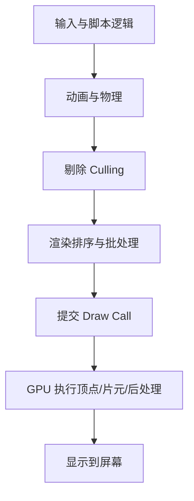
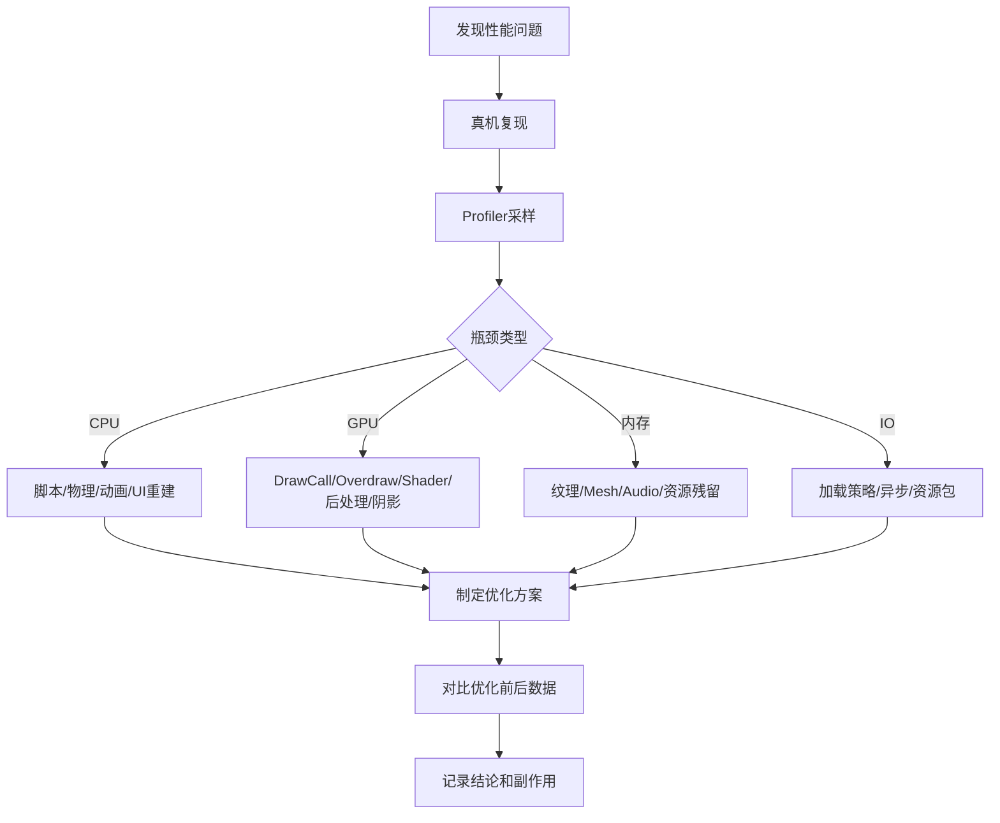

# Unity 图形渲染与性能优化专题详解

## 1. 这篇文章解决什么问题

在 Unity 项目里，“性能优化”经常被说成一句很泛的话：

> 这个场景有点卡，优化一下。

但真正开始做时，很多人会发现自己不知道从哪里下手：

1. 是 CPU 卡，还是 GPU 卡？
2. 是 DrawCall 太多，还是 Shader 太重？
3. 是 UI 重建，还是透明物体过度绘制？
4. 是模型面数太高，还是阴影太贵？
5. 是内存泄漏，还是 GC 分配太频繁？
6. 是编辑器里卡，还是真机上卡？

这篇文章参考 `Unity高级开发工程师应掌握的技术栈` 中“图形、渲染与性能优化”相关知识点，把它展开成一个更完整的专题。

本文重点不是堆技巧，而是建立一套完整的分析框架：

1. 先理解 Unity 渲染链路。
2. 再判断瓶颈在 CPU、GPU、内存、IO 还是资源层。
3. 然后使用正确工具定位问题。
4. 最后选择对应优化手段。

:::abstract 一句话结论
Unity 图形性能优化的核心不是“少用特效、少用贴图、少用 Shader”，而是先测量瓶颈，再根据 CPU、GPU、内存和资源链路分别处理。没有数据支撑的优化，通常只是猜。
:::

## 2. 先建立总地图：Unity 性能问题分成几类

性能问题不要一上来就归咎于“渲染太重”。  
Unity 项目常见瓶颈可以拆成下面几类：

| 瓶颈类型 | 典型表现 | 常用工具 |
| --- | --- | --- |
| CPU 瓶颈 | 主线程耗时高、逻辑卡、脚本耗时高 | Profiler、Profile Analyzer |
| GPU 瓶颈 | DrawCall 不一定高，但画面越复杂越掉帧 | Frame Debugger、RenderDoc、平台 GPU 工具 |
| 内存瓶颈 | 内存持续上涨、切场景不释放、闪退 | Memory Profiler、Profiler Memory |
| GC 瓶颈 | 间歇性卡顿、GC.Alloc 高 | Profiler Timeline、Deep Profile |
| IO / 资源加载瓶颈 | 进入场景卡顿、加载界面卡死 | Profiler、资源加载日志 |
| UI 瓶颈 | 打开界面卡、滑动列表卡 | Profiler UI、Frame Debugger |

图形和渲染主要影响 GPU、Render Thread、主线程提交渲染命令，以及资源内存。  
所以一个渲染问题不一定只在 GPU 上体现，也可能表现为 CPU 渲染提交成本过高。

## 3. Unity 一帧里发生了什么

理解一帧的基本流程，对性能定位非常重要。



简化理解：

| 阶段 | 主要成本 |
| --- | --- |
| 脚本逻辑 | C# Update、事件、AI、寻路、状态机 |
| 动画物理 | Animator、SkinnedMesh、Collider、Rigidbody |
| 剔除排序 | 相机可见性判断、透明排序、渲染队列 |
| 渲染提交 | DrawCall、SetPass、材质切换、合批 |
| GPU 执行 | 顶点数量、像素填充、Shader、阴影、后处理 |

性能优化的第一步就是判断耗时在哪个阶段。

## 4. 渲染管线：Built-in、URP、HDRP

### 4.1 三种管线的定位

| 管线 | 定位 | 适用场景 |
| --- | --- | --- |
| Built-in | 传统内置管线 | 老项目、存量项目、简单项目 |
| URP | 通用渲染管线 | 移动端、主机、PC 中轻量到中等画质项目 |
| HDRP | 高清渲染管线 | 高端 PC、主机、高保真画面项目 |

如果你是移动端项目，通常优先考虑 URP。  
如果你是高端写实项目，才考虑 HDRP。  
如果是老项目，Built-in 迁移到 URP 要评估 Shader、后处理、光照和美术资源改造成本。

### 4.2 管线选择不是越高级越好

HDRP 不是 URP 的“高级替代品”，它是面向不同硬件和画质目标的管线。  
移动端项目盲目上 HDRP，通常会带来：

1. Shader 成本上升。
2. 光照和后处理成本上升。
3. 美术资源规格上升。
4. 低端设备适配压力上升。

### 4.3 SRP Batcher 是什么

SRP Batcher 是 URP / HDRP 中非常重要的优化机制。  
它通过减少 CPU 侧材质和 Shader 常量提交成本，提高大量相同 Shader 物体的渲染效率。

你可以把它理解成：

**让使用兼容 Shader 的大量物体，在 CPU 提交渲染数据时更高效。**

但它不是万能合批。  
它更偏向降低 CPU 渲染提交成本，不代表 DrawCall 数一定大幅下降。

## 5. DrawCall、Batch、SetPass 的真正含义

### 5.1 DrawCall 是什么

DrawCall 可以简单理解为：

**CPU 通知 GPU 绘制一批几何体的一次调用。**

DrawCall 太多时，CPU 需要频繁提交渲染命令，可能导致 CPU 渲染线程压力变大。

### 5.2 Batch 是什么

Batch 通常指 Unity 把若干可合并的渲染对象合在一起提交。  
合批的目标是减少渲染提交次数。

常见合批方式：

| 合批方式 | 说明 |
| --- | --- |
| Static Batching | 静态物体合批，占用额外内存 |
| Dynamic Batching | 小型动态网格合批，限制较多 |
| GPU Instancing | 大量相同 Mesh / Material 实例化绘制 |
| SRP Batcher | 优化 SRP 下的 CPU 提交成本 |
| UI Batching | UGUI 根据材质、贴图、层级等合批 |

### 5.3 SetPass 是什么

SetPass 代表切换渲染状态或 Shader Pass 的成本。  
有时 SetPass 比 DrawCall 更值得关注，因为材质和 Shader 状态切换会打断批处理。

常见导致 SetPass 增加的原因：

1. 材质过多。
2. Shader 变体过多。
3. 同一类物体没有共享材质。
4. UI 使用多个贴图和材质。
5. 特效粒子使用大量不同材质。

## 6. 合批优化：不要只盯着 DrawCall 数字

### 6.1 Static Batching

适合：

1. 不移动的场景建筑。
2. 地形装饰。
3. 大量静态环境物件。

代价：

1. 会增加内存。
2. 不适合频繁移动或动态变换物体。
3. 对资源组织有要求。

### 6.2 Dynamic Batching

Dynamic Batching 对 Mesh 顶点数量、材质、Shader 等限制较多。  
现代项目中，不应过度依赖它。

### 6.3 GPU Instancing

适合：

1. 大量相同树木。
2. 大量相同草。
3. 大量相同子弹、道具、装饰物。

关键条件：

1. Mesh 相同。
2. Material 相同。
3. Shader 支持 Instancing。
4. 每个实例差异通过实例化属性传递。

### 6.4 MaterialPropertyBlock

如果你只是想让同一材质的多个物体颜色不同，不要每个物体 new 一个材质。  
可以用 `MaterialPropertyBlock`。

```csharp
using UnityEngine;

namespace Blogger.Runtime
{
    /// <summary>
    /// 使用 MaterialPropertyBlock 设置颜色，避免为每个对象创建独立材质。
    /// </summary>
    public sealed class MaterialPropertyBlockColor : MonoBehaviour
    {
        [SerializeField]
        private Renderer targetRenderer;

        [SerializeField]
        private Color color = Color.red;

        private MaterialPropertyBlock propertyBlock;

        #region 材质属性块设置

        /// <summary>
        /// 初始化材质属性块。
        /// </summary>
        private void Awake()
        {
            // 创建材质属性块，用于覆盖 Renderer 的局部材质参数。
            propertyBlock = new MaterialPropertyBlock();
        }

        /// <summary>
        /// 应用颜色到渲染器。
        /// </summary>
        private void Start()
        {
            // 从渲染器读取当前属性块，避免覆盖已有参数。
            targetRenderer.GetPropertyBlock(propertyBlock);

            // 设置 Shader 中名为 _BaseColor 的颜色属性，URP Lit 常用该名称。
            propertyBlock.SetColor("_BaseColor", color);

            // 将属性块设置回渲染器。
            targetRenderer.SetPropertyBlock(propertyBlock);
        }

        #endregion
    }
}
```

:::warning 常见误区
`renderer.material` 会实例化一份材质。  
如果你在大量对象上频繁访问 `renderer.material`，可能造成材质实例膨胀和内存上涨。能共享材质时优先使用 `sharedMaterial`，只改单个 Renderer 参数时考虑 `MaterialPropertyBlock`。
:::

## 7. GPU 瓶颈：顶点、像素、带宽

GPU 成本可以粗略拆成三类：

| 类型 | 说明 | 常见问题 |
| --- | --- | --- |
| 顶点成本 | 处理 Mesh 顶点 | 模型面数高、骨骼蒙皮复杂 |
| 像素成本 | 处理屏幕像素 | 透明叠加、后处理、复杂片元 Shader |
| 带宽成本 | 纹理采样、RenderTexture、深度、颜色写入 | 高分辨率贴图、多 RenderTarget |

### 7.1 顶点成本

顶点成本主要来自：

1. 模型顶点数。
2. SkinnedMeshRenderer。
3. BlendShape。
4. 顶点 Shader 复杂度。
5. 实时阴影 caster。

优化思路：

1. 使用 LOD。
2. 远处角色降低骨骼数量。
3. 控制 BlendShape 使用频率。
4. 对远景物体使用低模。
5. 不必要的物体关闭阴影投射。

### 7.2 像素成本

像素成本常见于：

1. 大面积透明物体。
2. 多层 UI 叠加。
3. 全屏后处理。
4. 高复杂度 Shader。
5. 粒子特效堆叠。

移动端上，很多场景不是 DrawCall 先炸，而是 FillRate 先炸。  
也就是 GPU 要处理太多屏幕像素。

### 7.3 带宽成本

带宽成本常见于：

1. 高分辨率 RenderTexture。
2. 多个摄像机叠加。
3. 多次全屏 Blit。
4. 过多后处理 Pass。
5. 纹理格式不合理。

优化思路：

1. 降低 RenderTexture 分辨率。
2. 合并后处理。
3. 减少不必要的全屏 Pass。
4. 使用合适压缩纹理格式。

## 8. Overdraw：透明和 UI 的隐形杀手

### 8.1 Overdraw 是什么

Overdraw 指同一个屏幕像素被重复绘制多次。  
透明物体无法像不透明物体那样充分利用深度剔除，所以特别容易产生 Overdraw。

常见来源：

1. 多层半透明 UI。
2. 大面积透明特效。
3. 草、树叶、毛发。
4. 粒子系统。
5. 全屏遮罩叠加。

### 8.2 如何优化透明 Overdraw

| 问题 | 优化方式 |
| --- | --- |
| 粒子贴图空白区域大 | 裁剪贴图，减少透明空白 |
| UI 遮罩层太多 | 合并层级，减少全屏半透明图 |
| 草和树叶过密 | 降低密度，使用 LOD |
| 多个全屏特效叠加 | 合并 Pass 或降低分辨率 |

### 8.3 UI 特别容易产生 Overdraw

UGUI 中一个全屏透明 Image，即使视觉上看起来“没什么”，也可能让 GPU 多绘制一整屏。  
所以不要为了接收点击或占位，就到处放全屏透明图。

## 9. Shader 优化

### 9.1 Shader 成本从哪里来

| 成本来源 | 说明 |
| --- | --- |
| Pass 数量 | 多 Pass 会多次绘制 |
| 光照计算 | 实时光照、法线、阴影、PBR 成本更高 |
| 纹理采样 | 多张贴图、多次采样增加成本 |
| 分支判断 | 动态分支可能影响性能 |
| 透明混合 | 影响深度剔除和 Overdraw |
| Shader Variant | 变体过多会增加构建体积和运行时加载压力 |

### 9.2 ShaderGraph 不是性能免费

ShaderGraph 很方便，但不代表性能一定好。  
复杂节点网络可能生成很重的 Shader。

建议：

1. 重要 Shader 要查看生成代码或使用分析工具。
2. 移动端避免过度复杂的 PBR 效果。
3. 控制采样次数。
4. 控制关键字和变体数量。

### 9.3 Shader 关键词变体

Shader Variant 爆炸会带来：

1. 构建时间变长。
2. 包体变大。
3. 运行时 Shader 加载卡顿。
4. 内存占用上升。

优化思路：

1. 清理不用的 Shader Keyword。
2. 使用 Shader Variant Collection 预热关键变体。
3. 避免为小差异创建大量独立 Shader。
4. 对低端平台提供简化 Shader。

## 10. 光照优化

### 10.1 实时光照、烘焙光照、混合光照

| 光照方式 | 优点 | 缺点 |
| --- | --- | --- |
| 实时光照 | 动态效果好 | 性能成本高 |
| 烘焙光照 | 运行时成本低 | 不适合动态变化 |
| 混合光照 | 兼顾静态与动态 | 配置复杂 |

移动端项目中，静态场景优先考虑烘焙光照。  
大量实时光源和实时阴影通常非常昂贵。

### 10.2 Lightmap 优化

Lightmap 常见问题：

1. 分辨率过高导致内存大。
2. UV 展开不合理导致浪费。
3. 小物件占用过多 Lightmap 空间。
4. 场景拆分不合理导致加载峰值高。

优化建议：

1. 按场景和区域控制 Lightmap 数量。
2. 静态物体合理设置 Scale In Lightmap。
3. 远处或不重要物体降低 Lightmap 精度。
4. 移动端关注 Lightmap 压缩格式和内存。

## 11. 阴影优化

阴影通常是图形性能大户。

### 11.1 阴影成本来自哪里

1. Shadow Map 分辨率。
2. 投射阴影的物体数量。
3. 接收阴影的物体数量。
4. 级联阴影数量。
5. 实时光源数量。

### 11.2 优化方式

| 问题 | 优化方式 |
| --- | --- |
| 阴影太清晰但很贵 | 降低 Shadow Resolution |
| 远处阴影不可见但仍计算 | 调整 Shadow Distance |
| 小物体投影意义不大 | 关闭 Cast Shadows |
| 移动端阴影太贵 | 使用烘焙阴影或 Blob Shadow |
| 角色阴影成本高 | 使用简化阴影方案 |

:::hint 移动端建议
移动端不要默认打开高质量实时阴影。很多时候一个简单的圆形 Blob Shadow，在视觉收益和性能成本之间更划算。
:::

## 12. 后处理优化

后处理通常是全屏 Pass，分辨率越高，成本越明显。

常见后处理成本：

| 效果 | 成本特点 |
| --- | --- |
| Bloom | 多次降采样和模糊 |
| SSAO | 屏幕空间采样较重 |
| Depth of Field | 多次模糊，移动端昂贵 |
| Motion Blur | 需要速度信息和额外采样 |
| Color Grading | 成本相对可控 |

优化建议：

1. 移动端谨慎开启 SSAO、DOF、Motion Blur。
2. 后处理尽量合并。
3. 降低内部渲染分辨率。
4. 为低端机提供关闭选项。
5. 不要在多个 Camera 上重复开启同类后处理。

## 13. UI 渲染优化

UI 性能问题非常常见，尤其是 UGUI。

### 13.1 Canvas 重建

UGUI 中 Canvas 下任意元素变化，可能触发 Canvas 重建。  
如果一个大 Canvas 里包含很多元素，而其中一个计时文本每帧变化，可能导致整块 UI 频繁重建。

优化方式：

1. 动态 UI 和静态 UI 分 Canvas。
2. 高频变化元素单独 Canvas。
3. 列表使用对象池。
4. 避免 LayoutGroup 高频重排。
5. 不要让 ContentSizeFitter 和 LayoutGroup 复杂嵌套。

### 13.2 UI 合批

影响 UI 合批的因素：

1. 材质不同。
2. 贴图不同。
3. Mask 裁剪。
4. 层级穿插。
5. 不同 Canvas。

优化方式：

1. 使用图集。
2. 减少材质变体。
3. 合理拆 Canvas。
4. 减少 Mask 和 RectMask2D 滥用。
5. 列表项复用。

### 13.3 UI 透明 Overdraw

UI 最常见的 GPU 问题就是透明叠加。  
优化建议：

1. 删除不可见 Image。
2. 减少全屏半透明遮罩。
3. 合并背景图层。
4. 控制弹窗叠加数量。

## 14. 粒子与特效优化

粒子系统看起来只是表现问题，但性能成本很容易失控。

### 14.1 粒子成本来源

1. 粒子数量。
2. 透明 Overdraw。
3. 粒子材质数量。
4. 粒子碰撞。
5. Soft Particles。
6. 灯光粒子。
7. Shader 复杂度。

### 14.2 优化建议

| 问题 | 优化方式 |
| --- | --- |
| 粒子太多 | 降低 Max Particles |
| 大量透明叠加 | 缩小粒子贴图透明区域 |
| 材质太散 | 合并特效图集和材质 |
| 低端机卡顿 | 降低发射频率和生命周期 |
| 碰撞昂贵 | 非必要不要开启粒子碰撞 |

特效优化要和美术协作。  
不要只要求“少做粒子”，而是明确预算：粒子数量、贴图尺寸、材质数量、最大屏幕占比。

## 15. 模型、LOD 与剔除

### 15.1 模型面数不是越低越好

模型优化要看平台、距离、屏幕占比和角色重要程度。

| 对象 | 优化重点 |
| --- | --- |
| 主角 | 保留质量，重点优化 Shader 和骨骼 |
| 远处 NPC | 使用 LOD |
| 小装饰物 | 降低面数或合并 |
| 大量植被 | LOD、Billboard、GPU Instancing |

### 15.2 LODGroup

LODGroup 可以根据距离切换不同精度模型。

建议：

1. 大量远景物体使用 LOD。
2. 植被使用 Billboard 或低模。
3. 角色远距离降低骨骼和材质复杂度。
4. LOD 切换要避免明显跳变。

### 15.3 Occlusion Culling

遮挡剔除适合：

1. 室内场景。
2. 城市场景。
3. 复杂建筑遮挡明显的场景。

不太适合：

1. 开阔平原。
2. 物体高度动态变化场景。
3. 遮挡关系不稳定的场景。

## 16. SkinnedMeshRenderer 与动画成本

角色多的项目，SkinnedMeshRenderer 很容易成为瓶颈。

常见成本：

1. 骨骼数量。
2. 蒙皮顶点数。
3. BlendShape。
4. Animator 状态机复杂度。
5. 动画层和 IK。

优化建议：

1. 远距离角色降低更新频率。
2. 非重要 NPC 使用简化骨骼。
3. 减少不必要 BlendShape。
4. 使用 Animator Culling Mode。
5. 多角色同屏时做质量分级。

## 17. 内存与纹理优化

### 17.1 纹理内存往往是大头

纹理常见问题：

1. 分辨率过高。
2. 格式不合适。
3. 没有压缩。
4. Mipmap 设置不合理。
5. UI 图集过大。

### 17.2 纹理格式建议

| 平台 | 常见格式 |
| --- | --- |
| Android | ASTC、ETC2 |
| iOS | ASTC、PVRTC |
| PC | BC 系列格式 |

ASTC 在移动端很常用，但不同块大小会影响质量和体积。  
例如 ASTC 4x4 质量较高但体积更大，ASTC 6x6、8x8 体积更小但质量下降。

### 17.3 Mipmap

Mipmap 适合 3D 场景中会远近变化的贴图。  
但 UI 贴图通常不需要 Mipmap。

| 贴图类型 | Mipmap 建议 |
| --- | --- |
| 3D 模型贴图 | 通常开启 |
| 地表贴图 | 通常开启 |
| UI 图标 | 通常关闭 |
| 字体贴图 | 通常关闭 |

## 18. GC 与脚本性能

图形优化不能只看 GPU。  
很多卡顿来自 C# GC。

### 18.1 常见 GC 来源

1. 每帧 new 对象。
2. 字符串拼接。
3. LINQ 高频使用。
4. foreach 在某些集合上产生枚举器分配。
5. 协程频繁创建 WaitForSeconds。
6. 闭包捕获。
7. 装箱拆箱。

### 18.2 示例：缓存 WaitForSeconds

```csharp
using System.Collections;
using UnityEngine;

namespace Blogger.Runtime
{
    /// <summary>
    /// 缓存等待对象，减少协程中的重复分配。
    /// </summary>
    public sealed class CachedWaitSample : MonoBehaviour
    {
        private readonly WaitForSeconds waitOneSecond = new WaitForSeconds(1f);

        #region 协程等待缓存

        /// <summary>
        /// 启动循环协程。
        /// </summary>
        private void Start()
        {
            // 启动定时日志协程。
            StartCoroutine(LogLoop());
        }

        /// <summary>
        /// 每秒输出一次日志。
        /// </summary>
        /// <returns>协程迭代器。</returns>
        private IEnumerator LogLoop()
        {
            while (true)
            {
                // 输出中文调试信息，用于观察协程循环。
                Debug.Log("每秒执行一次");

                // 使用缓存的 WaitForSeconds，避免循环中重复创建对象。
                yield return waitOneSecond;
            }
        }

        #endregion
    }
}
```

### 18.3 对象池

频繁创建销毁对象会产生性能和 GC 压力。  
适合使用对象池的对象：

1. 子弹。
2. 飘字。
3. 伤害数字。
4. 特效。
5. UI 列表项。

对象池不是越多越好。  
如果对象只创建一次或数量很少，就没必要引入池化复杂度。

## 19. Profiler：性能优化的第一工具

### 19.1 必须真机 Profiler

编辑器里的性能数据只能参考。  
真机才是目标平台的真实表现。

原因：

1. 编辑器有额外开销。
2. PC 性能和手机完全不同。
3. 真机 GPU、内存、温控差异明显。
4. 移动端发热降频会影响长时间表现。

### 19.2 Profiler 常看模块

| 模块 | 关注点 |
| --- | --- |
| CPU Usage | 主线程、渲染线程、脚本耗时 |
| Rendering | Batches、SetPass、Triangles、Vertices |
| Memory | Total Allocated、纹理、Mesh、Audio |
| GC Alloc | 每帧分配 |
| UI | Canvas.BuildBatch、Layout rebuild |
| Physics | 模拟和碰撞检测成本 |

### 19.3 Timeline 比 Hierarchy 更适合看卡顿

Hierarchy 适合看总体耗时排序。  
Timeline 更适合看某一帧为什么突然卡顿。

卡顿分析建议：

1. 找到 spike 帧。
2. 看主线程是否被阻塞。
3. 看是否发生 GC。
4. 看是否加载资源。
5. 看渲染线程是否等待 GPU 或主线程。

## 20. Frame Debugger：分析渲染批次

Frame Debugger 可以逐步查看一帧中的绘制过程。

适合排查：

1. 为什么 DrawCall 多。
2. 哪些对象打断合批。
3. UI 是否产生大量批次。
4. 阴影和后处理执行了多少 Pass。
5. 某个物体使用了哪个 Shader Pass。

使用思路：

1. 打开 Frame Debugger。
2. 逐步查看 Draw Event。
3. 观察材质、Shader、纹理、Pass。
4. 找出批次被打断的原因。

## 21. Memory Profiler：分析内存

Memory Profiler 适合回答：

1. 哪些纹理占用最大？
2. 哪些 Mesh 没释放？
3. 场景切换后资源是否残留？
4. 对象引用链是谁持有？
5. 是否有重复材质、重复贴图？

常见流程：

1. 进入场景前抓快照。
2. 进入场景后抓快照。
3. 离开场景后抓快照。
4. 对比是否释放。

## 22. Profile Analyzer：对比优化效果

优化不是“感觉快了”，而是要能对比。

Profile Analyzer 可以对比优化前后的采样数据：

1. 平均帧耗时是否下降。
2. 峰值帧是否减少。
3. GC 是否降低。
4. 某个函数耗时是否改善。

建议每次优化记录：

| 信息 | 示例 |
| --- | --- |
| 优化目标 | 降低战斗场景 GPU 时间 |
| 修改内容 | 关闭低端机 SSAO |
| 测试设备 | Android 中端机 |
| 优化前 | 28 FPS |
| 优化后 | 43 FPS |
| 副作用 | 画面阴影细节下降 |

## 23. 移动端优化重点

移动端最重要的是：

1. 控制分辨率。
2. 控制透明 Overdraw。
3. 控制后处理。
4. 控制实时阴影。
5. 控制发热降频。
6. 控制内存峰值。

### 23.1 分级画质

移动端项目不应该只有一档画质。  
建议至少有：

| 档位 | 特点 |
| --- | --- |
| 低 | 关闭高成本后处理、降低阴影、降低特效 |
| 中 | 保留基础表现 |
| 高 | 开启更好阴影、后处理、特效密度 |

### 23.2 动态分辨率

动态分辨率可以在 GPU 压力大时降低内部渲染分辨率。  
适合 GPU 瓶颈明显的移动端项目。

但要注意：

1. UI 清晰度。
2. 后处理效果。
3. 抗锯齿表现。
4. 低端机视觉接受度。

## 24. 热更新项目中的图形性能问题

资源热更新项目还要额外注意：

1. 新资源是否符合规格。
2. 新 Shader 变体是否进入预热。
3. 新特效是否超过预算。
4. 新贴图格式是否正确。
5. 新 AB 或 Addressables 包是否重复依赖。

如果没有资源准入规范，热更新很容易把性能问题带到线上。

建议建立资源检查规则：

| 资源类型 | 检查内容 |
| --- | --- |
| Texture | 尺寸、格式、Mipmap、压缩 |
| Mesh | 顶点数、面数、骨骼数 |
| Material | Shader、关键词、贴图数量 |
| Particle | 粒子数、材质数、透明面积 |
| UI | 图集、尺寸、透明区域 |

## 25. 常见问题定位表

| 现象 | 优先怀疑 | 工具 |
| --- | --- | --- |
| 帧率稳定低 | GPU 或 CPU 持续瓶颈 | Profiler、GPU 工具 |
| 偶发卡顿 | GC、资源加载、Shader 编译 | Profiler Timeline |
| UI 打开卡 | Canvas 重建、资源加载 | Profiler UI |
| 场景切换后内存不降 | 引用残留、资源未卸载 | Memory Profiler |
| DrawCall 高 | 材质多、合批失败、UI 批次多 | Frame Debugger |
| 手机发热后掉帧 | GPU 过载、CPU 过载、分辨率高 | 真机长时间测试 |
| 粉色材质 | Shader 丢失、变体缺失、管线不匹配 | Frame Debugger、日志 |

## 26. 一套推荐的优化流程



## 27. 团队协作中的性能预算

性能优化不是程序一个人的事情。  
应该和策划、美术、TA 建立预算。

### 27.1 常见预算项

| 类型 | 示例 |
| --- | --- |
| 单屏角色数 | 同屏最多 20 个怪 |
| 模型面数 | 普通怪不超过指定面数 |
| 贴图尺寸 | UI 图标、角色贴图、场景贴图分级 |
| 特效粒子数 | 普通技能、必杀技、Boss 技能分级 |
| 后处理 | 低端机关闭高成本效果 |
| DrawCall | 场景、UI、角色分别设目标 |

### 27.2 为什么预算比事后优化更重要

没有预算时，项目通常会变成：

1. 美术不断提高资源规格。
2. 策划不断增加同屏数量。
3. 程序后期被迫救火。
4. 优化变成砍效果。

有预算时，性能成本在制作阶段就能被控制。

## 28. 常见误区

### 28.1 误区一：DrawCall 越低越好

DrawCall 很重要，但不是唯一指标。  
如果 GPU 被复杂 Shader 或 Overdraw 打满，DrawCall 降低也不一定明显提升帧率。

### 28.2 误区二：模型面数低就一定性能好

如果 Shader 很重、透明很多、后处理很贵，低面数也可能卡。

### 28.3 误区三：优化就是降低画质

好的优化是用更合理的方式达到接近的视觉效果。  
例如：

1. 用烘焙替代实时光。
2. 用 Blob Shadow 替代实时阴影。
3. 用 LOD 保留近景质量。
4. 用图集减少 UI 批次。

### 28.4 误区四：编辑器不卡就代表真机不卡

必须真机测试。  
尤其是移动端，发热降频后的表现比刚启动时更重要。

### 28.5 误区五：优化可以最后再做

性能最好从资源规范、管线选择、场景结构阶段就开始控制。  
最后再优化，通常成本最高。

## 29. 从入门到进阶的学习路线

### 29.1 入门阶段

先掌握：

1. Profiler 基础使用。
2. DrawCall、Batch、SetPass 概念。
3. Frame Debugger。
4. Texture、Mesh、Material 基础成本。
5. 协程、GC、对象池基础。

### 29.2 进阶阶段

继续掌握：

1. URP / HDRP / Built-in 差异。
2. SRP Batcher。
3. GPU Instancing。
4. Shader 变体。
5. Lightmap、阴影、后处理优化。
6. UI 重建和 Overdraw。

### 29.3 实战阶段

最后重点掌握：

1. 真机性能分析。
2. Memory Profiler 快照对比。
3. 移动端画质分级。
4. 资源准入检查。
5. 性能预算制定。
6. 优化前后数据报告。

## 30. 总结

Unity 图形、渲染与性能优化是一套系统能力，不是一堆孤立技巧。

你需要同时理解：

1. 渲染管线决定基础能力和成本边界。
2. DrawCall、Batch、SetPass 影响 CPU 渲染提交。
3. Shader、Overdraw、后处理、阴影影响 GPU。
4. 纹理、Mesh、Audio、资源引用影响内存。
5. UI、粒子、动画、物理都会和渲染性能交叉影响。
6. Profiler、Frame Debugger、Memory Profiler 是定位问题的核心工具。

如果只记一句话，那就是：

**性能优化不是凭经验删效果，而是用工具证明瓶颈，用数据选择方案，用规范防止问题再次发生。**
