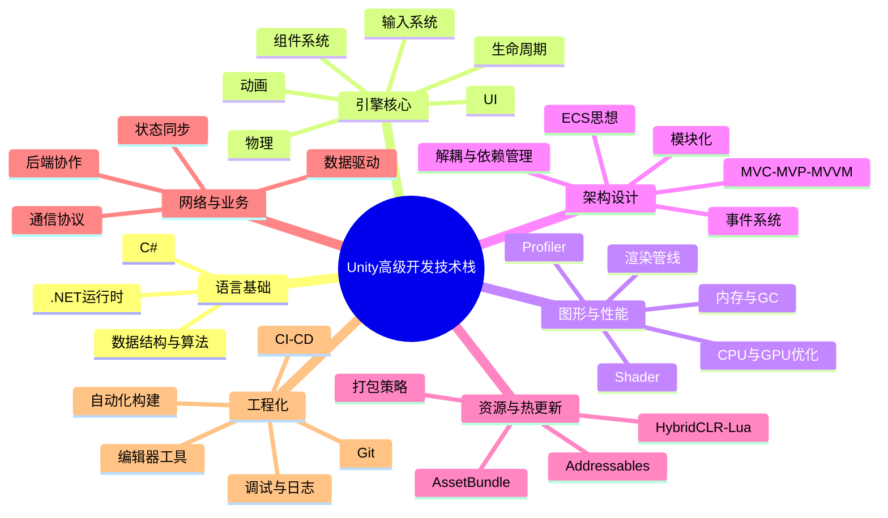

# Unity高级开发工程师应掌握的技术栈

## 1. 先说结论

如果只用一句话概括，那么 Unity 高级开发工程师的核心竞争力，不是“会用 Unity 做功能”，而是能够在复杂项目中，稳定地解决以下问题：

1. 把功能做出来。
2. 把性能做稳定。
3. 把架构做清晰。
4. 把项目做可迭代。
5. 把团队协作成本降下来。

因此，高级 Unity 工程师需要掌握的技术栈，通常不是单点技能，而是一个分层能力体系。

:::abstract 能力定位
初级工程师更关注“功能能不能实现”，中级工程师更关注“实现方式是否合理”，高级工程师则必须同时关注功能、性能、架构、流程、发布与长期维护成本。
:::

## 2. 整体能力地图

## 3. 第一层：语言与计算机基础

### 3.1 C# 必须扎实

Unity 高级开发的第一前提，不是 Unity API，而是 C# 基础足够扎实。

至少要熟练掌握以下内容：

| 方向 | 应掌握内容 |
| --- | --- |
| 面向对象 | 封装、继承、多态、抽象类、接口、组合优于继承 |
| 泛型与集合 | `List<T>`、`Dictionary<TKey, TValue>`、泛型约束、常见集合性能差异 |
| 委托与事件 | 回调、事件驱动、观察者思想、闭包问题 |
| 异步编程 | `Task`、`async/await`、协程与异步的区别 |
| 反射与特性 | 配置驱动、编辑器扩展、运行时元数据处理 |
| 内存意识 | 值类型与引用类型、装箱拆箱、GC 分配来源 |

高级工程师常见的差异点，不在于“知道语法”，而在于知道这些语法在 Unity 项目里会带来什么成本。

例如：

1. 委托链和事件系统是否会造成对象生命周期难以管理。
2. 闭包捕获是否会引入额外 GC。
3. 反射是否应该只用于编辑器阶段，而不进入高频运行逻辑。

### 3.2 数据结构与算法不能缺位

很多 Unity 项目后期性能变差，并不是因为 Unity 本身慢，而是因为业务层的数据结构设计不合理。

至少要理解：

| 能力 | 典型用途 |
| --- | --- |
| 数组、链表、哈希表、队列、栈 | 管理实体、缓存、消息队列、状态机 |
| 排序与查找 | 战斗排序、排行榜、目标筛选 |
| 空间换时间 | 缓存表、对象池、索引结构 |
| 时间复杂度分析 | 判断某段逻辑为何在大规模数据下失控 |

:::info 为什么这很重要
很多“优化”问题，本质上不是 API 调用慢，而是 O(n)、O(n²) 的业务逻辑在错误的生命周期里被频繁执行。
:::

## 4. 第二层：Unity 引擎核心能力

### 4.1 必须理解引擎生命周期

高级工程师不能只会写 `Update`，还必须理解 Unity 的执行顺序和生命周期边界。

重点包括：

| 模块 | 关键问题 |
| --- | --- |
| `Awake` / `OnEnable` / `Start` | 初始化责任该放哪一层 |
| `Update` / `LateUpdate` / `FixedUpdate` | 输入、表现、物理分别该在哪个阶段处理 |
| 场景加载与卸载 | 跨场景对象如何管理 |
| `OnDestroy` | 事件解绑、资源释放、异步取消如何处理 |

如果这些边界不清晰，项目很容易出现初始化顺序错误、重复注册、状态残留和内存泄漏。

### 4.2 常用系统要能独立落地

高级 Unity 工程师通常应具备以下模块的独立开发能力：

| 模块 | 应掌握内容 |
| --- | --- |
| UI 系统 | UGUI、Canvas 划分、批处理、事件系统、分辨率适配 |
| 动画系统 | Animator、状态机、Timeline、Playable |
| 物理系统 | 2D/3D 物理、碰撞、射线检测、性能边界 |
| 输入系统 | 旧输入系统、新 Input System、多端输入适配 |
| 场景管理 | 多场景协作、异步加载、过场控制 |
| 音频系统 | 音效管理、背景音乐、音频资源调度 |

### 4.3 资源加载流程要成体系

在中大型项目里，资源管理能力直接决定项目是否可持续迭代。

应当掌握：

1. `Resources`、`AssetBundle`、`Addressables` 的适用边界。
2. 资源依赖、冗余打包、变体包、增量更新的基本思路。
3. 资源引用计数、缓存回收、加载时机控制。
4. 场景资源、UI 图集、特效资源、音频资源的不同管理策略。

:::warning 常见误区
很多项目早期图方便，所有资源都直接拖引用或放进 `Resources`，短期开发很快，但一旦进入热更新、分包、内存控制阶段，改造成本会非常高。
:::

## 5. 第三层：图形、渲染与性能优化

### 5.1 不要求人人都写复杂 Shader，但必须能读懂渲染链路

高级 Unity 工程师不一定都做 TA，但至少要能定位常见的图形性能问题。

建议掌握：

| 方向 | 重点内容 |
| --- | --- |
| 渲染管线 | Built-in、URP、HDRP 的差异与适用场景 |
| DrawCall 优化 | 合批、实例化、材质球管理、UI 重建 |
| GPU 负载 | 过度绘制、后处理、阴影、透明排序 |
| Shader 基础 | ShaderGraph、常见表面效果、关键词变体 |
| 美术协作 | 模型面数、贴图规格、光照模式、特效成本沟通 |

### 5.2 高级工程师必须具备完整的性能诊断能力

不是“知道怎么优化”，而是“知道怎么定位瓶颈”。

常见工具与能力如下：

| 工具 | 主要用途 |
| --- | --- |
| Unity Profiler | 分析 CPU、渲染、内存、GC、物理、音频开销 |
| Frame Debugger | 排查渲染批次与绘制问题 |
| Memory Profiler | 分析内存分配、引用链、泄漏风险 |
| Profile Analyzer | 对比优化前后的采样差异 |
| 真机分析工具 | 定位不同平台上的性能差异 |

### 5.3 性能优化的核心不是技巧，而是方法论

高级工程师通常应该形成这样的优化顺序：

1. 先测量，明确瓶颈位置。
2. 再判断是 CPU、GPU、内存、IO 还是资源加载问题。
3. 然后定位是引擎层、业务层、资源层还是渲染层。
4. 最后才选择具体优化手段。

如果一开始就“凭经验乱改”，通常会浪费很多时间。

## 6. 第四层：架构设计与工程组织能力

### 6.1 必须能设计可维护的业务结构

中小项目里，功能能跑就行；中大型项目里，如果没有架构约束，后续维护成本会迅速失控。

高级 Unity 工程师通常要能处理：

| 架构议题 | 说明 |
| --- | --- |
| 模块划分 | 登录、大厅、战斗、背包、任务等系统如何拆分 |
| 通信方式 | 事件、消息、命令、直接引用分别适合哪些场景 |
| 数据流 | 界面层、表现层、业务层、配置层如何协作 |
| 状态管理 | 页面状态、角色状态、战斗状态如何收敛 |
| 配置驱动 | 数值、技能、掉落、AI 行为如何数据化 |

### 6.2 常见架构思想需要会选型，不是死记名字

常见需要理解的内容：

1. MVC、MVP、MVVM 的职责分层差异。
2. 事件总线、观察者、命令模式、状态模式的适用边界。
3. 对象池、工厂、策略、责任链等模式在游戏项目中的常见落地点。
4. ECS/DOTS 的核心思想，以及它与传统 OOP 写法的取舍关系。
5. 依赖注入容器的价值与成本，例如 VContainer 适合解决什么问题。

:::hint 架构层面的判断标准
高级工程师不应该为了“看起来高级”而上复杂架构。真正合理的架构，是在当前团队规模、项目生命周期和迭代压力下，能有效降低耦合和返工成本的架构。
:::

## 7. 第五层：资源管理、热更新与版本迭代

### 7.1 热更新能力在商业项目里几乎是刚需

如果项目要长期运营，那么高级 Unity 工程师通常需要熟悉至少一种热更新方案。

常见方向如下：

| 方向 | 说明 |
| --- | --- |
| 资源热更新 | 基于 `AssetBundle` 或 `Addressables` 更新资源 |
| 代码热更新 | Lua、xLua、ILRuntime、HybridCLR 等 |
| 配置热更新 | JSON、二进制表、远端配置中心 |
| 版本控制 | 强更、静默更新、灰度更新、补丁校验 |

### 7.2 不只要会接方案，还要理解版本管理

真正困难的部分往往不是“接入一个库”，而是处理这些问题：

1. 客户端如何识别本地版本与远端版本。
2. 补丁依赖关系如何维护。
3. 回滚策略如何设计。
4. CDN 缓存、文件校验、断点续传如何处理。
5. 不同平台审核规则对更新机制有什么限制。

## 8. 第六层：网络、工具链与工程化能力

### 8.1 网络知识决定你能否和服务端高效协作

即使不负责服务端开发，高级 Unity 工程师也应该理解网络通信的基本机制。

建议掌握：

| 方向 | 关键内容 |
| --- | --- |
| 协议基础 | HTTP、WebSocket、TCP、UDP 的差异 |
| 序列化 | JSON、Protobuf、自定义二进制协议 |
| 同步策略 | 帧同步、状态同步、指令同步的大致思路 |
| 容错设计 | 重连、超时、心跳、消息去重、顺序控制 |
| 联调能力 | 抓包、日志定位、错误码协作、接口 Mock |

### 8.2 编辑器工具与自动化能力非常重要

高级工程师应该逐步把重复劳动工具化，而不是长期手工操作。

可以重点建设：

| 工具方向 | 示例 |
| --- | --- |
| 编辑器工具 | 批量检查资源、自动命名、配置导出、场景校验 |
| 构建工具 | 多平台打包、渠道参数注入、版本号管理 |
| 自动化检查 | 资源规范检查、代码扫描、配置合法性校验 |
| 日志系统 | 分级日志、线上问题回溯、埋点辅助分析 |

### 8.3 工程化能力决定团队效率上限

这部分往往最容易被忽略，但它非常能拉开高级工程师之间的差距。

应当逐步掌握：

1. Git 分支协作、冲突处理、提交规范。
2. 自动构建、自动打包、自动上传与版本归档。
3. CI/CD 流程的基本搭建思路。
4. 崩溃日志、错误上报、线上问题定位流程。
5. 多平台发布流程，包括 Android、iOS、PC、主机等差异点。

## 9. 第七层：团队协作与跨岗位沟通能力

很多人把“高级”理解成代码更熟练，但在真实项目里，高级工程师往往还承担这些职责：

| 协作对象 | 需要具备的能力 |
| --- | --- |
| 策划 | 评估需求实现成本、推动数据化方案 |
| 美术 / TA | 统一资源规格、定位表现成本、优化渲染问题 |
| 服务端 | 协议对齐、联调流程、状态同步设计 |
| 测试 | 构建复现路径、补齐调试信息、缩短定位时间 |
| 制作人 / 技术负责人 | 排期预估、技术选型、风险预判 |

:::info 高级工程师的一个典型特征
当项目出问题时，他不仅能修复 bug，还能快速判断问题属于需求设计、资源规范、业务逻辑、底层架构，还是流程协作问题。
:::

## 10. 一个更实用的学习优先级

如果你现在正从中级往高级走，可以按照下面的顺序补技术栈：

| 优先级 | 建议方向 | 原因 |
| --- | --- | --- |
| 第一优先级 | C# 基础、Unity 生命周期、常见模块开发 | 这是所有能力的基础 |
| 第二优先级 | 性能分析、资源管理、UI 与场景加载 | 这是项目最常见的痛点 |
| 第三优先级 | 架构设计、事件系统、配置驱动 | 这是从“能做”走向“做得稳”的关键 |
| 第四优先级 | 热更新、网络同步、工程化流程 | 这是商业化项目的核心门槛 |
| 第五优先级 | 渲染链路、Shader、平台发布差异 | 这是进一步拉开上限的能力 |

## 11. 总结

Unity 高级开发工程师应掌握的技术栈，可以概括为七个关键词：

1. 语言基础。
2. 引擎核心。
3. 性能优化。
4. 架构设计。
5. 资源与热更新。
6. 工程化与工具链。
7. 跨团队协作。

如果只会写功能，那么更像“Unity 开发者”；如果能在复杂项目中兼顾质量、性能、维护成本和迭代效率，才真正具备“Unity 高级开发工程师”的技术栈。

:::ref 延伸阅读
如果你在系统学习 Unity 工程能力，这篇文章建议和以下主题一起看：

- `Addressables`
- `AssetBundle 与 Addressables 对比`
- `Unity-UniTask详细用法`
- `Unity-VContainer详细用法`
- `架构设计`
- `ECS架构设计`
:::
